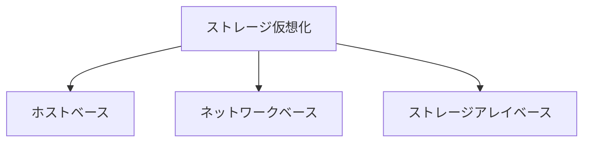

# ストレージ仮想化（Storage Virtualization）

## 1. 概要

### A. 定義
> 物理的に分散した異機種のストレージ資源を**論理的に統合（抽象化）**し、ユーザ・アプリケーションに対して物理構成とは無関係に**単一のストレージプール（Pool）**のように提供する技術。

ストレージ仮想化の核心は、**物理的な記憶装置と論理ボリュームを分離（decoupling）**することである。アプリケーションは、実際のデータがどのディスク・どのメーカーの装置にあるかを知る必要がなく、論理ボリュームだけを参照する。この分離により、物理装置を交換・移設・拡張しても論理ビューはそのまま維持され、データ移動がアプリケーションに対して透過的になる。サーバ仮想化が物理サーバとVMを分離するように、ストレージ仮想化は物理ディスクと論理ボリュームを分離するのである。

### B. 登場背景および必要性
企業が成長する過程で複数メーカーのストレージを時期ごとに導入すると、装置ごとに管理ツールが異なるため**管理のサイロ（silo）**が生まれ、ある装置は余り、ある装置は飽和するという**利用率の不均衡**が発生する。また、装置を交換するたびにデータを移すにはサービスを停止しなければならなかった。ストレージ仮想化は、異機種資源を一つのプールにまとめて**統合管理と利用率の向上**を実現し、シンプロビジョニングで**コストを最適化**し、無停止マイグレーションによって**運用の柔軟性**を提供するために必要である。

## 2. 実装位置別の類型

仮想化レイヤを**どこに置くか**によって類型が分かれ、これが性能・異機種統合性・ベンダ依存性のトレードオフを決定する。仮想化ポイントがサーバに近いほど実装は容易で安価だがホストに負荷をかけ、ストレージに近いほど高性能・安定的だが特定ベンダに縛られる。

- **ホストベース**: サーバOSのボリュームマネージャ（LVMなど）やソフトウェアが仮想化を担う。別途の装置なしに**実装が簡単で低コスト**だが、仮想化演算がサーバCPUを使うためホストに負荷をかけ、複数サーバにまたがる拡張・統合管理には限界がある。
- **ネットワークベース**: SANスイッチや専用アプライアンスが、サーバとストレージの**間（in-band/out-of-band）**で仮想化を行う。サーバ・ストレージから独立しているため**異機種統合と集中管理に最も優れる**が、別レイヤが追加されるため構成が複雑になり、それ自体がボトルネック・障害点になり得る。
- **ストレージアレイベース**: ストレージコントローラが自ら、あるいは他社ストレージを背後に接続して仮想化する。ハードウェアに密着しているため**高性能・安定的**だが、当該ベンダの装置に**依存**するという短所がある。

| 類型 | 実装位置 | 長所 | 短所 |
|---|---|---|---|
| **ホストベース** | サーバOS/LVM | 簡単・低コスト | ホスト負荷・拡張性の制限 |
| **ネットワークベース** | SANスイッチ・アプライアンス | 異機種統合・集中管理に優れる | 構成が複雑・別の障害点 |
| **ストレージベース** | ストレージコントローラ | 高性能・安定 | ベンダ依存性 |

## 3. データアクセス方式

仮想化されたストレージへのアクセス方式は、データを扱う**単位**によってブロックとファイルに分かれる。この区分は性能と用途を左右する。

- **ブロックレベル（SAN）**: データをファイルシステムの概念なしに**ブロック（block）単位**で扱う。サーバから見るとローカルディスクのように見え、オーバーヘッドが少ないため**高性能・低遅延**である。トランザクションが頻繁な**データベース**や仮想化データストアに適している。
- **ファイルレベル（NAS）**: ファイルシステム（NFS・SMB）単位でアクセスするため、複数クライアントが**ファイルを共有・協働**しやすい。ブロック方式よりオーバーヘッドは大きいが、共有ファイルサーバ・文書保存に適している。

| 区分 | 単位・プロトコル | 適合用途 |
|---|---|---|
| **ブロックレベル** | ブロック（SAN、iSCSI/FC） | DB・高性能トランザクション |
| **ファイルレベル** | ファイル（NAS、NFS/SMB） | ファイル共有・協働 |

## 4. 主要技術および効果

仮想化が提供する論理的抽象化の上で、さまざまなストレージ効率化技術が動作する。代表的な**シンプロビジョニング**は、実際の使用量分だけ物理領域を動的に割り当てることで利用率を大きく高める。例えばユーザに1TBを割り当てても実際に100GBしか使わなければその分だけ物理的に消費するため、初期の過剰購入を減らせる。**自動階層化**はアクセス頻度を分析し、頻繁に使うデータ（hot）はSSDへ、まれなデータ（cold）はHDDへ自動配置して、性能とコストを同時に満たす。

| 技術 | 原理 | 効果 |
|---|---|---|
| **シンプロビジョニング** | 使用量分だけ動的割当 | 利用率↑・初期コスト↓ |
| **自動階層化（Tiering）** | アクセス頻度別にSSD/HDD配置 | 性能・コストのバランス |
| **無停止マイグレーション** | 論理ビューを維持したまま物理移動 | 無停止での装置交換 |
| **スナップショット・複製** | 特定時点のコピー・遠隔複製 | バックアップ・災害復旧（DR） |

## 5. 考慮事項および示唆点
- **SDS・クラウドの基盤**: ストレージ仮想化は、ハードウェアから制御機能を分離した**SDS（Software Defined Storage）**や、クラウドのブロック・オブジェクトストレージの土台となる。
- **HCIへの進化**: **ハイパーコンバージドインフラ（HCI）**では、コンピューティング・ネットワーク・ストレージをソフトウェアで統合的に仮想化し、標準x86サーバ群のローカルディスクを一つの分散ストレージプールにまとめる。
- **トレードオフ**: 仮想化レイヤが性能オーバーヘッドと新たな単一障害点を生む可能性があるため、**性能・可用性・ベンダ依存性**を比較衡量して類型を選択すべきである。例えば最高性能が必要ならアレイベース、異機種統合が急務ならネットワークベースが有利である。
- **展望**: NVMe-oF・オブジェクトストレージ、クラウド連携のハイブリッドストレージへと拡張しており、データのモビリティと自動化がいっそう重視されている。

---

> **一言まとめ**: ストレージ仮想化は異機種の記憶資源を*論理的な単一プールに抽象化（物理と論理の分離）*し、**ホスト・ネットワーク・アレイベース**の類型と**ブロック/ファイルレベル**のアクセス、シンプロビジョニング・自動階層化・無停止マイグレーションによって利用率・柔軟性を高め、SDS・HCI・クラウドの基盤となる。
