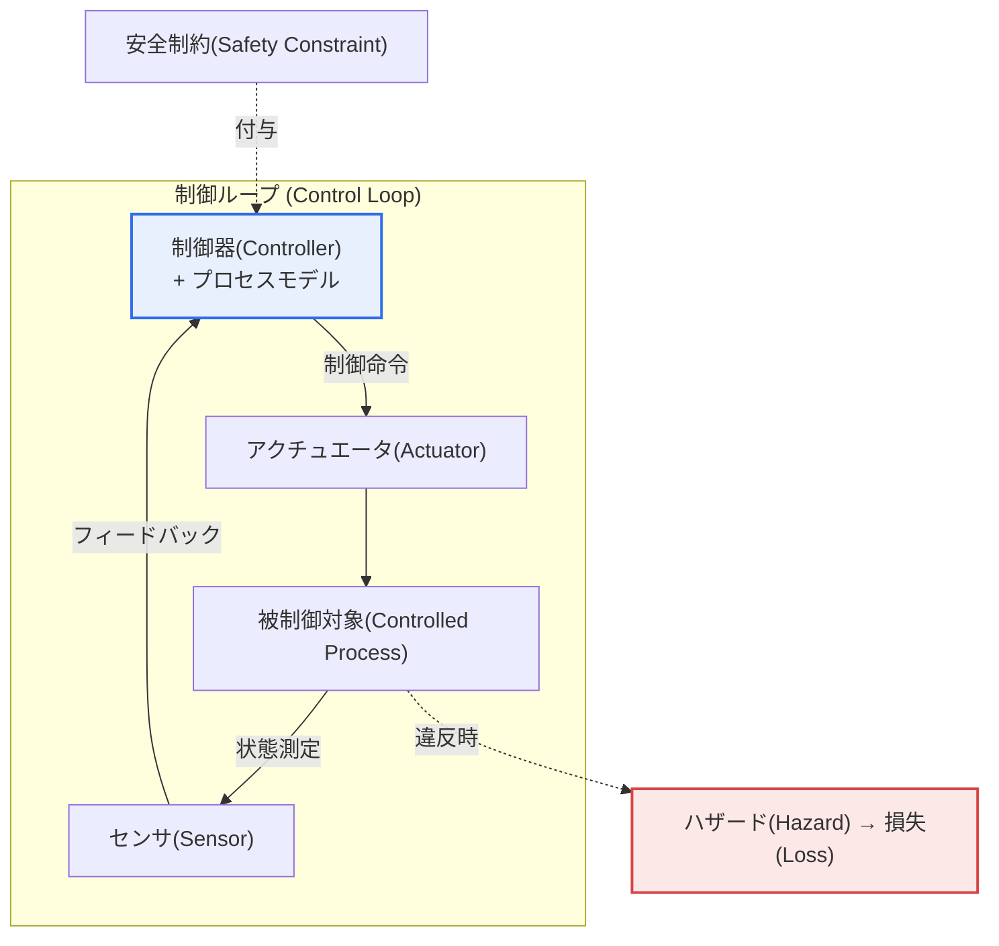
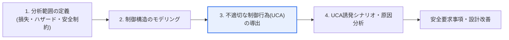

# STPA（System Theoretic Process Analysis） — FMEA・HAZOPとの比較

## 1. 概要

### A. 概念と背景
> **STPA**はシステム理論に基づくハザード分析（Hazard Analysis）手法であり、事故を「部品の故障」ではなく「**安全制約に違反する不適切な制御（Unsafe Control Action）**」と捉え、システムの制御構造からハザードをトップダウン（Top-down）で導出する。MITのナンシー・レブソン（Nancy Leveson）が提唱した事故因果モデル**STAMP**（System-Theoretic Accident Model and Processes）に根ざしている。

STPAが登場した根本的な理由は、「**現代の事故は部品故障よりも相互作用・制御の問題からより多く発生する**」からである。この背景を理解するには、まず伝統的な安全分析が拠って立つ前提を見る必要がある。FMEA・HAZOPのような古典的手法は「この部品が故障したら何が起こるか」を問う。その根底には、**各部品が正常であればシステムも安全である**という信頼性理論（Reliability Theory）の前提がある。この前提は、部品故障が事故の支配的原因であった機械中心の時代には妥当であった。

しかし、自動運転・航空・医療機器・原子力のように、ソフトウェアが複数の要素を統合制御する複雑システムでは、この前提が崩れる。すべての部品が仕様どおり正常に動作していても、**部品間の誤った相互作用や状況に合わない制御命令**によって事故が起こる。例えば、センサと制御器がそれぞれ個別試験をすべて通過していても、制御器が誤った状況認識（Process Modelの誤り）によって不適切な命令を出せば事故が発生する。ソフトウェアは物理的に「故障」しない — 設計どおりに動作するが、その設計された動作が特定の文脈で危険であるにすぎない。したがって、「故障率」でソフトウェアのリスクを説明することはできない。

STPAはこの点で視点を転換する。安全を「部品が故障しない状態」ではなく「**システムが安全制約（Safety Constraint）を満たし続けるよう制御されている状態**」と再定義し、事故をその制御が失敗した結果とみなす。すなわち、安全を**制御問題（Control Problem）**として扱う。この転換により、STPAは部品故障だけでなく、要求事項の不備、制御器の状況認識の誤り、人間と自動化の相互作用の誤りなど、伝統的手法が見落としていたハザードまで発掘する。

### B. FMEA・HAZOPの特徴および限界
FMEAとHAZOPは長年の検証を経た手法であるが、共通の限界がある。**FMEA**（Failure Mode and Effects Analysis）は、部品それぞれの故障モード（Failure Mode）を列挙し、その影響をボトムアップ（Bottom-up）で分析し、重大度・発生度・検出度を掛け合わせたRPN（Risk Priority Number）で優先順位を付ける。**HAZOP**（Hazard and Operability Study）は、「No」「More」「Less」といったガイドワードをプロセス変数に当てはめ、設計意図からの逸脱（Deviation）を体系的に探す。

| 手法 | アプローチ | 強み | 限界 |
|---|---|---|---|
| **FMEA** | 部品の故障モード・影響をボトムアップ分析、RPNで優先順位付け | 個別部品の信頼性の定量化に強い | 部品個別の故障中心で、部品間の相互作用・SWの誤りを見落とす |
| **HAZOP** | ガイドワードでプロセス設計の逸脱を分析 | 化学・プロセスプラントで実証済み | プロセスフロー中心で、複雑な制御・SWロジックに限界 |

両手法とも、分析単位が「部品（またはプロセス変数）」であることから限界が生じる。部品を一つずつ切り離して見るため、部品がすべて正常であるにもかかわらず発生する相互作用・制御の誤りは、構造的に視野に入らない。これこそがSTPAが補完しようとする正確なポイントである。

歴史的に、この限界は実際の大規模事故で明らかになった。ソフトウェアが制御するシステムの事故の相当数は、個別部品の物理的故障ではなく、要求事項の不完全性や運用者と自動化の間の誤解、状況に合わない制御命令に起因するという分析が蓄積されてきた。FMEA・HAZOPの枠組みでは「すべての部品が仕様を満たしていたのに、なぜ事故が起きたのか」という問いに答えにくく、まさにこの空白が、システム理論に基づく新たな分析手法の必要性を生んだ。

## 2. STAMP事故モデルとSTPAの位置付け

STPAを正しく理解するには、その基盤理論であるSTAMPを先に見る必要がある。STAMPはシステムを階層的な制御構造と捉え、上位階層が下位階層に安全制約を課して統制するとみなす。以下は、STAMPの制御ループとSTPAが扱う安全制約の関係を示した全体構造図である。

STAMPの核心概念は三つである。第一に、**制御構造（Control Structure）** — システムは、制御器・アクチュエータ・被制御対象・センサからなる制御ループの階層として表現される。第二に、**プロセスモデル（Process Model）** — 制御器は被制御対象の状態に関する内部モデルを持ち、それに基づいて命令を出すが、このモデルが実際とずれると（例: 航空機が着陸状態であると誤判断）不適切な命令が出る。第三に、**安全制約** — 事故を防ぐためにシステムが守るべき条件であり、STPAはこの制約がいつ違反されるかを追跡する。ソフトウェア集約型システムの事故の相当数が「プロセスモデルの誤り」で説明されるという点がSTAMPの洞察であり、これは部品故障モデルでは捉えられない。

## 3. STPAの4段階分析方法

STPAは、損失を定義するところから出発し、具体的な原因シナリオへと絞り込んでいくトップダウンの手順に従う。以下はそのプロセス詳細図である。

**A. 第1段階 — 分析範囲の定義。** まず、システムが決して経験してはならない**損失（Loss）**（例: 人命被害、ミッション失敗、資産損傷）を定義し、その損失につながるシステムレベルの**ハザード（Hazard）**（例: 「自動運転車が先行車両との最小安全距離を維持できない」）を識別する。続いて、各ハザードを裏返し、システムが守るべき**安全制約**を導出する。この段階が重要なのは、分析の基準点を「部品」ではなく「組織・利害関係者が合意した損失」に置くことで、以降のすべての分析が実際に防止すべき結果に整合するようにするためである。

**B. 第2段階 — 制御構造のモデリング。** システムを、制御器-アクチュエータ-被制御対象-センサの制御ループとしてモデル化する。ここには、ソフトウェア制御器だけでなく、人間の運転者、管制官、上位の管理組織まで制御者として含めることができる。人間と自動化を一つの制御構造の中に共に置くという点がSTPAの強みであり、人間-自動化相互作用（Human-Automation Interaction）の誤りを自然に扱うことができる。各制御関係には、どのような制御命令がやり取りされ、どのようなフィードバックが返ってくるかを記述する。

**C. 第3段階 — 不適切な制御行為（UCA）の導出。** 各制御命令について、それがどのような文脈で安全制約に違反するかを、四つの類型で体系的に検討する。この4類型がSTPAの核心ツールである。

| UCA類型 | 意味 | 例（自動運転の制動） |
|---|---|---|
| **① 提供しない** | 必要な制御を行わない | 障害物があるのに制動命令がない |
| **② 誤って提供** | 危険な制御を行う | 高速走行中の急制動で後続車の追突を誘発 |
| **③ タイミング・順序の誤り** | 早すぎる・遅すぎる、または誤った順序で提供 | 制動が遅すぎて停止距離を確保できない |
| **④ 持続の誤り** | 長すぎる/短すぎる適用または中断 | 制動を早く解除しすぎて再加速 |

**D. 第4段階 — シナリオ・原因分析。** 導出された各UCAについて、「なぜそのような制御が出るのか」を掘り下げる。原因は大きく二系統である — 制御器内部のプロセスモデルの誤り（誤った状況認識、アルゴリズムの欠陥、要求事項の不備）と、制御経路の問題（命令が伝達されない、フィードバックが遅延・損失する、センサの誤り）。こうして導出されたシナリオは、そのまま**安全要求事項**と**設計改善案**につながる。例えば「センサフィードバックの遅延が遅い制動を誘発する」というシナリオは、「フィードバック遅延の上限をT ms以内に保証せよ」という要求事項として具体化される。

この4段階が伝統的手法と決定的に異なるのは「分析の終着点」である。FMEAが部品別の故障確率とRPNという定量指標で止まるのに対し、STPAは各UCAを誘発する具体的シナリオを経て、ただちに検証可能な安全要求事項に帰結する。すなわち、STPAの成果物は「どの部品が危険か」ではなく「システムがどの制約をどの条件で守らなければならないか」であり、これが設計・検証段階へと自然につながり、安全を要求事項レベルで統制できるようにする。実際の自動運転の事例で「停止車両を背景と誤分類する認識エラー」が制動の不提供（UCA ①）の原因シナリオとして導出されれば、これは「特定の状況で認識の信頼度が閾値未満であれば安全停止せよ」という要求事項として反映される。

## 4. 伝統的手法との比較および実務上の含意

三手法の違いは、結局「分析単位と事故モデル」で分かれる。FMEA・HAZOPは部品・プロセスを単位として信頼性理論に立ち、STPAは制御構造を単位としてシステム理論に立つ。

| 区分 | FMEA・HAZOP | STPA |
|---|---|---|
| **視点** | 部品故障 | システムの制御・相互作用 |
| **理論基盤** | 信頼性理論 | システム理論（STAMP） |
| **分析方向** | ボトムアップ（FMEA）/逸脱（HAZOP） | トップダウン（損失→ハザード→UCA） |
| **強み** | 個別故障の定量化 | 相互作用・SW・制御・人的エラー |
| **適合対象** | ハードウェア中心のシステム | 複雑・SW集約型のセーフティクリティカルシステム |

違いが生じる理由を実務上の含意までつなげると、次のようになる。FMEAが部品の信頼性をうまく定量化できるのは、故障率という確率的データが部品単位で存在するためであり、まさにそのために、確率で表現されないソフトウェアロジックの誤りには弱い。逆に、STPAがSW・相互作用の誤りに強いのは、分析対象を「故障」ではなく「制御行為の適切性」に置くためであり、その代償として部品別の故障確率のような定量指標は直接算出できない。したがって実務では両者を対立させない — セーフティクリティカルシステムの認証では、STPAで制御・相互作用のハザードを発掘して安全要求事項を立て、FMEAでハードウェア部品の故障を定量評価し、この二つを相互補完的に併用するのが定着したアプローチである。

## 5. 深掘り: 標準・産業適用の動向

**A. 自動車 — 自動運転とSOTIF。** 機能安全規格ISO 26262が「部品故障によるハザード（誤動作）」を扱うのに対し、自動運転の新たな問題は「故障がなくても、意図された機能の限界や誤認識によって生じるハザード」である。これを扱う規格がISO 21448（SOTIF, Safety Of The Intended Functionality）であり、ここでSTPAはシナリオベースのハザード発掘手法として広く活用されている。センサ・認識・判断・制御へとつながる制御ループにおいて、状況認識の誤りが不適切な制御を生む過程を、STPAがよく捉えるためである。

**B. 航空・宇宙・防衛。** 米国の航空宇宙分野では、大規模システムの安全分析にSTPA・STAMPが実務的に採用されてきており、関連するハンドブックや事例が公開されている。複数の自動化と人間（パイロット・管制）が絡む制御構造を一つのモデルで扱えるため、人間-自動化相互作用に起因する事故の分析・予防に強みを示す。特に複数の組織・階層が関与する複雑システムにおいて、上位の管理・規制階層まで制御構造に含めて分析できる点が、航空・防衛のように組織的要因が事故に大きく作用するドメインで有用と評価されている。

**C. セキュリティへの拡張（STPA-Sec）と予想出題方向。** 近年では、安全（Safety）だけでなくセキュリティ（Security）上の脅威を同じ制御構造の視点で分析する**STPA-Sec**という拡張も議論されている。技術士の観点からの答案戦略としては、① 「部品故障 vs 制御・相互作用」という事故モデルの転換を明確に提示し、② STAMP–プロセスモデル–安全制約の概念的つながりとUCAの4類型を具体的な事例（自動運転の制動など）で説明し、③ FMEA・HAZOPとの相互補完、ISO 26262/21448のような規格との連携、設計初期適用の利点まで展開すれば、深掘りの深さを示すことができる。

## 6. 考慮事項および示唆点

技術士の観点から、STPAは個別手法の優劣ではなく、システムの複雑度・安全要求レベル・既存の認証体系に合わせてハザード分析戦略をどう構成するかという問題として取り組むべきである。以下はその戦略策定の判断基準である。

1. **相互補完的な活用が原則である。** STPAはFMEA・HAZOPを置き換える手法ではなく、部品故障（FMEA）と制御・相互作用の誤り（STPA）を併せて分析し、ハザードを包括的に発掘する補完材である。セーフティクリティカルシステムの認証では、両系統を併用して互いの死角を埋める戦略が望ましい。

2. **ソフトウェア集約型・自律システムに不可欠である。** 自動運転・航空・医療機器のように、SWが複雑に制御し人間と相互作用するシステムでは、部品故障だけでは説明できないハザード（プロセスモデルの誤り、要求事項の不備、人間-自動化相互作用）が支配的であるため、STPAの制御の視点が強力である。

3. **設計初期での適用が費用対効果に優れる。** STPAは制御構造をモデル化するため、要求事項・アーキテクチャ設計段階で適用すれば、発掘したUCAとシナリオをそのまま安全要求事項に反映し、ハザードを根本的に予防できる。開発後半に発見される欠陥ほど修正コストが急増するという点で、早期適用の経済的効果は大きい。

4. **規格・定量化との整合を設計する。** STPAはハザードの「発掘」には強いが、部品別の故障確率のような定量指標は直接算出しない。したがって、ISO 26262（機能安全）・ISO 21448（SOTIF）などの規格体系と整合を取り、必要な定量的根拠はFMEA・定量的信頼性分析で補う統合的なセーフティケース（Safety Case）を構成しなければならない。

5. **適用能力とツールの確保が鍵である。** STPAは視点の転換とシステム理論の理解を要求するため、分析者の訓練とチームの学習曲線、制御構造のモデリング・UCA管理を支援するツールが普及の成否を左右する。組織レベルでの方法論の内在化とツール支援を併せて計画してこそ、実務上の効果が出る。

## 参考資料
- Nancy Leveson, *Engineering a Safer World* (STAMP/STPA) — https://mitpress.mit.edu/9780262533690/engineering-a-safer-world/
- MIT PSAS, STPA Handbook — http://psas.scripts.mit.edu/home/materials/
- ISO 21448 (SOTIF) 概要 — https://www.iso.org/standard/77490.html

---

> **一言まとめ**: STPAは*事故を部品故障ではなく不適切な制御（安全制約違反）と捉える*システム理論（STAMP）ベースのハザード分析であり、制御構造からUCAの4類型をトップダウンで導出して、FMEA・HAZOPが見落とす相互作用・SW・人的エラーを発掘し、自動運転・航空などの複雑でセーフティクリティカルなシステムにおいて伝統的手法と相互補完的に活用される。
