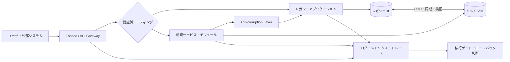
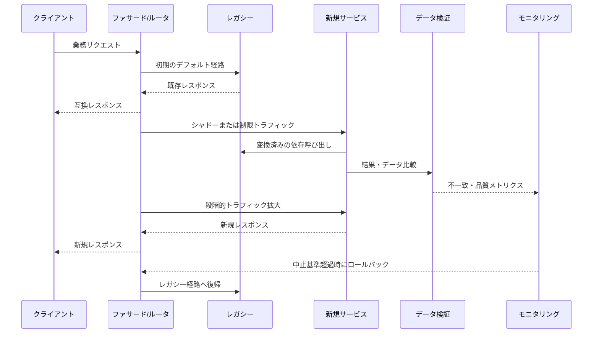

# ストラングラーフィグ（Strangler Fig）パターンに基づくレガシーモダナイゼーション

## 1. 概要

> **定義**: ストラングラーフィグ（Strangler Fig）パターンは、既存のレガシーシステムを一度に廃棄して書き直す代わりに、外部に仲介レイヤを置き、業務機能を小さな単位で新システムへ段階的に移行した後、移行が完了したレガシー部分を段階的に除去していくモダナイゼーション戦略である。

大規模な情報システムは、業務ルール、データ、バッチ、外部連携、運用手順が長期間にわたって蓄積されており、単にソースコードを新しい言語に翻訳しただけではモダナイズされない。
現在動作している機能の中には文書化されていないルールや例外が混在し、複数の部署が同じデータベースとインタフェースを共有しており、障害発生時の手動対応までもが業務プロセスの一部になっている。
したがって全面的な書き直しは、新技術を適用するには魅力的に見えるが、隠れた要求事項を見落としたり、長期の移行期間中に既存業務の改善を止めてしまったりするリスクが大きい。

ストラングラーフィグという名称は、宿主の木を包み込みながら成長する絞め殺しのイチジクの成長様式に由来する。
ソフトウェアでは、既存システムをただちに停止させるのではなく、新しい機能を既存システムの周縁から始め、機能が検証されるたびに新しい実装の範囲を広げていく。
ユーザや外部システムは当初は同じインタフェースを使うが、ルーティングレイヤはリクエストをレガシーまたは新システムへ選択的に送る。
最終的にすべての業務機能とデータが移行され、レガシーへの依存が除去されれば、仲介レイヤとレガシーシステムを併せて整理する。

このパターンの本質は、「新システムを作る技術」よりも「業務を止めずに変化の単位を小さくする技術」にある。
各段階は独立してデプロイ・観察されなければならず、誤った移行を元に戻せる経路を含む必要がある。
モダナイゼーションの進捗率も、コード行数ではなく、移行された業務能力、安定性、ユーザ価値、レガシー依存性の減少で測定するのが望ましい。

### 1.1 登場背景と必要性

第一に、レガシーシステムは置き換えの対象であると同時に、現場の中核的な運用基盤である。
代替システムが完成するまで既存システムを止めることはできないため、要求事項をすべて確定してから数年後に一括移行する方式は、現在の業務変化に合わない。
段階的な方式は、既存システムがサービスを提供し続ける間に、優先度の高い機能から改善できるようにする。

第二に、レガシーシステムの実際の挙動を完全に把握することは難しい。
ソースコードと設計書だけでは、運用データの特殊値、外部機関との非公式な連携、現場担当者の補正手順を発見しにくい。
小さな機能を実際の業務フローに投入すれば、チームは移行の過程で隠れたルールを学習し、以降の移行計画を修正できる。

第三に、投資と成果を段階的に確認する必要がある。
全面的な書き直しは多額のコストを先に投入し、最後になってようやく成否が分かるが、ストラングラーフィグは各段階で動作する成果物を出す。
したがって経営陣は、リスク、コスト、ユーザ価値の変化を定期的に判断し、継続・中止・方針転換を選択できる。

### 1.2 目標と設計原則

ストラングラーフィグの第一の目標は、無停止または低停止での移行である。
既存の契約とユーザ体験を維持しながら内部実装を変える必要があるため、外部インタフェースと内部サービスの境界を分離する。

第二の目標は、機能単位の可逆性である。
新機能の障害がサービス全体に波及しないようルーティングを元に戻せなければならず、データ変更には復旧と再処理の手順を備える必要がある。

第三の目標は、境界の明確化である。
業務能力、データ所有権、トランザクション範囲を基準に移行単位を定め、新システムがレガシーのデータ構造や用語をそのまま引きずらないよう変換境界を置く。

第四の目標は、レガシーの最終的な除去である。
仲介レイヤを恒久的な複雑性として残すと、システムはレガシーと新システムが結合した新たなモノリスになる。
したがって最初から完了条件、除去時期、担当者、予算を定義し、一時的なアダプタとルーティングルールに有効期限の条件を付与する。

## 2. 構造と中核構成要素

ストラングラーフィグパターンは、プロキシを一つ追加するだけの構造ではない。
クライアントとシステムの間のルーティングレイヤ、新機能を提供するサービス、レガシーと新システムの間の変換レイヤ、データ同期・検証の仕組み、オブザーバビリティと移行統制の機能が併せて構成される。

### 2.1 ファサードまたはルーティングレイヤ（Facade）

ファサードは、既存クライアントが見る接点と内部実装の所在を分離する。
初期にはほとんどのリクエストをレガシーへ転送し、移行が完了した機能のリクエストだけを新サービスへ送る。
こうすることで、クライアントが呼び出し先アドレスを変えなくても、内部の機能所有権を移すことができる。

ルーティング基準はURLだけに限定しない。
機能・バージョン・テナント・地域・ユーザグループ・トラフィック比率・フィーチャーフラグを組み合わせることができ、高リスクの変更は社内スタッフや一部のトラフィックから始める。
ただし、ルーティングルールが業務ルールと混ざるとファサードが新たな巨大システムになるため、技術的ルーティングと業務判定の責任を分離しなければならない。

ファサードは単一障害点やボトルネックになりやすい。
ステートレスで水平スケールさせ、ルール配布のバージョンとキャッシュ無効化の方式を管理し、ファサード自体の障害時の安全なデフォルト経路を定義する。
すべてのルーティング決定について、対象バージョン、ルールバージョン、ユーザ影響範囲をログに残し、障害時にどのリクエストがどのシステムへ送られたかを再現できるようにする。

### 2.2 新規サービスと機能スライス

移行単位は技術レイヤではなく業務能力で切るのがよい。
例えば注文システムでは、画面・コントローラ・サービス・テーブルを一度に移すよりも、「配送先変更」や「注文状態照会」のようにユーザが理解できるフローを一つのスライスとして定義する。
機能スライスは、入力契約、出力契約、データ所有権、エラー処理、運用メトリクスを併せ持つ。

最初からすべてのドメインをマイクロサービスに分割する必要はない。
新しい実装はモジュラーモノリスでもよいし、機能ごとの独立サービスでもよい。
重要な基準は、デプロイと所有権の境界が明確であり、次の移行単位を妨げないかどうかである。

### 2.3 腐敗防止レイヤ（Anti-corruption Layer）

レガシーと新システムは、同じ単語を使っていても意味やデータ形式が異なる場合がある。
レガシーは`顧客等級=3`として保存しているが、新システムは`SILVER`という明示的な列挙型を使う場合があり、レガシーの一つの注文状態が新システムでは複数の状態に分割されることもある。
腐敗防止レイヤはこうした差異を変換し、レガシーのデータ構造・エラーコード・トランザクション慣行が新システムのモデルを汚染しないようにする。

このレイヤは単純なDTOマッピングを超え、契約変換、単位・タイムゾーン変換、エラーの意味の変換、リトライ・タイムアウト、冪等性処理を含む。
変換ルールはテスト可能なコードとバージョン付きの契約として管理し、新システム内部でレガシーの用語が直接使われていないかを静的検査で点検する。

### 2.4 データストアと同期

アプリケーション機能を移しても、データが中央のレガシーデータベースに残っていれば、システムの結合は続く。
しかし、データベースを最初から分離すると同期と一貫性の問題が急激に大きくなるため、段階的に読み取り・書き込みの責任を移していく。

初期段階では新サービスがレガシーテーブルを読むことができるが、新しいコードがレガシースキーマに直接依存する期間を制限する。
次の段階ではドメインデータを新しいストアへ複製し、元データと複製データの件数・合計・ハッシュ・業務上の不変条件を検証する。
検証が完了したら新しいストアをシステム・オブ・レコードに指定し、レガシーには必要な互換データのみを提供する。

| 構成要素 | 主な責任 | 中核となる統制 |
|---|---|---|
| ファサード・ゲートウェイ | リクエストをレガシーと新システムに振り分け | ルールバージョン、障害時迂回、アクセス制御 |
| 新規機能スライス | 移行された業務能力の実行 | 契約テスト、フィーチャーフラグ、独立デプロイ |
| 腐敗防止レイヤ | モデル・契約・エラーの意味の変換 | マッピングバージョン、変換テスト、冪等性 |
| 同期パイプライン | 元ストアと新規ストア間のデータ伝達 | CDC、再処理、順序・重複制御 |
| オブザーバビリティレイヤ | 移行結果と運用リスクの測定 | 分散トレーシング、SLO、機能別比較 |
| 除去計画 | レガシー依存性の終了 | 使用量0の確認、保存・廃棄の承認 |

表の項目は独立した製品リストではなく、一つの移行統制面を構成する。
例えば、ルーティングが新サービスに切り替わったのにデータ同期の遅延を測定していなければ、ユーザは古い照会結果を受け取る可能性がある。
逆に、データが先に分離されても、ファサードの切替ルールが準備されていなければ、新しいストアの結果を実際の業務に公開できない。
したがって、機能ごとにルーティング、変換、データ、オブザーバビリティの準備状態を併せて評価しなければならない。

## 3. 段階的移行の手順

### 3.1 目標と現状の診断

モダナイゼーションに先立ち、「技術を変える」ではなく、どの業務成果を改善するかを定義する。
応答時間、リリースサイクル、障害復旧時間、規制対応、運用コスト、拡張性の中から優先順位を定め、数値化可能なベースラインを確保する。

レガシーの呼び出し関係とデータフローを静的解析だけで推定せず、実際のログ・トレース・バッチ履歴・担当者インタビューで補完する。
機能別の使用量、売上・規制への影響、変更の難易度、結合度、データの機微性を併せて評価すれば、移行候補の優先順位を決められる。

### 3.2 境界と最初のスライスの選定

最初の移行対象には、最も複雑な機能よりも、学習効果が高く失敗の範囲が限定された機能が適している。
業務価値が明確で、呼び出し境界を観察でき、データ所有権を説明できる機能を選ぶ。
中核的な決済のアトミックなトランザクションのように失敗コストが大きい領域は、十分なガードレールが整ってから扱う。

機能を選定する際、「画面一つ」という基準では不十分である。
入力検証、権限、データ変更、非同期イベント、通知、監査ログ、バッチの後続処理までが一つの業務能力に含まれるかを確認しなければならない。
境界を誤ると、一つの機能が両方のシステムを繰り返し呼び出し、結局は以前よりも複雑な分散トランザクションが生まれる。

### 3.3 ファサードと契約の導入

クライアントとレガシーの間にファサードを設置するが、初期はすべてのリクエストをレガシーへ転送し、挙動が変わらないことを検証する。
この段階は機能移行ではなく、オブザーバビリティと統制の基盤を作る段階である。
リクエスト・レスポンスのスキーマ、認証主体、レイテンシ、エラー率、リトライ回数をベースラインと比較する。

その次に新サービスの契約を定義する。
契約は単なるJSONフィールドの一覧ではなく、フィールドの意味、必須性、単位、ソート・ページング、エラーコード、冪等性、個人情報のマスキングルールを含む。
コンシューマ駆動契約テストと互換性チェックにより、一方のデプロイが他方の呼び出しを壊さないようにする。

### 3.4 機能実装と並行検証

新機能はアダプタを通じて必要なレガシーのデータとサービスを利用するが、レガシーの内部呼び出しをそのままコピーしない。
実装が完了したら、シャドートラフィックや読み取り比較を用いて、新しい結果をユーザに公開する前にレガシーの結果と比較する。
比較は文字列の完全一致だけで判断してはならず、業務的に同一か、許容可能な丸め・並び順の差異かを区別する。

書き込み機能は読み取りよりも危険である。
初期は新サービスが検証・計算のみを行い実際の書き込みはレガシーが担うようにするか、デュアルライトを使いつつ重複と順序の逆転を処理する。
デュアルライトの成功基準は両システムとも記録されたことを意味するため、部分的な失敗に対する補償処理と運用キューを設計しなければ、整合性の負債が蓄積する。

### 3.5 トラフィック切替と安定化

切替は一度のスイッチではなく、段階的な拡大である。
社内ユーザ、テストテナント、少量トラフィック、特定地域、全トラフィックの順に拡大でき、段階の間に観察期間を設ける。
各段階には、許容可能なエラー率・レイテンシ・業務成功率・データ不一致率の中止基準を設ける。

フィーチャーフラグは迅速な切替とロールバックを助けるが、期限切れにならないフラグはコードと運用経路を複雑にする。
フラグの所有者、有効期限、デフォルト値、緊急解除権限、変更の監査ログを管理し、切替完了後は必ず除去する。

### 3.6 レガシーの除去と事後検証

新システムが正常に動作しているからといって、ただちにレガシーのテーブルとコードを削除しない。
呼び出し量が一定期間0であるか、バッチ・外部連携・管理者ツールが残っていないか、監査・保存義務が満たされているかを確認する。
削除前にはバックアップからの復旧とロールバックの可能性を検証し、保存すべきデータと廃棄するデータを法務・個人情報担当者と区別する。

除去後も、ユーザと運用チームが新しい経路のメトリクスを理解しているかを確認する。
モダナイゼーションの完了とはコード削除の瞬間ではなく、責任者・運用手順・障害対応・セキュリティ統制が新システムへ移行された状態を意味する。

## 4. データモダナイゼーションと一貫性設計

### 4.1 共有データベースのリスク

複数のサービスが同じテーブルを直接読み書きすると、テーブル構造が事実上の共用APIになる。
新システムがレガシーテーブルを変更すると他のバッチやレポートが影響を受け、どのサービスが値を変更したかを追跡しにくい。
したがって移行過程では、テーブルアクセスを段階的にサービスAPIやイベントでラップし、直接アクセスの一覧と廃止スケジュールを管理する。

共有データベースをただちに分離できない場合でも、読み取りと書き込みの所有者を決めることはできる。
特定ドメインの書き込みは一つのシステムだけが担い、他のシステムはイベントや読み取りモデルを通じてアクセスするようにすれば、競合の原因を絞り込める。
このとき、データの鮮度目標と一時的な不一致を業務的に許容するかどうかを明示しなければならない。

### 4.2 CDCとイベント駆動型同期

変更データキャプチャ（CDC）は、データベースのログや変更イベントを読み取り、新しいストアに伝達する方式である。
アプリケーションコードに同期ロジックを散在させるよりも欠落の監視と再処理が容易になり得るが、削除・スキーマ変更・トランザクション順序・機微情報の伝播を併せて統制する必要がある。

イベント駆動型同期では、イベントの意味とスキーマをバージョン管理する。
コンシューマは重複イベントを受け取っても一度だけ適用できなければならず、順序が重要な業務はキーごとの順序と遅延イベントの処理ポリシーを備える必要がある。
失敗したイベントを無限にリトライすると障害が拡大するため、隔離キューとオペレータによる再処理手順を設ける。

### 4.3 デュアルリード・デュアルライト

デュアルリードは二つのシステムの結果を比較するのに有用だが、ユーザリクエストのレイテンシと負荷を増加させる。
比較リクエストは非同期で実行するかサンプリングし、個人情報を含む結果はマスキング・ハッシュ化して、比較ログに原文を残さない。

デュアルライトはデータ整合性の確認に役立つが、分散トランザクションではない。
一方の書き込みが成功した後に他方が失敗すると、補償イベント、再処理キュー、オペレータによる確認、元システム基準の復旧シナリオが必要になる。
可能であれば、元データを一つに保ちつつイベントで派生ストアを更新する構造のほうが、責任の境界を明確にする。

| データ段階 | 読み取り経路 | 書き込み経路 | ロールバック難易度 | 適用目的 |
|---|---|---|---|---|
| 初期観察 | レガシー | レガシー | 低 | ベースライン・呼び出し関係の把握 |
| シャドー検証 | レガシー+新規の比較 | レガシー | 低〜中 | 結果・性能の検証 |
| 限定切替 | 新規優先、失敗時はレガシー | 単一の元データまたは統制されたデュアルライト | 中 | 実トラフィックでの学習 |
| ドメイン所有権の移行 | 新規 | 新規 | 中〜高 | 新システムをシステム・オブ・レコードとして確定 |
| レガシー除去 | 新規 | 新規 | 高 | 依存性の終了とコスト削減 |

各段階でロールバックを「以前のルーティングに戻す」とだけ定義するのは不十分である。
すでに新しいストアに記録された変更をレガシーに戻すべきか、ユーザに成功と見えたリクエストを再処理しても安全か、イベントが重複発行されないかまで決めなければならない。
特に元データの所有権を移した後は、ロールバックよりも前方向の復旧のほうが安全な場合が多いため、段階ごとに可逆性と復旧目標を区別する。

## 5. 既存の移行戦略との比較

全面的な書き直し（Big Bang）は、新システムを完成させた後に一度に切り替える方式である。
構造が単純で、移行期限が短く、レガシーの外部依存が少ない場合には管理が容易なこともある。
しかし長期間の開発中はユーザのフィードバックを実運用で確認しにくく、最後の切替時に隠れた差異とデータの問題に一度に直面する。

並行稼働（Parallel Run）は、旧システムと新システムを一定期間同時に実行し、結果を比較する方式である。
リスクの高い計算や規制報告のように、同一入力に対する結果の検証が重要な場合に有用だが、二つのシステムに入力を供給し結果を突き合わせるコストが大きい。
ストラングラーフィグは並行稼働を一部活用できるが、システム全体を完成させてから並行させるのではなく、機能ごとに小さな範囲で適用する。

リフト・アンド・シフト（Lift and Shift）は、既存の構造を大きく変えずにインフラのみを移す方式である。
運用停止やインフラ老朽化のリスクは減らせるが、アプリケーションの結合度やデプロイのボトルネックは残り得る。
一方、ストラングラーフィグはインフラ移行とアプリケーション・データ境界の再設計を併せて推進できるが、一時的な構造と運用の複雑性が増す。

| 区分 | 全面的な書き直し | リフト・アンド・シフト | ストラングラーフィグ |
|---|---|---|---|
| 移行単位 | システム全体 | インフラ・デプロイ単位 | 業務機能・ドメイン単位 |
| 初期価値 | 遅れて発生 | インフラ移行直後 | 各スライス完了時に発生 |
| 業務停止リスク | 高 | 中 | 相対的に低 |
| 一時的な複雑性 | 開発期間中は大きい | 比較的低い | ファサード・同期により高い |
| 隠れた要求事項の学習 | 後半に集中 | 限定的 | 段階ごとに学習 |
| データ設計の変化 | 一度に推進 | ほとんどなし | 段階的に推進 |
| 成功条件 | 全体完成・一括検証 | 移行後の安定化 | 境界・オブザーバビリティ・除去計画 |

この比較において、ストラングラーフィグが常に優れているわけではない。
小さく独立したシステムを迅速に置き換える必要がある場合や、法規上元のシステムを即座に廃棄しなければならない場合は、段階的な共存がかえって不利になり得る。
逆に、大規模な業務システムのように停止コストが高く要求事項が変化し続ける環境では、初期の一時的コストを受け入れる理由が大きくなる。

## 6. 適用事例: 注文・配送プラットフォームの段階的移行

以下は特定企業の実績ではなく、技術士の答案作成のための例示シナリオである。
注文・配送プラットフォームが古いモノリシックアプリケーションと一つのリレーショナルデータベースを使用しており、新規モバイルチャネルと地域別の配送ルールを迅速にサポートする必要があると仮定する。

第一段階で、チームはファサードを設置し、注文照会のトラフィックを観測する。
注文作成はレガシーに残したまま、照会リクエストのみを新しい照会サービスへシャドー方式で転送し、状態・金額・配送先マスキングの結果を比較する。
このとき、機能を移す前にレガシーの実際の応答時間分布とエラー類型をベースラインとして作成する。

第二段階で、注文照会の読み取りモデルを新しいストアに作る。
レガシーの注文テーブルの変更をCDCで伝達し、注文ごとの最終イベント時刻とバージョンを記録する。
新しい照会結果が遅延したり不一致だったりする場合はユーザに公開せずレガシー経路を維持し、不一致レコードを運用キューへ送る。

第三段階で、配送先変更機能を移行する。
住所の正規化・権限検証・配送可能地域の判定は新サービスが行い、注文状態の変更は明示された契約を通じてレガシーの単一の書き込み経路を呼び出す。
新システムがレガシーの内部テーブルを直接変更しないようにすることで、以後、注文ドメインの書き込み所有権を移せる境界を作る。

第四段階で、新規地域を対象に注文作成のトラフィックを段階的に切り替える。
重複注文を防ぐため、クライアントのリクエストキーと業務キーを併せて冪等性キーとして用い、ルータのリトライで同一注文が二重に作成されないようにする。
注文作成結果、決済承認、在庫引当、配送イベントの相関IDを全区間に伝達する。

第五段階で、障害注入と復旧訓練を実施する。
CDCの遅延、新しいストアの障害、ルータのルール誤り、レガシー呼び出しのタイムアウト、イベントの重複をシナリオ化し、実際のロールバック時間とデータ復旧時間を測定する。
測定結果が目標を満たせば地域とトラフィックの範囲を拡大し、満たさなければフィーチャーフラグを戻したうえで原因を補強する。

最後に、レガシーの注文照会テーブルと関連バッチの使用量が0であることを確認し、監査・保存データは別途保管したうえでドメインテーブルを廃棄する。
レガシーアプリケーションに残った注文関連コードとファサードのルールを除去し、「新規サービスにルーティングされるが内部的にはレガシーを呼び出している」という偽りの完了状態を避ける。

## 7. リスク要因と統制方策

### 7.1 一時的構造の恒久化

ファサードと腐敗防止レイヤは移行を可能にするが、除去スケジュールがなければ恒久的な変換コストと障害点になる。
すべての一時的構成には、所有者、作成日、依存機能、除去条件、有効期限をタグとして付与する。
四半期ごとのアーキテクチャレビューで実際のトラフィックとコード参照を確認し、除去作業を通常の機能開発と同等の優先度で管理する。

### 7.2 データ不一致とロールバックの失敗

新システムが成功レスポンスを返したのにデータ同期が失敗すると、ユーザは再接続後に異なる結果を目にする可能性がある。
データの所有者を一つに定め、イベントの順序・重複・遅延を処理し、整合性メトリクスと再処理結果を監査する。
ドメインごとに、どの時点までルーティングを戻せるか、それ以降はどのような前方向の補正を行うかを文書化する。

### 7.3 性能ボトルネックと障害の伝播

ファサードですべてのリクエストを検査・変換するとレイテンシが蓄積し、レガシーと新システムの両方を呼び出す比較リクエストは負荷を倍増させる。
経路別のタイムアウト・サーキットブレーカ・バルクヘッド・非同期比較を適用し、移行段階ごとの容量試験で最大同時リクエスト数とピーク負荷を確認する。
オブザーバビリティは平均値ではなく、パーセンタイルのレイテンシと業務失敗率を中心に設計する。

### 7.4 セキュリティ・個人情報統制の断絶

新サービスへ機能を移す過程でレガシーの認証・権限・マスキング・監査ログを見落とすと、機能は動作しても統制レベルが低下する。
新サービスのデータ分類、最小権限、シークレット管理、暗号化、アクセスログを設計段階で点検し、レガシーと新システムの権限判定が同じ意味を持つかをテストする。
シャドートラフィックのログには、住民登録番号・決済情報のような機微な値を原文で残さない。

### 7.5 組織と責任の不一致

機能移行はチーム間の所有権と業務プロセスを変える。
開発チームだけがモダナイゼーションを行い、運用・セキュリティ・データ・現場が遅れて参加すると、移行完了後の障害対応や変更承認でボトルネックが生じる。
プロダクト責任者、ドメイン責任者、プラットフォームチーム、データ管理者、セキュリティ・監査担当者の意思決定権限をRACIで整理し、共通の成功指標を設ける。

## 8. 深掘り: モダナイゼーションポートフォリオと測定体系

ストラングラーフィグを一つのプロジェクトのスケジュール表としてのみ管理すると、機能移行の数を増やすことに集中しがちである。
技術士の観点からは、モダナイゼーション対象のポートフォリオを価値・リスク・結合度・規制・変更頻度の軸で評価し、各ドメインの目標アーキテクチャと移行順序を結び付けなければならない。

機能の優先順位は、単純な難易度順ではない。
顧客価値が高く変更が頻繁な機能は新システムでの学習効果が大きいが、結合度が高すぎると最初の候補としては不適切な場合がある。
逆に、独立性が高いが価値の低い機能はリスクを減らすための練習対象として活用できるため、ポートフォリオ全体で学習と価値のバランスを取る。

運用指標は四つの階層で構成する。
第一は技術指標であり、可用性、エラー率、レイテンシ、スループットである。
第二はデータ指標であり、同期遅延、不一致件数、重複イベント、再処理成功率である。
第三は業務指標であり、注文成功率、精算の正確性、業務処理時間、ユーザ離脱である。
第四は移行指標であり、レガシー呼び出し比率、新規機能比率、一時アダプタの数、除去したテーブル・バッチの数である。

これらの指標は一つのダッシュボードに集約するが、同じ意味の分母を使わなければならない。
例えば、新システムのエラー率が低いだけで成功と判断することはできず、ルータが新規へ送ったリクエストのうちレガシーへのリトライに切り替わった比率と、最終的な業務成功率を併せて見る必要がある。
移行段階の中止基準は事前に合意し、基準を超えた場合は自動または承認ベースのロールバックを実行する。

アーキテクチャ意思決定記録（ADR）には、なぜこの機能を先に選んだのか、どのデータ所有権と一貫性モデルを採用したのか、いつファサードを除去するのかを残す。
この記録は、チームが変わったり運用障害が発生したりしたときに、移行の意図とトレードオフを再確認させる。
また、新サービスが再びレガシーと同様の結合度を生まないよう、共通原則と禁止ルールをコード検査と設計レビューに反映する。

## 9. 考慮事項および示唆点

### 9.1 業務境界優先の設計

技術レイヤやチーム組織を基準に切ると、データ所有権とトランザクションが絡み続ける。
業務能力と変更理由を基準に境界を定め、境界ごとに責任者と成功指標を指定しなければならない。

### 9.2 可逆性と前方向の復旧の区別

すべての変更を原状回復できると仮定すると、データ移行後の現実を過小評価することになる。
ルーティングのロールバック、コードのロールバック、データのロールバック、業務の補償処理はそれぞれ異なる手段であるため、段階ごとに可能な範囲を試験し、不可能な場合は前方向の補正手順を準備する。

### 9.3 オブザーバビリティなき段階的移行の禁止

新システムがうまく動いているという開発者の判断だけでトラフィックを増やすと、ユーザの実際のエラーやデータの遅延を見落とす可能性がある。
分散トレーシング、構造化ログ、機能別SLO、データ整合性検証、業務KPIを移行前から準備しなければならない。

### 9.4 一時的構成のライフサイクル管理

ファサード・アダプタ・デュアルライト・同期パイプラインは技術的負債になり得るため、通常の資産と同様に登録し、有効期限と除去条件を管理する。
モダナイゼーション完了のレビューにレガシーコードの削除とルーティングルールの除去を含め、「新システムが追加された」ことと「レガシーが置き換えられた」ことを区別する。

### 9.5 セキュリティと個人情報の同等性確保

機能が新システムへ移る際に、認証、権限、暗号化、マスキング、監査の統制レベルが低下してはならない。
両システムのポリシーを比較し、テストデータとシャドーログの機微情報の露出を遮断し、データの保存・廃棄義務を移行計画に反映する。

### 9.6 組織・運用モデルの同時変革

新しいアーキテクチャだけを導入し、チームのデプロイ権限、障害対応、プロダクトの意思決定構造をそのままにしておくと、レガシーを生んだ原因が繰り返される可能性がある。
ドメイン中心の所有権、自動化されたデプロイとテスト、運用フィードバックループを併せて設計し、モダナイゼーションを一過性のプロジェクトではなく持続可能な働き方とする。

### 9.7 適用不適合状況の判断

リクエストを横取りできる接点がない場合、レガシーと新システムの共存を許容する時間がない場合、システムが小さく独立している場合は、全面的な置き換えのほうが合理的なこともある。
パターンを流行のアーキテクチャとして選ぶのではなく、移行期間、データリスク、停止コスト、最終的な除去の可能性を比較して決定する。

## 参考資料

- Martin Fowler, “Strangler Fig”: https://martinfowler.com/bliki/StranglerFigApplication.html
- Microsoft Azure Architecture Center, “Strangler Fig pattern”: https://learn.microsoft.com/en-us/azure/architecture/patterns/strangler-fig
- AWS Prescriptive Guidance, “Strangler Fig pattern”: https://docs.aws.amazon.com/prescriptive-guidance/latest/modernization-strangler-fig-pattern/introduction.html

---

> **一言まとめ**: ストラングラーフィグパターンは、ファサード・機能スライス・データ検証・可逆的な切替によってレガシーを業務停止なしに段階的に置き換え、最後には一時的な構造まで除去するモダナイゼーション戦略である。
