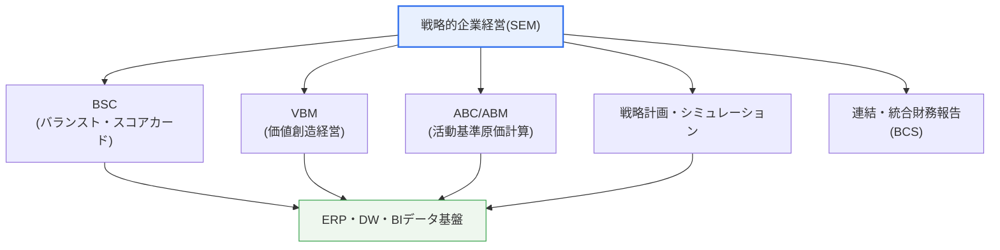

# 戦略的企業経営（SEM, Strategic Enterprise Management）

## 1. 概要

### A. 定義
> SEMは、企業の**戦略策定から実行・成果測定・フィードバックまでの全過程を情報システムで統合的に支援**し、戦略目標の達成を体系的に管理する経営手法であり、同時にその手法を実装したシステムである。抽象的な戦略を実行可能な指標（KPI）と具体的な活動に翻訳し、その進捗をデータで追跡・フィードバックすることが本質である。

SEMが登場した根本的な背景は、「**優れた戦略が実行段階でたびたび失敗する**」という長年の経営課題であった。経営陣がいかに優れた戦略を立てても、それが現場の具体的な活動や成果測定につながらなければ、会議室の壁に掛けられた額縁の中のスローガンにとどまる。実際、多くの経営研究は、戦略失敗の相当部分が戦略そのものの欠陥ではなく「実行（execution）の失敗」に起因すると指摘している。キャプランとノートンが観察したところによれば、多くの組織では構成員の大多数が自社の戦略を正しく理解しておらず、予算・成果報酬の体系が戦略と乖離しており、経営陣でさえ戦略の実行状況の検討に十分な時間を割けていない。

SEMはまさにこの「**戦略と実行の間のギャップ（strategy-execution gap）**」を埋めるために考案された。1990年代後半にERP導入が広がるにつれ、企業内部に膨大な運用データが蓄積され、このデータを戦略の観点から再解釈して経営陣の意思決定に結び付けたいという要求が高まった。SAPが「SEM」という製品群を打ち出したことで用語が普及したが、概念的にはBSC・VBM・ABCのような戦略管理手法を情報システムに統合したことが核心である。すなわちSEMは特定の製品ではなく、「戦略をデータで管理する」という経営パラダイムに近い。

### B. 登場背景と必要性
経営環境が複雑かつ急速に変化するほど、経営者の直感や年度末の決算報告書に依存する事後的な管理では対応が遅れる。市場・競争・規制がリアルタイムで変化する環境では、戦略の実行状況を常時追跡し、目標と実績の差異が検知された時点でただちに原因を分析して戦略を調整する能力が競争力を左右する。SEMはこうした**データに基づく戦略実行・フィードバック（feedback）のインフラ**を提供する。

特に、財務諸表のような遅行指標（lagging indicator）だけでは企業の将来の成果を予測したり牽引したりできないという認識が、SEMの必要性を裏付けている。今四半期の売上は、過去数四半期にわたる顧客満足、プロセス品質、従業員の能力への投資の「結果」にすぎない。SEMはこうした先行指標（leading indicator）までバランスよく測定し、財務成果が悪化する前に、その原因となる活動を管理できるよう支援する。この点が、単なる財務管理システムやBIツールとSEMを区別するポイントである。

## 2. 構成要素

SEMは複数の戦略経営手法を情報システムに統合したものであり、各手法が戦略管理の異なる側面を担う。以下の概念図は、SEMを構成する中核手法とその関係を示している。

**BSC（Balanced Scorecard、バランスト・スコアカード）**はSEMの中心軸である。財務・顧客・内部プロセス・学習と成長の四つの視点から戦略をバランスよく測定し、短期的な財務成果だけに埋没することを防ぐ。例えば、財務の視点の「売上成長」という目標は、顧客の視点の「顧客満足度」、プロセスの視点の「納期遵守率」、学習と成長の視点の「従業員の熟練度」といった先行要因と因果的に結び付いている。BSCはこの四つの視点の目標を**戦略マップ（Strategy Map）**として可視化し、下位の活動がどのように最終的な財務成果につながるかを一目で示す。

**VBM（Value-Based Management、価値創造経営）**は、企業価値の最大化をあらゆる意思決定の基準とする手法である。代表的な指標である**EVA（経済的付加価値）**は、税引後営業利益から投下資本に対する資本コストを差し引いて算出する。これは、会計上の利益が出ていても資本コストを上回れなければ、実質的には価値を破壊したとみなす視点を反映している。例えば、ある事業部が税引後営業利益100億ウォンを上げても、投下資本1,000億ウォンに資本コスト率（WACC）12%を適用した資本コスト120億ウォンを差し引けば、EVAは−20億ウォンとなる。すなわち会計上は黒字でも、資本を提供する株主の観点からは20億ウォンの価値を破壊したことになる。VBMはこのように、事業部・プロジェクトごとに真に価値を創出している部分と資本を消耗している部分を区別し、資源配分を最適化する。

**ABC/ABM（Activity-Based Costing/Management、活動基準原価計算/管理）**は、原価を製品や部門ではなく「活動」単位で追跡する。伝統的な原価計算は間接費を売上や人員数のような単一の基準で配賦するため実際の原価を歪めるが、ABCは各活動が消費する資源を因果的に配賦し、どの製品・顧客・チャネルが実際に利益を生み、どこで原価が漏れているかを明らかにする。

例えば、売上は大きいが頻繁な少量注文・返品・特別配送を要求する顧客は、伝統的な原価計算では優良顧客に見えるが、ABCで活動原価を配賦するとむしろ赤字顧客である可能性がある。ABM（活動基準管理）は、こうした分析結果をもとに非付加価値活動を除去・改善し、収益性の低い製品・顧客のポートフォリオを再調整する。このようにABC/ABMは、VBMの価値判断とBSCのプロセスの視点に正確な原価情報を供給する基盤となる。

**戦略計画・シミュレーション（BPS, Business Planning & Simulation）**は、シナリオベースで計画を策定・検証する。「What-if」分析によって為替・原材料価格・需要変動などの前提を変えながら戦略の財務的結果を予測し、ローリングフォーキャスト（rolling forecast）で計画を常時更新する。伝統的な年間予算が一度確定すると環境が変わっても硬直的に維持されるのとは異なり、BPSは予測を定期的に更新して計画と実行の乖離を減らす。これら四つの手法は互いに独立しておらず、一つのデータ基盤の上でかみ合って機能するという点が、SEMの統合的な性格を示している。

| 構成要素 | 担当領域 | 代表的な指標・成果物 |
|---|---|---|
| **BSC** | 4視点のバランスの取れた成果測定、戦略の可視化 | KPI、戦略マップ |
| **VBM** | 企業価値中心の意思決定 | EVA、ROIC、MVA |
| **ABC/ABM** | 活動単位の原価分析・改善 | 活動原価、コストドライバー |
| **戦略シミュレーション（BPS）** | シナリオ計画・予測 | What-if、ローリングフォーキャスト |

## 3. 構築方策および手順

SEM構築の核心は、抽象的なビジョンを測定可能な指標へと段階的に落とし込みながら（cascading）翻訳し、その指標を実データと結び付けて自動的に追跡・フィードバックする循環ループを作ることである。以下はその手順を示した概念図である。

まず**戦略策定**の段階で、ビジョン・ミッションと中長期の戦略目標を定義する。このとき戦略は宣言的なスローガンではなく、「誰に、どのような価値を、どのように提供して、どのような財務成果を上げるのか」という具体的なロジック（戦略マップ）として表現されてはじめて、以降の段階で指標化が可能になる。

次に、各戦略目標の達成に決定的な**重要成功要因（CSF, Critical Success Factor）**を導出する。例えば「顧客ロイヤルティの強化」が目標であれば、「迅速なアフターサービス対応」「パーソナライズされたサービス」などがCSFとなる。続いてCSFを定量的に測定する**KPI（重要業績評価指標）**に変換し、BSCの4視点に配置する。この過程でKPIが多すぎると焦点がぼやけ、統制不可能な指標を担当者に課すと抵抗を招くため、少数の中核指標に集中し、責任の所在を明確にする設計が重要である。

**システム構築**の段階では、ERP・データウェアハウス（DW）などのデータソースと連携し、KPIが自動的に算出されるダッシュボード・レポーティング体系を作る。この自動化がSEMの成否を分ける。もし指標値を担当者が毎月手作業のスプレッドシートで集計しなければならないとすれば、SEMはすぐに形式的な報告手続きに堕し、データの信頼性と適時性が崩れる。最後に、成果を**モニタリング・測定**し、目標との差異を**分析**して、その結果を次の戦略策定に**フィードバック**する循環を確立する。

ここで、フィードバック（feedback）の性格を区別することが重要である。目標と実績の差異を見て活動を調整するのは、定められた戦略の中での**シングルループ学習（single-loop learning）**である。しかし成果が悪い原因が、実行ではなく戦略の前提そのものの誤りにある可能性もある。例えば「顧客満足を高めれば売上が上がる」という仮定がデータで裏付けられないのであれば、活動をもっと熱心に行うのではなく、戦略マップの因果仮説そのものを修正しなければならない。このように戦略の前提を問い直す**ダブルループ学習（double-loop learning）**を支援することが、SEMを単なる成果測定ツールと区別するポイントである。よく設計されたSEMは、定例の戦略レビュー会議でKPIデータを根拠に「我々の戦略仮説は依然として有効か」を検証し、必要に応じて戦略そのものを更新する組織学習の場を提供する。

| 手順 | 主な内容 | 成果物 |
|---|---|---|
| **1. 戦略策定** | ビジョン・ミッション・戦略目標の定義 | 戦略マップ |
| **2. CSF導出** | 目標ごとの重要成功要因の識別 | CSFリスト |
| **3. KPI・BSC設計** | 4視点の指標・目標値・イニシアティブ | スコアカード |
| **4. システム構築** | ERP・DW連携、ダッシュボード | SEMシステム |
| **5〜6. モニタリング・フィードバック** | 成果の測定・分析、戦略調整 | 成果レポート |

## 4. 類似概念との比較および適用事例

SEMはしばしばERP・BI・EPM（Enterprise Performance Management）と混同される。**ERP**が受注・生産・会計といった「運用取引を処理」するシステムであるとすれば、SEMはその運用データを「戦略の観点から解釈・管理」する上位レイヤである。**BI**はデータを照会・可視化する分析ツールでありSEMの実装手段となるが、BI自体にはBSC・戦略マップのような戦略管理の方法論は組み込まれていない。今日の商用市場では、SEMと事実上同じ概念を**EPM/CPM（Corporate Performance Management）**と呼び、計画・予算（FP&A）、連結決算、業績管理を包含する統合プラットフォームへと進化している。

両アプローチの違いが実務にもたらす含意は明確である。ERP・BIだけを備えた組織は、データは豊富でも「それで、戦略はうまく実行されているのか」という問いに答えにくい。SEMは、データを戦略目標に結び付ける方法論を加えることで、この問いに答えられるようにする。

| 区分 | 主な目的 | 時間軸 | 組み込まれた方法論 |
|---|---|---|---|
| **ERP** | 運用取引の処理（受注・生産・会計） | 現在（リアルタイム処理） | 業務プロセス |
| **BI** | データの照会・可視化・分析 | 過去・現在 | なし（ツール） |
| **SEM/EPM** | 戦略実行・業績管理・計画 | 過去〜未来（予測・フィードバック） | BSC・VBM・ABC・計画 |

この表から分かるように、三つのシステムは代替財ではなく階層的な補完財である。ERPが信頼できる運用データを作り、BIがそれを加工・可視化し、SEM/EPMが戦略方法論を載せて意思決定につなげる。したがってSEMの導入は、ERP・BI基盤が成熟した組織でその上に載せるときに最も効果的である。

具体的な事例として、キャプランとノートンが紹介した米国のある石油会社（モービル北米精製・販売部門）は、BSC導入後の数年間で業界最下位から最上位の収益性へと躍進したことでよく知られている。核心は、「燃料そのもの」ではなく「コンビニエンスストア・迅速な決済といった付加サービス」を求める顧客セグメントを、財務-顧客-プロセス-学習の視点の因果連鎖で結び付け、組織全体の活動を再整列させたことにあった。財務の視点の「使用資本利益率（ROCE）の向上」という最上位目標が、顧客の視点の「ターゲット顧客の満足」と「ディーラー関係の強化」へ、さらにプロセスの視点の「安全・品質」と「新製品開発」へ、最終的に学習と成長の視点の「従業員の能力と戦略認識」へと下方展開されたことが、その因果連鎖の骨格であった。

韓国国内でも多くの大企業や公共機関がBSCベースの業績管理を導入し、戦略目標を事業部・個人のKPIまで連携（cascading）させ、成果給体系と連動させた事例が蓄積されている。特に公共機関は、企画財政部の経営評価体系とかみ合う形でBSC型の成果指標を幅広く活用してきた。ただし、KPIを成果給にのみ機械的に連動させると、指標の操作や短期主義を誘発しかねないため、学習・改善の目的とのバランスを取る設計が成功要因として指摘されている。成功した組織と失敗した組織を分ける決定的な違いはシステムの精巧さではなく、経営陣がSEMのデータを定期的な戦略対話で実際に使ったかどうかであるという点が、多くの事例で共通して観察されている。

## 5. 深掘り — 最新動向と進化の方向

第一に、SEMは過去の成果の「測定」を超え、未来の「予測」へと重心を移しつつある。データ・AI技術の発展により、単純なKPIダッシュボードを超えて、需要・売上・リスクを予測し最適なシナリオを提案する**予測的・処方的分析（predictive/prescriptive analytics）**がSEMに統合されつつある。ローリングフォーキャストと組み合わせたこうしたアプローチは、年1回の予算編成の硬直性を克服し、環境変化に常時対応する「継続的計画（continuous planning）」を可能にする。

第二に、**ESG・サステナビリティ経営指標の統合**が顕著である。伝統的なSEMが財務中心であったとすれば、今や炭素排出・ダイバーシティ・ガバナンスのような非財務指標をBSCに組み込み、企業価値とともに管理する方向へと拡張されている。EUのCSRDや国内外の開示義務の強化により、ESGデータの測定・報告が規制要件となるにつれ、SEM/EPMプラットフォームがESG業績管理のインフラの役割を担う傾向にある。

第三に、**クラウドEPMへの移行**が加速している。オンプレミス中心だったSEMは、SaaS型EPM（例: クラウドベースの計画・連結決算ソリューション）へと移行し、導入期間の短縮とリアルタイムの協働計画を支援している。技術士の観点からは、こうしたツールの選択よりも、組織の戦略管理の成熟度とデータガバナンスのレベルに合った段階的な導入が成功の鍵であることを強調する必要がある。

第四に、**部門の壁を越えた統合（xP&A）**が強調されている。かつては財務計画、営業計画、人員計画、サプライチェーン計画がそれぞれ異なる部門で別々のツールを用いて策定され、前提が食い違う問題が頻発した。最近の拡張計画（Extended Planning & Analysis）は、これらを一つのデータモデルで結び付け、営業計画の変化がただちに人員・財務・サプライチェーン計画に反映されるようにする。これはSEMが目指してきた「全社的な整合」を計画策定の段階から実現しようとする試みであり、予測的分析・ESG統合とかみ合って、SEM/EPMの次の進化の方向を示している。

## 6. 考慮事項および示唆点

1. **戦略と実行の整合（Alignment）がSEMの中核的価値である。** 上位組織の戦略が下位部門・個人のKPIまで一貫して連結（Cascading）されてこそ、戦略は現場で実際に実行される。整合が崩れると、各部門が局所的な指標のみを最適化する「部分最適の罠」に陥るため、戦略マップを通じて指標間の因果関係を明確にすることが重要である。

2. **データ連携とガバナンスがリアルタイム業績管理の前提である。** ERP・DW・BIとの自動連携がなければ、SEMは手作業の報告書に堕する。さらに、指標定義の一貫性、データ品質・所有権を管理するデータガバナンスが裏付けとなってこそ、指標に対する組織の信頼が確保される。

3. **少数の正しい指標に集中し、指標の逆機能を警戒しなければならない。** 過度に多いKPIは焦点をぼやかし、測定しやすいものだけを測定したり成果給に機械的に連動させたりすると、指標の操作や短期主義を誘発する。統制可能性と戦略的重要度を基準に指標を選別し、定性的判断とのバランスを取る設計が必要である。

4. **導入は技術ではなく変革管理（Change Management）の問題である。** SEMは、システム構築よりも、経営陣の継続的な関与、戦略コミュニケーション、業績対話の文化の定着が成否を左右する。トップマネジメントが定例の戦略レビュー会議でSEMのデータを実際に活用しなければ、システムはすぐに放置される。

5. **AI・ESGの統合とクラウド移行を戦略的に準備する。** 予測・処方分析とESGの非財務指標をSEMに段階的に統合し、組織の成熟度に合わせてクラウドEPMへの移行を検討するが、ツール導入そのものが目的化しないよう、戦略管理能力の内在化を優先する。

## 参考資料
- R. Kaplan & D. Norton, "The Balanced Scorecard": https://hbr.org/1992/01/the-balanced-scorecard-measures-that-drive-performance-2
- R. Kaplan & D. Norton, "The Strategy-Focused Organization" の概念紹介（HBR）: https://hbr.org/2000/09/having-trouble-with-your-strategy-then-map-it

---

> **一言まとめ**: SEMは*戦略策定→CSF・KPI・BSCによる具体化→ERP・DW連携システムの構築→モニタリング・フィードバック*の循環を通じて戦略と実行を整合させ、成果を統合的に管理する経営手法であり、BSC・VBM・ABC/ABMを軸として、データガバナンス・変革管理とともにAI予測・ESG統合・クラウドEPMへと進化している。
