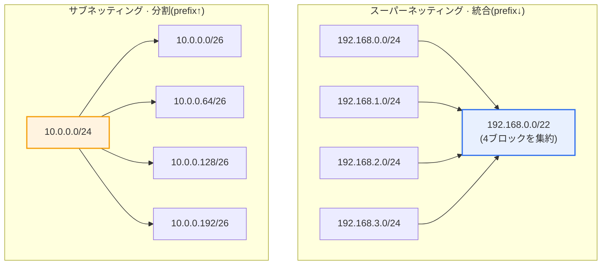
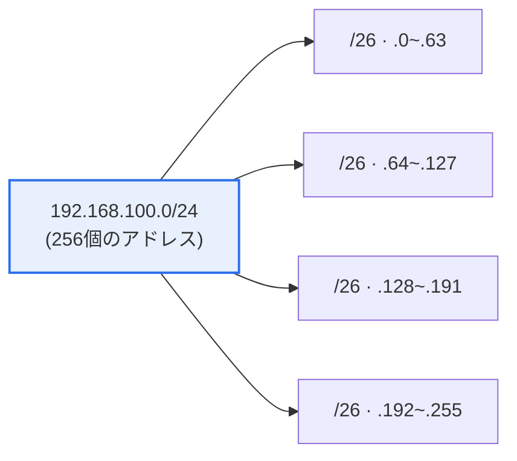

# ネットワークのサブネッティングとスーパーネッティング

## 1. 概要

### A. 定義
> **サブネッティング（Subnetting）**は一つの大きなネットワークを**複数の小さなサブネットに分割**する手法であり、**スーパーネッティング（Supernetting）**は複数の小さなネットワークを**一つの大きなネットワークに統合（経路集約）**する手法である。いずれも有限なIPv4アドレス資源を効率的に配分・管理し、ルーティングの負担を軽減するための相補的な技術である。

IPアドレスは本来、クラス（A/B/C）単位でのみ配分されていた。クラスベースの割当ではアドレス境界が8ビット単位に固定されているため、実際に必要な規模と配分単位との間のギャップが非常に大きかった。例えば、300台のホストが必要な組織は、254個しか収容できないCクラス（/24）一つでは足りず、6万5千個余りを収容できるBクラス（/16）を丸ごと受け取らなければならず、その結果6万個を超えるアドレスが死蔵された。逆に10台規模の小規模ネットワークにCクラスを与えると244個が無駄になる。1990年代初頭にこうした浪費が蓄積するにつれ、IPv4アドレスの枯渇が現実的な脅威となり、同時にインターネットのバックボーンルータの経路表が爆発的に増加（routing table explosion）して、ルータのメモリと経路計算の負担が限界に達した。

サブネッティングが必要な根本的理由は、このように「**IPアドレスの浪費を防ぎ、ブロードキャストドメインを適正な大きさに保つ**」ことにある。一つの大きなフラット（flat）ネットワークに数百〜数千台のホストをそのまま置くと、ARP・DHCP・ルーティング広告のようなブロードキャストトラフィックがすべてのノードに伝播して帯域とCPUを蝕み、一つの障害・セキュリティインシデントが全体に広がる構造になる。サブネッティングは、ホストに使われていたビットの一部をネットワークビットとして借用（borrow）し、帯域を必要な大きさに切り分けて、ブロードキャストドメインを隔離し、部門・用途・セキュリティレベルごとにネットワークを区画する。これは性能・セキュリティ・管理の利便性を同時に改善する設計行為である。

逆にスーパーネッティングは、隣接する複数のネットワークブロックを一つの短いプレフィックスにまとめてルーティングテーブルのエントリを減らす（経路集約、route aggregation）手法であり、これを一般化したものが**CIDR（Classless Inter-Domain Routing, RFC 1518/1519、現行RFC 4632）**である。CIDRはクラス境界を廃止してプレフィックス長を任意に指定できるようにし、アドレスを必要な分だけ配分し、上位事業者が下位顧客の経路を一つに集約して広告できるようにした。サブネッティングとスーパーネッティングは結局、「可変長プレフィックス」という一つの原理をそれぞれ分割と統合の方向に適用したものであり、IPv4の寿命を20年以上延ばした中核技術である。

### B. 特徴
サブネッティング・スーパーネッティングの共通の特徴は、第一に**ビット単位の柔軟性**である。クラス境界（8ビット）を離れて1ビット単位でネットワーク・ホストの境界を定められるため、必要な規模に精密に合わせることができる。第二に**階層性**である。上位ブロックを下位に分け、さらにその下位を分けるという再帰的な分割が可能であり、組織構造や地理的な階層をアドレス体系にそのまま反映できる。第三に**双方向性**である。同じ原理を分割（サブネッティング）と統合（スーパーネッティング）の双方向に適用するため、組織内部では細かく分け、バックボーンでは大きくまとめる階層的なアドレス設計が自然に実現される。

### C. 必要性
まとめると、サブネッティング・スーパーネッティングは、(1) **アドレス効率**（必要な規模に合わせた配分による浪費の最小化）、(2) **性能・セキュリティ**（ブロードキャストドメインの縮小とネットワークの隔離）、(3) **ルーティングのスケーラビリティ**（経路集約によるバックボーンテーブルの抑制）という三つの要求を同時に満たす。これら三つの要求は、組織内部（サブネッティング）とインターネットバックボーン（スーパーネッティング）という異なる階層で発生するが、いずれも「ビット単位でプレフィックスを調整する」という同一のメカニズムで解決される。

## 2. サブネッティングとスーパーネッティングの原理比較

サブネッティングの本質は**ネットワーク部を増やすこと**である。ホストビットのいくつかをネットワーク側へ移すとプレフィックスが長くなり（マスクが長くなり）、その分表現可能なサブネット数は増えるが、サブネットあたりのホスト数は減る。逆にスーパーネッティングは**ネットワーク部を減らすこと**であり、複数の連続ブロックの共通の上位ビットだけを残してプレフィックスを短くし、一つの経路として表現する。両手法はプレフィックスを伸ばすか縮めるかが異なるだけで、いずれも「境界を8ビットのクラスから任意のビットへと解放した」というCIDRの思想の上に立っている。

| 区分 | サブネッティング | スーパーネッティング |
|---|---|---|
| **方向** | 大きなネットワーク → 小さなネットワーク（分割） | 小さなネットワーク → 大きなネットワーク（統合） |
| **ビット操作** | ホストビットをネットワーク側へ借用 | ネットワークビットをホスト側へ返還 |
| **マスク（プレフィックス）** | 長くなる（prefix↑） | 短くなる（prefix↓） |
| **主な目的** | アドレス効率・ブロードキャストドメイン縮小・ネットワーク隔離 | ルーティングテーブルの集約（CIDR）・経路広告の削減 |
| **適用箇所** | 組織内部のネットワーク設計 | 事業者・バックボーンのルーティング |
| **代表例** | VLSMによる部門分割 | ISPによる顧客帯域の集約（aggregation） |

サブネッティングとスーパーネッティングが正反対の方向である理由は、プレフィックス境界の移動方向が逆だからである。サブネッティングではマスクの1ビットが右へ拡張（ホスト部を侵食）し、スーパーネッティングでは左へ後退（ネットワーク部を返還）する。実務では、組織が上位事業者からCIDRブロック（例: /20）を受け取り、それを内部でサブネッティング（/24、/26など）により細かく分け、事業者は再び複数の顧客ブロックをスーパーネッティングしてバックボーンに広告するという形で、両手法が階層的にかみ合う。

## 3. サブネッティング演習: 192.168.100.0/24 → 4つに均等分割

サブネッティングの計算は、「いくつに分けるか」と「各断片に何台必要か」のいずれかを出発点とする。ここでは4つへの均等分割を例に取る。中核となる原理は、**必要なサブネット数を2のべき乗に切り上げ、その指数分だけホストビットを借用**することである。4つ必要であれば4 = 2²なので2ビットを借用し、5〜8個必要であれば2³ = 8なので3ビットを借用する。ビットを借用するほどプレフィックスが長くなり、サブネットの大きさは半分ずつ小さくなる。

**分割手順**を段階的に見ると次のとおりである。
1. 4つのサブネットが必要である。4 = 2²なので、**ホストビットから2ビットを借用**してネットワークビットとして使う。
2. プレフィックスは/24 + 2 = **/26**となる。
3. サブネットマスクは/26、すなわち先頭26ビットが1である。最後のオクテットが`11000000` = **192**なので、マスクは**255.255.255.192**。
4. 各サブネットの大きさ（ブロック）は2^(32−26) = **64個のアドレス**ずつである。このとき64を「ブロックサイズ（block size）」と呼び、サブネット境界は0、64、128、192のようにブロックサイズの倍数に位置する。

| サブネット | ネットワークアドレス | 使用可能範囲 | ブロードキャスト |
|---|---|---|---|
| 1 | 192.168.100.0/26 | .1 ~ .62 | .63 |
| 2 | 192.168.100.64/26 | .65 ~ .126 | .127 |
| 3 | 192.168.100.128/26 | .129 ~ .190 | .191 |
| 4 | 192.168.100.192/26 | .193 ~ .254 | .255 |

各サブネットの64個のアドレスのうち、最初のアドレス（ネットワークアドレス）と最後のアドレス（ブロードキャストアドレス）はホストに使えないため、**割当可能なIPは64 − 2 = 62個**である。ネットワークアドレスは「このサブネット自体」を指す識別子であり、ブロードキャストアドレスはサブネット内の全体送信用であるため個々のホストに割り当てられないという点が、サブネットごとに2個ずつアドレスが「税金」のように差し引かれる理由である。サブネットを細かく分割するほど、この2個のオーバーヘッドが繰り返し発生するため、過度に細分化するとかえってアドレス効率が下がるというトレードオフが生じる。

> **結果**: サブネットマスク = **255.255.255.192（/26）**、サブネットあたりの**割当可能IP = 62個**

### A. 逆方向の計算: 必要ホスト数を基準とする場合
実務では「いくつに分けるか」よりも「一つのサブネットに何台必要か」から出発する場合のほうが多い。このときは**必要なホストビット**を先に求める。原理は、「2^(ホストビット) − 2 ≥ 必要ホスト数」を満たす最小のホストビットhを求めることである。例えば一つのサブネットに100台必要であれば、2^6 − 2 = 62では足りず、2^7 − 2 = 126でようやく収まるのでh = 7、プレフィックスは32 − 7 = **/25**となる。逆に30台必要であれば、2^5 − 2 = 30がちょうど合うのでh = 5、/27である。

このように、サブネット数基準（ネットワークビットの借用）とホスト数基準（ホストビットの確保）は表裏一体である。32ビットをネットワーク部とホスト部が分け合う構造であるため、一方を決めればもう一方が自動的に決まる。試験や設計でどちらの基準で問われても、「2のべき乗とプレフィックス長」という一つの関係式に還元して計算すれば、ミスを減らせる。ブロックサイズ（2^h）を把握すれば、ネットワーク境界・ブロードキャスト・使用範囲が一気に導出される。

## 4. VLSMによる浪費の最小化（事例）

均等分割は計算が容易だが、実際の組織の部門規模はまちまちであるため、均等に切るとかえって浪費が生じる。これを解決するのが**VLSM（Variable Length Subnet Mask、可変長サブネットマスク）**である。VLSMは一つのブロックを異なるプレフィックスで切り分け、大きな部門には大きな断片を、小さな部門には小さな断片を割り当てる。ルールは「**ホスト需要の大きいものから配置**」することであり、大きな断片を先に切り出さないとアドレス境界がずれてしまう。

例えば、192.168.100.0/24一つで、(A) 60台、(B) 28台、(C) 12台、(D) ルータ間接続（2台）のネットワークを作るとする。60台には62個を収容できる**/26（64個）**、28台には30個を収容できる**/27（32個）**、12台には14個を収容できる**/28（16個）**、ポイントツーポイントリンクには2個を収容できる**/30（4個）**を割り当てる。各要求に対して「2のべき乗 − 2 ≥ 必要ホスト数」を満たす最小ブロックを選び、A=.0/26（.0~.63）、B=.64/27（.64~.95）、C=.96/28（.96~.111）、D=.112/30（.112~.115）の順に連続配置すれば、/24一つの中で互いに重複せず、残りの帯域（.116~.255）まで将来の拡張用として保全できる。均等分割であれば各部門に同じく62個を与え、小規模ネットワークで数十個ずつ無駄になっていたであろう。このようにVLSMは「必要な分だけ」配分してアドレス効率を最大化するものであり、今日の企業ネットワーク設計の基本原則である。

VLSMが成立するためには、ルーティングプロトコルがサブネットマスク情報も併せて伝達しなければならない。初期のRIPv1のようなクラスフル（classful）プロトコルはマスクを広告しないため異なるプレフィックスを区別できず、そのためVLSM・CIDRをサポートするには、RIPv2・OSPF・EIGRP・BGPのようにプレフィックス長を併せて広告するクラスレス（classless）プロトコルが必要である。今日では事実上すべての現代的なルーティングプロトコルがクラスレスであるため、VLSMは標準的な設計慣行として定着している。

ポイントツーポイントリンクに/30（ホスト2個）を使うのも代表的な実務慣行である。ルータとルータをつなぐWANリンクは両端の2個のアドレスだけが必要なので/30がちょうど合い、IPv6や最新の設計では、まったく無駄のない**/31（RFC 3021、ブロードキャストなしで2個のアドレスをすべてホストとして使用）**をポイントツーポイントに使うこともある。こうした細かな調整が積み重なり、大規模な事業者ネットワークでは数千本のリンク分のアドレス節約につながる。

## 5. 深掘り: CIDR・経路集約とIPv6への継承

スーパーネッティングの実務上の真髄は**経路集約（route summarization）**である。ISPが203.0.0.0/24から203.0.3.0/24までの4つの連続ブロックを顧客に配分した場合、バックボーンにはこれを4つとして広告せず、共通の上位22ビットだけを残した**203.0.0.0/22**一つに集約して広告する。こうすれば世界中のルータが保持すべき経路エントリが4分の1に減り、下位ブロックに障害が生じても集約経路は揺らがないため、ルーティングの安定性（経路フラッピングの抑制）が高まる。CIDR導入後もBGPのグローバルルーティングテーブルは増え続け、2020年代には90万経路を超えたが、もしクラスベースのままであったなら、とうの昔にルータのハードウェアが耐えられなくなっていたであろう。すなわち、CIDR・スーパーネッティングは「インターネットが現在の規模まで成長することを可能にした」基盤技術と評価される。

経路集約が可能であるためには、下位ブロックが**連続かつ整列（aligned）**していなければならないという点が実務上の中核的な制約である。例えば203.0.0.0/24と203.0.3.0/24だけがあり、間の.1、.2が別の組織に配分されている場合、これらを一つの/22に集約すると他者の帯域まで抱え込むことになり、集約は成立しない。そのため、アドレスを最初に配分する時点から「後で集約されること」を念頭に置き、2のべき乗の境界に合わせて連続的に配分するポリシー（アドレス計画、addressing plan）がルーティング効率を左右する。これが、IPアドレス管理（IPAM）が単なる記録ではなく設計活動である理由である。

アドレス枯渇そのものは**IPv6（128ビットのアドレス空間）**によって根本的に解決されるが、サブネッティング・プレフィックスの概念はIPv6でもそのまま継承・強化されている。IPv6では一般にインタフェースIDに64ビットを固定で割り当て、サイトには/48を、個々のサブネットには/64を割り当てるという形でプレフィックス階層が標準化された。クラスは消えたが、「プレフィックス長でネットワークを区画する」という思想はむしろより深く根付いたのである。最近ではクラウド環境でVPC（Virtual Private Cloud）を設計する際にCIDRブロックを指定し、それをサブネットに分ける作業がネットワークエンジニアの日常業務となっており、オンプレミスとクラウドをつなぐハイブリッドネットワークでは、アドレス帯域が重複しないようにするIPアドレス計画（IPAM, IP Address Management）が必須の能力として浮上している。

## 6. 考慮事項および示唆点

1. **VLSMで浪費を最小化しつつ、過分割を警戒する。** 部門ごとの需要に合わせて差を付けて配分すればアドレス効率は最大化されるが、細かく分けすぎるとサブネットごとにネットワーク・ブロードキャストアドレスの2個が繰り返し消費され、ルーティング・管理の複雑さが増す。将来の拡張余地（成長率）も併せて考慮した適正な分割が鍵である。
2. **CIDR・経路集約でルーティングのスケーラビリティを確保する。** アドレス配分を地理的・組織的に連続するよう設計してはじめて集約が可能となるため、初期のIPアドレス計画の段階で「集約しやすい」配分ポリシーを立てることが、バックボーンのルーティング負担を左右する。不連続な配分は集約を不可能にし、経路の爆発的増加を招く。
3. **IPv6移行ロードマップと連携する。** サブネッティングの知識はIPv4に限定されず、IPv6のプレフィックス設計へとつながる。デュアルスタック・移行技術を併用する過渡期には、IPv4のサブネッティングとIPv6のプレフィックス計画を統合的に管理するIPAMツール・ガバナンスが求められる。
4. **セキュリティ・セグメンテーションの観点からの設計が重要である。** サブネッティングは単なるアドレス節約を超え、ブロードキャストドメインの隔離とファイアウォール・ACLの境界設定の基盤である。ゼロトラスト・マイクロセグメンテーションの流れの中で、サブネットはセキュリティポリシー適用の最小単位として活用されるため、用途・信頼レベルごとのネットワーク分離を念頭に置いた設計が必要である。
5. **自動化・IaCとの結合を目指す。** クラウド・大規模データセンターでは、サブネット・CIDRの配分を手作業ではなく、Terraformなどのコードとしてのインフラ（IaC）とIPAMで自動管理し、帯域の衝突と浪費を事前に防ぎ、変更履歴を追跡することが現代的な運用標準である。

## 参考資料
- RFC 4632, Classless Inter-domain Routing (CIDR): The Internet Address Assignment and Aggregation Plan — https://datatracker.ietf.org/doc/html/rfc4632
- RFC 1878, Variable Length Subnet Table For IPv4 — https://datatracker.ietf.org/doc/html/rfc1878
- RFC 3021, Using 31-Bit Prefixes on IPv4 Point-to-Point Links — https://datatracker.ietf.org/doc/html/rfc3021

---

> **一言まとめ**: サブネッティングはホストビットを借用して（prefix↑）ネットワークを分割し、スーパーネッティング（CIDR）は逆にネットワークビットを減らして（prefix↓）統合・集約する。192.168.100.0/24を4つに均等分割すると2ビットを借りて*マスク255.255.255.192（/26）、サブネットあたりの割当可能IP 62個*となり、VLSM・CIDR・IPv6プレフィックスによってアドレス効率とルーティングのスケーラビリティを同時に達成する。
