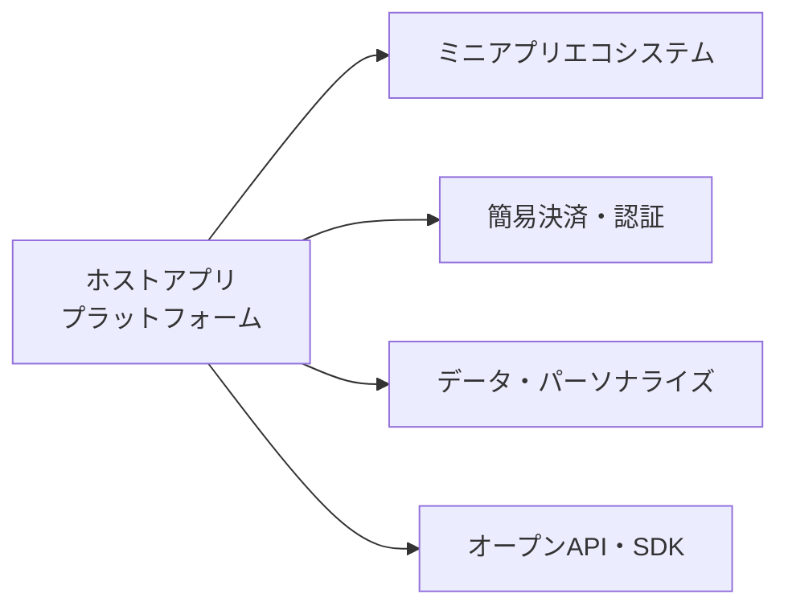

# スーパーアプリ（Super App）

## 1. 概要

### A. 定義
> 一つのアプリの中で**メッセージング・決済・金融・ショッピング・移動・予約など多様なサービスを統合**して提供し、外部サービスが**ミニアプリ（Mini App）**の形で出店して一つのエコシステムを形成する**プラットフォーム型アプリケーション**。

スーパーアプリの核心は、個々の機能の総和ではなく、**決済・認証・データという共通インフラを複数のサービスが共有**する構造にある。ユーザは一度ログインし、一度決済手段を登録すれば、アプリを離れることなく日常の大部分を処理でき、出店サービスはすでに確保されたトラフィックと決済・認証インフラを再利用する。すなわちスーパーアプリは、自らすべてのサービスを作るのではなく、**プラットフォーム（オペレーティングシステム）のように機能**し、その上にサードパーティのエコシステムを載せる。

### B. 登場背景および必要性
スマートフォンの初期にはサービスごとにアプリを個別にインストールしていたが、アプリが乱立するにつれて、インストール・ログイン・決済を繰り返す**アプリ疲れ**が大きくなった。事業者の立場からは、新規アプリのユーザ獲得コストが高騰することが問題であった。スーパーアプリは、すでに数億人が毎日使うアプリの中にサービスを出店させることで**獲得コストを下げ**、ユーザをエコシステムに囲い込む**ロックイン（Lock-in）**を実現する。中国のようにクレジットカード・Webインフラを飛び越えてモバイルへ直行した市場で、WeChat・Alipayが爆発的に成長したことが代表的な背景である。

## 2. スーパーアプリの主要構成要素

スーパーアプリを支える要素は互いにかみ合い、一つのプラットフォームを形成する。中心には、ミニアプリを実行するランタイムと共通UIを提供する**ホストアプリ**があり、これが事実上アプリ上のオペレーティングシステムの役割を果たす。その上で**簡易決済・統合認証（SSO）**があらゆるサービスの摩擦を取り除く接着剤の役割を果たし、どのミニアプリを使っても再ログイン・再決済なしにスムーズにつながる。複数のサービスから集まったデータは**統合プロファイル**として結合され、パーソナライズされた推薦・マーケティングの源泉となり、**オープンAPI/SDK**は外部サービスが容易に出店できるよう参入障壁を下げてエコシステムを成長させる。これら四つの要素の中でも決済・認証インフラが特に重要であり、これが堅固であってはじめてサードパーティが安心して出店するからである。

| 要素 | 説明 | 役割 |
|---|---|---|
| **ホスト（プラットフォーム）アプリ** | ミニアプリ実行ランタイム・共通UIの提供 | アプリ上のオペレーティングシステム |
| **ミニアプリ** | インストール不要で動作する出店サービス | エコシステムのコンテンツ |
| **簡易決済・認証** | 統合ウォレット・SSOによる本人確認 | 摩擦の除去（接着剤） |
| **データ・パーソナライズ** | 統合プロファイルに基づく推薦・マーケティング | エンゲージメント誘導・収益化 |
| **オープンAPI/SDK** | サードパーティの出店・連携支援 | エコシステムの拡張 |

## 3. スーパーアプリ vs マルチアプリ（比較）

スーパーアプリとマルチアプリの違いは単なるアプリの数ではなく、**統合か専門化か**という戦略の違いに由来する。マルチアプリ戦略はサービスごとにアプリを分離し、各アプリが自らの領域に集中（専門化）して独立的に発展するようにするが、ユーザはアプリを行き来するたびにログイン・決済を繰り返さねばならず、データも分散する。一方スーパーアプリは、一つのアカウント・ウォレット・プロファイルに統合して**途切れのない体験**と強力なロックインを生み出すが、その代償としてアーキテクチャが複雑になり、一つのアプリにサービスが集中して**単一障害点（SPOF）**と規制リスクが大きくなる。すなわち、統合がもたらす利便性・データのシナジーと、分散がもたらす独立性・回復力とがトレードオフの関係にある。

| 区分 | スーパーアプリ | マルチアプリ | 違いの理由 |
|---|---|---|---|
| **構造** | 単一アプリ + ミニアプリ | 機能別の個別アプリ多数 | 統合 vs 専門化の戦略 |
| **ユーザ体験** | 途切れのない統合UX | アプリ切替・再ログイン | 共通の認証・決済を共有するか否か |
| **アカウント・決済** | 統合（SSO・統合ウォレット） | サービスごとに分散 | インフラ共有の構造 |
| **データ** | 統合プロファイル | 分散 | パーソナライズ・収益化の源泉 |
| **リスク** | ロックインは強いがSPOF・規制が集中 | 回復力↑、シナジー↓ | 集中 vs 分散のトレードオフ |
| **例** | WeChat、Grab、Toss、Kakao | サービスごとの個別アプリ | |

## 4. ミニアプリ（Mini App）

ミニアプリは、スーパーアプリ上で**インストールなしに即座に実行される軽量サービス**であり、スーパーアプリのエコシステムの実際のコンテンツを満たす。ユーザはアプリストアからダウンロードしてログインする手順なしに、必要なときにすぐ使え、ストレージ容量もほとんど占有しない。出店事業者の立場からは、スーパーアプリのトラフィック・決済・認証をそのまま再利用できるため、初期の参入コストが大幅に減る。実装には標準Web（HTML/JS）を使うか、WeChatミニプログラムのようなプラットフォーム専用フレームワークを使うが、専用フレームワークは性能・セキュリティの統制には有利である反面、その分当該プラットフォームに依存するというトレードオフがある。

## 5. 事例・展望・課題

| 区分 | 内容 |
|---|---|
| **事例** | WeChat（中国の国民的アプリ）、Grab・Gojek（東南アジアのモビリティ+金融）、Toss・Kakao・NAVER（韓国国内） |
| **展望** | コマース・フィンテック・モビリティの融合、AIエージェントとの結合による対話型パーソナライズの深化 |
| **課題** | **独占・寡占とプラットフォーム規制**、個人情報の集中・プライバシー、ミニアプリの**セキュリティ審査・品質**、単一障害点（SPOF） |

事例を見ると、スーパーアプリは各市場で満たされていなかったインフラに入り込んで成長してきた。WeChatはクレジットカードが弱かった中国で決済を、Grab・Gojekは公共交通が不足していた東南アジアでモビリティを足掛かりとして、金融・コマースへと拡張した。韓国国内では、Tossが送金、Kakaoがメッセンジャーを基盤に、それぞれ金融・生活サービスを付加してきた。展望としては、AIエージェントがスーパーアプリの統合データ・ミニアプリをツールとして用い、ユーザに代わってタスクを実行する方向へ進化すると見られる。ただし、サービス・データが一か所に集中するほど独占規制と個人情報リスクが大きくなるため、その管理が成否を分ける。

## 6. 考慮事項および示唆点（技術士の観点）
- **データ・決済統合の両面性**: 統合は強力なエコシステムとパーソナライズを生むが、同時に個人情報の集中と独占という規制の標的を生む。データの最小収集・目的制限でバランスを取らなければならない。
- **ミニアプリのガバナンス**: サードパーティのミニアプリが増えるほど悪質・低品質なサービスが混入するリスクが大きくなるため、審査・サンドボックス隔離・権限統制といったプラットフォームレベルのセキュリティガバナンスが不可欠である。
- **回復力の設計**: サービスの集中はSPOFを生むため、冗長化・障害隔離によって一つのミニアプリの障害が全体に波及しないよう設計しなければならない。
- **規制対応こそが競争力**: プラットフォームの独占・自社優遇に対する規制が強化される流れの中で、開放性と公正性を先制的に確保することが持続可能性の鍵である。

---

> **一言まとめ**: スーパーアプリは*ホストアプリ + ミニアプリエコシステム + 統合された決済・認証・データ*によって複数のサービスを一つのプラットフォームに収め、途切れのない体験とロックインを生み出すが、その統合の代償として**独占・個人情報の集中・ミニアプリのセキュリティ・SPOF**の管理が成否を分ける。
