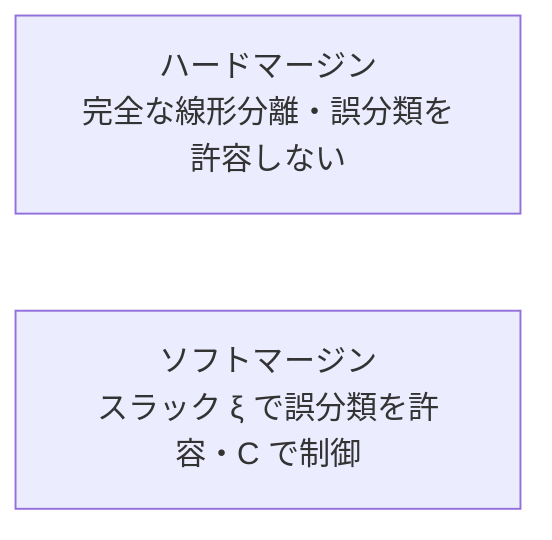

# 線形SVMのマージン分類方法（ハード/ソフトマージン）

## 1. 概要

### A. 定義
> **サポートベクターマシン（SVM）**は、二つのクラスを分ける無数の決定境界（超平面）の中から、**境界に最も近いデータ（サポートベクター）との間隔であるマージン（Margin）を最大化**する超平面を選択する教師あり学習の分類モデルである。

パーセプトロンのように「とりあえず分けるだけ」の境界は無数に存在するが、その中のどれが新しいデータに対して最もよく汎化するかが問題である。SVMの洞察は、「**境界が両側のクラスからできるだけ離れているほど（=マージンが広いほど）、わずかなデータの変動でも誤分類せず安定である**」というものである。すなわちマージン最大化は、汎化誤差の上限を小さくしようとする原理的根拠（構造的リスク最小化、SRM）を持つ。

### B. 登場背景および必要性
現実のデータには測定ノイズやクラス間の重なりがよく見られ、特に特徴量の数がサンプル数より多い**高次元・小標本**の状況（遺伝子・テキスト分類など）では、過学習のリスクが大きい。マージンを明示的な目的関数とするSVMは、決定境界をサポートベクターという少数の境界データだけで決定するため、こうした環境で頑健な分類性能を発揮する。ただし、完全に分離される理想的な状況と、ノイズの混じった現実の状況を同じ方法で扱うことはできないため、マージン分類は**ハードマージン**と**ソフトマージン**の二系統に分かれる。

### C. 中核概念
| 概念 | 説明 | なぜ重要か |
|---|---|---|
| **超平面（Hyperplane）** | $w^\top x + b = 0$ で定義される決定境界 | 分類の基準面 |
| **マージン（Margin）** | 超平面と最も近いデータとの距離（$2/\lVert w\rVert$） | 広いほど汎化↑ |
| **サポートベクター** | マージン境界上にあり超平面を決定する少数のデータ | これらの点のみが解に影響 |

マージン幅は$2/\lVert w\rVert$であるため、マージンを最大化することは、すなわち$\lVert w\rVert$（または$\tfrac12\lVert w\rVert^2$）を**最小化**する凸二次計画（QP）問題となる。サポートベクターでないデータは、いくら多くても解を変えない。これが、SVMがいくつかの外れ値には鈍感でありながら、境界付近のデータには敏感である理由である。

## 2. マージン分類の2種類

二つの方式の違いは、「**制約をどれだけ厳格に守るか**」から生じる。ハードマージンはすべての点がマージンの外側になければならないという制約を決して破らず、ソフトマージンはこの制約を破ることを許容する代わりに対価（ペナルティ）を課す。

### A. ハードマージン（Hard Margin）
> ただ一つの誤分類もマージン侵犯もなく、**すべてのデータを完全に線形分離**する最大マージン超平面。

ハードマージンは、すべての点$i$について$y_i(w^\top x_i + b) \ge 1$という強い制約の下で$\tfrac12\lVert w\rVert^2$を最小化する。問題は、この制約が**データが実際に線形分離可能な場合にのみ**満たされ、ノイズや外れ値が一つでも反対側に紛れ込むと**解がまったく存在しない**という点である。仮に分離できたとしても、境界に接した外れ値一つがマージン全体を大きく歪めうるため、実際のデータにはほとんど使われない。

| 項目 | 内容 |
|---|---|
| **条件** | 線形分離可能（ノイズ・重なりなし） |
| **目標** | $\min \tfrac12\lVert w\rVert^2$ s.t. すべての点がマージンの外側 |
| **限界** | 外れ値・ノイズに非常に敏感、分離不可能な場合は解なし |

### B. ソフトマージン（Soft Margin）
> **スラック変数$\xi_i \ge 0$**によって各データがマージンを侵犯・誤分類する程度を許容し、その総和に**ペナルティ$C$**を課して制御しながらマージンを最大化する。

ソフトマージンは目的関数を$\min \tfrac12\lVert w\rVert^2 + C\sum_i \xi_i$に変え、制約を$y_i(w^\top x_i+b) \ge 1-\xi_i$に緩和する。すなわち、「**広いマージン**」と「**少ない誤分類**」という相反する二つの目標を$C$で天秤にかける。これにより、ノイズが混じっていたり完全に分離できなかったりするデータにも常に解が存在し、外れ値に対する頑健性が得られる。

| 項目 | 内容 |
|---|---|
| **条件** | ノイズ・重なりのあるデータにも適用（現実のデータ） |
| **目標** | マージン最大化 + 誤分類ペナルティ（$C\sum\xi_i$）の最小化 |
| **パラメータ $C$** | 大きい → 誤分類を強く抑制（マージン↓・過学習↑）、小さい → マージン↑・汎化↑（過少適合のリスク） |

$C$はバイアス-バリアンスの天秤のハンドルである。$C$が非常に大きいとハードマージンに近づき、外れ値まで合わせようとしてバリアンスが大きくなり、$C$が小さいと一部の誤分類を見逃してマージンが広がり、バイアスが大きくなる。例えば、二つのクラスがわずかに重なるデータで$C$を100のように大きく設定すると、重なった数個の点を無理に分離しようとして境界が曲がりくねり、$C=1$程度であればそれらの点をスラックで吸収して滑らかな境界が得られる。

## 3. 比較

| 区分 | ハードマージン | ソフトマージン |
|---|---|---|
| **誤分類** | 許容しない（$\xi=0$） | 許容（$\xi \ge 0$） |
| **ノイズ耐性** | 弱い（外れ値で解が崩壊） | 強い（スラックで吸収） |
| **解の存在性** | 線形分離可能な場合のみ | 常に存在 |
| **適用** | 理論的・完全分離可能なデータ | 実データ（一般的） |

違いが生じる根本的な理由は、制約違反を許容するか否かである。ハードマージンは制約を決して破れないため、データの一点の位置に解全体が左右されるが、ソフトマージンは違反をコストに換算して吸収するため、少数の外れ値の影響を$C$で抑え込むことができる。

## 4. 考慮事項および示唆点
- **実務の基本はソフトマージン**: ノイズのないデータはほとんど存在しないため、ソフトマージンを使い、$C$を交差検証でチューニングしてバイアス-バリアンスを調整する。
- **非線形問題にはカーネルトリック**: 線形分離が不可能な場合、RBF・多項式カーネルでデータを高次元に写像すれば、元の空間で非線形な境界を高次元での線形超平面として扱える。このときもマージンの概念はそのまま維持される。
- **強みと限界のトレードオフ**: 高次元・小標本で頑健であり解が一意（凸最適化）であるが、サンプル数が数十万を超えるとQP学習コスト（$O(n^2)\sim O(n^3)$）が大きくなり、SGD・ツリーベースのモデルのほうが実用的な場合がある。
- **連携**: 確率出力が必要であればPlatt scaling、多クラス分類はOne-vs-Rest/One-vs-Oneで拡張する。

---

> **一言まとめ**: 線形SVMはサポートベクターまでの*マージン（$2/\lVert w\rVert$）を最大化*し、*ハードマージン（誤分類を許容しない・外れ値で解が崩壊）*と*ソフトマージン（スラック$\xi$で誤分類を許容、$C$でバイアス-バリアンスを制御）*に分かれ、ノイズが一般的な実務ではソフトマージンを基本としてカーネルトリックとともに用いる。
