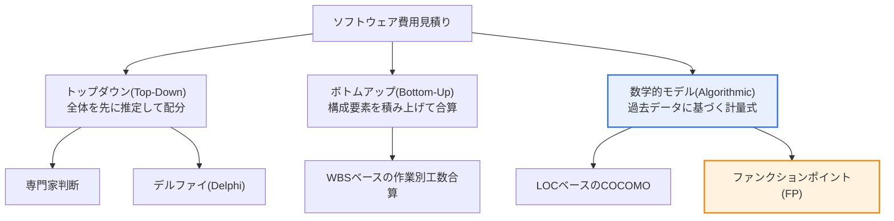

# ソフトウェア費用見積り方法

## 1. 概要

### A. 定義
> **ソフトウェア費用見積り（Software Cost Estimation）**は、開発に必要な**工数（Man-Month）・期間・費用を開発着手前に予測**する活動であり、プロジェクトの計画・予算・スケジュールの策定と、発注・契約の定量的な根拠となる。

費用見積りが難しく、かつ重要である理由は、「**目に見えないものの値を前もって当てなければならない**」という本質的な矛盾にある。ソフトウェアには物理的な実体がなく、完成する前に規模・複雑度を正確に知ることは難しい。ところが予算とスケジュールは着手前に確定しなければならず、一度決まった予算はプロジェクトの全期間を縛る。見積りが楽観的すぎれば予算・納期を超過してプロジェクトが危機に陥り、残業・品質低下・紛争につながり、保守的すぎれば受注競争で負ける。このジレンマのため、見積りは単なる計算ではなく、**不確実性の中でリスクを管理する意思決定行為**として理解しなければならない。

こうした困難を緩和するため、さまざまな見積り方法が発展してきた。大きく分けて、人の経験と直感に依存する**トップダウン（Top-Down）** — 専門家判断・デルファイ法、構成要素を細かく分けて積み上げる**ボトムアップ（Bottom-Up）** — WBSベースの合算、そして過去のプロジェクトデータから作った回帰式・係数を用いる**数学的モデル（Algorithmic）** — LOCベースのCOCOMOと機能ベースのファンクションポイント（FP）がある。三方式はそれぞれ**正確性・客観性・見積り可能な時点**において異なるトレードオフを持つ。トップダウンは着手のごく初期でも迅速に答えを出せるが主観的であり、ボトムアップは精密だが設計がある程度確定している必要があり漏れのリスクがあり、モデルベースは定量的・検証可能だが入力値（LOC・機能規模）の予測精度に結果が左右される。どの方法も完璧ではないため、**複数の方法を併用して交差検証（triangulation）**し、その偏差をリスクのシグナルとして解釈するのが賢明である。

### B. 登場背景と必要性
1960〜70年代に大型ソフトウェアプロジェクトが相次いで予算・納期を超過し、「ソフトウェア危機（software crisis）」が台頭すると、どんぶり勘定の見積りに代わる**客観的・再現可能な見積り手法**の必要性が高まった。不正確な見積りは予算超過・納期遅延・品質低下・利害関係者間の紛争の根本原因であり、特に公共の情報化事業では、予算の適正性と発注の透明性が監査・監理の中核的な論点となる。その結果、韓国ではファンクションポイントベースの標準的な対価算定体系が、国際的にはCOCOMO・ファンクションポイント（IFPUG/ISO）などの計量モデルが定着した。

### C. 良い見積りが備えるべき性質
良い費用見積りは、第一に**客観性**（誰が行っても類似した結果）、第二に**追跡性**（見積りの根拠・前提を文書化）、第三に**適時性**（必要な意思決定の時点で答えを提供）、第四に**段階的な精緻化**（段階が進むにつれて誤差を狭めていく「不確実性のコーン（cone of uncertainty）」の反映）を備えていなければならない。着手初期に±100%に達する不確実性が設計・実装の進行とともに狭まることを前提に、見積りは一度きりではなく**反復的に再見積り**されなければならない。

## 2. 費用見積り方法の分類 — 全体構造

費用見積り手法は、情報の方向と根拠によってトップダウン・ボトムアップ・数学的モデルに分かれ、実務ではこれらを相互補完的に組み合わせる。

**トップダウン**は、プロジェクト全体の規模を経験的に先に推定し、その後下位の作業に配分する方式である。着手のごく初期、要求事項が曖昧なときでも迅速に概算見積りを出せるため、事業の妥当性検討や提案段階で有用である。しかし個人の経験に左右されるため偏りが大きく、詳細作業の漏れを捉えられないという限界がある。この偏りを減らすため、複数の専門家の匿名意見を複数ラウンドにわたって収斂させる**デルファイ法**が用いられる。

**ボトムアップ**は逆に、作業分解構成（WBS）でプロジェクトを細かく分解した後、各作業の工数を見積もって合算する。詳細な根拠が明確で精度が高いが、設計がある程度確定していなければ適用できず、統合・管理といった「目に見えない」オーバーヘッドを見落としやすい。そのため、ボトムアップの合計に統合・リスク予備費を一定比率上乗せする補正が慣行となっている。

**数学的モデル**は、過去のプロジェクトから導出した回帰式・係数によって規模（LOCまたはFP）を工数・費用に換算する。客観的で根拠を検証できるため大規模・公共事業の標準として定着したが、入力値の予測を誤れば結果全体が狂う「ガベージイン・ガベージアウト」のリスクを抱える。

| 方法 | 原理 | 長所 | 短所 | 適用時点 |
|---|---|---|---|---|
| **専門家判断** | 経験者の直感 | 迅速・簡便・低コスト | 主観的・根拠が脆弱 | ごく初期 |
| **デルファイ** | 多数の専門家の匿名意見を収斂 | 個人の偏りを緩和 | 時間・コストがかかる | 初期 |
| **ボトムアップ（WBS）** | 作業別工数の合算 | 精密・根拠が明確 | 設計確定が必要・漏れのリスク | 設計以降 |
| **LOC/COCOMO** | 予想コード量・コストドライバーで工数を算定 | 定量的・検証済み | LOC予測に依存・言語依存 | 設計段階 |
| **ファンクションポイント（FP）** | ユーザ機能の規模を測定 | 言語非依存・初期に適用可 | 測定の専門性が必要 | 要求事項段階 |

## 3. 主要な計量モデルの詳細 — COCOMO

**COCOMO（Constructive Cost Model）**は、Barry Boehmが1981年に提案した代表的なLOCベースの数学的モデルであり、予想コード規模（KLOC）とプロジェクト特性に基づいて工数を計算する。基本的な着想は「**工数は規模の非線形関数である**」というものであり、規模が大きくなるほどコミュニケーション・統合のコストのために、工数が規模よりも速く（指数が1より大きく）増加するという経験則を数式化している。基本形はおおむね`工数 = a × (KLOC)^b`の形であり、係数a・bはプロジェクトの類型によって異なる。

COCOMOはプロジェクトを、**組織型（Organic）** — 小規模・慣れたドメイン、**半独立型（Semi-detached）** — 中規模・混在した経験、**組込み型（Embedded）** — 大規模・厳しい制約（リアルタイム・ハードウェア結合）の三つのモードに区分する。同じ規模でも組込み型は組織型より指数bが大きく、工数がはるかに多くかかる。これは「規模の不経済（diseconomy of scale）」がプロジェクトの性格によって異なって作用することを反映したものであり、単純な人月の掛け算では捉えられない洞察である。

精密型である**中間（Intermediate）・詳細（Detailed）COCOMO**は、これに製品の信頼性・データベースの規模・チームの能力・開発ツールの成熟度などの**コストドライバー（cost driver）**を掛けて補正する。例えば、要求される信頼性が非常に高い航空・医療ソフトウェアは、検証の負担のために工数の乗数が大きくなる。後継モデルである**COCOMO II（2000）**は、再利用・オブジェクト指向・商用部品（COTS）・スパイラル開発といった現代的な開発方式を反映し、初期のプロトタイプ段階（アプリケーションポイント）から後期段階（FP・LOC）まで、段階ごとに異なる入力を許容する。COCOMOの根本的な限界は、依然として**LOCを着手初期に正確に予測することが難しい**という点、そして言語・開発方式に依存するという点である。

## 4. 韓国の標準 — ファンクションポイント（FP）とSW事業の対価算定

**ファンクションポイント（Function Point, FP）**は、コードではなく**ユーザの視点の機能**で規模を測定する。ユーザに提供される機能を五つの類型 — 外部入力（EI）・外部出力（EO）・外部照会（EQ）・内部論理ファイル（ILF）・外部インタフェースファイル（EIF） — として識別し、各機能の複雑度に応じて重みを付けて合算する。FPの決定的な長所は、**開発言語・技術・プラットフォームに依存しない**ことである。同じ機能をJavaで作ってもPythonで作っても、ユーザに提供される機能の量は同じであるため、LOCベースの方式が抱える言語依存・初期予測の困難という問題を相当程度回避できる。また、要求事項が整理される早い段階から適用できるため、発注・契約の根拠として適している。

このため、韓国の公共情報化事業は**ファンクションポイント方式を標準の対価算定方式として採用**している。韓国ソフトウェア産業協会（KOSA）が毎年改訂・公表する**『SW事業対価算定ガイド』**は、開発費を「**ファンクションポイント × ファンクションポイント当たり単価**」で算定するよう規定している。実際の数値を見ると、FP当たり単価は2020年の553,114ウォンから、**2024年5月の改訂版で9.5%引き上げられた605,784ウォン**に調整されたが、これはコロナ禍以降の物価上昇とSW技術者の人件費上昇を反映した結果である。また2024年改訂版は、AI導入事業のライセンス費用、アルゴリズム調整、データ収集・前処理・学習・検証などを**投入工数方式の専門作業費**として別途算定するよう定め、生成AI時代の新たな事業形態を対価体系に反映し始めた。

こうした標準化が実務にもたらす含意は大きい。発注機関と事業者が同一のルールで規模を測定するため、**予算の客観性と発注の透明性**が確保され、監理・監査の際に対価算定の根拠を検証できる。一方でFP測定には専門人材が必要であり、非機能要求事項（性能・セキュリティ）や技術的難易度を規模に十分に反映しにくいという限界もあるため、投入工数方式と併用する補完が行われている。 [[sw-sizing-methods]] [[sw-operation-cost]]

## 5. 比較と実務適用 — 方法選択の論理

三方式の違いは結局、「**いつ、何を根拠に答えを出せるか**」に由来する。提案・妥当性検討の段階のように情報がほとんどないときは、精密なボトムアップは不可能であるため専門家判断・デルファイで概算見積りを出し、要求事項が整理されればファンクションポイントで規模を確定し、設計が具体化すればWBSベースのボトムアップで精密に検証する。実際の大型プロジェクトでは、この三つを**段階ごとに切り替えながら再見積り**するのが定石である。

具体例として、ある公共機関の次世代システム（仮定）で要求事項段階にFPで3,000FPと見積もられた場合、単価を掛ければ約18億ウォン規模の開発費の初案が出る。その後設計が完了してWBSでボトムアップの再見積りを行った結果が22億ウォンであれば、その4億ウォンの差（約22%）は、要求事項の漏れや非機能要求の過小評価を知らせる**リスクのシグナル**として読むべきである。このように、方法間の偏差そのものがリスク管理の情報となる。もう一つの例として、リアルタイム制御が中核となる組込み型ソフトウェアはCOCOMOの組込み型係数を適用して組織型に比べて大きな工数を認めなければならず、これを無視すると低価格受注の後に赤字プロジェクトとなりやすい。

## 6. 深掘り — アジャイル・AI時代における見積りの進化

伝統的な見積りが「着手前に一度で全体を当てる」予測型であるとすれば、**アジャイル**はこれを根本から覆す。アジャイルでは全体を事前に精密に見積もらず、相対的な大きさを表す**ストーリーポイント（story point）**でバックログを推定し、スプリントごとに実際の処理量である**ベロシティ（velocity）**を測定して、残りのスケジュールを継続的に再予測する。すなわち「一度の大きな予測」を「実測に基づく短い補正の繰り返し」に置き換えるものであり、不確実性の大きいプロジェクトで不確実性のコーンを迅速に狭めるという長所がある。ただし、組織間の比較や固定価格契約には不向きであるため、公共発注のファンクションポイント体系とは相互補完的に用いられる。

最近では**データ・AIベースの見積り**が台頭している。過去に完了したプロジェクトの規模・工数・欠陥データで機械学習の回帰モデルを学習させ、類似プロジェクトの工数を予測したり、要求仕様書を自然言語処理で分析してファンクションポイントの測定を自動化しようとしたりする試みが進んでいる。生成AIを活用した開発生産性の向上（コードの自動生成）は、既存のLOC・工数ベースの見積りの前提そのものを揺るがしており、前述の2024年対価ガイドにおけるAI専門作業費の新設のように、見積り体系も再定義が必要な局面にある。これは類似テーマであるソフトウェア規模見積り（[[sw-sizing-methods]]）・運用段階の対価（[[sw-operation-cost]]）とともに最近の既出問題の定番の題材であるため、答案では「伝統的モデルの限界 → アジャイル・AIによる補完」という流れでつなげて記述するのが有効である。

## 7. 考慮事項および示唆点

1. **複数の方法の併用と交差検証が精度を高める。** 単一の方法は固有の偏り・誤差を持つため、トップダウン・ボトムアップ・モデルベースを併せて適用して結果を突き合わせ、方法間の大きな偏差は無視せず、要求事項の漏れ・リスクの早期シグナルとして解釈しなければならない。見積りに用いた前提・根拠は必ず文書化し、追跡性を確保する。
2. **見積りは一度きりのイベントではなく反復的なプロセスである。** 不確実性のコーンに従い、着手初期の大きな不確実性は段階が進むにつれて狭まるため、マイルストーンごとに再見積りを行い、予備費（contingency）を規模・リスクに比例して確保するリスクベースの管理が必要である。
3. **韓国の公共分野ではファンクションポイントベースが標準であり、制度の変化を追跡しなければならない。** SW事業対価算定ガイドは毎年単価・項目が改訂されるため（例: 2024年のFP単価605,784ウォン、AI専門作業費の新設）、最新のガイドを根拠にしてはじめて、対価の適正性と発注の透明性を守ることができる。
4. **非機能要求・技術的難易度の反映を忘れてはならない。** FP・LOCは機能規模が中心であるため、性能・セキュリティ・可用性などの非機能要求や新技術導入の難易度を十分に盛り込めない。したがって投入工数方式・コストドライバーによる補正で補い、トレードオフを明示的に管理しなければならない。
5. **展望: AIが見積りの対象であり、かつツールとなる。** 生成AIが開発生産性を変えることで既存の規模-工数関係の前提が揺らぐ一方、AIベースの自動見積り・類似事例による推定が精度を引き上げている。技術士の観点からは、伝統的モデルの原理を基盤としつつ、アジャイル・データ・AIへと拡張・連携する進化的な視点が求められる。

## 参考資料
- 韓国ソフトウェア産業協会（KOSA）、「2024 ソフトウェア事業対価算定ガイド」（2024.05.13）: https://www.sw.or.kr
- 「ソフトウェアのファンクションポイント（FP）単価60万5784ウォン、9.5%上方調整」（Byline Network、2024.05）: https://byline.network/2024/05/13-363/
- 「KOSA、SW事業対価算定の改訂版を公表…AI事業の対価体系も反映」（Digital Today）: https://www.digitaltoday.co.kr/news/articleView.html?idxno=517431
- COCOMO（Constructive Cost Model）概要: https://en.wikipedia.org/wiki/COCOMO
- Function point 概要: https://en.wikipedia.org/wiki/Function_point

---

> **一言まとめ**: SW費用見積りは*着手前に工数・期間・費用を予測*するリスク管理型の意思決定であり、トップダウン（専門家・デルファイ）・ボトムアップ（WBS）・数学的モデル（COCOMO・ファンクションポイント）が正確性・客観性・時点においてトレードオフを持つ。韓国の公共分野はファンクションポイント（2024年 FP 605,784ウォン）標準を用いており、複数の方法の併用・交差検証と、アジャイル・AIベースの見積りへの進化が核心である。
