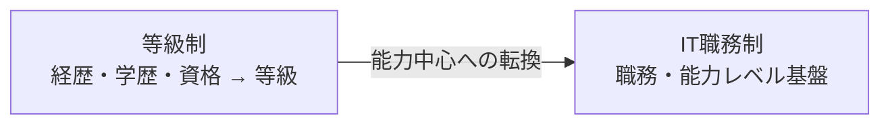

# ソフトウェア技術者の区分（等級制 → IT職務制）

## 1. 概要

### A. 定義および背景
> **技術者等級制**は、経歴・学歴・資格を点数化して初級・中級・高級・特級に分けていた人材分類体系であり、**IT職務制**は、遂行する**職務と実際の能力レベル**を基準に人材を分類する能力中心の体系である。

かつての韓国のSW産業は、技術者等級制に基づいて人件費（労賃単価）を算定していた。等級がそのまま単価であったため計算は単純であったが、「何年働いたか」が「何をどれだけうまくできるか」の代わりとなる**年功序列型の評価**という根本的な問題があった。同じ経歴でも実力差の大きいSW職種の特性がまったく反映されなかったのである。そこで政府は2012年にSW技術者申告制（等級制）関連の規定を廃止し、職務と能力を中心とするIT職務制への転換を推進した。

### B. 必要性
IT職務制の必要性は、**専門性に対する正当な報酬**から生じる。能力の優れた開発者が経歴だけが長い人材よりも低く評価されれば、優秀な人材は産業を離れ、発注の対価も実際の価値と食い違う。職務・能力に基づく分類はこうした歪みを正して処遇を改善し、発注者が必要な能力を明確に要求して対価を合理的に算定できるよう支援する。さらに個人に対しては**キャリア開発パス（Career Path）**を提示し、産業全体の専門性を高める基盤となる。

## 2. 等級制とIT職務制の概念・特徴

等級制は**投入人材の履歴（input）**を見る。経歴・学歴・資格という客観的な資料で等級を付けるため計算が容易で論争も少ないが、実際の成果物の質とは無関係に等級が固定される。一方IT職務制は、**遂行する職務と、その職務で要求される能力レベル（competency）**を見る。例えばSFIA（Skills Framework for the Information Age）のような国際的な能力体系のように、職務ごとに要求される能力と熟練段階を定義し、その到達レベルで人材を評価する。視点が「どれだけ長く」から「どれだけうまく、どのような仕事を」へと移ったことが本質的な違いである。

| 区分 | 技術者等級制 | IT職務制 |
|---|---|---|
| **基準** | 経歴・学歴・資格 → 等級（初・中・高・特級） | **職務・能力レベル**による分類 |
| **視点** | 投入人材の等級（年功） | 遂行職務・専門性 |
| **対価算定** | 等級別の労賃単価 | 職務・能力に基づく単価 |
| **長所** | 単純・客観的な算定 | 専門性の反映・キャリア開発の促進 |
| **短所** | 年功序列・能力が未反映 | 現場への定着不足・基準の不在 |

## 3. 現行IT職務制の問題点

制度は変わったが、現場は依然として等級制の慣行にとどまっているというのが中核的な問題である。最大の原因は**対価算定基準の空白**である。等級制には等級別の労賃単価という明確な数字があったが、職務制ではこれに代わる標準単価・基準が十分に整備されていないため、発注者は契約書で依然として「中級以上」のような等級を要求している。また、能力を客観的に測定する認証体系が不備であるため「この人が当該職務の能力を備えている」ことを証明しにくく、発注者・企業の理解と受容度も低い。

| 問題点 | 内容 |
|---|---|
| **現場への未定着** | 発注・契約書で依然として等級を要求 |
| **対価基準の混乱** | 職務制に基づく労賃単価・算定基準の不在/曖昧さ |
| **能力評価の困難** | 客観的な能力測定・検証体系の不備 |
| **認識不足** | 発注者・企業の理解・受容が低調 |

## 4. 改善方向

問題の根が「制度と現場のギャップ」である以上、改善も**ギャップを埋める実質的な対策**でなければならない。まず職務制に基づく対価・労賃の基準を明確に定め、発注者が等級の代わりに職務で要求できるようにし、標準的な能力体系と認証（経歴管理システムとの連携）を整備して能力を証明可能にする。発注ガイド・教育で認識を高めつつ、公共発注が先行して職務制を適用し、市場を先導するのが効果的である。ただし急激な転換は混乱を招くため、等級と職務をマッピングして**並行運用した後に段階的に移行**するソフトランディング戦略が現実的である。

| 改善方向 | 内容 |
|---|---|
| **制度整備** | 職務制に基づく対価・労賃基準の明確化 |
| **能力認証** | 標準能力体系・認証（経歴管理システムとの連携） |
| **認識向上** | 発注ガイド・教育、公共部門での先行適用 |
| **段階的転換** | 等級-職務マッピング → 並行運用 → 移行 |

## 5. 考慮事項および示唆点
- **制度と現場のギャップ解消が核心**: いかに優れた分類体系でも、対価算定・発注慣行が裏付けとならなければ死文化する。対価基準の明確化が最優先課題である。
- **能力中心の文化への転換**: 年功ではなく実力で評価される文化が定着すれば、SW技術者の処遇と産業競争力がともに向上する。
- **法・制度との連携**: ソフトウェア振興法、SW事業対価算定ガイド、公共SW発注制度と整合的に連携させてはじめて実効性が確保される。
- **国際的な整合性**: SFIAなどの国際的な能力体系と互換性のある基準を設ければ、グローバルな人材移動・評価にも対応できる。

---

> **一言まとめ**: SW技術者の区分は*経歴に基づく等級制*から*職務・能力に基づくIT職務制*へと転換されたが、現場への未定着・対価基準の混乱が問題であり、職務制の対価基準の明確化・能力認証・認識向上・段階的転換が中核的な改善方向である。
