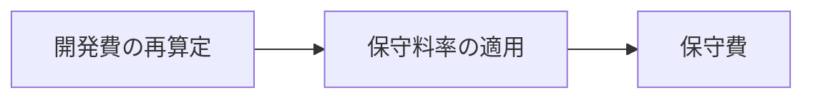
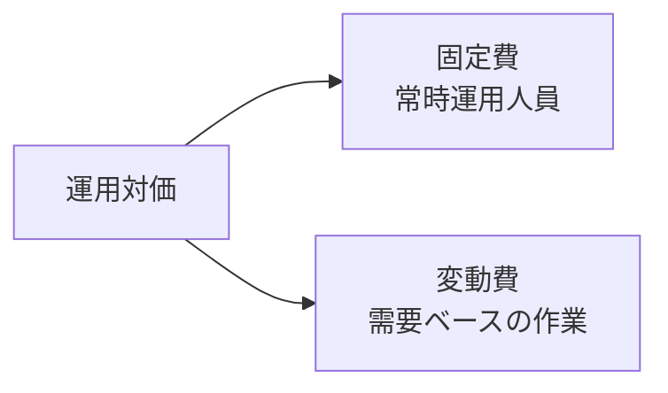

# ソフトウェア運用段階の対価算定（SW事業対価算定ガイド2023）

## 1. 概要

### A. 定義
> 「ソフトウェア事業対価算定ガイド（2023改訂）」に基づき、**SW運用段階（保守・運用）の対価を客観的基準で算定**し、発注・契約の合理的根拠を提供する方式である。

SWの総所有コストは、開発よりも運用・保守の期間により多く発生する。しかしこれまで運用対価は「慣行的に開発費の何%」のように根拠が弱いまま設定されることが多く、これが低価格受注と品質低下、あるいは逆に過大計上の原因となっていた。対価算定ガイドはこうした恣意性を減らし、**機能規模（ファンクションポイント）・投入工数・SLAのような測定可能な指標に基づいて**対価を算出するよう標準化したものである。

### B. 保守と運用の区分
ガイドは運用段階を性格の異なる2つの活動に分ける。**保守**は引き渡された応用SWの瑕疵を修正し、小規模な機能を改善・補修する活動であり、その負担はおおむね**SWの規模（ファンクションポイント）に比例**する。一方、**SW運用**はシステムが安定して稼働するよう常時監視・障害対応・構成管理を行う活動であり、その負担は規模よりも**投入人員とサービスレベル（SLA）**に左右される。性格が異なる以上、算定式も異なるべきだというのがこの区分の理由である。

## 2. 応用SW料率制による保守費

保守費は**再算定した開発費に保守料率（%）を乗じる**方式で求める。ここで核心となるのが「開発費の再算定」であり、これはすでに運用中のSWの機能規模を現在の基準（ファンクションポイント・単価）で計算し直した値である。保守負担がSW規模に比例するという前提のもと、規模を開発費に換算し、それに料率を乗じるのである。料率は通常10〜15%程度を基準とし、サービスレベル・難易度・障害対応時間などの補正係数を反映して調整する。例えば再算定開発費が10億ウォンで料率が12%であれば、年間保守費は約1.2億ウォンと算出される。この方式は規模という客観指標に依拠するため、**簡便で紛争が少ない**という長所がある。

| 項目 | 内容 |
|---|---|
| 算定式 | 保守費 = 開発費（再算定）× 保守料率（%） |
| 料率 | サービスレベル・難易度の補正係数を反映（通常10〜15%程度） |
| 前提 | 保守負担がSW規模（ファンクションポイント）に比例 |
| 特徴 | 規模ベース、簡便・客観的、紛争の余地が少ない |

## 3. SW運用の投入工数算定方式

運用費は規模ではなく、**実際に何人がどれだけ投入されるか**で算定するのが合理的である。常時監視・障害対応のような活動は、SWの大小にかかわらず決まった人員が勤務しなければならないためである。そのため算定式は `運用費 = 投入工数(M/M) × 労務単価 + 経費・利益` の形をとる。投入工数は運用対象の規模、業務量、SLA（可用性・応答時間目標）を根拠に算定する。例えば24時間監視が必要なシステムでは交代勤務を考慮した人員が算定され、同じ規模でもSLAが高いほど工数が増える。このように投入工数方式は**運用の労働集約的な性格をそのまま反映**する。

| 項目 | 内容 |
|---|---|
| 算定式 | 運用費 = 投入工数(M/M) × 労務単価 + 経費・利益 |
| 投入工数の算定 | 運用業務量・SLA・対象規模に基づく |
| 前提 | 運用負担が規模よりも投入人員に比例 |
| 特徴 | 実投入ベース、常時運用の性格に適合 |

## 4. 固定費／変動費算定方式

運用業務には性格上、「常に必要な部分」と「要請があったときだけ発生する部分」が混在している。これを一つの方式でひとまとめにすると、実際の所要と対価が食い違う。そこで常時監視・基本維持のような**固定費**（月額定額の性格）と、機能改善・障害対応のように要請・作業量に応じて増減する**変動費**を分離して算定する。このように分けると、予測可能な基本費用は安定的に保証し、変動要素は実際の発生分だけ精算できるため、**発注者・受託者の双方にとって公正**である。実務では通常、固定費を骨格とし、その上に変動費を載せる混合方式を用いる。

| 区分 | 内容 | 性格 |
|---|---|---|
| 固定費 | 常時運用人員・基本維持費用 | 月額定額、予測可能 |
| 変動費 | 改善・障害など要請・作業量に連動する費用 | 実績精算 |
| 適用 | サービス特性に応じて固定＋変動を混合 | 公正性・柔軟性 |

## 5. 考慮事項および示唆点
- **性格に合った方式の選択**：規模比例が明確な保守は料率制、労働集約的な運用は投入工数、需要変動の大きい業務は固定＋変動の混合が適している。一つの万能式を押し付けると、低価格・過大計上の歪みが生じる。
- **SLA・業務量に基づく定量化**：対価の根拠をSLA・業務量のような測定指標で明示してこそ、低価格受注と品質低下の悪循環を断ち切ることができる。
- **公共SW対価の現実化**：ガイドの趣旨は対価を現実化し、人材の処遇とSW品質を共に引き上げることにあり、これは産業エコシステムの持続性に直結する。
- **限界と協議**：料率・補正係数には依然として協議の余地があるため、発注時にSLA・成果物・投入計画を契約書に具体化し、解釈をめぐる紛争を減らす必要がある。

---

> **一言まとめ**: SW運用段階の対価は、規模に比例する*保守を料率制（開発費×料率）*で、人員に比例する*運用を投入工数（M/M×単価）*で算定し、常時発生する費用は固定費、作業量連動の費用は変動費に分けて**性格に合わせて定量化**することが核心である。
