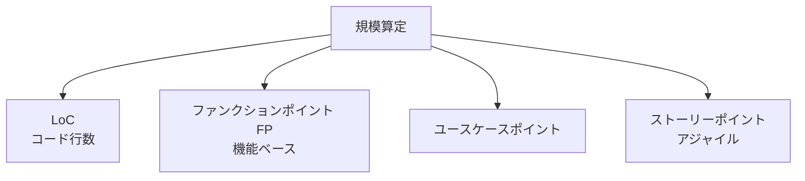

# ソフトウェア規模算定方式と公共SWの改善方策

## 1. 概要

### A. 定義
> ソフトウェア開発に必要な**規模（サイズ）を定量的に見積もる**方式であり、開発費・投入工数（M/M）・スケジュール算定の出発点となる。

規模算定とは、「どれほど大きなソフトウェアを作るのか」を数値に換算する作業である。規模が決まって初めて生産性（単位規模あたりの工数）を乗じて工数・費用・スケジュールを導出できるため、規模算定はあらゆるSW見積りの**最上位の基準点**である。算定方式は何をサイズの単位とするかによって分かれ、各方式は測定時点・精度・客観性において明確なトレードオフを持つ。

### B. 登場背景および必要性
かつてSW対価は人員数・期間のような投入（input）中心で算定されていたため根拠が脆弱であり、これが発注者・受託者間の**作業範囲をめぐる紛争**や、**低価格受注**後の品質低下につながった。ソフトウェアには物理的実体がないため「いくらのものか」を客観的に合意することが難しく、成果物（output）ベースの標準化された規模尺度が必要となった。特に公共部門では予算執行の透明性と公正性が求められるため、言語・技術に依存しない標準化された算定方式を対価の基準として採用するに至った。

## 2. 規模算定方式の種類・特徴

4つの方式は大きく**「コードベース（LoC）」と「機能ベース（FP・UCP・SP）」**に分かれる。LoCは完成したソースの行数を数えるため直感的であるが、同じ機能でも言語・開発者のスタイルによって行数が大きく異なり、開発が終わらなければ正確に数えられないため、**初期見積りには不向き**である。反対にファンクションポイント（FP）は「ユーザーに提供される機能」を単位とするため、実装言語に関係なく要求分析段階で算定でき、国際標準（ISO/IEC 20926など）として確立されているため**客観性・再現性**が高い。ユースケースポイントはUMLユースケースの複雑度を活用するためオブジェクト指向プロジェクトに適しており、ストーリーポイントはアジャイルチームが相対的なサイズで見積もる方式であるため、チーム内部では有用だがチーム間の比較には使いにくい。

| 方式 | サイズ単位 | 長所 | 短所 |
|---|---|---|---|
| **LoC（コード行数）** | ソース行数 | 単純・直感的 | 言語・スタイルに依存、初期見積りが困難 |
| **ファンクションポイント（FP）** | ユーザー機能 | 言語非依存、国際標準、初期算定が可能 | 測定に専門性・労力が必要 |
| **ユースケースポイント** | ユースケースの複雑度 | オブジェクト指向・UMLプロジェクトに適合 | ユースケース記述の品質に依存 |
| **ストーリーポイント** | 相対的規模 | アジャイルの反復見積りに有用 | チーム依存、チーム間比較が困難 |

こうした特性から、**公共SW事業はファンクションポイント（FP）**を対価算定の標準として採用している。

## 3. ファンクションポイント（FP）の算定

FPは、ソフトウェアがユーザーに提供する機能を**データファンクション**と**トランザクションファンクション**に分けて計量する。データファンクションはシステムが維持・参照する論理データの集合であり、トランザクションファンクションはユーザーが実行する処理単位である。各機能の複雑度（単純／普通／複雑）に応じて重みを付与し、合算する。

| 段階 | 内容 |
|---|---|
| **機能の識別** | データファンクション（内部論理ファイルILF・外部インタフェースファイルEIF）・トランザクションファンクション（外部入力EI・外部出力EO・外部照会EQ） |
| **複雑度の重み付け** | 機能ごとの複雑度（単純・普通・複雑）に重みを付与 |
| **補正・集計** | 簡易法（平均複雑度を適用）または正規法（個別複雑度を算定）で総FPを算出 |

実務では、要求が確定する前の初期段階では平均複雑度を適用する**簡易法**で素早く見積もり、設計が詳細化した後に個別の複雑度を反映する**正規法**で精緻化するというように、段階的に精度を高める。例えば100 FP規模と算定された事業に、SW事業対価基準の単価を乗じて開発費を導出する。

## 4. 公共SW規模算定の現実的な改善方策

公共SW事業の算定問題の大半は、「事業初期に要求が不明確であるにもかかわらず、その時点で対価を固定する」という構造的矛盾に起因する。以下の改善方策はこの矛盾を緩和する方向である。

| 問題 | 原因 | 改善方策 |
|---|---|---|
| **要求不明確時の算定の不正確さ** | 着手時点で要求が未確定 | 分析完了後の**段階的再算定**（要求の詳細化後に確定） |
| **作業範囲変更の未反映** | 契約後の要求増加 | 作業範囲変更審議委員会、変更分の対価再算定 |
| **低価格受注** | 最低価格競争 | 適正対価・原価に基づく下限設定、SW影響評価 |
| **FP測定の負担** | 測定の専門性・時間を要する | 自動化ツール、標準・教育、専門人材の育成 |

核心は、規模を一度に確定させるのではなく、**分析後の再算定（段階的確定）**と**作業範囲変更管理**を制度化することである。要求が増えればその分だけ対価を再算定できてこそ、低価格受注と無理な作業追加（velvet）を防ぐことができる。

## 5. 考慮事項および示唆点
技術士の観点では、SW規模算定は単なる見積り技法ではなく、**発注者と受託者の間の信頼を担保する制度的装置**として捉えるべきである。第一に、ファンクションポイントに基づく客観的算定と作業範囲変更管理を組み合わせてこそ、算定の正確性と公正性が共に確保される。第二に、SW事業対価算定ガイド・SW振興法と連携して適正対価を保障することにより、産業エコシステムの健全性を守る。第三に、アジャイル・クラウド（SaaSサブスクリプション）・保守事業のように従来のFPでは捉えにくい事業類型が増えているため、ストーリーポイント・サービス規模などを反映した**算定方式の多様化・補完**が今後の課題である。

---

> **一言まとめ**: SW規模算定は*LoC・ファンクションポイント（FP）・ユースケース・ストーリーポイント*方式に分かれ、公共では言語非依存で標準化されたFPが基準であり、要求詳細化後の段階的再算定・作業範囲変更の反映・適正対価の確保が公共SW算定の核心的な改善方向である。
