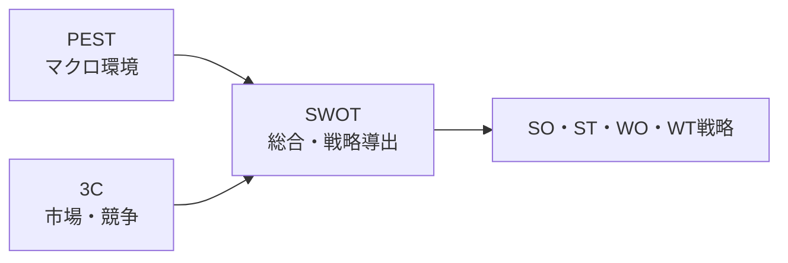

# 経営環境分析：SWOT・3C・PEST

## 1. 概要

### A. 定義
> 事業・情報化戦略の策定に先立ち、組織を取り巻く**内外の経営環境を体系的に診断**するための代表的な分析フレームワークであり、それぞれマクロ環境・市場競争・総合という異なる観点を担う。

3つの手法は競合関係ではなく、**分析の階層（scope）**が異なる。PESTは制御不可能なマクロ環境を、3Cはその中の特定の市場・競争構図を、SWOTは先行する分析を内部能力と結び付けて戦略へと総合する。したがって一つだけを使うよりも、**PEST→3C→SWOTの順に連携**させたときに分析の論理的根拠が強固になる。

### B. 登場背景および必要性
戦略は「自社が何を得意とするか（内部）」だけでは立てられず、市場・規制・技術のような**外部変化の中での自社の位置**を読み取らなければならない。直感と経験のみに依存した戦略は環境変化を見落として失敗しやすいため、外部・市場・内部を漏れなく押さえる構造化されたチェックリストが必要となった。これらのフレームワークは分析の漏れを防ぎ、利害関係者間に**共通の議論言語**を提供するという点で、情報化戦略計画（ISP）・事業妥当性分析の標準ツールとして用いられている。

## 2. 3手法の概要比較

PESTが産業全体に影響を与える広い環境を俯瞰するとすれば、3Cはその産業の中で自社が競争する具体的な市場を掘り下げ、SWOTはこの外部情報（機会・脅威）に内部診断（強み・弱み）を加えて実行可能な戦略へと凝縮する。すなわち、前の2手法がSWOTの入力を作り出す構造である。

| 手法 | 観点 | 構成要素 | 成果物 |
|---|---|---|---|
| **PEST** | マクロ外部環境 | 政治・経済・社会・技術 | 機会／脅威の源泉 |
| **3C** | 市場・競争構図 | 顧客・競合・自社 | 重要成功要因（KSF）・差別化 |
| **SWOT** | 内部＋外部の総合 | 強み・弱み（内部）・機会・脅威（外部） | SO・ST・WO・WT戦略 |

## 3. PEST分析

PESTは、組織が制御できない**マクロ環境の変化**を政治（Political）・経済（Economical）・社会（Social）・技術（Technological）の4軸で俯瞰し、長期的・戦略的な方向性を設定するために用いられる。規制・技術の変化が大きい産業や新市場への参入、中長期計画を立てる際に特に有効である。方法としては、4要因ごとの変化を導出した後、各変化が事業にとって機会か脅威かを評価し、複数の組み合わせをシナリオとして構成する。例えばEV企業であれば、炭素規制の強化（P）は機会、バッテリー原材料価格の急騰（E）は脅威と読み取り、対応シナリオを分ける。

| 要因 | 例 |
|---|---|
| **P（政治）** | 規制・政策、税制、政治的安定性 |
| **E（経済）** | 景気・金利・為替、所得水準 |
| **S（社会）** | 人口・ライフスタイル・価値観 |
| **T（技術）** | 新技術・特許・デジタルトランスフォーメーション |

## 4. 3C分析

3Cは**市場参入・競争戦略**の策定に焦点を当て、顧客（Customer）・競合（Competitor）・自社（Company）の3軸をクロス分析して**重要成功要因（KSF）**と差別化戦略を導出する。まず顧客のニーズとセグメンテーションを把握し、競合の強み・弱みを分析した後、この2つに照らして自社の能力を比較する。差別化とは結局、「顧客が望んでいるのに競合は提供できず、自社は提供できる」ポイントを見つけることである。例えばデリバリープラットフォームが3Cを適用すると、迅速な配達を望む顧客（C）と手数料競争中の競合（C）を前にして、自社（C）の物流能力で「超短時間配達」という差別化ポイントを打ち立てることができる。

## 5. SWOT分析

SWOTは、PEST・3Cなどで整理された外部要因（機会O・脅威T）と内部要因（強みS・弱みW）を一つのマトリクスに**総合して戦略を導出**する段階である。したがってSWOTは分析の出発点ではなく、先行する分析が終わった後に実施してこそ実効性がある。核心は単に4つのマスを埋めることではなく、内部・外部要因を**クロス（cross）**させて具体的な戦略を引き出すことにある。

| 区分 | 機会（O） | 脅威（T） |
|---|---|---|
| **強み（S）** | **SO**：強みで機会を活用（攻勢・拡大） | **ST**：強みで脅威を回避 |
| **弱み（W）** | **WO**：弱みを補完して機会を活用 | **WT**：弱み・脅威を最小化（防御・撤退） |

例えば強力なブランド（S）と新興市場の成長（O）が組み合わされば積極的な進出（SO）が、技術人材の不足（W）と急変する技術（T）が組み合わされば、アウトソーシング・提携によってリスクを減らす防御戦略（WT）が導出される。

## 6. 考慮事項および示唆点
技術士の観点では、これらのフレームワークの価値は個別の使用ではなく**連携活用**にある。PEST（マクロ）→3C（市場）→SWOT（総合）の順に進めると、外部・市場分析の結果がそのままSWOTのO/T・S/Wを導出する**根拠**となり、戦略の論理的一貫性が確保される。この流れはISP・事業妥当性分析の環境分析段階で標準的に用いられる。ただし3手法はいずれも分析者の主観が介入する**定性分析**であるため、市場データ・専門家レビュー・定量指標で補完して偏りを減らす必要がある。また環境は絶えず変化するため、一度の分析で終わらせず定期的に更新することが望ましい。

---

> **一言まとめ**: PEST（マクロ環境）・3C（顧客・競合・自社）で外部・市場を診断し、SWOTで内外を総合してSO・ST・WO・WT戦略を導出する。PEST→3C→SWOTの連携活用と定量データによる補完が、効果的な環境分析の核心である。
