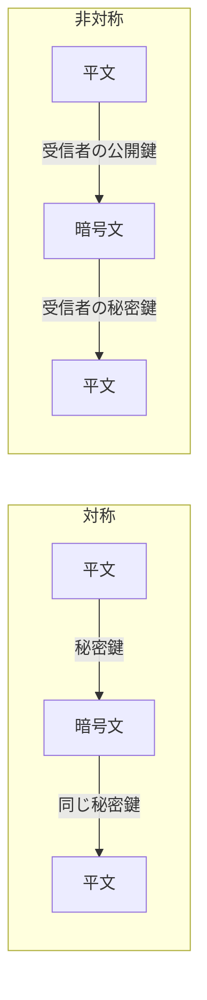

# 対称暗号化と非対称暗号化

## 1. 概要

### A. 定義
> **対称暗号化（Symmetric）**は暗号化と復号に**同一の秘密鍵**を使用する方式であり、**非対称暗号化（Asymmetric、公開鍵暗号）**は数学的に対をなす**公開鍵・秘密鍵のペア**を使用し、一方の鍵で暗号化すると他方の鍵でのみ復号できる方式である。

両方式の根本的な違いは、「鍵を共有するか、分けるか」にある。対称暗号は送受信者が**同じ秘密を事前に共有**しなければならないため高速であるが、その秘密を安全に伝達するという問題が残る。非対称暗号は鍵を**公開用と秘密用に分離**し、公開鍵は誰にでも配布し、秘密鍵は所有者のみが保管する。この非対称性のおかげで、事前共有なしに安全な通信と本人証明が可能になる。

### B. 登場背景および必要性
初期の暗号はすべて対称方式であり、参加者が増えるほど**鍵配送（Key Distribution）**が難題となった。n人が相互に通信するにはn(n-1)/2個の秘密鍵が必要であり、これらの鍵をどのように安全に分け合うかは、それ自体がさらに別の安全なチャネルを要求した。1976年にDiffie-Hellmanが公開鍵の概念を提示してこの循環問題を打破し、その後RSAが実用的なアルゴリズムとして実装された。しかし公開鍵演算は対称に比べて数百〜数千倍遅く、大容量データには不向きである。そのため実務では、**非対称で鍵を交換し、対称で本文を暗号化する**ハイブリッド構造によって両方式の長所だけを取り入れる。

## 2. 動作方式の比較

対称方式は一つの秘密鍵が暗号化・復号の両方でそのまま使われるため、演算が単純で高速である。AESのようなブロック暗号はハードウェアアクセラレーション（AES-NI）までサポートされ、毎秒数GBを処理する。一方、非対称は大きな整数のべき乗・素因数分解の困難性（RSA）や楕円曲線離散対数（ECC）のような**数学的難問**に安全性を依拠するため、演算コストが大きい。その代わり公開鍵を公開しても秘密鍵を逆算できないため、鍵を事前共有する必要がなくなる。

| 区分 | 対称暗号化 | 非対称暗号化 |
|---|---|---|
| **鍵** | 同一の秘密鍵 | 公開鍵／秘密鍵のペア |
| **速度** | 高速 | 低速（数百〜数千倍） |
| **鍵配送** | 困難（事前共有が必要） | 容易（公開鍵の配布） |
| **鍵の数** | n(n-1)/2 | 2n |
| **アルゴリズム** | AES, SEED, ARIA, DES | RSA, ECC, ElGamal |
| **用途** | 大容量データの暗号化 | 鍵交換・電子署名 |

鍵の数の違いは、核心的なトレードオフをよく示している。100人が通信する場合、対称では約4,950個の鍵を管理しなければならないが、非対称ではそれぞれ1ペアずつ200個で済む。すなわち、**参加者が多く事前の関係がないオープンな環境ほど非対称が有利**である。

## 3. 提供するセキュリティサービス

暗号方式の選択は、どのようなセキュリティサービスが必要かによって異なる。**機密性**は対称・非対称の両方が提供するが、性能上の理由から実際には本文を対称で暗号化し、そのセッション鍵のみを非対称で保護する。**認証と否認防止**は非対称固有の強みである。送信者が自身の**秘密鍵で署名**すれば誰でもその公開鍵で検証でき、秘密鍵は本人しか持たないため「その者が署名したこと」を否認できない。**完全性**は原文のハッシュ値に署名し、転送中に改ざんされるとハッシュが変わって検証に失敗するという原理で保証される。

| サービス | 実現方式 |
|---|---|
| **機密性** | 対称（本文）＋非対称（セッション鍵の保護） |
| **認証・否認防止** | 秘密鍵による電子署名 → 公開鍵で検証 |
| **完全性** | ハッシュ（SHA-256）＋署名 |

## 4. ハイブリッド方式（デジタルエンベロープ）

両方式の限界を互いに補う代表的な設計が**デジタルエンベロープ（Digital Envelope）**である。送信者は任意の**セッション鍵（対称）**を生成して大容量の本文を高速に暗号化し、そのセッション鍵のみを**受信者の公開鍵（非対称）**で暗号化して一緒に送る。受信者は自身の秘密鍵でセッション鍵を復元した後、本文を復号する。こうすることで、低速な非対称演算は小さなセッション鍵にのみ、高速な対称演算は大きな本文に使われ、性能と鍵配送を同時に解決する。TLSハンドシェイク、S/MIMEによる電子メール暗号化はいずれもこの構造に従う。例えばHTTPS接続時、ブラウザはサーバ証明書の公開鍵を用いて対称セッション鍵を安全に合意した後、実際のWebトラフィックはAESで暗号化してやり取りする。

## 5. 考慮事項および示唆点
- **鍵管理こそがセキュリティ水準**：アルゴリズムが強固でも鍵が漏えいすれば無意味である。**HSM（ハードウェアセキュリティモジュール）**で鍵を保護し、生成・配布・廃棄・更新のライフサイクルを統制しなければならない。
- **安全な鍵長の維持**：計算性能の向上に備え、AES-256、RSA-2048以上、または短い鍵で同等の強度を実現する**ECC（例：256bit ≈ RSA 3072bit）**を採用する。
- **耐量子計算機暗号（PQC）への移行への備え**：量子コンピュータのShorアルゴリズムはRSA・ECCを無力化しうるため、NIST標準（CRYSTALS系）に基づく**PQC移行ロードマップ**を先制的に準備すべきである。
- **要件ベースの設計**：性能・規制・相互運用性を総合して対称・非対称・ハイブリッドを組み合わせ、韓国国内のシステムではSEED・ARIAなど国産アルゴリズムの使用要件も併せて考慮する。

---

> **一言まとめ**: 対称暗号化は*同一の秘密鍵で高速だが鍵配送が難しく*、非対称暗号化は*公開鍵／秘密鍵により鍵配送・電子署名に有利だが低速であり*、実務ではデジタルエンベロープのように非対称でセッション鍵を保護し、対称で本文を暗号化するハイブリッドとして組み合わせる。
