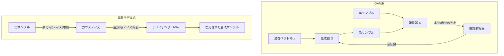

# 合成データ（Synthetic Data）

## 1. 概要

> **定義**：合成データ（Synthetic Data）とは、現実世界から直接収集した元データではなく、元データの**統計的分布・相関関係・構造的特性**を学習し、あるいはルール・シミュレーションによって模倣して**人工的に生成したデータ**をいう。実在する個々の主体を指し示さない一方で、分析・学習の目的においては元データと同等の有用性（utility）を持つよう設計される。

合成データが台頭した背景には、**データ活用と個人情報保護の間の根本的な緊張**がある。AI・データ産業では学習データの量と質がそのままモデル性能を左右するが、肝心の高品質データは個人情報保護法・GDPRなどの規制、営業秘密、収集コストのために自由に使うことが難しい。非識別化措置（仮名化・匿名化）は再識別リスクと情報損失の間でバランスを取りにくく、データを削るほど有用性が急減するというジレンマがある。合成データは「元データを変形する」アプローチではなく、「元データと統計的に似た新しいデータを作る」アプローチによってこのジレンマを回避する。

これに加えて、**良質な実データの枯渇**という問題も合成データを押し上げている。インターネットから収集可能な高品質のテキスト・画像は有限であり、大規模モデルがこれを急速に使い尽くしつつあるという懸念が高まっている。Webクローリングデータは著作権・ライセンス紛争のリスクも抱えているため、生成条件を制御して望む品質・テーマで作成できる合成データの戦略的価値は相対的に高まっている。

もう一つの背景は**データの不均衡・希少性の問題**である。不正取引、製造不良、希少疾患のように実際には極めてまれにしか発生しない事象（イベント）は学習データが不足し、モデルが十分に学習できない。自動運転において子どもが道路に突然飛び出すような極端な状況（コーナーケース）を実際に収集することは、ほぼ不可能である。合成データはこのような**希少シナリオを意図的に大量生成**し、データ拡張（augmentation）やエッジケースの補強に用いられる。Gartnerは2030年頃にはAIモデルの学習に使われるデータの相当部分が合成データに置き換わると予測しており、実際に大規模言語モデル（LLM）の学習においても合成コーパスの活用が急速に増えている。

合成データの主な特徴は、①元データとの**統計的類似性**を保ちながらも個々のレコードは実在の人物と1対1に対応しないこと、②必要なだけ**無限に拡張・生成**できること、③生成時点でラベルを同時に付与できるため**アノテーション（annotation）コストを削減**できること、④生成条件を調整して**分布を制御（controllable generation）**できることである。

こうした特徴により、合成データは単なる「偽データ」ではなく、**データの資産化・流通のための戦略的手段**となる。元データを直接移動・共有することなくその価値を外部と分かち合えるため、韓国のデータ3法・マイデータなどデータ経済政策が目指す安全なデータ活用と方向性が一致する。ただし後述するように「合成だから無条件に個人情報ではない」という認識は危険であり、生成品質と再識別リスクによってその法的・技術的地位が変わるという点を前提として理解すべきである。

## 2. 合成データの全体構造と生成類型

合成データ生成パイプラインは、元データの分布を学習・定義する段階、その分布からサンプリングしてデータを生成する段階、生成物の有用性・プライバシー・忠実度を評価する段階で構成される。以下の概念図は全体の流れを示す。

生成パイプラインを手順として展開すると次のようになる。第一に、**要件定義**段階で、何を（どのカラム・ラベル・シナリオを）、なぜ（テスト・学習・共有）、どの水準のプライバシー・忠実度で作るのかという目標を確定する。第二に、**元データの分析・前処理**で、欠損・外れ値・カラム型（カテゴリ型／連続型／時系列）を把握し、機微なフィールドを識別する。第三に、**生成方式・モデルの選定**で、データ型と目標に合った手法を選び、（必要に応じて差分プライバシーを）組み合わせる。第四に、**生成・後処理**で制約条件（例：年齢は0〜120、合計の一致といった整合性ルール）を強制する。第五に、**評価・検証**で忠実度・有用性・プライバシーを測定し、目標未達であれば前の段階に戻る。第六に、**配布・監視**でデータセットのバージョン・系譜を記録し、再識別リスクを継続的に観察する。この手順は一回限りではなく、評価結果に応じて繰り返される循環構造である点が重要である。

合成データは生成方式によって大きく3系統に分かれる。第一は**ルール・統計ベースの生成**であり、ドメイン専門家が定義したルール、確率分布（正規分布・ポアソン分布など）、あるいは元データの周辺分布と相関行列を用いてデータを作る。実装が単純で説明可能であるが、変数間の複雑な非線形関係を表現しにくい。第二は**シミュレーション・エージェントベースの生成**であり、物理エンジンやゲームエンジン、デジタルツインで仮想環境を構成し、センサー・映像データを作る。自動運転・ロボティクスで特に有用である。第三は**深層生成モデルベース**であり、GAN・VAE・拡散モデル（Diffusion）・Transformer（LLM）が元データの同時分布（joint distribution）を学習し、高次元・非構造化データまでリアルに生成する。

以下の表は3系統の特性を比較する。ただし表は整理の補助手段にすぎず、各方式がいつ、なぜ有利なのかは続く段落で説明する。

| 方式 | 代表的手法 | 強み | 弱み | 適合データ |
|------|-----------|------|------|-------------|
| ルール・統計 | 分布サンプリング、コピュラ | 説明可能・低コスト | 複雑な関係の表現に限界 | 構造化（テーブル） |
| シミュレーション | 物理エンジン、デジタルツイン | ラベル自動付与・エッジケース | 現実との乖離（ドメインギャップ） | 映像・センサー |
| 深層生成 | GAN, VAE, Diffusion, LLM | 高忠実度・非構造化対応 | 学習の難しさ・モード崩壊 | 画像・テキスト・時系列 |

ルール・統計ベースは、個人情報がほとんど関与しない初期テストデータやソフトウェア開発用のダミーデータに適している。例えば金融システムの性能負荷テストのために1億件の仮想取引レコードを作る場合、実際の顧客分布におおまかに従えば十分であるため、統計ベースが経済的である。一方、不正検知モデルを学習させるには正常・異常取引の微妙な相関まで再現しなければならないため、深層生成が必要となる。

シミュレーションベースが有利な理由は、**生成時点でラベルを正確に把握できるため**である。仮想環境でレンダリングした歩行者・車両は位置・距離・速度・遮蔽（occlusion）情報をピクセル単位ですでに把握しているため、人手でバウンディングボックスを描くアノテーションコストは事実上ゼロに収束する。実際の道路映像100万枚を人がラベリングするには莫大な費用と時間がかかるが、シミュレーションは同規模を自動で生成する。このように生成方式の選択は「データ型（構造化／非構造化）」と「求められる忠実度・ラベル精度・コスト」の3軸の関数であり、実務では一つの方式に固執するよりも複数の方式を組み合わせる。

## 3. 深層生成モデルベースの合成アーキテクチャ

深層学習ベースの合成データの核心は、元データの確率分布を近似する生成モデルである。以下のアーキテクチャ詳細図は、代表的なGAN系と拡散モデル系の生成原理を対比して示す。

3系統は生成原理が根本的に異なり、この違いがそのまま強みと弱みを生む。GANは識別器との競争を通じて鮮明（sharp）なサンプルを得るが学習が不安定であり、VAEは確率的潜在空間により安定しているがぼやけやすく、拡散モデルは多段階のデノイジングで最高品質を実現するが生成速度が遅い。いずれも万能ではないため、要求品質と生成コスト・速度のバランスを見て選択すべきである。

**GAN（Generative Adversarial Network）**は、生成器（Generator）と識別器（Discriminator）が互いに競い合いながら学習する。生成器は潜在ベクトルから偽データを作り、識別器はそれが本物か偽物かを見分けようとする。2つのニューラルネットワークが敵対的に均衡点（ナッシュ均衡）へ収束するにつれ、生成器は次第に元データと区別しにくいデータを作るようになる。構造化テーブルデータに対しては、CTGAN（Conditional Tabular GAN）がカテゴリ型・連続型の混在カラムと不均衡な分布を扱うよう特化されており、広く用いられている。ただしGANは学習が不安定であり、特定のパターンのみを繰り返し生成する**モード崩壊（mode collapse）**のリスクがあるため、ハイパーパラメータのチューニングが難しい。

CTGANを例にとると、売上・年齢のような連続型カラムは多峰性（multi-modal）の分布をなすことが多く、単純な正規化では表現が歪む。CTGANはカラムごとに複数の正規分布の混合で値を表現し（mode-specific normalization）、希少なカテゴリが学習から漏れないよう条件付きサンプリング（conditional vector）を導入して不均衡を緩和する。こうしたドメイン特化の設計があって初めて実際のテーブルデータの有用性が確保され、汎用GANをそのまま使うと性能が大きく低下するという点が実務上の教訓である。

**VAE（Variational Autoencoder）**は、データを低次元の潜在空間にエンコードした後、その潜在分布からサンプリングして再び復元（デコード）する方式である。学習がGANより安定しており、潜在空間が連続的であるため補間（interpolation）が自然であるが、生成物がやや不鮮明（blurry）になる傾向がある。それでも安定性と潜在空間の解釈可能性から、異常検知の基準分布の学習や条件付き生成の基盤として依然として幅広く活用されている。

**拡散モデル（Diffusion Model）**は、元データにノイズを段階的に加えて完全な雑音にした後（順方向過程）、これを逆に一つずつ除去しながらデータを復元する（逆方向過程）よう学習する。現在、画像合成において最高水準の忠実度と多様性を示しており、Stable Diffusionなどテキスト画像生成の根幹となった。近年は表形式データにも拡散モデルを適用する研究（TabDDPMなど）が活発である。

**LLMベースの合成**は、Transformer言語モデルが文章・コード・対話を生成する能力を活用する。特にLLM自体をより小さなモデルへと蒸留（distillation）するために、強力な教師モデルが作成した高品質な指示・応答ペアを合成学習データとして用いる方式が標準として定着しつつある。ただし元モデルのバイアスがそのまま転移したり、合成データのみで反復学習した場合に分布が崩壊する**モデル崩壊（model collapse）**現象が報告されており、実データと合成データの混合比率の管理が重要となっている。

どの生成モデルを選択するかは、データ特性と制約に依存する。構造化テーブルにはCTGAN・TabDDPMのようにカラムの異質性と不均衡を扱うよう特化した手法が、画像には拡散モデルが、時系列には時間依存性を保存する再帰型・Transformer系が、テキストにはLLMがそれぞれ有利である。また、プライバシー保証が必須となる規制産業では、性能がやや低くても差分プライバシーを組み合わせた変種（DP-CTGANなど）を優先的に検討する。すなわち「最もリアルなモデル」ではなく「目的・制約に合致するモデル」を選ぶことが核心であり、この判断こそが技術士が提示すべき設計上の意思決定である。

## 4. 品質評価：忠実度・有用性・プライバシーの三角バランス

合成データの価値は3つの軸で評価され、この3軸はしばしば相反する。忠実度はさらに単変量（各カラムの分布）と多変量（カラム間の相関・条件付き関係）に分けて見る。単変量だけが合っていて多変量構造が崩れると、個々のカラムはもっともらしいがカラムの組み合わせが非現実的なデータが作られ、モデルを誤った方向に導く。**忠実度（Fidelity）**は合成データが元データの統計的特性をどれほどよく再現するかであり、カラムごとの分布比較（KS統計量）、相関構造の類似度、識別モデルが元データ・合成データを区別できない度合い（distinguishability）などで測定する。**有用性（Utility）**は合成データで学習したモデルが実際の業務でどれほどうまく機能するかであり、代表的にはTSTR（Train on Synthetic, Test on Real）方式—合成データで学習し実データで検証した際の性能—を用いる。TSTR性能が実データで学習した場合（TRTR）に近いほど、その合成データは実務で代替として使えると判断する。**プライバシー（Privacy）**は合成データから元データの個別情報が漏えいするリスクであり、メンバーシップ推論攻撃（特定のレコードが学習に使われたかを推論）や近接性攻撃（合成レコードが元レコードに過度に近いか）で評価する。

ここで核心となるのは、**3軸がトレードオフの関係にある**という点である。忠実度を極端に高めると元データをほぼそのまま複製することになり、プライバシーが崩れる。逆にプライバシーのためにノイズを多く加えると有用性が低下する。したがって実務では、**差分プライバシー（Differential Privacy）**を生成モデルの学習に組み合わせ（例：DP-SGD）、「ある一個人のデータが存在してもしなくても生成結果が統計的にほとんど区別できない」という数学的保証を与え、プライバシー予算（ε）で均衡点を定量的に調整する。εが小さいほどプライバシーは強固になるが、有用性は低くなる。

特に注意すべき落とし穴は、**平均的な有用性指標が少数集団の崩壊を覆い隠す**という点である。全体の正解率（accuracy）や分布類似度は良好に見えても、データ内で比率の小さい下位集団は合成過程で過小に表現され、その集団に対するモデル性能が急落しうる。したがって有用性評価は全体指標だけでなく、下位集団ごとに分解して確認すべきである。また、一つの要約スコアで合成データを「合格／不合格」と判定するよりも、3軸を同時に示すダッシュボードで管理し、事業目的に合った閾値を各軸に設定することが実務上の原則である。

プライバシー評価でよく用いられるDCR（Distance to Closest Record）は、各合成レコードが最も近い元レコードからどれだけ離れているかを測定する。この距離が0に近ければ元データを事実上複製したことになるため、危険信号である。ただし距離をむやみに大きくすると有用性が損なわれるため、ホールドアウト（元データのうち学習に使用しなかった標本）との距離分布と比較し、「学習用元データにだけ際立って近いか」を相対的に判断するのが精緻なアプローチである。

以下の表は3つの評価軸と代表的な指標を整理したものである。各指標を単独で見るのではなく、3軸を合わせてダッシュボードで管理することが実務上の原則である。

| 評価軸 | 問い | 代表的な指標・方法 |
|---------|------|----------------|
| 忠実度 | 元データと統計的に似ているか | 分布のKS検定、相関類似度、識別不可能性 |
| 有用性 | 実際のタスクで役に立つか | TSTR、ダウンストリームモデルの性能 |
| プライバシー | 元データが漏れ出していないか | メンバーシップ推論攻撃の成功率、DCR（最近接距離） |

## 5. 産業適用事例と比較

合成データはすでに多くの産業で実証されている。各事例で合成データを選ぶ理由は少しずつ異なる。金融は**プライバシー・共有の制約**を、ヘルスケアは**アクセス制限と希少性**を、自動運転・製造は**エッジケースの確保とラベリングコスト**を、それぞれ第一の動機とする。この違いが、生成方式（構造化データ向け深層学習 vs シミュレーション）と検証の焦点（プライバシー vs ドメイン整合性）を分けている。

**金融**分野では、個人情報と結び付いた取引データを外部のフィンテック・研究機関と共有することが難しいため、元データと統計的に同等な合成取引データを作成し、不正検知モデルの共同開発や規制サンドボックスでのテストに活用する。例えばクレジットカード不正は全取引の約0.1〜0.2%にすぎず極端な不均衡を示すが、合成によって異常取引を拡張すると少数クラスの再現率（recall）を有意に引き上げることができる。

**ヘルスケア**では、患者の電子カルテ（EMR）が最も機微なデータに属し、研究目的のアクセスが制限されている。合成EMRを生成すれば、実際の患者を露出させることなくアルゴリズムの開発・検証が可能になる。ただし希少疾患のような少数事例は合成過程で特定の実在患者に過度に類似しうるため、近接性検査と臨床的妥当性の検証を並行して行う必要がある。特に医療データには検査値間の生理学的制約（例：特定の数値の組み合わせは臨床的に不可能）が存在するため、統計的類似性を合わせるだけでは不十分であり、ドメインルールに基づく事後検証が必ず必要である。

**自動運転・製造**では、シミュレーションベースの合成が主力である。ゲームエンジンで多様な天候・照度・歩行者の行動を組み合わせた走行映像とラベルを自動生成し、実際の道路での収集では確保しにくい危険な状況を大量に学習させる。ここで鍵となるのは、仮想と現実の統計的な差である**ドメインギャップ（domain gap）**をドメイン適応（domain adaptation）手法で縮小することである。製造分野でも、不良率が数百ppm程度と極めて低い欠陥画像を合成で拡張し、外観検査モデルの欠陥検出性能を高める事例が増えており、デジタルツインと組み合わせれば設備故障のシナリオまで仮想的に生成できる。

**テキスト・LLM**領域の事例も急速に増えている。コールセンターの応対ログのように個人情報と機微な発話が混在するデータはそのまま学習に使うことが難しいため、発話意図・感情・シナリオを保存した合成対話を生成し、応対ボット・要約モデルを学習させる。また特定ドメイン（法律・医療）で不足している指示-応答データを上位モデルで合成して小型モデルを蒸留すれば、実データを収集することなくドメイン特化の性能を確保できる。ただしこの場合、事実誤り（hallucination）が学習データに混入しないよう、検証フィルタを必ず設けなければならない。

合成データを従来の非識別化措置と比較すると、違いが明確になる。仮名化・匿名化は元レコードを保持したまま識別子を変形するため**元データとの1対1対応が残り**、再識別リスクが常に存在し、削除・カテゴリ化が進むほど情報が失われる。一方、合成データは新しいレコードを生成するため元データとの1対1対応そのものが存在せず、再識別の出発点が消える。しかしこれは「合成なら無条件に安全」を意味しない。過学習した生成モデルは元データを事実上記憶・複製しうるため、合成データにもプライバシーリスク評価が必須であるという点が実務上の含意である。すなわち非識別化は「削り取る」アプローチ、合成は「作り直す」アプローチであり、それぞれ残余リスクの管理方法が異なる。

## 6. 深掘り：最新動向と標準・規制の変化

合成データを取り巻く制度・技術環境は急速に整備されつつある。規制面では、**EU AI Act**がバイアス緩和・データガバナンスの文脈で合成データに明示的に言及し、許容の根拠を設けた。米国などでもプライバシー保護技術の一つとして注目されている。韓国でも個人情報保護委員会・関係機関を中心に仮名情報・合成データ活用ガイドの議論が続いており、合成データの法的地位（個人情報該当性の判断基準）が今後の核心的な争点になる見込みである。現時点では「合成データが自動的に非個人情報になるわけではなく、再識別リスク評価の結果に応じて判断する」という慎重なアプローチが一般的であるため、断定的な表現は避けるべきである。

これに伴い、**合成データの出所表示・追跡**に関する議論も浮上している。生成AIコンテンツに対するウォーターマーキング・出所表示（provenance）の要求が強まるにつれ、学習・流通する合成データが実データと誤認されないよう、メタデータに合成か否かと生成の系譜を残すことが信頼性確保の条件になりつつある。これはデータリネージ（lineage）・データカタログ管理と自然にかみ合う。

技術動向としては、第一に、**差分プライバシーを組み合わせた生成**（DP-GAN、PATE-GANなど）がプライバシーを数学的に保証する標準的アプローチとして定着しつつある。第二に、**拡散モデルの構造化データへの拡張**によってGANを置き換えようとする流れが強まっている。第三に、LLM学習における**合成データ比率の急増**とともに、前述のモデル崩壊を防ぐための実データによるアンカリング・キュレーションが重要な研究テーマとなった。第四に、合成データの品質・プライバシーを一貫して評価するための**オープンソース評価フレームワーク**（例：SDMetrics系）とベンチマークが普及し、「生成」よりも「検証」が実務のボトルネックへと移りつつある。予想される出題方向としては、①合成データと非識別化措置の比較、②忠実度-有用性-プライバシーのトレードオフと差分プライバシーの組み合わせ、③特定産業（金融・医療・自動運転）への適用シナリオ設計が有力である。

## 7. 考慮事項および示唆点

- **残余プライバシーリスクの常時検証**：合成であるという事実だけで安全と断定してはならない。生成モデルの過学習・記憶の有無をメンバーシップ推論・近接性指標で定期的に点検し、差分プライバシー予算（ε）を明示的に管理するガバナンス体制を整えるべきである。プライバシー検証を通過しなかった合成データは配布・共有しない品質ゲートが必要である。

- **バイアスの転移と増幅の防止**：合成データは元データのバイアス（性別・人種・地域の偏り）をそのまま学習し、少数集団を過小生成するとバイアスがかえって増幅されうる。したがって生成条件を制御して少数集団の表現を補強し、ダウンストリームモデルの公平性指標を併せて監視する戦略が求められる。

- **有用性-プライバシーのバランスと事業目標の整合**：どの軸を優先するかは事業・規制の文脈によって異なる。対外共有・公開データセットであればプライバシーを、内部のモデル性能改善であれば有用性を優先するというように、まず目標を定義し、εと忠実度の目標値を逆算するアプローチが実効的である。

- **品質評価・検証体制の内製化（連携技術）**：合成データのボトルネックは生成ではなく、信頼できる検証である。MLOps・データオブザーバビリティ・モデルレジストリと連携し、合成データセットのバージョン・系譜・評価結果を追跡し、再現可能なパイプラインとして管理すべきである。

- **ドメインギャップ・現実整合性の管理**：シミュレーションベースの合成では、仮想-現実の分布差が性能を左右する。ドメイン適応・少量の実データ混合（hybrid）でギャップを縮小し、実環境への展開前に必ず実データで検証（TSTR）する手順を標準化すべきである。

- **整合性・ビジネスルールの強制**：合成データは統計的にもっともらしくても、ドメイン制約（参照整合性、合計の一致、物理・生理学的限界）に違反しうる。生成後処理段階にルール検証器を置いて違反レコードを除外してこそダウンストリームで信頼でき、これはデータ品質管理・データコントラクト（data contract）と連携して運用することが望ましい。

- **ガバナンス・責任所在の明確化**：合成データの生成根拠（元データの出所・同意範囲）、使用目的、配布先を文書化し、再識別リスク評価の結果に応じて個人情報該当性を判断する内部基準と承認手続きを整えるべきである。「合成なら規制の対象外」という安易な前提は、将来の法的リスクとして跳ね返りうる。

- **展望**：データ規制の強化と高品質データの枯渇が重なり、合成データは選択肢ではなく必須のインフラへと移行するとみられる。ただし「合成なら規制と無関係」という誤解とモデル崩壊のリスクが残っているため、実データと合成データを戦略的に配合し継続的に検証するハイブリッドデータ戦略が、技術士の観点における核心的課題となるであろう。

## 参考資料

- Gartner, "Maverick Research: Forget About Your Real Data — Synthetic Data Is the Future of AI" — https://www.gartner.com/en/documents/4002912
- NIST, Differential Privacy関連資料 — https://www.nist.gov/blogs/cybersecurity-insights/differential-privacy-future-work-and-open-challenges
- EU AI Act公式ポータル — https://artificial-intelligence-act.eu/
- SDV（Synthetic Data Vault）/ SDMetricsプロジェクト — https://docs.sdv.dev/

---

> **一言まとめ**: 合成データは元データの統計的特性を模倣して人工的に生成したデータであり、プライバシー保護・データ拡張・希少シナリオの補強を可能にする一方、忠実度・有用性・プライバシーのトレードオフを差分プライバシーと継続的な検証で管理すべき、ハイブリッドデータ戦略の核心である。
