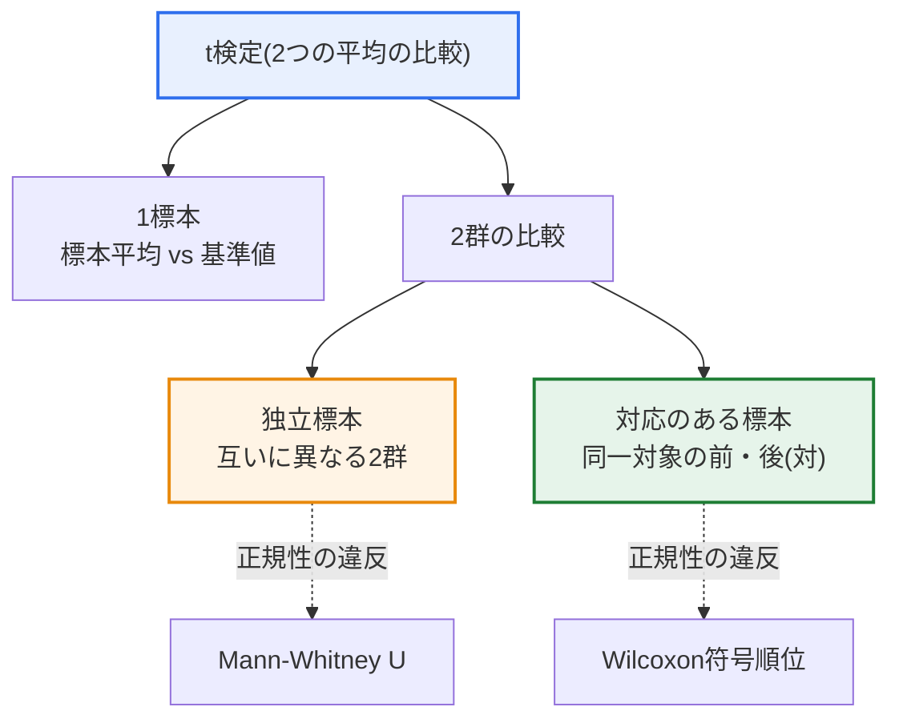
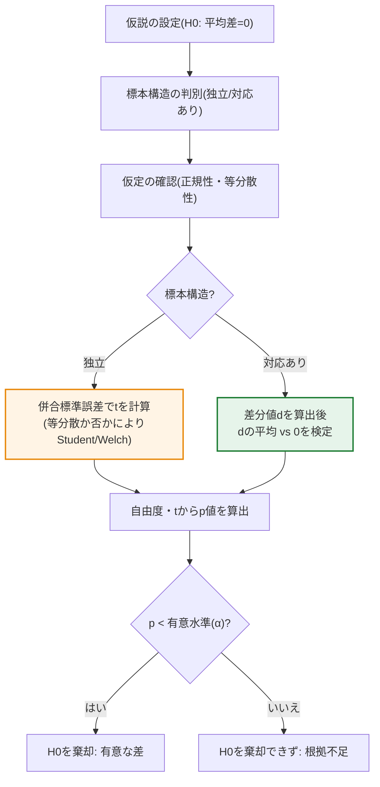

# 独立2標本t検定と対応のあるt検定の比較

## 1. 概要

### A. 定義

> **t検定（t-test）**は、2群の平均の差が標本抽出の偶然によるものか、統計的に有意な実際の差であるかを、t分布を用いて判断するパラメトリック検定である。このうち**独立2標本t検定（Independent samples t-test）**は互いに無関係な2群の平均を比較し、**対応のあるt検定（Paired samples t-test）**は同一対象における事前・事後のように対になった2つの値の差を比較する。

2つの検定を分ける決定的な基準は、「**2つの標本が互いに独立しているか、それとも対になっている（対応がある）か**」である。例えばA組の生徒とB組の生徒の成績を比較するのであれば、2群は別々の人々で構成され相互に無関係であるため**独立標本**である。一方、同じ生徒たちに特定の教育を実施し、教育前と教育後の成績を比較するのであれば、各データが「同じ人」という軸で対になるため**対応のある標本**である。表面的にはいずれも「2つの平均を比較する」ように見えるが、データの生成構造が根本的に異なる。

この構造の違いが重要である理由は、対応のある標本では、個人ごとに異なる基礎能力・体質のような**個人差（個体間変動）を差分値（d）によって相殺**できるためである。独立標本では「もともと得意な人と不得意な人が混在している」という個人差がそのまま雑音（誤差）として残り、処置の効果をぼやけさせる。しかし対応のある標本では同じ人の前後の差だけを見るため、その人がもともと何点であったかは消去され、「変化量」だけが残る。個人差という雑音を除去すると処置（例：教育）の純粋な効果がより鮮明に現れ、結果として**検出力（Power：実際に効果があるときにそれを有意と検出できる確率）が高まる**。後述するように、この違いが統計量の数式にどのように現れるかを具体的に見ていく。

### B. 必要性と登場背景

2群の平均を単純に比較して「平均が3点上がったので教育に効果があった」と結論づけるのは危険である。標本とは母集団から一部を抽出したものであるため、抽出のたびに平均は偶然に変動する。すなわち観測された3点の差は実際の効果によるものかもしれないが、単に「今回の標本がたまたまそうなった」だけかもしれない。t検定はこの2つを区別するために、観測された差をその差の標準誤差で割って**差が偶然の範囲をどの程度超えているかをt統計量として数値化**し、これを確率（p値）に換算して判断する。

このとき、標本が独立か対応ありかによって「差の標準誤差」の計算方法が異なるため、**標本構造に合った検定を選択して初めてp値の解釈が妥当になる**。誤った検定を用いると検出力を浪費したり（対応のあるデータに独立2標本検定を適用）、成立しない仮定を前提として誤った結論を下したりすることになる。t検定自体は、小標本でも正規分布の代わりにt分布を用いて平均を検定する目的で考案された古典的な方法であり、標本数が少なく母分散を知ることが難しい実務の状況（品質管理・臨床・社会調査）で広く用いられている。

## 2. 2つの検定の区分構造

t検定は、比較対象の数と標本構造によっていくつかの系統に分かれる。以下の構造図は、t検定全体の地形の中で独立2標本と対応のある標本がどこに位置するのか、そして仮定が崩れたときにどのようなノンパラメトリックな代替手法につながるのかを一目で示している。

この図から確認できるように、独立標本と対応のある標本はいずれも「2群の比較」の下に置かれるが、標本構造が分かれる地点で分岐する。また各検定は正規性の仮定が成立しないとき、対応するノンパラメトリック検定（順位ベース）に置き換えられるが、この代替経路が互いに対をなしている点（独立↔Mann-Whitney U、対応あり↔Wilcoxon符号順位）も併せて覚えておく必要がある。3群以上を比較するにはt検定の枠組みを離れて分散分析（ANOVA）へと拡張されるが、これは後の考慮事項で扱う。

## 3. 検定統計量の計算と意思決定の手順

2つの検定が実際にどう異なるかは、検定統計量tを計算する方法に最も明確に現れる。以下の手順図は、データが入力されてから結論（帰無仮説の棄却の可否）に至るまでの流れを、独立・対応ありの経路が分岐する地点を含めて示したものである。前の構造図が「どのような検定があるか」を示したとすれば、この手順図は「一つの分析をどのような順序で実施するか」を示している。

**A) 独立2標本t検定の統計量。** 独立標本では、2群の平均の差（x̄₁ − x̄₂）を2群の変動を合わせた標準誤差で割ってtを求める。ここで標準誤差は各群の標本分散と標本サイズから計算され、2群の分散が等しいと仮定できる場合は併合分散（pooled variance）を用いるStudentのt検定を、分散が異なる場合はWelchのt検定を用いる。すなわち独立標本では2群の「個人差」がいずれも分母（誤差）に反映されるため、個人差が大きいほどtが小さくなり、有意性を検出しにくくなる。実務では等分散の仮定がしばしば危ういため、デフォルトとしてWelch検定を推奨する見解が多い。

**B) 対応のあるt検定の統計量。** 対応のある標本はアプローチが根本的に異なる。まず各ペアの差分値 dᵢ = （事後 − 事前）を求めた後、これらの差分値の平均 d̄ が0であるかを検定する。その結果、検定は事実上「差分値という一つの標本」に対する1標本t検定に帰着する。この過程で各個人の絶対的な水準（もともとの能力）は引き算によって消去され、変化量だけが残るため、個人差という大きな雑音源が分母から除去される。まさにこのため、同じ大きさの効果であっても、対応のある標本の方が標準誤差が小さく、t値が大きく、検出力が高くなるのである。ただしこのとき必要な仮定は「2群の正規性・等分散性」ではなく、「差分値dの正規性」一つに変わる。

**C) 共通の意思決定手順。** 2つの検定はいずれも、①仮説の設定（帰無仮説H₀：平均差 = 0、対立仮説H₁：平均差 ≠ 0）→②標本構造・仮定の確認→③t統計量と自由度の計算→④tからp値を求めて有意水準（α、通常0.05）と比較する、という手順を共有する。p値がαより小さければ「この程度の差が偶然現れる確率は非常に低い」とみなして帰無仮説を棄却し、有意な差があると判断する。そうでなければ「差があるという根拠が不十分である」と結論づける。ここで、有意でないことが「差がないことを証明した」わけではない点に注意すべきである。

**D) 効果量と信頼区間の併用。** 実務の答案で強調すべき点は、p値だけで結論を下してはならないということである。標本が非常に大きければ些細な差でも有意となり、標本が小さければ実際に効果があっても有意とならないことがある。したがって差の「大きさ」を示す効果量（例：Cohen's d）と平均差の信頼区間（95% CI）を併せて提示し、「統計的有意性」と「実質的重要性」を区別して解釈することが望ましい。

## 4. 比較と適用事例

2つの検定の違いを整理すると以下の表のとおりである。ただし表は要約にすぎず、前述のとおりその違いは「個人差を誤差として残すか、差分値で消去するか」というデータ構造に由来する点が核心である。

| 区分 | 独立2標本t検定 | 対応のあるt検定 |
|---|---|---|
| **標本構造** | 互いに独立した2群 | 対になった（同一対象の）2つの値 |
| **検定対象** | 2群の平均の差 | 差分値（d）の平均が0か |
| **個人差の扱い** | 誤差にそのまま含まれる | 差分値によって相殺（消去） |
| **主な仮定** | 正規性＋等分散性（またはWelch） | 差分値dの正規性 |
| **検出力** | 相対的に低い | 個人差の相殺により相対的に高い |
| **ノンパラメトリックな代替** | Mann-Whitney U | Wilcoxon符号順位 |
| **代表例** | 男性／女性の給与、A/Bグループの成果 | ダイエット前／後の体重、教育前／後 |

**事例1 — 新薬の臨床試験。** 互いに異なる患者群にそれぞれ新薬とプラセボを投与して血圧の低下度を比較すれば独立標本である。一方、同じ患者に対して投薬前と投薬後の血圧を測定して比較すれば対応のある標本である。後者は患者ごとに異なるベースライン血圧・体質の違いを除去するため、例えば30人という少ない標本でも薬効をより鋭敏に検出できる。ただし対応のある設計では「時間が経つと自然に下がる効果」が薬効と混ざりうるため、別途対照群を置く設計上の補完が必要である。

**事例2 — A/Bテスト。** Webサイトで互いに異なる訪問者集団に既存画面（A）と新画面（B）を見せ、購買コンバージョン率を比較するのは独立標本の構造である。訪問者を対にすることができないためである。このように対象を繰り返し測定できない状況では独立2標本検定が自然な選択であり、この場合は標本サイズを十分に確保して個人差の雑音を相殺することが検出力確保の鍵となる。

**事例3 — 教育効果の測定。** 同じ受講生40人に事前テストを受けさせ、教育後に再び事後テストを受けさせて点数の変化を検定すれば対応のある標本である。もともと点数の高かった学生と低かった学生の差は消去され、「各自の向上幅」だけが評価されるため、教育の純粋な効果が鮮明に現れる。ただし、事前テストを受けた経験そのものが事後の点数を押し上げる「学習効果（練習効果）」が介在しうるため、これを統制しなければ教育効果を過大評価するおそれがある。

この3つ目の事例を数値で見ると、2つの検定の違いがより明確になる。40人の平均が事前70点から事後75点へと5点上がったとしよう。もし学生ごとの向上幅がおおむね5点前後（例：+3〜+7）とそろっていれば、差分値dの標準偏差が小さいため対応のある検定のt値は大きくなり、容易に有意となる。しかし同じデータを、事前・事後が互いに異なる2群であるかのように独立標本として扱うと、学生一人ひとりの能力のばらつき（例：40〜95点）がそのまま分母の誤差に入り込んで標準誤差が大きくなり、t値が小さくなって、実際には存在する5点の効果を有意でないと判定しうる。同一のデータ・同一の平均差であるにもかかわらず、標本構造をどう捉えるかによって結論が覆りうるという点は、標本構造に合った検定の選択がなぜ重要なのかを端的に示している。

## 5. 深掘り — 仮定違反への対応と拡張

実務でt検定を正しく使うには、仮定の点検と代替手法の選択、そして多群・多要因への拡張を併せて理解する必要がある。

**A) 仮定違反とノンパラメトリックな代替。** t検定は正規性（および独立標本の場合は等分散性）を前提とするパラメトリック検定である。標本が小さくデータが正規性から大きく外れている場合（例：強い歪み・外れ値）、正規性の仮定が崩れてp値が歪む。このときは順位に基づくノンパラメトリック検定に置き換える。独立標本はMann-Whitney U検定に、対応のある標本はWilcoxon符号順位検定に切り替える。正規性は標本数が大きい場合には中心極限定理によってある程度緩和されるが、小標本ではShapiro-Wilk検定やQ-Qプロットで事前に点検するのが安全である。等分散性はLevene検定などで確認するが、違反時にはStudentではなくWelch検定を使えば済むため、実務ではWelchをデフォルトとする流れがある。

**B) 多重比較の問題とANOVAへの拡張。** 3群以上を比較する際に群のペアごとにt検定を何度も繰り返すと、比較回数が増えるほど少なくとも一度は偶然に有意となる確率（第1種の誤り）が累積して膨らむ。例えば有意水準0.05で複数のペアを検定すると、全体の第1種の誤り率は0.05を大きく超える。そのため3群以上は分散分析（ANOVA）で一度に検定し、有意な場合に限り事後検定（Tukey HSDなど）や多重比較の補正（Bonferroniなど）を適用する。対応のある構造が繰り返される場合は、反復測定ANOVAへと拡張される。すなわちt検定は2群比較という特殊なケースであり、その上位の一般形がANOVA・回帰分析という連続線上にあることを理解することが重要である。

**C) データ分析・機械学習の文脈における位置づけ。** 今日、A/Bテスト、モデル性能の比較（2つのモデルの交差検証性能の差の検定には対応のあるt検定がよく用いられる）、実験計画などにおいて、t検定は依然として基本的なツールである。ただし大量・多変量のデータ環境では、単一のt検定よりも回帰・混合効果モデル・ブートストラップのような手法が併用され、t検定はその出発点であり、結果解釈の直観を提供する役割を担う。

**D) よくある誤りと実務上の留意点。** 第一に、片側・両側検定を混同する誤りである。方向についての事前の根拠なしに片側検定を用いると有意性を人為的に膨らませることになるため、特段の理由がなければ両側検定をデフォルトとする。第二に、対応のある構造を見落とす誤りである。同じ対象から得られた前後のデータを2つの独立した列とみなして独立2標本検定を適用すると、個人差の相殺という対応のある設計の利点を失い、検出力が低下する。第三に、外れ値（Outlier）の放置である。t検定は平均と分散に基づくため、少数の極端値が結果を大きく揺るがしうる。そのため事前に分布を可視化し、外れ値の原因を確認しなければならない。こうした点検は、検定結果の再現性と信頼性の確保に直接寄与する。

## 6. 予想される出題方向と答案構成戦略

技術士試験においてt検定の主題は、短答形式では「2つの検定の違いと選択基準」、論述形式では「実験／データ分析のシナリオを提示し、適切な検定を選択・正当化せよ」という形で出題されうる。答案を構成する際は、①2つの検定の定義と標本構造の違いをまず提示し、②その違いが検定統計量（個人差を誤差に含める vs 差分値で消去する）にどのように現れるかを原理として説明した後、③仮定・ノンパラメトリックな代替・効果量まで言及して深さを確保し、④3群以上はANOVAへ拡張されるという連携で締めくくる流れが効果的である。表を並べるだけでなく、「なぜ対応のある標本の検出力が高いのか」を文章で説明することが差別化につながる。

また近年、データに基づく意思決定・品質管理・AIモデルの検証が重視されるにつれ、統計的検定を「分析ツール」ではなく「意思決定の根拠の妥当性を確保する手段」として捉える視点が求められている。したがって答案では検定手順の機械的な羅列にとどまらず、標本設計の適切性・仮定の点検・結果の実務的解釈（効果量・不確実性）まで結び付け、「統計的厳密性がなぜ信頼できる結論につながるのか」を記述すれば、技術士水準の完成度を備えた答案となる。

## 7. 考慮事項および示唆点

1. **実験計画の段階で標本構造をまず確定すべきである。** 検定はデータが作られた構造に従うものであるため、データをすべて集めた後に検定を選ぶのではなく、設計時点で独立／対応ありを決めなければならない。構造を誤って判断し、対応のあるデータに独立2標本検定を適用すると個人差相殺の利点を自ら捨てることになり、逆の誤適用は成立しない対応関係を仮定する誤りとなる。

2. **可能であれば対応のある（反復測定）設計が検出力の面で有利である。** 同じ対象を繰り返し測定すれば個人差を統制でき、より少ない標本でも高い検出力が得られるため、コスト・倫理の面で利点が大きい。ただし学習効果・順序効果・時間経過に伴う自然変化のようなバイアスが介在しうるため、順序のランダム化・対照群の設定などでこれを統制して初めて結果が妥当となる。

3. **仮定の点検とノンパラメトリックな代替を常に念頭に置く。** 正規性・等分散性の仮定を形式的に済ませるだけでは、p値は信頼を失う。小標本・非正規データではMann-Whitney U・Wilcoxon符号順位などのノンパラメトリック検定に置き換え、等分散が疑われる場合はWelch検定を用いるなど、データ特性に合わせた手法の選択が結論の妥当性を左右する。

4. **p値単独の解釈を避け、効果量・信頼区間と併せて見る。** 標本サイズによって有意性が過大・過小評価されうるため、統計的有意性（p値）と実質的重要性（効果量・信頼区間）を区別して報告すべきである。技術士・実務の観点からは、「有意である／ない」の二分法を超えて、差の大きさと不確実性を併せて提示し、意思決定につなげる姿勢が求められる。

5. **多群・多要因への拡張経路を理解する。** 3群以上の比較においてt検定を繰り返すと第1種の誤りの累積を招くため、ANOVAへ拡張し、反復測定・多要因の構造では反復測定ANOVA・回帰・混合モデルへと一般化する。t検定を孤立した手法としてではなく、統計的仮説検定体系の基本単位として位置づける視点が必要である。

---

> **一言まとめ**: 独立2標本t検定は*互いに異なる2群の平均差*を、対応のあるt検定は*同一対象の対になった差分値（d）の平均が0か*を検定し、対応のある標本は個人差を差分値で相殺するため検出力が高い。したがって実験計画の段階で標本構造を確定し、仮定・効果量まで併せて考慮して検定を選択すべきである。
