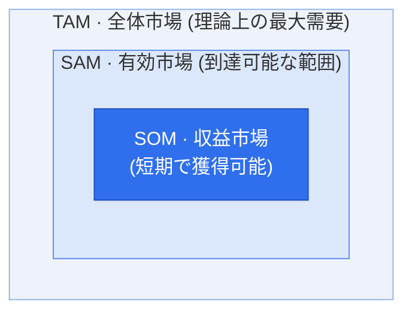

# TAM-SAM-SOM — 市場規模推定フレームワーク

## 1. 概要

### A. 定義
> 新規事業・製品の**市場規模を3つの同心円の階層**（TAM → SAM → SOM）で段階的に絞り込んで推定するフレームワークであり、理論上の全体需要から自社が実際に獲得可能な市場までを定量化し、事業の妥当性と目標を併せて提示する。

TAM-SAM-SOMの核心的な発想は、「市場が大きい」という魅力と「自社が実際にどれだけ獲得できるか」という現実性を**一つの論理的な流れで結び付ける**ことにある。全体市場だけを大きく提示すれば実現可能性がないように見え、目標だけを小さく提示すれば成長性がないように見える。3つの階層で絞り込んでいく構造はこの両者の間に論理的な橋を架け、どのような仮定と制約によって全体市場が獲得可能な目標へと縮小するのかを段階的に説明する。

### B. 登場背景および必要性
投資検討（IR）や事業計画において、起業家は2つのことを同時に立証しなければならない。一つはこの市場が**投資に値するほど大きいか**であり、もう一つはそのうち自社が**現実的にどれだけを獲得できるか**である。「全体市場は兆単位」という言葉だけでは実行可能性を証明できないため、段階的な縮小を通じて根拠のある目標へと絞り込む方式が必要となる。このフレームワークは資源配分・参入戦略・売上目標設定の定量的根拠を提供し、特に投資家が起業家の市場理解度と仮定の合理性を検証するツールとして広く用いられている。

## 2. 階層構造（同心円の図式）



> 包含関係：**TAM ⊇ SAM ⊇ SOM**

3つの階層が同心円（包含関係）で描かれるのは偶然ではない。各段階は外側の市場に**現実的な制約を一つずつ適用**して内側へと絞り込まれるためである。TAMにビジネスモデル・地域・チャネルの制約をかければSAMとなり、そこに競争・自社能力・期間の制約をかければSOMとなる。すなわち内側に行くほど「可能性」から「現実」へと移動し、この絞り込みの過程そのものが事業の戦略的選択を明らかにする。

### 市場規模の比率（例）

```chart
{
  "type": "doughnut",
  "data": {
    "labels": ["SOM · 収益市場", "SAM · 有効市場(SOMを除く)", "TAM · 全体(SAMを除く)"],
    "datasets": [{
      "data": [5, 25, 70],
      "backgroundColor": ["#2f6fed", "#7aa5f3", "#d7e3fb"],
      "borderColor": "#ffffff",
      "borderWidth": 2
    }]
  },
  "options": {
    "plugins": {
      "legend": { "position": "bottom" },
      "title": { "display": true, "text": "TAMに対するSAM · SOMの比率 (単位: %)" }
    }
  }
}
```

## 3. 階層別の定義

各階層は投げかける問いが異なる。**TAM**は「この課題を抱えるすべての人が自社の製品群を買うとしたら？」という理論上の最大値を、**SAM**は「自社のビジネスモデル・地域・セグメントで実際にサービスできる範囲は？」という到達可能性を、**SOM**は「競争と自社の能力を考慮すると、1〜3年以内に実際に獲得できる取り分は？」という獲得可能性を問う。例えば中小企業向けSaaSを作るのであれば、国内のクラウド市場全体がTAM、そのうち中小企業向けSaaSがSAM、3年以内の目標シェア5%に相当する売上がSOMとなる。

| 階層 | 名称 | 定義 | 例（観点） |
|---|---|---|---|
| **TAM** | Total Addressable Market<br>（全体市場） | 製品・サービスが**理論的に到達可能な全体需要**。競争・制約を無視した最大市場 | 「国内のクラウド市場全体の規模」 |
| **SAM** | Serviceable Addressable Market<br>（有効市場） | TAMのうち、自社の**ビジネスモデル・地域・セグメント・チャネルで実際にサービス可能な**部分 | 「国内の中小企業向けSaaS市場」 |
| **SOM** | Serviceable Obtainable Market<br>（収益／獲得市場） | SAMのうち、**短期間（1〜3年）で実際に獲得可能な**シェア規模。競争・能力・マーケティングを反映 | 「3年以内の目標シェア5%の売上」 |

## 4. 市場規模の算定方法

算定方法の選択は、**保有するデータと市場の成熟度**に左右される。**Top-down**は調査機関の産業統計にセグメント比率を乗じて下りていく方式であるため迅速であるが、他者の仮定をそのまま引き継ぐため**過大推定**になりやすい。**Bottom-up**は顧客数 × 単価（ARPU）× 購買頻度のように最下層の単位を積み上げていく方式であるため、データの確保は煩雑であるが説得力ははるかに高い。**Value theory**は、まだ市場が存在しない革新的製品について顧客が感じる価値・支払意思額（WTP）で推定するが、主観性が大きい。そのため実務では、Top-downでTAMの上限を押さえ、Bottom-upでSAM・SOMを積み上げて2つの結果を**クロス検証**するのが最も信頼性が高い。2つの方式の結果が大きく食い違えば、仮定のどこかに誤りがあるというシグナルだからである。

| 方法 | 説明 | 特徴 |
|---|---|---|
| **Top-down** | 産業統計・調査（全体市場）からセグメント比率で下方に縮小 | 迅速だが**過大推定**のリスク、根拠資料に依存 |
| **Bottom-up** | 顧客数 × 単価（ARPU）× 購買頻度など**単位データを積み上げて**算定 | 現実的・説得力が高い、データ確保の負担 |
| **Value theory** | 顧客が感じる**価値・支払意思額（WTP）**に基づく推定 | 新市場・革新的製品に適合、主観性が存在 |

> 実務では、**Top-downでTAM**を押さえ、**Bottom-upでSAM・SOM**をクロス検証する方式の信頼性が高い。

## 5. 考慮事項および示唆点（技術士の観点）

このフレームワークを実務で用いる際に最もよくある失敗は、**階層間で基準が混在すること**と**SOMを楽観的に水増しすること**である。売上高とユーザー数を階層ごとに使い分けると同心円の論理が崩れるため、測定単位と期間を統一しなければならない。またSOMは競争の強度・自社の能力・GTM（Go-to-Market）戦略を冷静に反映してこそ信頼を得られる。さらに市場は静的ではないため、成長率（CAGR）を併せて提示して動的な観点を補い、すべての仮定と出典を文書化して検証可能性を確保すべきである。

1. **一貫した基準** — 金額（売上）・数量などの測定単位と期間を階層間で統一
2. **SOMの現実性** — 競争の強度・自社の能力・GTM戦略を反映し、過大算定を警戒
3. **根拠・仮定の明示** — 出典とassumptionを文書化し、検証可能性を確保
4. **動的な観点** — 静的な数値ではなく、市場成長率（CAGR）を併せて提示
5. **段階別の活用** — 初期のIRではTAMの魅力度、実行段階ではSOMの達成可能性に焦点
6. **手法の連携** — Bottom-upの需要予測・ビジネスモデルキャンバスの顧客セグメントと連携して整合性を強化

---

> **一言まとめ**: 市場規模を*全体（TAM）→ 有効（SAM）→ 獲得可能（SOM）*へと制約を一つずつかけながら絞り込んで推定するフレームワークであり、Top-downとBottom-upをクロス検証して**魅力的な市場＋現実的な目標**を同時に定量提示するツールである。
