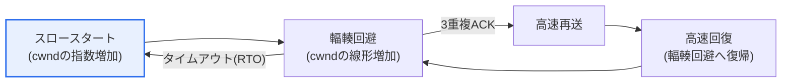
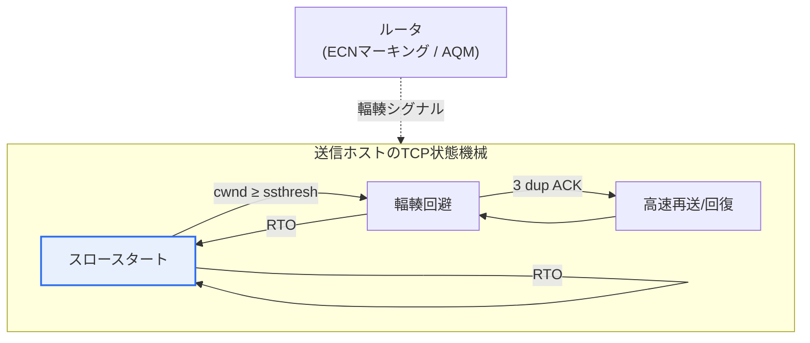

# TCP輻輳制御(Congestion Control)

## 1. 概要

### A. 定義
> ネットワーク内部で**輻輳(パケットの過負荷)が発生したときに、送信速度(輻輳ウィンドウ)を自ら調整して輻輳を緩和・回避する**、TCPのエンドツーエンド制御メカニズム。受信側バッファの処理速度に合わせるフロー制御(Flow Control)が「受信者の保護」であるのに対し、輻輳制御はルータ・リンクなど「ネットワーク共有資源の保護」を目的とする。

輻輳制御が必要な根本的な理由は、「**輻輳崩壊(Congestion Collapse)の防止**」である。複数の送信者がネットワークの状態を無視してデータを無秩序に送り出すと、中間ルータの出力キューがあふれてパケットが廃棄される(tail drop)。すると送信者は失われたパケットを再送し、この再送がさらにキューを膨らませてより多くの損失を招くという悪循環が起きる。最終的に、リンクは再送トラフィックで満杯なのに、肝心の実効スループット(goodput)は0に収束するという崩壊が起こる。実際に1986年のインターネット初期には、スループットが瞬間的に数百分の一に落ちる輻輳崩壊が観測され、これを契機にVan Jacobsonがスロースタート・輻輳回避アルゴリズムを導入したことが、今日のTCP輻輳制御の出発点である。

TCPはこの問題を解くために、一つの巧妙な仮定を置く。無線エラーがまれな有線網では、**パケット損失をそのまま輻輳のシグナルと解釈**し、損失を検知すると自発的に送信量を減らす。すなわち、ネットワークのコア(ルータ)は単純に保ち、知能(制御ロジック)は端点(ホストのTCP)に置くという「エンドツーエンド原則(end-to-end principle)」に従う。個々の端点が協調的に速度を調整することで、中央集権的な統制なしにインターネットという巨大な共有資源を安定的に維持しているのである。

### B. 必要性とフロー制御との区別
インターネットは無数の端点が同時に分け合う資源であるため、各自が自分の速度だけに固執すれば全体が崩壊する。輻輳制御は、端点が自律的に協力して帯域を公平に分け合い(fairness)、ネットワークを崩壊から守る中核的な仕組みである。このとき、フロー制御との区別が重要となる。フロー制御は「速い送信者が遅い受信者を圧倒しないよう」受信ウィンドウ(rwnd)で調整する1対1の問題であり、輻輳制御は「多数の送信者が共有ネットワークを圧倒しないよう」輻輳ウィンドウ(cwnd)で調整する多対多の問題である。実際の送信量は二つのウィンドウのうち**小さい方の値**で決まり、受信者とネットワークを同時に保護する。

二つの概念はしばしば混同されるが、保護の対象とシグナルの発信源が根本的に異なる。フロー制御のシグナルは、受信者が自分のバッファの空きを載せて送るrwndという「明示的な」値であるのに対し、輻輳制御のシグナルはネットワークが教えてくれないため、損失・遅延といった「暗黙的な」手がかりから推論しなければならない。この違いにより、フロー制御は比較的決定論的だが、輻輳制御は推論の精度によって性能が大きく分かれる確率的な性格を帯びる。

| 区分 | フロー制御(Flow Control) | 輻輳制御(Congestion Control) |
|---|---|---|
| **保護対象** | 受信者バッファ(1対1) | ネットワーク共有資源(多対多) |
| **制御変数** | 受信ウィンドウ(rwnd) | 輻輳ウィンドウ(cwnd) |
| **シグナル** | 受信者による明示的な通知 | 損失・遅延・ECNからの暗黙的な推論 |
| **実際の送信量** | `min(cwnd, rwnd)`で二つの制約を同時に満たす | |

## 2. 輻輳制御メカニズムの構成要素

伝統的なTCP(Reno系)の輻輳制御は、四つの要素が状態機械のようにかみ合って動作する。各要素は、「どれだけ積極的に帯域を探索するか」と「損失時にどれだけ後退するか」という相反する要求を、段階ごとに調整する。

**スロースタート(Slow Start)**は、接続初期に利用可能な帯域がまったく分からない状態から出発する。cwndを1 MSSから始め、RTTごとに倍々(1→2→4→8…)に指数関数的に増やして、素早く帯域を探索する。名前は「遅い開始」だが、実際には増加速度が指数関数的であるため非常に積極的であり、「遅い」とは「1から慎重に出発する」という意味である。指数増加は閾値(ssthresh)に達すると止まり、輻輳回避へと移行する。

**輻輳回避(Congestion Avoidance)**は、すでに帯域の限界に近づいたとみなし、cwndをRTTごとに1 MSSずつ線形に増やす。この段階の考え方は「AIMD(Additive Increase, Multiplicative Decrease)」であり、平常時は少しずつ加算しながら帯域を探索し、損失が起きると半分に一気に減らす。この「ゆっくり増やし、急いで減らす」という非対称性が、複数のフロー間の公平性と安定性を生み出す理論的な根拠である。

**高速再送(Fast Retransmit)**は、同じシーケンス番号の重複ACKが3回到着すると、再送タイマ(RTO)の満了を待たずに直ちに該当パケットを再送する。重複ACK3回は「後続のパケットは到着したが一つだけ抜けている」というシグナルであるため、高コストなタイムアウトを待つ必要なく素早く回復できる。

**高速回復(Fast Recovery)**は、高速再送の直後にスロースタートへリセット(cwnd=1)するのではなく、ssthreshを現在の半分に下げたうえで、その地点から輻輳回避へ復帰する。軽微な損失にもかかわらず最初からやり直すという過度な速度低下を防ぎ、部分的な損失の状況でスループットを維持する。

| 構成要素 | 動作 | cwndの変化 |
|---|---|---|
| **スロースタート** | 初期の帯域探索 | 指数増加(RTTごとに×2)、ssthreshまで |
| **輻輳回避** | 慎重な帯域増加(AIMD) | 線形増加(RTTごとに+1 MSS) |
| **高速再送** | 3重複ACK時に即時再送 | (再送のトリガ) |
| **高速回復** | 再送後に輻輳回避へ復帰 | ssthresh=cwnd/2としてその地点へ復帰 |

## 3. 輻輳状況の検知シグナル

TCPが輻輳を「見る」窓は、明示的な測定ではなく間接的なシグナルである。ルータの内部を直接のぞくことはできないため、TCPはACKの到着の様子からネットワークの状態を推論する。この推論の精度が、そのまま輻輳制御の品質を左右する。

**タイムアウト(RTO)**は、一定時間内にACKがまったく来ない状況であり、連続した多数のパケットが消失したことを意味する。これは深刻な輻輳(または経路の断絶)のシグナルと解釈され、TCPはssthreshを半分に下げ、cwndを1に初期化したうえでスロースタートからやり直す。最も強く後退する対応である。

**重複ACK3回**は、一部のパケットだけが失われた軽微な状況である。後続のパケットは到着しているため、ネットワークが完全に詰まっているわけではないとみなし、高速再送・高速回復によってcwndを半分だけ減らして穏やかに対応する。同じ「損失」でも、シグナルの種類によって後退の強さを変えるところに、TCPの精緻さがある。

**ECN(Explicit Congestion Notification、明示的輻輳通知)**は、損失が起きる前に、ルータがIPヘッダのビットを立てて「まもなく輻輳する」と前もって知らせる方式である。パケットを廃棄して輻輳を知らせる代わりに通知で知らせるため、再送と遅延を減らすことができ、最新のデータセンター・モバイル網で活用が広がっている。

| シグナル | 意味 | 対応(cwnd) |
|---|---|---|
| **タイムアウト(RTO)** | 多数パケットの損失、深刻な輻輳 | cwnd=1、スロースタートを再開 |
| **重複ACK3回** | 単一パケットの損失、軽微 | 高速再送・回復(cwndを半減) |
| **ECNマーキング** | 損失前のルータによる事前通知 | 損失なしに先制的に減速 |

## 4. 輻輳ウィンドウ(cwnd)とノコギリ波の動作、そしてアルゴリズムの進化

中核となる状態変数である**輻輳ウィンドウ(cwnd)**は、まだACKで確認されていないままネットワークに送り出せるデータ量、すなわち瞬間的な送信速度を表す。前述のとおり、実際の送信可能量は`min(cwnd, rwnd)`で決まる。輻輳が検知されると、ssthreshを現在のcwndの半分に下げてcwndを減らし、再び徐々に増やしていく。この「線形増加 → 損失時に半減 → 再び増加」が繰り返されて描かれる**ノコギリ波(sawtooth)の波形**が、伝統的なTCP輻輳制御の象徴的な特徴である。ノコギリ波の平均の高さがそのまま平均スループットとなるため、損失が頻繁になるほど(ノコギリ波が頻繁に削られるほど)スループットは低下する。

この損失ベースのノコギリ波モデルは、帯域が大きく遅延の長い「ロングファットパイプ(long fat pipe)」で限界を露呈する。例えば大陸間の高速リンクでは、一度損失が起きてcwndが半減すると、線形増加で元のウィンドウを回復するのに数百RTT(数秒以上)かかり、リンクを使い切れない。この問題を解決するために、アルゴリズムは進化してきた。

**Tahoe**は最初の形態であり、損失時には無条件にスロースタートへ戻る。**Reno**は高速回復を導入し、部分的な損失における急落を緩和した。今日のLinuxの既定である**CUBIC**は、時間の3次関数(cubic)でウィンドウを増やし、半減後は以前の地点付近までは素早く回復しつつ、その近辺では慎重に探索することで、高帯域・高遅延環境の利用率を大きく高めた。Googleが開発した**BBR(Bottleneck Bandwidth and RTT)**は、アプローチそのものを変え、損失を待たずにボトルネック帯域と最小RTTを直接推定して最適な送信レートを計算する。損失を輻輳シグナルと誤解しやすい無線・バッファブロート環境で特に効果的であり、YouTubeなどの大規模サービスに適用された。

| アルゴリズム | 中核となる考え方 | 特徴・適用 |
|---|---|---|
| **Tahoe** | 損失時にスロースタートへ復帰 | 最初の形態、回復が遅い |
| **Reno** | 高速再送・高速回復を導入 | 部分的な損失への対応を改善 |
| **CUBIC** | 3次関数に基づくウィンドウ増加 | 高帯域・高遅延に最適(Linux既定) |
| **BBR** | 帯域・RTTの直接推定(モデルベース) | 無線・バッファブロートに強い(Google) |

## 5. 深掘り: データセンター・モバイル時代の輻輳制御

伝統的な損失ベースの制御は、「バッファが満杯になってパケットが廃棄されるまで待つ」という点で、遅延(latency)に不利である。ルータが過度に大きなバッファを持つと、損失は起きないがキューイング遅延が大きくなる**バッファブロート(bufferbloat)**現象が生じ、ビデオ会議・ゲームのようなリアルタイムサービスの応答性が悪化する。このため最近の流れは、「損失が起きる前に、遅延のシグナルで先回りして対応する」方向へと移りつつある。

第一の軸は、**能動的キュー管理(AQM)とECNの組み合わせ**である。ルータがCoDel・PIEのようなアルゴリズムでキューが大きくなる兆候を捉えると、パケットを廃棄する代わりにECNビットを立てて、送信者に前もって減速を要求する。これをデータセンター専用に精緻化したものが**DCTCP**であり、ECNマーキングの割合に比例してウィンドウをきめ細かく減らすことで、超低遅延と高い利用率を同時に達成する。

第二の軸は、**モデルベース制御の拡大**である。BBRに代表されるアプローチは、損失をシグナルとする代わりにリンクの物理的特性(帯域・RTT)を直接推定するため、無線リンクにおける非輻輳性の損失を輻輳と誤解して不必要に減速する問題を減らす。第三に、トランスポート層そのものが進化する流れもある。**QUIC**(HTTP/3の基盤)は、UDPの上で輻輳制御をユーザー空間に実装し、カーネルを入れ替えずにCUBIC・BBRなどのアルゴリズムを迅速に実験・展開できるようにしたうえ、接続・暗号化・輻輳制御を統合して初期遅延を減らした。これは、輻輳制御がもはやカーネルのTCPだけに閉じ込められず、アプリケーション層で柔軟に進化する時代に入ったことを示している。

## 6. 考慮事項および示唆

1. **損失ベースからモデル・遅延ベースへのパラダイム転換。** Reno・CUBICは損失を輻輳シグナルとするが、これは無線・高帯域環境で誤判断を生む。BBR・DCTCPのように帯域・遅延・ECNを直接活用する方式は、超低遅延と高利用率を同時に達成するため、環境ごとに適切なシグナルモデルを選ぶ見識が重要である。

2. **ネットワーク特性に合わせたアルゴリズムのチューニング。** データセンターの低遅延・高帯域、衛星・モバイルの高遅延・高損失、一般的なインターネットでは、最適なアルゴリズムがそれぞれ異なる。Linuxでは`net.ipv4.tcp_congestion_control`でCUBIC・BBRなどを選択できるため、サービスのトラフィック特性(長時間の大容量転送 vs 短いリクエスト/レスポンス)に合わせて、実測に基づいて調整しなければならない。

3. **バッファブロートへの対応と遅延-スループットのトレードオフ。** スループットだけを追って大きなバッファを置けば、遅延が悪化する。AQM(CoDel/PIE)とECNを併用して損失前に減速を促すことで、リアルタイム性と帯域利用率のバランスを設計しなければならない。特にビデオ会議・クラウドゲーミングのサービスでは、遅延がそのまま品質である。

4. **公平性(fairness)とアルゴリズム混在の問題。** 異なる輻輳制御アルゴリズムが同じボトルネックを共有すると、帯域が不公平に分配されうる(例: 積極的なアルゴリズムが消極的なアルゴリズムの帯域を侵食する)。大規模インフラを運用する際は、アルゴリズムの混在がもたらす不公平・不安定の可能性まで考慮して、標準化・検証しなければならない。

5. **トランスポート層の柔軟化と今後の展望。** QUIC/HTTP/3のように輻輳制御をユーザー空間へ移せば、カーネルのリリース周期に縛られずに迅速に改善・実験できる。今後は学習ベース(強化学習)の輻輳制御や、アプリケーションの要求(遅延重視/スループット重視)に適応する制御が広がる見通しであり、技術士の観点からは「固定されたTCP」ではなく「進化するトランスポート層」として捉える視野が必要である。

## 参考資料
- RFC 5681 — TCP Congestion Control (https://www.rfc-editor.org/rfc/rfc5681)
- RFC 8312 — CUBIC for Fast and Long-Distance Networks (https://www.rfc-editor.org/rfc/rfc8312)
- Cardwell et al., "BBR: Congestion-Based Congestion Control", ACM Queue (https://queue.acm.org/detail.cfm?id=3022184)
- RFC 3168 — The Addition of Explicit Congestion Notification (ECN) to IP (https://www.rfc-editor.org/rfc/rfc3168)

---

> **一言まとめ**: TCP輻輳制御は、*スロースタート・輻輳回避・高速再送・高速回復*によって輻輳ウィンドウ(cwnd)をAIMDのノコギリ波の形で調整し、タイムアウト・重複ACK・ECNで輻輳を検知して輻輳崩壊を防ぐ仕組みであり、損失ベース(Reno・CUBIC)からモデル・遅延ベース(BBR・DCTCP)とQUICへと進化している。
