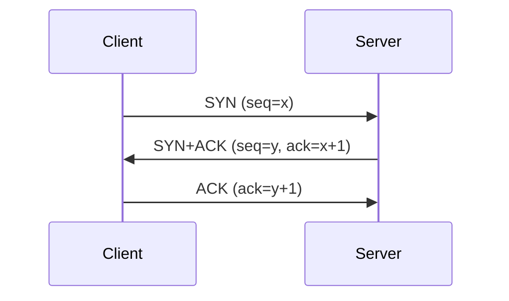
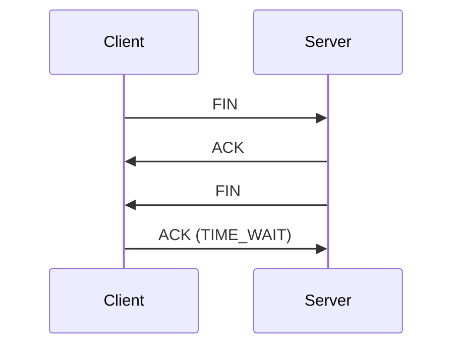

# TCP 3-way Handshakeと4-way Handshake

## 1. 概要

### A. 定義
> **TCP**はコネクション指向・高信頼の伝送プロトコルであり、コネクションの**確立には3-way**、コネクションの**切断には4-way**ハンドシェイクを用いて、双方向通信を信頼性高く管理する。

TCPがハンドシェイクを設ける根本的な理由は、IPが順序・到達を保証しない非信頼のネットワーク上で**信頼性のある双方向ストリーム**を作らなければならないためである。データを送る前に双方が「準備ができた、何番から数える」を互いに確認して初めて、その後の順序の再構成・重複の除去・再送が可能になる。すなわちハンドシェイクは通信の挨拶ではなく、**信頼性の初期契約**である。

### B. 目的
コネクション確立過程の目標は2つある。第一に、双方向それぞれの送受信準備状態を確認する。クライアント→サーバ方向だけでなく、サーバ→クライアント方向も開いている必要があるため、双方のSYNがいずれも必要となる。第二に、各方向の**初期シーケンス番号（ISN）を交換・同期**する。シーケンス番号はその後のすべてのバイトの順序と再送の基準となり、予測不可能な値から開始することで、古いコネクションのパケットの混入や偽造を防ぐ。

## 2. コネクション確立 — 3-way Handshake

確立がなぜ**ちょうど3段階**なのかが核心である。各方向を開くには「SYN（自分の開始番号の通知）」とそれに対する「ACK（確認）」が必要であるため、本来は4つのメッセージが必要となる。しかしサーバがクライアントのSYNを確認するACKと、サーバ自身のSYNを**一つのパケット（SYN+ACK）にまとめられる**ため、3段階に短縮される。①クライアントがSYNで自身の初期シーケンスxを通知し、②サーバがxを確認（ack=x+1）すると同時に自身のシーケンスyを送り、③クライアントがyを確認（ack=y+1）すると、双方向のシーケンスがすべて合意されてコネクションが確立（ESTABLISHED）する。2段階ではサーバ方向の確認がないため不十分であり、4段階は不要なのである。

| 段階 | 内容 | 状態 |
|---|---|---|
| 1. SYN | クライアントの接続要求（初期シーケンスx） | SYN_SENT |
| 2. SYN+ACK | サーバの受諾＋自身のシーケンス（y）、xの確認 | SYN_RECEIVED |
| 3. ACK | クライアントがyを確認 → コネクション確立 | ESTABLISHED |

## 3. コネクション切断 — 4-way Handshake

切断が確立より1段階多い4-wayである理由は、TCPコネクションが**方向ごとに独立した2本のストリーム**であるためである。一方が「送るものは終わった（FIN）」と伝えても、相手にはまだ送るべきデータが残っている場合がある。そのため相手はまずFINを確認（ACK）するだけにとどめ、**自身の残りのデータを送り終えた後**、すべて終わった時点で自身のFINを別途送る（この半分だけ閉じた状態をCLOSE_WAIT/half-closeという）。確立時にはSYN+ACKとしてまとめられていた確認と終了のシグナルが、切断時には「残りのデータ送信」という時間差のためにACKとFINに**分離**されるため、段階が一つ増える。最後のACKを送った能動クローズ側はすぐには閉じず、TIME_WAIT状態でしばらく待機する。

| 段階 | 内容 |
|---|---|
| 1. FIN | 能動クローズ側が終了を要求 |
| 2. ACK | 受信側が確認（残りのデータ送信が可能、half-close） |
| 3. FIN | 受信側も送信完了後に終了を要求 |
| 4. ACK | 能動クローズ側が確認 → TIME_WAIT → 終了 |

## 4. 関連概念およびセキュリティ

ハンドシェイクは便利である反面、脆弱性も生む。終了後の**TIME_WAIT**は無駄に見えるが、ネットワーク上で遅延した古いパケットが、新たに開かれた同一ポートのコネクションに誤って混入するのを防ぎ、最後のACKが失われた場合に相手の再送を受け取るためのものであり、通常2MSLの間維持される。**SYN Flooding**は、攻撃者がSYNだけを大量に送り最後のACKを送らないことで、サーバのハーフオープン接続キュー（backlog）を枯渇させるDoSである。これに対抗する**SYNクッキー**は、サーバが接続状態をキューに保存せずシーケンス番号の中に暗号学的にエンコードしておき、正当なACKが届いたらその値から状態を復元する手法である。

| 概念 | 説明 |
|---|---|
| TIME_WAIT | 遅延パケットの混入防止・最後のACKの再送への備え（2MSL） |
| SYN Flooding | 未完成の接続でbacklogを枯渇させるDoS |
| SYNクッキー | 状態をシーケンス番号にエンコードし、キューなしで防御 |
| シーケンス番号（ISN） | 順序保証・再送の基準、予測不可能にして偽造を防止 |

## 5. 考慮事項および示唆点
- **信頼性の代償は遅延**：3-wayはデータ送信前に最低1 RTTを消費する。短いリクエストが多いWebでは、この初期コストが体感性能を左右する。
- **QUICへの進化**：HTTP/3の基盤であるQUICは、UDP上でトランスポート接続とTLSネゴシエーションを統合し、0-RTTをサポートしてハンドシェイクの遅延を大幅に削減する。TCPの信頼性の概念を継承しつつ、確立コストを改善した流れである。
- **運用の観点**：大規模サーバではTIME_WAITソケットがポートを占有して枯渇しうるため、コネクションの再利用（keep-alive）・カーネルパラメータのチューニングで管理しなければならない。

---

> **一言まとめ**: TCPは*SYN→SYN+ACK→ACKの3-wayでシーケンスを同期してコネクションを確立*し、方向ごとのhalf-closeのために*FIN→ACK→FIN→ACKの4-wayで切断*する高信頼プロトコルであり、TIME_WAIT・SYNクッキーで安定性・セキュリティを補完し、QUICがその遅延を改善している。
