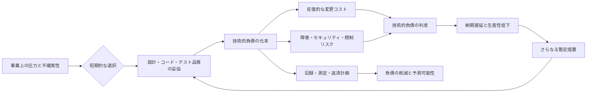
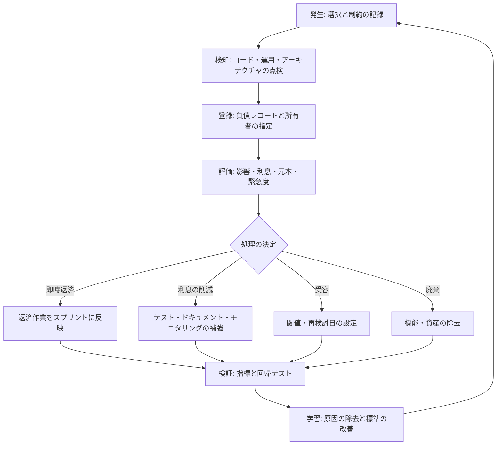

# 技術的負債（Technical Debt）の管理と返済戦略

## 1. 概要

### A. 定義

> 技術的負債（Technical Debt）とは、短期的な納期・コスト・市場対応のために、設計・コード・テスト・運用の品質を一部犠牲にすることで、将来に追加で負担することになる変更コストとリスクの累積分である。

技術的負債とは、単にコードが汚い、あるいは古いという意味ではない。
意図的に素早い選択をしたにせよ、うっかり品質を見落としたにせよ、現在の選択が将来の変更コストを高めるのであれば、それは負債となる。
金融負債が元本と利息を持つように、技術的負債も、今先送りしている作業という元本と、その結果として繰り返し発生する遅延・障害・認知負荷という利息を持つ。
したがって技術的負債は除去すべき欠陥のリストではなく、事業目標とリスクを併せて考慮しながら管理すべきポートフォリオである。

技術的負債が存在するからといって、悪い開発をしたという意味ではない。
検証されていない市場で最小限の機能を先にリリースしたり、障害発生時に一時的な回避策でサービスを復旧したりすることは、合理的な負債となりうる。
問題は、負債を記録せず、返済時期を定めず、利息がどれほど膨らんでいるかを観察しない場合である。
そのとき負債はチームの生産性を蝕み、新機能の納期を予測不可能にする。

### B. 登場背景と必要性

第一に、市場の不確実性のため、すべての品質要求をリリース前に完成させることは難しい。
初期の製品は顧客の反応を素早く確認しなければならないため、汎用化されたアーキテクチャや完全な自動化を後回しにすることがある。
この選択は学習を前倒しする代わりに、将来の拡張コストを生む。
負債を可視化すれば、素早い学習という便益と将来の返済コストを同一の意思決定の中で比較できる。

第二に、システムは時間の経過とともに周辺の条件が変化する。
OS・ライブラリ・クラウドAPI・セキュリティ要件・組織構造が変わると、過去には適切であった設計が現在の制約と合わなくなることがある。
したがって技術的負債は古いコードだけに固定されるものではなく、環境の変化とともに再評価されなければならない。

第三に、負債は累積効果を持つ。
一度の暫定処置そのものは小さく見えても、同じルールが複数のサービスやデータベースに複製されると変更箇所が増える。
変更箇所が増えればテスト範囲とデプロイリスクも大きくなり、リスクを減らすための手動承認や会議が増加する。
結局、機能開発に使える時間が減る悪循環が生じる。

第四に、技術的負債の責任は特定の開発者だけにあるのではない。
要件の不確実性、納期のプレッシャー、予算、意思決定構造、運用権限のすべてが負債の原因となりうる。
管理者は負債を隠すよう誘導する評価ではなく、合理的な負債を選択し、透明性をもって返済する文化を築かなければならない。

### C. 管理目標

技術的負債管理の第一の目標は、負債をゼロにすることではなく、リスクを許容可能な水準に維持することである。
すべてのコードを最新化すれば返済コストが製品価値を上回ることがあり、逆にすべての負債を放置すればシステムは事業の変化についていけなくなる。
したがって負債ごとに、発生原因、影響範囲、利息、返済コスト、返済時期を説明できなければならない。

第二の目標は、負債の利息を下げることである。
すぐに返済できなくても、文書化、テストの補強、モニタリング、境界面の固定といった措置によって追加コストの増加を遅らせることができる。
第三の目標は、新たな負債の流入を統制することである。
完了の定義、コードレビュー、自動テスト、アーキテクチャ決定記録を通じて、負債が記録なしに生み出されないようにしなければならない。

## 2. 技術的負債の構造と発生原因

### A. 負債の経済的構造

技術的負債は、次のように元本と利息の関係で説明できる。
元本とは、現在の状態を正常な品質水準に戻すための一回限りの作業量である。
利息とは、負債のために毎回追加で発生する分析・テスト・運用・変更のコストである。

元本が小さくても利息が大きければ優先度は高い。
例えば頻繁に変更される決済モジュールにテストがないことは、リリースのたびに手動検証を要求するため利息が高い。
一方、ほとんど変更されない内部バッチの古いライブラリは、元本が大きくても事業への影響と利息は低い場合がある。
このように負債をコードの見た目だけで評価すると、実際のリスクと優先度を誤って判断する。

負債の経済性は現在価値の観点からも捉えることができる。
返済コストをR、期間ごとの利息をI_t、割引率をdとすると、単純化した総コストはRと各期間の利息の現在価値の合計として考えることができる。
正確な財務計算が目的ではないが、返済を先送りするほどコストが増えるのか、今投資する価値があるのかを比較する枠組みを提供する。
ただし技術的負債の利息には障害確率や顧客の信頼低下のような定量化しにくい損失も含まれるため、数値を過度に精密な事実のように扱ってはならない。

### B. 発生原因

意図的な負債は、事業上の学習とスピードのために選択される。
MVPでシングルテナント構造を先に採用したり、検証前は手動運用で市場の反応を確認したりする場合がこれに該当する。
この選択は、返済条件と終了基準が文書化されている場合に限って合理的である。
「後で直す」という言葉だけがあり、いつ、どのようなシグナルで直すのかが決まっていなければ、意図的な負債も放置された負債へと変わる。

無知による負債は、チームが問題を認識していない、あるいは解決方法を知らない状態で生じる。
ドメインルールをコードに重複させたり、トランザクション境界を誤って設定したりする例が代表的である。
教育・メンタリング・設計レビュー・標準パターンの導入が予防策であるが、すでに発生した負債は記録と実験を通じて原因を明らかにしなければならない。

プレッシャーによる負債は、スケジュール、予算、人員、障害対応のような外部の制約によって品質活動が縮小されるときに生じる。
開発者が品質を重視していても、運用障害を優先的に処理しなければならないとテストやリファクタリングが後回しになりうる。
この類型は個人の努力だけでは解決しないため、計画に品質のためのキャパシティを確保し、暫定措置の終了条件をプロダクト・運用の責任者と合意しなければならない。

老朽化による負債は、依存技術と運用環境の変化から生じる。
サポートが終了したランタイム、脆弱な暗号ライブラリ、もはや監視されていないバッチ処理は、機能上の欠陥がなくてもリスクを高める。
老朽化による負債は、定期的な資産目録と脆弱性・サポート期間・互換性の点検を通じて早期に発見しなければならない。

### C. 負債の主な類型

負債の類型は責任者を探すための分類ではなく、返済方法を選択するための分類である。
コード負債は、重複・複雑な条件・低い凝集度のように実装の内部に現れる。
設計負債は、モジュール境界、依存の方向、データの所有権が誤って設定され、機能変更の影響範囲を拡大させる。

テスト負債は、自動検証が不足しているため、小さな変更でも手動の回帰検証を要求する状態である。
ドキュメント負債は、運用手順と設計上の決定が記録されておらず、特定の人員の記憶に依存している状態である。
インフラ負債は、手動デプロイ、古いイメージ、単一障害点、不十分なキャパシティ計画のように実行環境に存在する。
データ負債は、標準・品質・リネージ・保存ポリシーが不完全であるため、分析とサービス変更を困難にする。

| 類型 | 観察される兆候 | 主な利息 | 代表的な返済手段 |
|---|---|---|---|
| コード負債 | 重複、長い関数、複雑な条件 | 修正時間の増加、欠陥の混入 | リファクタリング、静的解析 |
| 設計負債 | 循環依存、境界の不明確さ | 影響範囲の拡大、並行開発の阻害 | モジュール境界の再設計、ADR |
| テスト負債 | 自動化率の低さ、不安定なテスト | 手動検証、デプロイ遅延 | 特性テスト、回帰テストの自動化 |
| ドキュメント負債 | 最新のランブック・決定記録の欠如 | オンボーディングの遅延、障害対応の遅延 | ドキュメント更新、知識共有 |
| インフラ負債 | 手動デプロイ、単一障害点 | 復旧の失敗、運用リスク | IaC、冗長化、自動化 |
| データ負債 | 重複・欠損・リネージの欠如 | 分析エラー、再処理コスト | 標準化、品質ルール、カタログ |

表の類型は互いに独立しているわけではない。
例えばデータの所有権が不明確であれば設計負債とデータ負債が同時に膨らみ、テスト負債があればコード負債を安全に返済することが難しい。
したがってバックログを類型別に分けて管理するとしても、影響分析においては一つのバリューストリームとして結び付けなければならない。

## 3. 識別・測定・優先順位付け

### A. 識別方法

負債の識別は開発者個人の感覚を収集する方式から始めることができるが、最終的には再現可能な証拠が必要である。
コード検索と静的解析で重複・複雑度・脆弱な依存関係を見つけ、テスト結果とデプロイ指標で検証コストを確認する。
運用面では、繰り返し発生する障害、手作業、アラートの誤検知、復旧段階のボトルネックを記録する。

アーキテクチャワークショップでは変更シナリオについて問いかける。
「新しい決済手段を追加すると、どのサービスとテーブルを修正するのか」といった問いに対して複数のチームが異なる答えを返すのであれば、境界とドキュメントに負債がある可能性が高い。
データフローと権限フローを描いてみたときに担当者を特定しにくかったり、暫定的な変換が繰り返されていたりすれば、それはデータ負債の証拠となる。

負債レコードには、少なくとも次の情報を含めなければならない。
発見箇所と現象、発生背景、影響を受けるユーザー・サービス、利息の兆候、見積もり元本、リスク度、返済条件、担当者、再検討日を残す。
チケットのタイトルに「リファクタリングが必要」とだけ書くと意思決定に必要な文脈が失われるため、負債が発生させるコストと、対処しなかった場合の結果を併せて記載しなければならない。

### B. 測定指標

元本の測定は作業量の見積もりから始める。
ストーリーポイント、開発者日数、変更ファイル数を用いることができるが、指標そのものが目的になってはならない。
複数チームの数値を単純に比較するよりも、同じチームで返済前後の推移を観察するほうが安全である。

利息の測定には、変更のリードタイム、デプロイ失敗率、復旧時間、欠陥の再発率、手動運用時間、コードレビューの待ち時間を活用できる。
これらの指標は技術的負債だけで決まるものではないため、デプロイ頻度・チーム規模・製品の段階と併せて解釈しなければならない。
例えばデプロイ失敗率が高くても、原因がテスト負債なのか外部APIの不安定さなのかを切り分けなければ、誤った返済作業を行うことになる。

| 測定の観点 | 指標の例 | 解釈時の留意点 |
|---|---|---|
| 変更容易性 | リードタイム、変更影響ファイル数 | 機能規模とチーム構造を併せて見る |
| 安定性 | 変更失敗率、MTTR、再発障害 | 障害原因と検知品質を切り分ける |
| 検証性 | 自動テスト比率、flaky比率 | 数値よりも主要経路の検証力を見る |
| セキュリティ | 脆弱な依存関係、パッチ遅延日数 | 深刻度と露出可能性を組み合わせる |
| 運用性 | 手作業時間、アラート誤検知率 | 反復作業の自動化可能性を確認する |
| 理解容易性 | オンボーディング時間、ADRの鮮度 | ドキュメントの存在よりも実際の活用状況を見る |

定量指標と定性的判断を併用しなければならない。
セキュリティパッチの遅延は、作業量が小さくても規制・侵害リスクのために高い優先度となりうる。
逆に、複雑度が高くても変更がほとんどない安定したアルゴリズムは、すぐに返済する理由が弱い場合がある。

### C. 優先順位付けの基準

優先順位は、事業への影響、発生可能性、利息の増加率、返済コスト、実行可能性を基準に決める。
簡単なリスクスコアは、影響度に可能性を乗じ、さらに利息の増加率で重み付けする方式で作ることができる。
このスコアはチーム間の対話を助ける補助手段であり、計算結果がセキュリティ・法規・安全に関する判断に取って代わってはならない。

第一に即時返済を検討すべき対象は、安全・セキュリティ・法規を直接脅かす負債である。
第二は、頻繁に変更される主要フローにおいてリードタイムと障害率を高める負債である。
第三は、返済コストが小さく、自動化によって素早く削減できる負債である。
使用頻度が低く隔離されており、利息も小さい負債は、廃棄または現状維持のほうが合理的な場合がある。

## 4. 管理ライフサイクルと返済方式

### A. 管理ライフサイクル

発生段階では選択を隠さない。
暫定的な実装を選択したのであれば、なぜ必要なのか、どのような条件で置き換えるのか、どのようなリスクを受け入れるのかをADRやイシューに記録する。
この記録は後から責任を追及するためのものではなく、返済候補を忘れないための仕組みである。

検知段階では、定期点検とイベント起点の点検を併せて運用する。
四半期ごとのアーキテクチャレビューだけではデプロイ過程で生じる負債を見落とすことがあるため、障害の振り返り・大規模機能の完了・依存関係の変更の後にも負債を再評価する。
発見した項目は、一人の所有者と次回の再検討日を持たなければならない。

評価段階では、返済、利息の削減、受容、廃棄の4つの決定を区別する。
返済は元本を除去することであり、利息の削減はすぐに構造を変えずに、テスト・オブザーバビリティ・ドキュメントによってリスクの増加速度を下げることである。
受容はリスクとコストを把握したうえで一定期間維持する決定であり、廃棄は使用されていない機能とインフラを除去して負債そのものをなくす決定である。

### B. 返済方式

全面的な書き直しは、既存システムを一度に置き換える方式である。
構造的な欠陥があまりに深い場合や技術の寿命が尽きた場合には魅力的であるが、要件や隠れた運用ルールを失うリスクが大きい。
書き直しの期間中は顧客価値の提供が止まり、2つのシステムを並行運用しなければならないこともあるため、明確な境界と段階的な検証なしには選択しないほうがよい。

段階的リファクタリングは、小さな変更と回帰テストを繰り返しながら構造を改善する。
外部との契約を先に固定し、内部実装を変更する方式は、顧客への影響を抑えることができる。
この方式は即時的な効果が小さく見えても、デプロイ可能な単位でリスクを分割し、学習を次の段階に反映できるという利点がある。

ストラングラーフィグパターンは、既存機能の前に境界を設け、新しい実装へと機能を一つずつ移行した後、古い部分を除去する。
ルーティング・データ同期・整合性検証が核心であり、移行期間が長引くと2つのシステムの二重運用という負債が生じるため、終了基準を管理しなければならない。

自動化による返済は、手動デプロイ、手動のデータ検証、反復的な環境設定をコードとパイプラインに置き換える方式である。
自動化は人為的ミスを減らすと同時に、システムの状態を再現可能にする。
ただし自動化された誤った手順はエラーを急速に拡散させうるため、承認段階、ロールバック、監査ログを併せて設計しなければならない。

### C. 開発フローへの組み込み

負債の返済を別期間の「整理週間」だけに任せると、事業スケジュールが押したときに真っ先に消えてしまう。
プロダクトバックログに負債を正式な項目として登録し、機能変更とともに関連する負債を一部返済する方式を適用しなければならない。
例えば決済手段を追加するストーリーに決済モジュールの契約テストの補強を含めれば、返済の文脈と効果が明確になる。

完了の定義には、主要経路のテスト、運用ドキュメントの更新、オブザーバビリティの追加、セキュリティパッチといった品質条件を含める。
コードレビューはスタイルだけを確認する時間ではなく、負債の流入を確認する設計レビューのポイントでなければならない。
CIでは静的解析・依存関係の点検・テスト・ビルドの再現性を自動検証し、閾値を超える場合は例外承認と有効期限を残す。

## 5. 比較と事例

### A. 技術的負債と欠陥の比較

欠陥とは要求された動作と実際の動作の差であり、現在のユーザーに誤った結果を与える問題である。
技術的負債は、現在の動作が要件を満たしていても、将来の変更コストとリスクを増大させる状態でありうる。
したがって欠陥をすべて修正すれば負債が自動的に消えるわけではなく、負債が必ずしもすぐに欠陥として現れるわけでもない。

| 区分 | 欠陥 | 技術的負債 |
|---|---|---|
| 基準 | 現在の要求動作への違反 | 将来の変更・運用コストとリスク |
| 症状 | 誤った結果、障害、機能不全 | 遅延、反復作業、拡張の困難 |
| 処理 | 修正と回帰検証 | 返済・利息の削減・受容・廃棄 |
| 優先順位 | ユーザーへの影響と緊急度が中心 | 影響、利息、元本、戦略適合性を総合 |
| 例 | 注文金額を誤って計算する | 注文ルールが複数のサービスに重複している |

この区分はチケットの担当組織を分けるためではなく、対応戦略を変えるために必要である。
現在の障害をまず復旧した後、障害を繰り返させる構造的な原因が技術的負債であれば、別途の返済項目として結び付けなければならない。

### B. 仮想事例：注文システムの段階的返済

以下は原理を説明するための仮想の事例である。
あるオンライン注文サービスが、リリース速度を高めるために注文・在庫・決済を一つのアプリケーションと共有データベースで実装したと仮定する。
当初はデプロイが単純で機能検証も速かったが、3つのチームが同時に変更を加えるにつれ、デプロイ待ちと回帰テストが増加した。

チームは変更失敗率、平均復旧時間、手動回帰テスト時間を4週間測定した。
手動回帰テストがリリースあたり12時間かかり、決済の変更が在庫モジュールのテストまで要求するという事実が明らかになった。
チームは全面的な書き直しの代わりに、まずAPI契約テストを追加し、注文の中核ルールをドメインモジュールへ移し、在庫照会と決済承認の境界を分離した。

第1段階では、外部APIの入力・出力の契約を固定した。
第2段階では、既存のデータベースをそのまま使用しつつ、新しいモジュールが直接アクセスするテーブルを制限した。
第3段階では、トラフィックの一部だけを新しい経路に流し、エラー率とレイテンシを比較した後に範囲を広げた。
最後に、使用されなくなった旧経路と暫定的な変換コードを除去し、ADRに返済の結果を記録した。

この事例の核心は「マイクロサービスに分割した」という技術用語ではない。
変更の境界をまず検証し、小さな単位でリスクを減らし、指標によって返済の効果を確認したという点である。
もし分割後もデータの所有権とデプロイの責任が不明確であったならば、分散システムという新たな負債が追加されただけであっただろう。

### C. 意思決定の例

| 選択肢 | 短期的効果 | 長期的リスク | 適合条件 |
|---|---|---|---|
| 現状維持 | コストとスケジュールの安定 | 利息が増加する可能性 | 変更頻度と影響が低い |
| 部分的リファクタリング | リスクとコストを分割 | 効果が漸進的 | テストと境界を確保できる |
| 全面的な書き直し | 構造を迅速に変更 | 要件・運用知識の喪失 | 寿命の終了と明確な移行計画 |
| 機能の廃棄 | 運用コストを即座に削減 | 一部の顧客価値の減少 | 利用率が低く代替経路が存在する |

表の選択は、システムの技術的な優秀さよりも、事業の時間軸とリスク許容度によって変わる。
運用中の中核的な決済経路では安定した段階的改善が優先される場合があり、実験用の内部ツールでは短命な負債を許容できる。

## 6. 深掘り：現代の開発・運用における技術的負債

クラウドとDevOpsの環境では、デプロイ速度が速くなった分だけ負債の生成と拡散も速くなる。
コンテナイメージが古くなったり、IaCモジュールが複製されたり、パイプラインの例外が累積したりすると、インフラ負債がコードと同じように蓄積する。
したがってアプリケーションのリポジトリだけでなく、パイプライン・クラウドアカウント・ダッシュボード・ランブックも負債管理の範囲に含めなければならない。

AIシステムでは、データ・モデル・プロンプト・評価セット・推論インフラが同時に変化する。
学習データのリネージがなかったり評価基準が固定されていなかったりすると、モデルを改善するほど結果を比較しにくくなるデータ・モデル負債が生じる。
モデルのバージョン、データのスナップショット、評価指標、承認記録を結び付けることが返済の出発点である。
生成AIを適用する際には、検索の根拠、安全フィルタ、コスト、レイテンシ、人によるレビュー手順も負債レコードに含めなければならない。

アーキテクチャ負債は、品質特性シナリオで扱うのが効果的である。
「ピーク時間帯に注文リクエストの99パーセントを2秒以内に処理する」のように、刺激・環境・応答・測定基準を具体化すれば、設計上の選択と負債の影響を検証できる。
単に「拡張性が悪い」と書くよりも、どのような負荷でどのような応答が悪化するのかを定義してこそ、返済作業と検証方法が結び付く。

組織レベルでは、負債を製品ポートフォリオのように管理する。
サービスごとの負債台帳、リスク等級、返済予算、例外承認、有効期限を運用し、四半期ごとに経営陣と共有する。
ただし負債の総数やチケット数を成果指標にすると、チームが小さな項目を量産しかねないため、変更のリードタイム・安定性・返済効果と連動させて見る。

## 7. 考慮事項および示唆点

### A. 事業価値と品質のバランス

技術的負債の返済は、技術チームの好みを押し通す活動ではなく、製品の持続可能な価値創出のための投資である。
返済の要請には、顧客への影響、納期の改善、リスクの削減、運用コストの削減といった事業の言葉を併せて提示しなければならない。
市場検証が優先される領域では限定的な負債を許容しつつ、学習の結果が出た後に返済の可否を改めて決定する。

### B. 返済優先順位の透明性

負債リストを非公開で管理すると、優先順位が個人の声の大きさに左右される。
共通テンプレートで原因・影響・利息・コスト・担当者を記録し、プロダクト・開発・セキュリティ・運用が共同で評価しなければならない。
セキュリティ・安全・法規の項目は、一般的な機能スケジュールと競わせるよりも、別途の最低基準と例外承認の体制を設ける。

### C. 過度なリファクタリングの防止

リファクタリングそのものが目的になると、安定したシステムを不必要に揺るがしかねない。
返済前には変更頻度、テスト可能性、運用への影響、代替可能性を確認し、返済後にどの指標が改善されるべきかを定義する。
効果が測定されない大規模な構造変更はさらなる負債となりうるため、段階的な実験とロールバック計画を用意する。

### D. 自動化とガードレール

CI/CDとポリシーの自動化は負債の流入を減らすが、閾値の意味を理解していなければ形式的な通過手続きとなる。
静的解析の警告は深刻度と所有者に結び付け、例外には有効期限を設ける。
自動化の失敗がデプロイを阻む場合にも、緊急変更の経路と事後検証を用意し、安全性と対応速度を両立させる。

### E. 運用・セキュリティ・データの統合管理

アプリケーションコードだけをリファクタリングしても、古い権限、脆弱なイメージ、品質の低いデータが残っていれば、実際のリスクは減らない。
負債レコードにサービス・データ・インフラ・セキュリティの依存関係を結び付け、変更影響分析に運用担当者とデータ担当者を参加させる。
特に規制対象のデータでは、返済よりも保存・アクセス・削除ポリシーの遵守が先行しなければならない。

### F. 組織学習と再発防止

返済の完了だけを記録すると、同じ負債が別のチームで繰り返される。
振り返りでは、なぜ負債が生み出されたのか、どのような意思決定とインセンティブが影響したのか、どのような標準・教育・プラットフォーム支援が必要なのかを確認する。
改善の結果を完了の定義、テンプレート、開発者プラットフォーム、アーキテクチャ原則に反映してこそ、負債の流入率を下げることができる。

## 8. 結論

技術的負債は、迅速な実行と将来の変更コストの間に存在する選択の結果である。
合理的な負債は事業仮説を検証し、市場からの学習をもたらすが、記録されていない負債は利息を隠したままチームのスピードと信頼性を低下させる。
技術士の観点では、負債をコード品質の問題に矮小化せず、アーキテクチャ・データ・セキュリティ・インフラ・組織の意思決定を含む全社的なリスクとして管理しなければならない。

実行の順序は、発見と記録、影響・利息・元本の評価、返済または利息削減の選択、自動検証、指標に基づく学習へとつながるべきである。
全面的な書き直しよりも境界の固定と段階的な移行を優先しつつ、寿命の終了・規制・安全上のリスクには明確な投資と終了条件を設ける。
結局、良い組織とは負債のない組織ではなく、負債を意識的に選択し、コストを公開し、継続的に返済する組織である。

## 参考資料

- Martin Fowler, “Technical Debt” — https://martinfowler.com/bliki/TechnicalDebt.html
- Ward Cunningham, “The WyCash Portfolio Management System” — https://wiki.c2.com/?WardCunningham

---

> **一言まとめ**: 技術的負債はなくすべき烙印ではなく、元本・利息・リスクを測定し返済条件を運用する、持続可能性の管理対象である。
