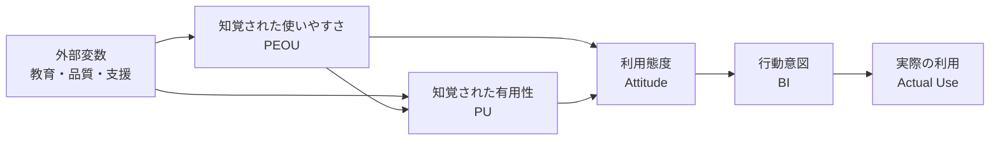

# 技術受容モデル(TAM, Technology Acceptance Model)

## 1. 概要

### A. 定義
> Davis(1989)が提示した、利用者が**新しい情報技術を受容し実際に使用する行動を説明・予測**する理論モデルである。心理学の合理的行為理論(TRA)を情報技術の文脈に特化させたもので、**知覚された有用性(PU)** と**知覚された使いやすさ(PEOU)** という二つの信念を中核変数とする。

TAMの洞察は、「技術の実際の性能」ではなく「**利用者がその技術をどのように知覚するか(perception)**」が受容を左右するという点にある。いかに優れたシステムであっても、利用者が有用でない、あるいは使いにくいと「感じれば」敬遠される。技術導入の成否を技術そのものではなく**利用者の認識**という心理変数で説明した点が、このモデルの理論的貢献である。

### B. 登場背景および必要性
1980年代、企業は情報システムに大規模な投資を行ったにもかかわらず、肝心の現場利用者がシステムを敬遠して投資が無駄になる**受容の失敗**が頻発した。高価なシステムがなぜ使われないのかを説明・予測する理論が必要とされ、TAMはこれを二つの測定可能な変数で簡潔に説明して大きな反響を得た。実務的には、新技術・情報化事業の導入前に**受容阻害要因を診断**し、教育・UX改善・変革管理などの対応戦略を立てる根拠を提供するという点で必要性が大きい。

## 2. 主要構成要素

この因果経路で注目すべき点が二つある。第一に、**使いやすさ(PEOU)が有用性(PU)に影響を与える**という矢印である。使いやすいシステムほど、利用者はその機能を十分に活用して成果を上げるため、有用であると感じるようになるからである。第二に、外部変数は二つの信念を**経由してのみ**態度・行動に影響を与える — すなわち教育やシステム品質はそれ自体で利用を増やすのではなく、利用者の知覚(PU・PEOU)を変えて初めて効果を発揮する。

- **外部変数(External Variables)**: 教育・訓練、システム品質、社会的影響、組織的支援など介入可能な要因であり、二つの知覚変数に影響を与える**レバー(てこ)** である。
- **知覚された有用性(PU)**: 「この技術を使えば自分の業務成果が高まるだろう」という信念。受容を決定する最も強力な変数として知られている。
- **知覚された使いやすさ(PEOU)**: 「この技術を大きな労力なく簡単に使えるだろう」という信念。態度に直接影響を与えると同時にPUを引き上げる。
- **利用態度(Attitude)**: 利用に対する肯定・否定の総合的評価。
- **行動意図(BI)**: 実際に利用しようとする意向であり、実際の利用を最もよく予測する先行変数である。
- **実際の利用(Actual Use)**: 最終的な利用行動であり、モデルの従属変数である。

| 構成要素 | 説明 | 役割 |
|---|---|---|
| **外部変数** | 教育・品質・社会的影響 | 知覚の先行要因 |
| **知覚された有用性(PU)** | 成果向上の信念 | 最強の予測変数 |
| **知覚された使いやすさ(PEOU)** | 容易な利用の信念 | PU・態度に影響 |
| **利用態度** | 肯定・否定の評価 | 意図の形成 |
| **行動意図(BI)** | 利用の意向 | 利用の予測 |
| **実際の利用** | 最終行動 | 従属変数 |

## 3. 拡張モデル

基本TAMは簡潔であるが、「なぜ有用だと感じるのか」という社会的・組織的背景を説明できなかった。これを補うために拡張モデルが登場した。**TAM2**(Venkatesh & Davis, 2000)は、PUの先行要因として**主観的規範(周囲の期待)・イメージ・職務関連性・結果の品質**などの社会的・認知的要因を追加した。**UTAUT**(2003)は、それまでの複数の受容理論を統合し、**成果期待・努力期待・社会的影響・促進条件**の4大決定要因と、性別・年齢などの調整変数を提示することで説明力を大きく高めた。

| モデル | 追加・統合要素 | 意義 |
|---|---|---|
| **TAM2** | 主観的規範・イメージ・職務関連性など | PUの社会的要因を解明 |
| **UTAUT** | 成果期待・努力期待・社会的影響・促進条件 + 調整変数 | 理論統合、説明力向上 |

## 4. 活用事例および限界

例えば、ある病院が電子カルテ(EMR)を導入する際、医療スタッフの**PEOUが低ければ**(入力が煩雑)、いかにシステムが優秀でも利用意図は低下する。TAMで事前アンケートを実施し、PEOUがボトルネックであると診断できれば、画面の簡素化・ショートカットキー・現場教育という処方を下すことができる。このようにTAMは、**導入前に受容度を予測し、設計・教育に反映**する実践的なツールとなる。

ただし限界も明確である。TAMは利用者の主観的回答(アンケート)に依存するため、状況や文化によって結果が変わり、実際の利用成果よりも「知覚」に焦点を当てるため、強制的な利用環境(義務的システム)では説明力が弱くなる。したがって、定量的アンケートを定性的インタビューで補完することが望ましい。

## 5. 考慮事項および示唆点
- **利用者中心のアプローチ**: 技術自体の優秀さよりも**有用性・使いやすさに対する利用者の知覚**が導入の成否を左右するため、企画段階からUXと現場の参画を設計に反映すべきである。
- **変革管理との連携**: TAMの診断結果は**変革管理(Change Management)** の教育・コミュニケーション・インセンティブ戦略につながり、抵抗を最小化するために活用される。
- **トレードオフ・展望**: 使いやすさを高めるために機能を単純化すると、専門的な利用者にとっての有用性が低下しうるため、バランスが必要である。近年の**AI・クラウド・デジタルトランスフォーメーション**といった新技術の組織定着戦略において、TAM/UTAUTは依然として受容度を計量・予測する理論的根拠として広く用いられている。

---

> **一言まとめ**: TAMは*知覚された有用性(PU)と使いやすさ(PEOU)* という二つの信念が態度・行動意図を経て実際の技術利用につながると説明するモデルであり、外部変数は知覚を通してのみ作用し、TAM2・UTAUTへと拡張されて新技術受容戦略の根拠となる。
