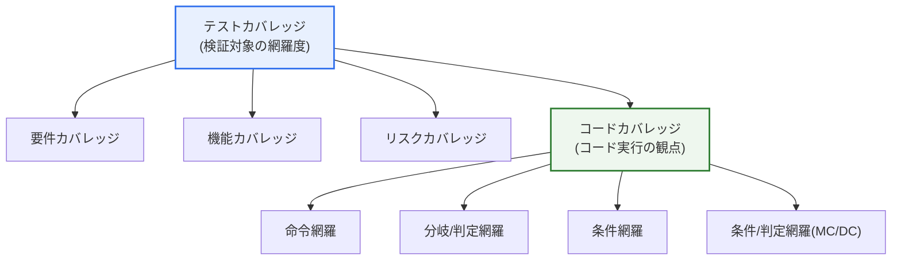

# テストカバレッジとコードカバレッジ

## 1. 概要

### A. 定義
> **テストカバレッジ(Test Coverage)** は、計画・実施したテストが検証対象(要件・機能・リスク)を**どの程度網羅したか**を示す広義の尺度であり、**コードカバレッジ(Code Coverage)** は、テストを実行した際にソースコードの文・分岐・条件などが**どの程度実際に実行されたか**を定量的に測定した尺度である。コードカバレッジは、テストカバレッジが包含する複数の観点のうち「コード実行の観点」に該当する下位指標である。

二つの概念を区別する核心的な問いは「**何を基準に十分さを測るか**」である。テストカバレッジは「テストすべき対象 — 要件・機能・ユーザーシナリオ・リスク — をどの程度扱ったか」を問う広い観点であり、要件カバレッジ・機能カバレッジ・構成カバレッジなどを包含する。一方コードカバレッジは、その対象のうちソースコードに焦点を当て、「各行・分岐・条件がテスト過程で実際に実行されたか」をツールで自動計測した定量指標である。すなわち、テストカバレッジが「検証の幅」を扱うとすれば、コードカバレッジは「実行の深さ」を数値で示す。

コードカバレッジが重要な理由は明確である。**実行されなかったコードは決してテストされていないコード**であり、その中に欠陥が潜んでいる可能性を排除できない。カバレッジ測定は「どのコードが一度も実行されなかったか」を明らかにし、テストの死角を可視化する。この意味で、コードカバレッジはテストが最低限の検証範囲を確保しているかを確認する「**必要条件**」として機能する。

しかし決定的なことに、**コードカバレッジ100%が即ち品質(正確性)を保証するわけではない。** ここで二つを区別しなければならない — 「コードが実行されたこと」と「その実行結果が正しいか検証(アサート)されたこと」はまったく別の問題である。アサーション(assertion)なしにコードを通過させるだけのテストは、カバレッジの数値は高めるが欠陥は検出できない。したがって、コードカバレッジは「十分条件ではなく必要条件」という正確な位置づけで活用すべきであり、数値にとらわれるとかえって品質に対する誤った確信を与えかねない。

### B. 登場背景と必要性
ソフトウェアの規模が大きくなり、回帰(regression)リスクが常態化するにつれ、「我々のテストは十分か?」という問いに勘ではなく**客観的な数値**で答える必要が生じた。開発者が直感的に「ある程度テストした」と感じていても、実際には例外処理の経路や特定の分岐が一度も実行されないまま残っていることが多い。カバレッジ計測ツールはこうした未検証領域を自動的に明らかにし、テストの完成度を定量化して品質ゲート(quality gate)の根拠を提供する。特にCI/CDが普及するにつれ、コミットごとにカバレッジを測定して回帰と死角を継続的に管理することが標準的な実務として定着した。

### C. 二つの概念の関係
整理すると、コードカバレッジはテストカバレッジの部分集合である。コードカバレッジがいかに高くても、要件そのものをテストケースとして導出できていなければテストカバレッジは低くなりうるし、逆に要件のマッピングが充実していても、そのテストがコードの特定分岐に到達しなければコードカバレッジに穴が残る。

この関係が実務で重要なのは、二つの指標が互いの盲点を補完するためである。要件カバレッジは「実装すべき機能を漏らしていないか(漏れ欠陥)」を捉え、コードカバレッジは「実装されたコードが実際に検証されたか(実装欠陥)」を捉える。どちらか一方だけでは完全な検証にならないため、二つの指標を相互補完的に併せて管理してこそ、検証の幅と深さの両方を確保できる。

## 2. 全体構造 — テストカバレッジの範疇

上記の構造図は、テストカバレッジという広い傘の下に要件・機能・リスクカバレッジと並んでコードカバレッジが位置し、コードカバレッジがさらに命令→分岐→条件→MC/DCへと細分化されることを示している。実務で「カバレッジ」という言葉が通常コードカバレッジを指すのは、この指標だけがツールによって自動・定量的に測定されるためである。要件・機能カバレッジは人が要件とテストケースをマッピングしてトレーサビリティマトリクス(RTM)で管理するのに対し、コードカバレッジは計測ツールが実行情報を自動収集するという点で性格が異なる。

## 3. コードカバレッジの種類(厳格度の段階)

コードカバレッジは、コードの何を、どの程度細かく実行したかによって複数の段階に分けられる。下に行くほど要求されるテストが精密になり、検出可能な欠陥の範囲も広がる。

### A. 命令網羅(Statement Coverage)
すべての実行可能な文(statement)が最低1回以上実行されたかを測定する。最も基本的で理解しやすい指標であるが、限界が明確である。例えば`if (a) x = 1;`というコードで`a`が真の場合だけをテストすれば命令網羅は100%になるが、`a`が偽の場合(すなわち分岐しない場合)の動作はまったく検証されない。つまり命令網羅は「実行はされた」ことを保証するだけで、分岐のもう一方の経路は見逃す可能性がある。

### B. 分岐/判定網羅(Branch/Decision Coverage)
すべての分岐点の真(true)・偽(false)の結果がそれぞれ最低1回ずつ実行されたかを測定する。前述の例では`a`が真の場合と偽の場合の両方をテストしなければ100%にならないため、命令網羅が見逃す「分岐しない経路」まで網羅する。一般的なアプリケーション開発では命令・分岐網羅を実用的な目標とすることが多いが、これはコスト対欠陥検出効果の均衡点がおおむねこの水準にあるためである。

### C. 条件網羅(Condition Coverage)
判定文を構成する**個々の条件式それぞれ**の真・偽がすべて実行されたかを見る。例えば`if (a && b)`では、`a`と`b`のそれぞれが真・偽の両方をとらなければならない。ただし条件網羅だけでは落とし穴がある。個々の条件の真・偽をすべて満たしながらも、肝心の判定(decision)全体の真・偽の結果のいずれかを見逃す可能性があり、分岐網羅を常に満たすとは限らない。このため実務では、条件と判定を併せて見る上位の基準が必要になる。

### D. MC/DC(条件/判定網羅)
MC/DC(Modified Condition/Decision Coverage)は、「**各条件が他の条件とは独立して判定結果に影響を及ぼすこと**」をそれぞれ立証するよう要求する強力な基準である。すなわち、特定の条件一つだけを変えたときに判定全体の結果が変わるテストのペア(pair)を条件ごとに確保しなければならない。MC/DCの実用的な利点は、すべての条件の組み合わせ(2ⁿ)を試験する複数条件網羅とは異なり、理想的な場合は**条件数nに対してn+1個のテストだけで**各条件の独立した影響を立証でき、組み合わせ爆発を回避できる点にある。

MC/DCが特に重要なのは、セーフティクリティカル(safety-critical)な規格がこれを明示的に要求しているためである。航空ソフトウェア認証規格であるDO-178Cは、最も高い安全レベル(Level A, DAL A)のソフトウェアに対してMC/DC水準の構造カバレッジを要求しており、機能安全規格IEC 61508も高いSILレベルでMC/DCを推奨・強く推奨している。ただしMC/DCは人手で測定することが事実上不可能であるため、VectorCAST・LDRAのような専用ツールで最小テストペアを導出・計測するのが一般的である。

| 種類 | 測定対象 | 厳格度 | 代表的な適用 |
|---|---|---|---|
| **命令(Statement)** | すべての文を1回以上実行 | 低 | 一般開発の最低基準 |
| **分岐/判定(Branch)** | 分岐の真・偽の両方を実行 | 中 | 一般アプリケーションで推奨 |
| **条件(Condition)** | 個々の条件式の真・偽を実行 | 中上 | 複合条件の検証 |
| **MC/DC** | 各条件の独立した影響を立証 | 高 | 航空・医療などセーフティクリティカル(DO-178C DAL A) |

## 4. 比較および実務適用事例

### A. テストカバレッジ vs コードカバレッジ
以下の表は二つの概念の違いを整理したものであるが、核心は表そのものよりも**違いが生じる理由**にある。テストカバレッジが「何を検証すべきか(要件)」という企画・設計の観点から出発するのに対し、コードカバレッジは「書かれたコードが実際に動いたか」という実行・計測の観点から出発する。そのため、要件がコードとして実装すらされていなければコードカバレッジの指標にはまったく現れず(漏れた機能には実行するコードがないので測定対象にならない)、これがコードカバレッジだけを盲信した際に生じる代表的な盲点である。

| 区分 | テストカバレッジ | コードカバレッジ |
|---|---|---|
| **対象** | 要件・機能・リスク | ソースコードの実行 |
| **観点** | 何を検証したか(幅) | コードがどの程度実行されたか(定量) |
| **測定方式** | 要件・機能マッピング(RTM)、手作業 | 計測ツールで自動測定 |
| **関係** | 上位(包括) | 下位(コード実行の観点) |
| **限界** | 定量化が難しい | 実行≠正解の検証、漏れた機能を捕捉できない |

### B. 具体的事例で見る落とし穴
事例を挙げると理解が明確になる。ある決済モジュールに`if (amount > 0 && balance >= amount)`という条件があるとしよう。テストが「正常決済」の1ケースだけを扱えば命令網羅は100%に達しうるが、`balance < amount`(残高不足)の分岐は実行されず、分岐網羅は50%にとどまる。実際に残高不足の処理ロジックに欠陥があっても、命令網羅100%という数値だけを見れば安心してしまうのである。逆にアサーションが不十分な事例もよくある — 関数を呼び出すだけで戻り値を検証(assert)しなければ、カバレッジは満たされても結果が誤っていてもテストは通過する。この「偽りの安心」を補うため、近年は**ミューテーションテスト(Mutation Testing)** を併用する実務が増えている。コードを意図的に変異(mutant)させた後、テストがその変異を検出できるか(kill)を測定することで、カバレッジの数値ではなくテストの「欠陥検出能力」そのものを評価するのである。

### C. リスクベースの目標設定
したがって、カバレッジの目標は一律の数値ではなく**リスクに比例**して定めるべきである。一般的な社内アプリケーションは命令・分岐網羅70~80%程度を実用的な目標とすることが多く、金融取引のようにエラーのコストが大きいドメインでは、より高い基準と境界値テストを併用する。航空・医療・自動車(ISO 26262)のようなセーフティクリティカルシステムでは、MC/DCのような厳格な構造カバレッジが規制として要求される。すなわち「何%なら十分か」に正解はなく、欠陥がもたらす損失の大きさが目標水準を決定する。

また、目標を無理に100%に設定するとかえって逆効果になる。到達が難しい例外処理・防御的コードまで無理にカバーしようとすると、テストが実装の詳細に過度に結合してリファクタリングを妨げ、保守コストを増大させる。実務では「中核的なビジネスロジックは高く、単純な委譲・設定コードは低く」というようにコード領域別に差をつけた目標を置き、カバレッジが低い領域がすなわちリスクの高い領域なのか、それともテストする価値の低い領域なのかを判断する解釈能力がより重要である。

## 5. 深掘り — 実務動向と予想出題方向

コードカバレッジは今日、CI/CDパイプラインの品質ゲートとして深く統合されている。JaCoCo(Java)、Istanbul/nyc(JavaScript)、Coverage.py(Python)、gcov・llvm-cov(C/C++)といったツールがビルドごとにカバレッジを測定し、設定したしきい値を下回ればマージをブロックしたり、「カバレッジが減少する変更」を警告したりする方式が標準化された。特に新規・変更コードにのみカバレッジ基準を適用する「差分カバレッジ(diff/patch coverage)」が広がり、レガシー全体を無理に引き上げる代わりに、新たに入るコードの品質を段階的に担保する現実的なアプローチが定着した。

また、カバレッジの「質」を高めようとする流れも顕著である。前述のミューテーションテストが代表的であり、セーフティクリティカル領域では、GCC 14にマスキング方式のMC/DC計測が追加されるなど、オープンソースのツールチェーンでも構造カバレッジのサポートが強化されている。これは「カバレッジの数値を満たすこと」から「**意味のある検証を定量化すること**」へと実務の重心が移りつつあることを示している。

加えて、近年は静的なカバレッジ計測を超えて、運用環境での実際の実行経路を測定するアプローチも広がっている。本番トラフィックに基づいてどのコードが実際に頻繁に実行されているかを把握すれば、テストリソースを利用頻度・リスクの高い経路に優先的に配分できる。すなわちカバレッジは、開発段階の検証指標を超え、運用のオブザーバビリティ(observability)と結びついて「何をさらに検証すべきか」をデータで示す方向へと拡張されつつある。

予想出題方向(技術士の観点)としては、① テストカバレッジとコードカバレッジの概念・関係の区別、② コードカバレッジの種類(命令・分岐・条件・MC/DC)の定義と厳格度の違い、および例題に基づく説明、③ MC/DCがセーフティクリティカル規格(DO-178C)で要求される理由とn+1テストの効率性、④ カバレッジの限界とそれを補完するミューテーションテスト・境界値分析・品質ゲート戦略を論述形式で問われる可能性が高い。答案では「高いカバレッジ ≠ 高い品質」という命題を軸に、必要条件としてのカバレッジと意味のある検証の結合を強調する構成が効果的である。

## 6. 考慮事項および示唆点(技術士の観点)

1. **高いカバレッジは品質を保証しない — 実行と検証を区別せよ。** コードが実行されたことと、その結果が正しいとアサートされたことは異なる。カバレッジの数値にとらわれず、意味のあるアサーション・境界値・例外シナリオの検証を併せて確保すべきである。ミューテーションテストでテストの欠陥検出能力そのものを評価することも有効な補完策である。
2. **目標水準はリスクに比例して設定する。** すべてのシステムに同一のカバレッジ基準を強いるのは非効率である。一般アプリケーションは命令・分岐、金融はそれ以上、航空・医療・自動車などのセーフティクリティカルシステムはMC/DCのように規制が要求する厳格な基準を適用するリスクベースのアプローチが合理的である。
3. **CI/CD品質ゲートに統合して継続的に管理する。** カバレッジをコミットごとに自動測定して品質ゲートとし、特に変更分に対する差分カバレッジを適用して回帰と死角を段階的に統制する。一回限りの測定ではなく、パイプラインに内在化されてこそ実効性がある。
4. **カバレッジは必要条件であって目的ではない — 測定の歪みを警戒せよ。** カバレッジが組織のKPIになった瞬間、アサーションのない形式的なテストで数値だけを満たすグッドハートの法則(測定が目標になると、それは良い測定ではなくなる)が働きうる。指標はテストの完成度を診断するツールとして用いつつ、検証の質を併せて管理して歪みを防ぐべきである。

## 参考資料
- LDRA, "DO-178C & Structural Coverage Analysis" — https://ldra.com/ldra-blog/do-178c-structural-coverage-analysis/
- Wikipedia, "Modified condition/decision coverage (MC/DC)" — https://en.wikipedia.org/wiki/Modified_condition/decision_coverage
- "Modified Condition/Decision Coverage in the GNU Compiler Collection" (GCC 14) — https://arxiv.org/pdf/2501.02133

---

> **一言まとめ**: テストカバレッジは*要件・機能・リスクをどの程度検証したか(幅)* を、コードカバレッジは*コードがどの程度実行されたか(命令・分岐・条件・MC/DC、深さ)* を測定する上位・下位の関係であり、コードカバレッジ100%でも実行≠正解の検証であるため品質を保証しない — したがって、意味のあるアサーション・ミューテーションテストとともにリスクベースで目標を定め、CI品質ゲートで継続的に管理すべきである。
