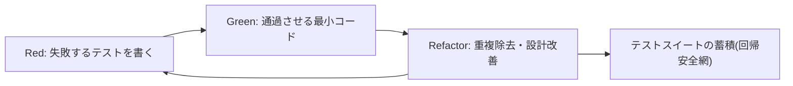
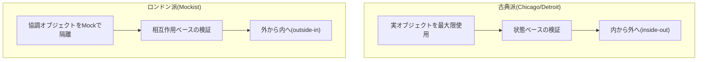

# テスト駆動開発(TDD, Test-Driven Development)

## 1. 概要

> テスト駆動開発(TDD)とは、プロダクションコードを書く前に、そのコードが満たすべき振る舞いを失敗する自動テストとして先に記述し、そのテストを通過させる最小限のコードを実装した後、重複と設計上の臭いを取り除くリファクタリングを繰り返す、進化的な設計・開発技法である。

伝統的な開発は「設計 → 実装 → テスト」の順序に従う。この順序ではテストが開発の最終段階に追いやられるため、スケジュールが逼迫すると真っ先に省略される活動となり、欠陥は結合・受入段階で遅れて発見される。欠陥の発見が遅れるほど修正コストが指数関数的に増大するというのはソフトウェア工学の古くからの経験則であり、これはTDDが解決しようとする根本的な問題意識に直結している。

TDDはこの順序を逆転させ、「テスト → 実装 → リファクタリング」として再構成する。ここでテストは単なる検証手段ではなく、**まだ存在しないコードの使い方を先に定義する実行可能な仕様(executable specification)**として機能する。開発者は「何を作るか」をテストコードで先に宣言し、その宣言を満たす方向にのみ実装を展開する。したがってTDDの成果物は、正しく動作するコードと、そのコードを文書化する回帰テストスイートを同時に確保するという点で二重の価値を持つ。

TDDはケント・ベック(Kent Beck)がエクストリーム・プログラミング(XP)の中核的プラクティスとして確立したものであり、その後アジャイル・DevOps文化の普及とともに継続的インテグレーション(CI)と結びつき、現代のソフトウェア品質確保の標準的なプラクティスとして定着した。重要なのは、TDDが「テストをたくさん書く活動」ではなく、**設計を導く(design-driving)活動**であるという点である。テストしにくいコードはたいてい結合度が高く凝集度が低いコードであるため、テストを先に書くという制約そのものが、疎結合と高凝集を強制する設計圧力として作用する。

### 1.1 登場背景と必要性

第一に、**欠陥の遅い発見のコスト**のためである。要件段階で発見された欠陥のコストを1とすると、運用段階で発見された同じ欠陥の修正コストは数十倍から数百倍に達するというのが、多くの実証研究に共通する傾向である。TDDはコードを書くその瞬間にテストが共に存在するため、欠陥の発見時点を開発時点まで最大限前倒しする(shift-left)。

第二に、**回帰(regression)への恐れ**のためである。テストという安全網のないコードベースでは、小さな修正でも予期せぬ副作用を生みうるため、開発者はリファクタリングや改善を避けるようになり、これが技術的負債の蓄積につながる。TDDが残す緻密なテストスイートは「変更しても既存の振る舞いは壊れない」という確信を与え、継続的な改善を可能にする。

第三に、**仕様の曖昧さと過剰設計**の問題のためである。要件がコードに移される過程で、開発者はしばしばまだ必要のない機能まで先回りして設計する(YAGNI違反)。TDDは「現在失敗しているテストを通過させるのに必要な最小限のコードだけを書く」よう強制することで過剰設計を抑制し、実際の要求をコードレベルの検証可能な形で固定する。

第四に、**生きたドキュメント(living documentation)の必要性**のためである。別途作成した設計文書はコードが変更された瞬間に古い情報となって信頼を失うが、テストはビルドのたびに実行され、合否によって自らが最新状態であることを自ら証明する。よく書かれたテスト名とシナリオは「このコンポーネントがどの入力にどう反応するか」を常に正確に説明するドキュメントの役割を果たし、新メンバーのオンボーディングや保守時のコード理解コストを大きく下げる。

## 2. TDDの中核サイクル — Red-Green-Refactor

TDDの心臓部は、非常に短い周期で繰り返される3段階のマイクロサイクルである。1サイクルは通常数分以内に保たれ、この短いフィードバックループが開発者の認知負荷を下げ、方向のずれを早期に修正する中核的なメカニズムである。

**A. Red(失敗)段階** — まだ実装されていない振る舞いを検証するテストを先に書く。このテストは当然失敗しなければならず、失敗を確認すること自体が重要である。失敗を見ずに先へ進むと、テストが実際に何かを検証しているのか確信できないからである。Red段階は、開発者に「何を、どのようなインターフェースで作るか」を利用者(呼び出し側)の視点から先に決めさせる。例えばショッピングカートの合計機能を作るなら、`cart.total()`がどの入力にどの値を返すべきかをAPIの形で先に確定させる。このとき、テストがコンパイルすら通らない状態も「失敗」の一形態とみなす。

**B. Green(成功)段階** — 今書いた失敗するテストを通過させるのに必要な**最も単純で最小限のコード**を書く。この段階の目標は「エレガントなコード」ではなく「動くコード」である。定数をそのまま返す仮実装(fake it)やハードコーディングさえ許される。重要なのは、できるだけ早くグリーンバー(all pass)を回復し、安定した基盤の上に立つことである。ケント・ベックはこれを「まず通過させ、罪はあとで洗い流せ」という観点で説明している。

**C. Refactor(改善)段階** — すべてのテストが通過している安全な状態で、コードの重複を除去し、名前を改善し、構造を整える。この段階では外部から観察される振る舞いを決して変えず、内部構造のみを整理する。リファクタリングの最中も頻繁にテストを実行してグリーンの状態を維持することが肝要である。Red-Greenが機能を追加する段階だとすれば、Refactorは設計品質を確保する段階であり、この二つのリズムこそがTDDの本質である。

この3段階を支えるため、開発者は状況に応じて三つの進行戦略を選択する。明白な実装(obvious implementation)は答えが自明なときにすぐ書く方式であり、仮実装(fake it)は定数を返した後に段階的に一般化する方式であり、三角測量(triangulation)は二つ以上の異なる例示テストによって一般化の方向を強制する方式である。例えば加算関数において`add(2,3)=5`一つだけでは`return 5`でも通過するが、`add(4,1)=5`と`add(2,2)=4`を追加すれば、実際の加算ロジックに収束せざるを得ない。

### 2.1 サイクルのリズムと歩幅の調整

TDD熟達の核心は、1サイクルで扱う「歩幅(step size)」を状況に応じて調整する感覚である。慣れていて自明なロジックは明白な実装で大きな歩幅をとってサイクルを素早く回し、不確実な領域や失敗が繰り返される領域では、仮実装と三角測量で歩幅を細かく刻み、一度に一つの決定だけを下す。失敗が2~3回連続したら歩幅が大きすぎるというサインとみなし、より小さなテストに戻るのが定石である。このように歩幅を動的に調整する規律がなければ、TDDは形式だけが残り、デバッグ地獄へと逆戻りする。

また、各サイクルは必ずコミット可能なグリーン状態で終わらなければならない。これはいつでも最後の安定地点に戻れるようにして心理的安全性を提供し、トランクベース開発における頻繁な統合を可能にする技術的前提となる。

一方、リファクタリング段階を習慣的に省略すると、TDDは半分しか実践していないことになる。Red-Greenだけを繰り返すと通過するコードは積み上がるが、設計負債も同時に蓄積し、最終的には変更困難なコードベースに帰結する。逆にグリーン状態を確保しないままリファクタリングを試みると、振る舞いの変更と構造の変更が混ざり合い、原因の追跡が不可能になる。したがって「グリーンのときだけ構造を変え、レッドのときだけ振る舞いを加える」という分離原則を守ることが、TDDの規律の要諦である。

## 3. 良い単体テストの条件とテストダブル

TDDが残すテストが信頼されるためには、個々のテストが一定の品質基準を満たす必要がある。これは一般に**FIRST原則**として要約される。Fast(高速に実行でき頻繁に回せること)、Independent/Isolated(他のテストや実行順序に依存しないこと)、Repeatable(どの環境でも同じ結果を出すこと)、Self-validating(人の目ではなく合否で自動判定されること)、Timely(プロダクションコードの直前に適時に書かれること)である。この原則が崩れると、テストはかえって開発速度を蝕む負債となる。

個々のテストは一般に**AAAパターン**(Arrange-Act-Assert)で構造化される。準備(Arrange)で入力と協調オブジェクトを設定し、実行(Act)で検証対象の振る舞いを呼び出し、表明(Assert)で期待結果を確認する。一つのテストは一つの論理的関心事だけを検証するよう小さく保つのが理想である。

実際のシステムは、データベース、外部API、時刻、ファイルといった外部依存を持つ。これらをそのまま使うとテストが遅く不安定になるため、それを代替する**テストダブル(Test Double)**を用いる。次の表は主なテストダブルを区分したものであるが、実務ではこの区分が曖昧になる場合が多いことも併せて考慮すべきである。

| 種類 | 役割 | 検証の焦点 | 例 |
|------|------|-----------|------|
| Dummy | 場所を埋めるだけの未使用オブジェクト | なし | コンストラクタ引数を埋める |
| Stub | あらかじめ決めた応答を返す | 状態(state) | 固定為替レートを返す偽API |
| Spy | 呼び出しの事実・引数を記録 | 相互作用 | メール送信有無の記録 |
| Mock | 期待する呼び出しを事前に指定・検証 | 相互作用(behavior) | 「決済1回呼び出し」の検証 |
| Fake | 単純化された実際の実装 | 状態 | インメモリDB、インメモリリポジトリ |

ここで状態検証と相互作用検証の選択は、単なるツールの問題ではなく設計哲学の問題である。Mockを過度に使用すると、テストが実装の詳細(どのメソッドを何回呼んだか)に結合し、振る舞いが同じであるにもかかわらず内部リファクタリングだけでテストが壊れる**脆いテスト(fragile test)**が発生する。したがって可能な限り状態検証を優先し、副作用やプロトコルの検証が本質である場合にのみ相互作用検証を用いるのが望ましい。

テストダブル選択の実務指針を整理すると次のとおりである。第一に、値を計算する純粋なロジックはダブルなしで実オブジェクトによって検証するのが最も堅牢である。第二に、応答が必要なだけで検証対象ではない協調者はStubで代替する。第三に、「メールが実際に送信されたか」のように副作用そのものが要件である場合にのみ、SpyやMockで相互作用を検証する。第四に、データベースやストレージのように状態を持つ依存はインメモリFakeで代替すれば、状態検証の堅牢さと実行速度を同時に得られる。この基準をチーム標準として固定すれば、開発者ごとにばらばらなダブルの使い方によってテスト品質が不揃いになる問題を減らすことができる。

## 4. TDDの二つの学派 — 古典派とロンドン派

TDDは単一のプラクティスではなく、協調オブジェクトの扱い方によって二つの流派に分かれ、この違いを理解してこそプロジェクトの性格に合った方式を選択できる。

**古典派(Classicist, Chicago school)**は、ケント・ベックの原型に近い。実際の協調オブジェクトを最大限使用し、遅い依存や非決定的な依存のみをFakeで代替し、最終状態を検証する。この方式は複数のオブジェクトが協調した結果を併せて検証するためリファクタリングに強いが、失敗時に原因箇所を絞り込みにくく、設計が事後的に浮かび上がる傾向がある。

**ロンドン派(Mockist, London school)**は、検証対象オブジェクトを協調オブジェクトからMockで徹底的に隔離し、オブジェクト間のメッセージの流れ(相互作用)を検証する。上位の受入テストから出発し、必要な協調者をMockで発見しながら内側へ降りていく「外から内へ(outside-in)」方式と相性がよく、まだ存在しないオブジェクトのインターフェースを設計の観点から先に導き出すのに有利である。ただし、Mockの乱用によってテストが実装に結合するリスクが大きい。

実務では両者を排他的に選ぶよりも、ドメインロジックの中核部は古典派的な状態検証で、外部システムとの境界(アダプタ)はロンドン派的な相互作用検証で扱う混合戦略が一般的である。例えば、決済ドメインの計算ロジックは実際の値オブジェクトで検証し、外部PG(決済代行)事業者との連携部分はMockで「正確なリクエストが1回送信されたか」を検証するといった具合である。

## 5. TDDと類似技法の比較 — BDD・ATDD

TDDは開発者視点の単体レベルの技法であり、ステークホルダーの要求を扱う上位の技法と組み合わされたときに最大の効果を発揮する。次の比較は単なる用語の区別ではなく、「誰が、どのような言語で、どのレベルを検証するか」の違いとして理解すべきである。

| 区分 | TDD | BDD | ATDD |
|------|-----|-----|------|
| 焦点 | コードの内部動作 | システムの振る舞い・シナリオ | 受入条件の充足 |
| 主な作成者 | 開発者 | 開発者+企画+QA | 顧客+開発+QA |
| 表現 | 単体テストコード | Given-When-Then | 受入基準の例示 |
| レベル | 単体(micro) | 機能・シナリオ | 要件(feature) |
| 代表的ツール | xUnit系 | Cucumber, SpecFlow | FitNesse, Robot |

BDD(振る舞い駆動開発)は、TDDの「テスト」という用語が検証だけに焦点を当てさせるという限界を克服するため、ビジネス側が理解できる自然言語に近いシナリオ(Given-When-Then)で振る舞いを記述する。すなわちBDDはTDDを置き換えるものではなく、要件の発見と共通言語(ubiquitous language)の形成という上位の目的を加えた拡張とみなすのが正確である。ATDD(受入テスト駆動開発)は、開発着手前に顧客とともに受入条件を実行可能な例示として合意し、要件の誤解を根本から減らす。

実務適用では、外側のATDD/BDDシナリオが「何を作るか」の方向を定め、その内側で開発者がTDDサイクルによって詳細を実装する**二重ループ(double-loop)構造**が広く用いられている。これは要求の整合性とコード品質を同時に確保する現実的な組み合わせである。

## 6. 適用事例 — 決済手数料計算モジュール

具体例として、ECプラットフォームの決済手数料計算モジュールをTDDで開発する状況を想定する。要求は「決済金額の2.5%を手数料として課すが、最低手数料は100ウォン、10万ウォン以上の決済にはプロモーションとして2.0%を適用する」である。開発者はまず最も単純なケースである`fee(10000) == 250`を失敗テストとして書く(Red)。続いて`return amount * 0.025`で通過させ(Green)、リファクタリングすべきものがないので次のケースに進む。

次に最低手数料ルールを検証する`fee(1000) == 100`を追加すると(1000の2.5%は25ウォンなので100ウォンに引き上げられなければならない)、既存の実装は失敗する(Red)。下限を適用する分岐を追加して通過させた後(Green)、マジックナンバー100と0.025を定数として抽出し、条件式を整理する(Refactor)。最後に`fee(100000) == 2000`(10万ウォンの2.0%)と境界値`fee(99999)`を三角測量として追加すると、プロモーション料率の分岐が自然に導き出される。この過程で境界値(ちょうど10万ウォン、その直前)、下限適用区間、料率の切り替わり点がすべてテストとして固定されるため、その後料率ポリシーが変わっても回帰安全網の上で安全に修正できる。

この事例が示す核心は、TDDが要求の**境界条件をコードより先に明示的に浮かび上がらせる**という点である。伝統的な方式では「10万ウォンのときは2.5%か2.0%か」といった曖昧さが実装後のQA段階になって初めて発見されるが、TDDはテストを書いた瞬間にこの曖昧さに開発者自身が向き合い、仕様として確定させる。実際の金融・決済ドメインのように境界条件の誤りがそのまま金銭的損失につながる領域でTDDの投資効果が特に大きい理由はここにある。

## 7. 深掘り — CI/CD連携、レガシーへの適用、そして最近の動向

TDDの価値は、継続的インテグレーション・デプロイのパイプラインと結びついたときに倍増する。開発者が残した単体テストはCIパイプラインの最初の関門(commit stage)でコミットごとに自動実行され、欠陥が統合された瞬間にビルドを失敗させ、責任の所在を絞り込む。これはDevOpsの「迅速なフィードバック」とトランクベース開発を支える技術的基盤となる。実際、DORAの研究が強調する高業績組織の特性であるデプロイ頻度の向上と変更失敗率の低下は、信頼できる自動テストなしには成立しにくい。

**レガシーコードへの適用**は、現場で最も難しい点である。テストがまったくないコードにいきなりTDDを適用することはできないため、マイケル・フェザーズが提示したアプローチのように、まず現在の振る舞いをそのまま固定する**仕様化テスト(characterization test)**で安全網を作り、その後依存を断ち切る「接合部(seam)」を導入してテスト可能な構造へと段階的に転換する。すなわちレガシーでは「正しい振る舞い」ではなく「現在の振る舞い」をまず捕捉するという逆順の戦略が必要である。

最近の動向としては三つが顕著である。第一に、生成AIコーディングツールの普及によりテストコードの自動生成が容易になったことで、逆説的に「何を検証するか」を人が仕様として規定するTDDの思考法がより重要になっている。AIが生成したコードの正確性を判定するオラクルとしてテストが機能するためである。第二に、単純な行カバレッジの限界を補うため、テストが実際に欠陥を検出できるかを検証するミューテーションテスト、そして例示の代わりに不変条件を検証するプロパティベーステストが、TDDスイートの品質を定量的に補強する手段として併用されている。第三に、契約テスト(contract test)が、マイクロサービス環境でサービス間の境界をTDD的に固定するプラクティスとして広がっている。

特に生成AIとの結合は、TDDの役割を再定義する方向へと進化している。人が失敗テストで要求を規定するとAIがそれを通過させる実装を提案し、人は再び境界条件や例外シナリオをテストとして追加してAIの成果物を検証・修正するという協業ループが形成される。この構造においてテストスイートは、AIの自由度を制限する「実行可能な契約」として機能し、AIが要求から逸脱したり既存の振る舞いを損なったりすることを即座に阻止する。すなわち自動化がコード生産を担うほど、何が正しい振る舞いかを規定する仕様作成能力が開発者の中核能力へと移り、TDDはその仕様をコードとして残す最も実践的な手段となる。

## 8. 考慮事項および示唆点

第一に、**TDDは万能ではなく、適用対象を選別すべきである。** ロジックの複雑度が高く回帰リスクの大きいドメインの中核部で投資対効果が大きい。一方、探索的プロトタイピング、UIのピクセルレイアウト、要求が急変する初期のスパイク段階では、かえって負担となりうるため、組織はTDDの適用範囲について明確な戦略を策定すべきである。

第二に、**テストそのものが資産であり負債でもあるという両面性**を認識すべきである。実装の詳細に結合した脆いテストはリファクタリングを妨げ、保守コストを増大させる。したがって、状態検証の優先、公開された振る舞い中心の検証、過度なMockの抑制といった規律を、コーディング標準・コードレビュー基準として制度化してこそ持続可能となる。

第三に、**カバレッジ数値の罠を警戒すべきである。** 高い行カバレッジが即ち高い欠陥検出力を意味するわけではない。アサーションが不十分なテストは実行するだけで検証しない。カバレッジは未検証領域を見つける補助指標としてのみ活用し、ミューテーションスコアのような欠陥検出の観点からの指標でテストの実効性を併せて管理することが、技術士の観点からの成熟したアプローチである。

第四に、**文化・能力・トレードオフの観点からの転換が必要である。** TDDは開発初期のコード作成速度をやや遅くする代わりに、中長期的な保守性と変更の安全性を高める投資である。このトレードオフを経営陣とチームが共有できなければ、スケジュールの圧力の中で真っ先に放棄される。ペアプログラミング・モブプログラミングによる知識の伝播、CIゲートによる強制、リファクタリング時間の公式な承認といった制度的な裏付けが並行されなければならない。

第五に、**テスト実行速度とフィードバックの維持**が持続可能性の条件である。スイートが大きくなるほど実行時間が延び、開発者が頻繁に実行することを嫌がるようになると、TDDの短いフィードバックループが崩れる。したがって、高速な単体テストと低速な結合・E2Eテストをテストピラミッドの原則に従って階層化し、並列実行・変更影響に基づく選択実行・テストの隔離によって、コミット段階のフィードバックを数分以内に保つ運用戦略を併用すべきである。

第六に、**関連技術との統合の展望**という観点では、TDDはリファクタリング、継続的インテグレーション、ドメイン駆動設計、マイクロサービスの契約テスト、そして生成AIベースの開発と有機的に結びついたときに真価を発揮する。今後は、AIが草案のコードとテストを生成し、人が仕様と境界条件を規定・レビューする協業モデルにおいて、TDDの「仕様優先」の思考が品質ゲートの中心軸として再評価される見通しである。

## 参考資料

- Kent Beck, "Test-Driven Development: By Example", Addison-Wesley
- Michael Feathers, "Working Effectively with Legacy Code", Prentice Hall
- Martin Fowler, "Mocks Aren't Stubs", https://martinfowler.com/articles/mocksArentStubs.html
- Steve Freeman & Nat Pryce, "Growing Object-Oriented Software, Guided by Tests"
- DORA, "Accelerate State of DevOps Report", https://dora.dev

---

> **一言まとめ**: TDDは、失敗するテストを先に書き(Red)、最小限の実装で通過させた後(Green)、構造を改善する(Refactor)という短いサイクルを繰り返すことで、検証可能な仕様・疎結合な設計・回帰安全網を同時に確保する進化的な開発技法である。
