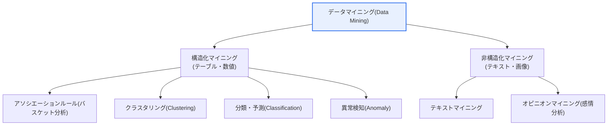

# データマイニング — 統計との違い、構造化/非構造化、オピニオン・テキストマイニング

## 1. 概要

### A. 定義

> **データマイニング(Data Mining)** とは、大量のデータに潜むパターン・規則・相関関係・知識を、統計・機械学習・データベース技術を組み合わせて**自動または半自動で発見**する技法である。そのうち**テキストマイニング(Text Mining)** は非構造化テキストから情報・トピック・関係を抽出する応用であり、**オピニオンマイニング(Opinion Mining、感情分析)** はテキストに込められた感情・意見の極性(肯定/否定/中立)と強度を判別する、テキストマイニングの下位分野である。

データマイニングを正しく理解するには、まず「**統計と何が違うのか**」という問いから出発しなければならない。伝統的な統計は、分析者がまず仮説を立て、標本を抽出してその仮説の有意性を検証する**演繹的・確認的(confirmatory)** アプローチである。例えば「今回のプロモーションは売上を有意に押し上げたか?」という命題をt検定で判定する。一方データマイニングは、仮説が明示的に与えられていない状態で膨大なデータそのものに語らせ、**事前に知らなかったパターンを見つけ出す帰納的・探索的(exploratory)** アプローチである。「売上とともに動く隠れた要因は何か?」をデータから発掘する。この違いは単なる好みの問題ではなく、データの規模が標本を超えて全数に近づき、変数の数が数百・数千に増えたビッグデータ環境では、仮説を一つひとつ立てて検証する方式が現実的に不可能になったために生じた方法論的進化である。

データマイニングが独立した学問・実務領域として定着した背景には三つの力がある。第一は**データの爆発的増加**である。POS・Webログ・センサー・SNSが刻一刻とデータを吐き出すようになり、人が目で眺めて規則を見つけることが不可能になった。第二は**保存・演算コストの低下**である。分散ストレージ(HDFS・オブジェクトストレージ)と並列演算(Sparkなど)が普及したことで、全数データを繰り返し走査するアルゴリズムを現実的なコストで実行できるようになった。第三は**意思決定のデータ化**の要求である。経験と直感の代わりにデータの根拠に基づいて判断しようとする組織文化が広がり、構造化された取引データだけでなく、レビュー・苦情・ソーシャルなどの非構造化テキストまで分析対象に取り込むようになった。データが構造化(テーブル・数値)であればアソシエーションルール・クラスタリング・分類・回帰を用い、非構造化(テキスト・画像・音声)であればテキスト・オピニオンマイニングのような特化した技法が必要となる。

### B. データマイニングと統計の違い

統計とデータマイニングは対立するものではなく、**目的とデータ環境が異なるだけで相互に補完**し合う。統計は標本から母集団を推論し、不確実性を定量化(信頼区間・p値)することに強く、データマイニングは大量データから事前の仮定なしにパターンを見つけて予測モデルを構築することに強い。実務では、データマイニングで候補パターンを発掘した後、統計的検定でそのパターンが偶然ではないことを確認する形で組み合わせる。違いが生じる根本的な理由は、「仮説を先に置くのか(統計)、データに先に語らせるのか(マイニング)」という**認識の出発点**の違いにある。

| 区分 | 統計 | データマイニング |
|---|---|---|
| **アプローチ** | 演繹的・確認的(仮説検証) | 帰納的・探索的(パターン発見) |
| **データ** | 標本中心、小・中規模 | 大量・全数データ、高次元 |
| **目的** | 仮説の統計的有意性の確認 | 未知のパターン・規則・予測モデルの発見 |
| **前提** | 分布・モデルの仮定(正規性など) | 仮定は最小限、データ主導 |
| **結果の解釈** | 因果・有意性中心 | 相関・予測力中心 |

この表の各行は「なぜそうなのか」と併せて読む必要がある。統計が分布の仮定を置くのは、標本から母集団を推論するために数学的根拠が必要だからであり、データマイニングが仮定を最小化するのは、全数に近いデータでは推論よりもデータに内在する構造そのもののほうが信頼に足るからである。また、統計が因果・有意性に集中するのに対しマイニングが相関・予測力に集中するのは、マイニングの目的が「なぜそうなのか」の説明よりも「次に何が起きるか」の予測にある場合が多いためである。

## 2. データマイニングの全体構造と主要技法

データマイニングは単一のアルゴリズムではなく、目的に応じて分岐する**技法群の集合**である。大きくは何を知りたいかによって、アソシエーション(同時に起きるもの)、クラスタリング(似たもの同士をまとめる)、分類/予測(正解を当てる)、異常検知(正常から外れたもの)に分けられる。以下の構造図はデータマイニングの大きな系統を、続く詳細図は構造化・非構造化データの処理の流れを示す。

**アソシエーションルール(Association Rule)** は、「ビールを買った顧客はおむつも一緒に買う」のような項目間の同時発生ルールを、支持度(support)・信頼度(confidence)・リフト値(lift)で定量化する。これは商品推薦・売り場配置・クロスセルの根拠となる。例えば、あるルールの支持度が5%、信頼度が60%、リフト値が2.5であれば、「二つの商品が偶然よりも2.5倍多く一緒に売れる」という実務的な意味に解釈され、バンドル商品の企画に用いられる。

これらの技法を実際のプロジェクトで組み立てる標準的な手順としては、**CRISP-DM(Cross-Industry Standard Process for Data Mining)** が広く用いられている。これは、① ビジネス理解 → ② データ理解 → ③ データ準備 → ④ モデリング → ⑤ 評価 → ⑥ 展開の6段階を反復・循環させる方法論である。この手順が強調する核心は「アルゴリズムよりもその前後が重要である」という点である。何を解くべきか(ビジネス理解)と結果をどう使うか(展開)が不明確であれば、いかに精緻なモデルも現場で捨てられる。実際、データマイニングプロジェクトの工数の半分以上はモデリングではなくデータ準備(クレンジング・統合・変換)に費やされるというのが現場の経験則であり、テキストマイニングでは前処理の比重がさらに大きくなる。

もう一つ留意すべき点は、発見したパターンが**行動に移せる(actionable)** ものかどうかの判別である。「雨の日には傘がよく売れる」のように自明であったり制御不能であったりするパターンは、統計的に強くても価値が低い。逆に、支持度は低くても収益性の高いニッチなルールは実務上価値がある。したがってデータマイニングの成果は、アルゴリズムの精度だけでなく、その結果が意思決定と実行につながるかどうかによって最終的に評価される。

**クラスタリング(Clustering)** は、正解ラベルなしに似た個体同士をまとめる教師なし学習であり、顧客セグメンテーション(RFMに基づく優良顧客・離反リスク顧客の区分)に広く用いられる。クラスタリングは「事前にいくつの集団があるか分からない」という点で探索的であり、マーケティング戦略を集団別に差別化する出発点となる。**分類・予測(Classification・Regression)** は、過去の正解がある教師あり学習であり、離反予測・倒産予測・スパム判別などに用いられ、正解率・適合率・再現率で性能を評価する。**異常検知(Anomaly Detection)** は、正常パターンから大きく外れた観測値を見つけ、カード不正取引・設備故障・侵入検知に活用される。

### 構造化 vs 非構造化データマイニング

構造化と非構造化の根本的な違いは、「**コンピュータがそのまま計算できる形か**」である。構造化データはすでに行・列の数値・カテゴリとして構造化されているため前処理が比較的軽いが、非構造化テキストは人間の言語であるため、形態素解析・ストップワード除去・ベクトル化(埋め込み)という重い変換を経て初めて数値となり、この過程で意味の損失・歪みが生じうる。そのため非構造化マイニングでは、「意味をどれだけうまく数値として保存できるか」が成否を分ける。

| 区分 | 構造化データマイニング | 非構造化データマイニング |
|---|---|---|
| **対象** | テーブル・数値(取引・ログ) | テキスト・画像・音声 |
| **技法** | アソシエーションルール・クラスタリング・分類・回帰 | テキスト・オピニオンマイニング、NLP |
| **前処理** | クレンジング・欠損値/外れ値処理・正規化 | 形態素解析・ストップワード除去・ベクトル化(埋め込み) |
| **難易度** | 比較的低い | 高い(意味理解・文脈が必要) |
| **評価** | 正解率・RMSEなど明確 | 正解が曖昧、人手のラベリングに依存 |

## 3. テキストマイニングとオピニオンマイニング

### A. テキストマイニングの処理の流れ

テキストマイニングは、非構造化文書の山をコンピュータが扱える構造に変換し、そこからキーワード・トピック・関係・要約を抽出する一連の過程である。核心は「言語を数値に変えるベクトル化」にある。初期には単語の出現頻度を数えるTF-IDFやBag-of-Wordsを用いたが、これは単語の順序と文脈を捨てるという限界があった。その後、Word2Vecのような分散表現が単語の意味的類似性をベクトル間の距離として表現できるようにし、近年ではBERT・GPT系の文脈埋め込みが、同じ単語であっても文中の位置によって異なるベクトルを与えることで、「bank」が川岸なのか金融機関なのかまで区別する。

前処理段階において、韓国語は英語よりも扱いが難しい。英語は分かち書きによって単語が比較的よく分離されるが、韓国語は助詞・語尾が付く膠着語であるため(日本語も同様である)、形態素解析器(例: Mecab・Okt)で「먹었다(食べた) → 먹/다」のように語幹を抽出して初めて、同じ意味の表現を一つにまとめることができる。この段階の品質が低いとその後のすべての分析が揺らぐため、ドメイン辞書(新語・専門用語)を整備することが実務の鍵となる。

### B. オピニオンマイニングの実施手順

オピニオンマイニング(感情分析)は、レビュー・SNS・苦情などから人々の意見の傾向と強度を判別する。実施手順は、① 対象テキストの収集 → ② 前処理(形態素解析・ストップワード除去) → ③ 感情辞書または機械学習・ディープラーニングによる肯定/否定/中立の分類 → ④ 意見の集計・可視化の順である。アプローチは大きく二つに分かれる。**辞書ベース(lexicon)** 方式は「良い=+2、悪い=-2」のように感情スコアを付与した辞書で文のスコアを合算する方式であり、解釈は透明だが新語・ドメイン固有の表現に弱い。**機械学習・ディープラーニングベース**の方式は人がラベリングしたデータでモデルを学習させて文脈を反映するが、良質な学習データが必要であり、判断根拠が不透明であるというトレードオフがある。

| 区分 | テキストマイニング | オピニオンマイニング |
|---|---|---|
| **目的** | テキストから情報・トピックを抽出 | テキストの感情・意見・態度を分析 |
| **出力** | キーワード・トピック・要約・文書分類 | 肯定/否定/中立、感情スコア・強度 |
| **関係** | 上位(包括的)技法 | テキストマイニングの応用(下位) |
| **活用** | 文書分類・検索・要約・トピックモデリング | 商品評判・世論・ブランドモニタリング |
| **難点** | ベクトル化・多義語の処理 | 皮肉・文脈・ドメインによる極性反転 |

すなわちオピニオンマイニングはテキストマイニングの一応用であり、単に情報を抽出するだけでなく、その中の「態度(感情)」まで読み取る点が差別化要素である。近年では、文全体の極性だけを見るのではなく、「画面は良いがバッテリーはいまひとつ」のように**属性(aspect)別の感情**を分けて分析するABSA(Aspect-Based Sentiment Analysis)が、製品改善の実質的な根拠として注目されている。

## 4. 産業適用事例

具体的な事例によって実効性を推し量ることができる。第一に、**EC(電子商取引)** では、数十万件の商品レビューをオピニオンマイニングで分析し、「配送遅延」「梱包破損」といった否定的キーワードが急増している商品を早期に選別して物流改善に反映する。第二に、**金融・通信**では、コールセンターの応対ログをテキストマイニングして繰り返される苦情のトピックをクラスタリングし、離反リスクの高い否定的感情の顧客を選別して、先制的な解約防止(リテンション)キャンペーンのターゲットとする。第三に、**公共・政策**分野では、SNS・ニュースコメントの世論をリアルタイムでモニタリングし、政策に対する肯定・否定の推移を追跡して危機的な論点を早期に検知する。これらの事例に共通するのは、構造化指標(売上・解約率)だけでは見えなかった「理由」を非構造化テキストからすくい上げるという点である。

このような分析が実務で力を持つのは、**構造化指標との結合**のおかげである。例えば、ある通信事業者の特定料金プランの解約率が1か月で3%ポイント上昇したとすれば、構造化データは「どれだけ」離反したかは教えてくれるが、「なぜ」かは語らない。このとき当該顧客層の応対・レビューのテキストをオピニオンマイニングすれば、「契約違約金への不満」や「速度低下」といった否定的トピックが上位に浮かび上がり、これはすぐさま料金プランの改定・ネットワーク投資という実行につながる。このように「構造化データが示した変化 → 非構造化データが示した原因 → 実行」へとつながる循環こそ、データマイニングが組織にもたらす実質的価値の典型である。逆に、テキスト分析の結果が構造化された成果指標と結びつかなければ、興味深いワードクラウドにとどまるだけで意思決定にはつながらないという点も、実務の教訓である。

## 5. 深掘り — 生成AI・LLMによるテキスト・オピニオンマイニングの転換

近年、テキスト・オピニオンマイニングの地形を最も大きく変えたのは**大規模言語モデル(LLM)** である。かつては感情分析のためにドメインごとに個別のラベル付きデータを集めてモデルを新たに学習させなければならなかったが、LLMは事前学習済みの言語理解を基盤に、少数の例を示すフューショット(few-shot)やプロンプトだけでも相当な水準の感情分類・要約・トピック抽出を実行する。これにより初期構築のコストと時間が大きく下がる。またLLMは、皮肉・当てこすり・二重否定のように従来の辞書ベース方式が弱かった文脈依存の表現を比較的うまく処理し、多言語を一つのモデルで扱えるため、グローバルな世論分析の敷居を下げる。

ただしLLMの導入には実務上の考慮が伴う。判断根拠が不透明なブラックボックス性、事実と異なる内容をもっともらしく生成するハルシネーション(hallucination)、そして大量のテキストをAPIで処理する際のコスト・遅延・データ流出リスクである。そのため実際の現場では、機密データは社内に置いて軽量モデルをファインチューニングしたり、LLMを一次分類にのみ用いて最終判断はルール・人手のレビューで補正したりするハイブリッド構成が増えている。技術士の観点では、これは「最新技術を無条件に導入する」ことではなく、**精度・コスト・セキュリティ・説明可能性の均衡点**を設計する問題に帰結する。

## 6. 考慮事項および示唆点

1. **非構造化データの前処理品質が成否を左右する。** 形態素解析・ストップワード除去・ベクトル化の品質がその後のすべての分析結果を決定するため、言語・ドメインの特性を反映した辞書とパイプラインの標準化に優先的に投資すべきである。
2. **文脈・皮肉・ドメインによる極性反転が最大の難題である。** 同じ「ヤバい」が称賛にも非難にもなりうるように、ドメインごとに極性が逆転するため、文脈を理解するディープラーニング・LLMと属性ベース(ABSA)の分析で精度を引き上げつつ、人手のレビューで誤分類を補正する体制が必要である。
3. **構造化・非構造化・統計の結合が価値を生む。** マイニングで発掘したパターンを統計で検証し、テキストが示した「理由」を構造化指標(売上・離反)と結びつけてこそ、実行可能なインサイトとなる。単一の技法に依存しない設計が核心である。
4. **データ倫理・プライバシー・バイアスを設計に内在化すべきである。** レビュー・SNSのテキストには個人情報や社会的バイアスが混在しており、収集の同意・非識別化・バイアス緩和をパイプラインに反映しなければ、法的・評判上のリスクとして跳ね返ってくる。
5. **評価の難しさを認め、継続的な改善体制を整える。** テキスト分析は正解が曖昧であるため、定期的なサンプルレビュー・再ラベリング・モデル再学習を前提としたMLOpsの観点での運用が、一回限りの構築よりも重要である。

## 参考資料

- Bing Liu, "Sentiment Analysis and Opinion Mining", Morgan & Claypool (概論): https://www.cs.uic.edu/~liub/FBS/sentiment-analysis.html
- scikit-learn, Working with Text Data(TF-IDF・分類): https://scikit-learn.org/stable/tutorial/text_analytics/working_with_text_data.html
- Google, Word2Vec / 埋め込みの概要: https://developers.google.com/machine-learning/crash-course/embeddings

---

> **一言まとめ**: データマイニングは*仮説検証を行う統計とは異なり、大量データからパターンを発見する* 探索的技法であり、構造化(アソシエーション・クラスタリング・分類)と非構造化(テキスト・オピニオンマイニング)に分かれ、オピニオンマイニングはテキストの態度(感情)まで読み取るテキストマイニングの応用として、LLMの力を得て精度・多言語対応・リアルタイム性が大きく向上している。
