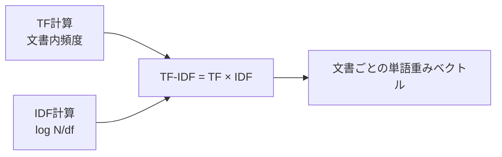

# TF-IDF (Term Frequency – Inverse Document Frequency)

## 1. 概要

### A. 定義
> 文書集合(コーパス)の中で、**ある単語が特定の文書をどれだけよく代表しているか**を数値化する重み付け技法である。ある文書で頻繁に出現し(**TF**)、文書全体では稀にしか出現しない(**IDF**)単語ほど高い重みを与える。

### B. 登場背景および必要性
文書をベクトルで表現する最も単純な方法は、単語の出現頻度(Bag-of-Words)をそのまま数えることである。しかしこの方式では、「は/が/の/を」や「the/of/and」のような**ストップワードがどの文書にも多く出現するため、頻度だけではむしろこうしたありふれた単語が文書を代表しているかのように歪められる**。TF-IDFはこの問題を「**ありふれた単語には弁別力がない**」という直観で解決する。すべての文書に広く現れる単語は特定の文書を区別するのに役立たないためIDFで重みを削り、特定の文書に集中して現れる単語に重みを乗せることで、**文書の特徴語(keyword)** を浮かび上がらせる。単純・高速でありながら解釈が明確であるため、検索エンジンのランキング、文書分類、キーワード抽出における長年の標準となった。

## 2. 計算式と各項の意味

TF-IDFは二つの要素の積として定義され、各項がそれぞれ異なる方向から単語の重要度を調整する。

| 項目 | 定義 | 直観的な意味 |
|---|---|---|
| **TF(t,d)** | 文書dにおける単語tの出現頻度(または正規化頻度) | この文書でどれだけ頻繁に使われたか → 局所的重要度 |
| **IDF(t)** | **log( N / df(t) )**, N=全文書数, df=tが出現した文書数 | コーパス全体でどれだけ稀か → 弁別力 |
| **TF-IDF** | **TF(t,d) × IDF(t)** | 局所的頻度 × 大域的希少度 |

> IDFに対数をとる理由は二つある。第一に、文書数が多いときにN/dfが過度に大きくなるのを緩やかに抑え、TFとのバランスをとる。第二に、単語がありふれたものになるほど(df↑)値が滑らかに小さくなり、すべての文書に出現すれば(df=N)log 1 = 0となって、**弁別力のない単語の重みが自然に0へと消去**される。

TFにも対数スケーリング(1+log TF)や文書長の正規化を適用する変形がよく見られる。同じ単語が3回出現したからといって、1回出現した文書よりも重要度がちょうど3倍であるとは言いがたいため、頻度の限界効用逓減を反映しようとするものである。

## 3. 計算過程(例)

計算は、TFとIDFをそれぞれ求めた後に掛け合わせるという単純な流れである。全文書数N=3で、単語「AI」が3文書中2文書に出現する(df=2)状況を考える。

- IDF(AI) = log(3/2) = log(1.5) ≈ **0.176** (問題で与えられたlogの値をそのまま使用)
- 文書1で「AI」が3回出現(TF=3) → TF-IDF = 3 × 0.176 ≈ **0.528**

もしある単語が3文書すべてに出現すれば、df=3、IDF=log(3/3)=log 1=0となり、TFがどれほど大きくてもTF-IDFは0となる。これこそが「**ありふれた単語は特徴語ではない**」という原理が数式として実装される点である。このように各文書を単語ごとのTF-IDF値のベクトルとして表現すれば、文書間の類似度(コサイン類似度)やクエリと文書のマッチングスコアを計算できる。

## 4. 特徴と限界

TF-IDFの強みは、計算が軽く、結果を人間が解釈できる点にある。しかし根本的に、**単語を独立した記号としてのみ扱うため、意味を理解できない。**

| 区分 | 内容 | 理由 |
|---|---|---|
| **長所** | 単純・高速、解釈が容易、特徴語抽出に効果的 | 統計的な頻度ベースのため学習不要 |
| **限界** | 意味・文脈・語順を反映しない | 単語を原子的なトークンとしてのみ扱う |
| **限界** | 同義語・多義語を処理できない | 「車」と「自動車」を別の単語とみなす |
| **限界** | 高次元の疎(sparse)ベクトル | 語彙数だけ次元があり、大部分が0 |
| **代替** | Word2Vec・BERTなどの埋め込み | 文脈・意味を密ベクトルとして学習 |

例えば「銀行預金」の「bank」と「川岸(river bank)」の「bank」はまったく異なる意味だが、TF-IDFは同じ単語として処理するため文脈を区別できない。こうした意味・文脈の問題を解決するために、単語を密ベクトルとして学習する**埋め込み(Word2Vec, BERT)** が登場した。

## 5. 考慮事項および示唆点
- **前処理が品質を左右する**: トークン化・ストップワード除去・ステミング・正規化の品質がTF-IDFの結果を決定する。特に韓国語(および日本語)では、助詞・語尾を処理するための形態素解析が先行しなければならない。
- **依然として有効な基盤技術**: 意味ベースの埋め込みが発展したものの、TF-IDFの進化形である**BM25**は、文書長の正規化と頻度の飽和を反映し、現在でも検索ランキングの強力なベースライン(baseline)として用いられている。
- **RAGハイブリッド検索との結合**: 最新のRAGパイプラインは、意味を捉えるベクトル(埋め込み)検索と、正確なキーワードマッチングに強いBM25/TF-IDF検索を**ハイブリッド**に組み合わせ、互いの弱点を相互補完する方式で検索精度を引き上げている。

---

> **一言まとめ**: TF-IDFは*TF(文書内頻度) × IDF(log N/df)* で単語の重要度を計算し、特定の文書には頻繁に、全体では稀に出現する特徴語に高い重みを与える技法であり、ありふれた単語を自動的に消去する長所があるが、意味・文脈を反映できないため埋め込み・BM25へと発展し、RAGのハイブリッド検索で併用されている。
