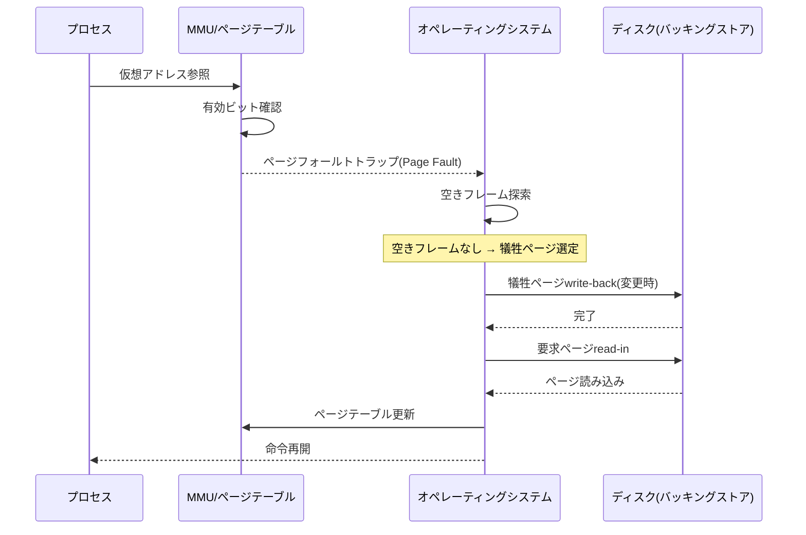

# スラッシング(Thrashing)

## 1. 概要

### A. 定義
> **スラッシング(Thrashing)** とは、仮想記憶システムにおいて**ページフォールト(Page Fault)が過度に発生し、CPUが実際の演算よりもページ置換(スワッピング)に多くの時間を費やすことで、システムのスループット(throughput)が急激に崩壊する現象**である。多重プログラミングの度合い(degree of multiprogramming)が臨界点を超えた瞬間にCPU利用率が垂直に急落することがその兆候である。

スラッシングの本質は、「**仕事はせずにページの入れ替えばかりを繰り返す**」という点にある。仮想記憶は、プログラム全体を物理メモリに載せるのではなく、実行に必要なページだけをデマンドページング(demand paging)で載せておく技法である。これにより、物理メモリより大きなプログラムを実行し、複数のプロセスを同時に動かすことができる。しかしこの技法は「必要なページはすでにメモリ上にあるだろう」という参照の局所性の仮定の上に成り立っており、この仮定が崩れた瞬間、システムはスラッシングによって崩壊する。

問題の根源は、**物理メモリ(フレーム)の総量は有限であるのに、実行しようとするプロセスが多すぎる**という点にある。各プロセスが自らの作業に必要な最小限のページ集合すら確保できなければ、ページAを載せるためにBを追い出し(page-out)、すぐにBが再び必要になってCを追い出してBを載せ、その間にAがまた必要になるという「ページの奪い合い」が際限なく繰り返される。CPUは肝心の命令を実行できないまま、ディスク入出力の完了をただ待つことになる。実際、ページフォールト1回の処理コストは数ミリ秒(HDDで約5~10ms、SSDでも数十~数百マイクロ秒)程度であり、ナノ秒単位であるCPUの命令実行よりも数万倍以上遅い。フォールト率がわずかに上昇するだけで実効アクセス時間が爆発的に増える理由はここにある。

さらに、**オペレーティングシステムの誤判断が悪循環を完成させる**。スラッシングが始まるとCPU利用率が底を打つが、中期スケジューラ(スケジューリングポリシー)はこれを「CPUが暇である」と解釈し、多重プログラミングの度合いをさらに高める。プロセスが追加投入されるとフレームの競合はさらに激化し、ページフォールトはさらに急増し、CPU利用率はさらに低下する。このフィードバックループ(feedback loop)こそが、スラッシングを単なる性能低下ではなく「自己強化型の崩壊」にする核心である。したがってスラッシングは、資源を増やすことではなく、**多重プログラミングの度合いを統制**することで根本的に脱却できる。

### B. スラッシングの特徴
スラッシングは、単なる過負荷と区別されるいくつかの特徴を持つ。第一に、**非線形的な崩壊**である。負荷が徐々に増えるときに性能も緩やかに低下するのではなく、臨界点を過ぎた瞬間に崖のように急落する。第二に、**低いCPU利用率と高いディスク活動の同時出現**という逆説的な指標を示す。表面上CPUは遊んでいるのに、システムは麻痺状態である。第三に、**自己悪化性**である。介入しなければ自ら回復できず、さらに悪化する。

## 2. 発生原理とメカニズム

### A. 多重プログラミングの度合いとCPU利用率の関係

上の図はスラッシングの悪循環のループを表している。核心は最後の赤いノード、すなわち**オペレーティングシステムが低いCPU利用率を誤って解釈し、さらに負荷を上乗せする段階**である。このフィードバックがなければスラッシングは一時的な性能低下にとどまるが、OSの誤判断が介入することで崩壊が加速する。

多重プログラミングの度合いをx軸、CPU利用率をy軸に置いて見ると、曲線は三つの区間に分かれる。初期区間では、プロセスを増やすほどCPUが遊ばずに働くため利用率が上昇する。第二の区間、すなわち臨界点付近では利用率がピークに達する。この地点が、物理メモリがすべてのプロセスのワーキングセットをかろうじて収容できる均衡点である。第三の区間でさらにプロセスを投入すると、各プロセスのフレームがワーキングセット以下に減ってページフォールトが爆発し、CPU利用率は垂直に落下する。スラッシングはまさにこの第三の区間で発生する。実務的には、「ピークの直前」を狙って多重プログラミングの度合いを制御することがスケジューリングの目標となる。

### B. ページフォールト処理の詳細な流れ

このシーケンス図は、ページフォールト1回を処理するのにどれほど多くの段階が介在するかを示している。特に**空きフレームがないとき**、犠牲ページ(victim)を選んでディスクに書き戻し(write-back)、さらに要求ページを読み込むという2回のディスクI/Oが発生しうる点が重要である。スラッシング状態ではほぼすべてのページフォールトがこの「空きフレームなし」の経路をたどるため、フォールト1回が2回のディスクアクセスを誘発し、ボトルネックが倍増する。変更されていない(clean)ページを優先的に犠牲にする最適化が存在する理由も、write-back 1回を節約するためである。

実効アクセス時間(EAT)で定量化すると、その深刻さは明らかになる。メモリアクセスを100ns、ページフォールト処理を8ms(=8,000,000ns)とすると、フォールト率pのとき EAT ≈ (1-p)×100 + p×8,000,000 である。フォールト率がわずか0.1%(p=0.001)でも、EATは約8,100nsとなり、正常時より80倍遅くなる。スラッシング区間ではフォールト率が数%に達するため、システムは事実上停止状態となるのである。

### C. ワーキングセットと局所性
スラッシングを理解し制御する理論的基盤が、**参照の局所性(locality of reference)** と**ワーキングセット(working set)** である。プログラムは任意の瞬間にアドレス空間全体を均等に参照するのではなく、特定の時点では一部のページ集合に参照が集中する。時間的局所性(直前に使ったデータをすぐにまた使う)と空間的局所性(隣接アドレスを一緒に使う)がそれである。プログラムの実行は、こうした局所性の集合が時間とともに移り変わる「フェーズ(phase)遷移」の連続とみなすことができる。

ワーキングセットはこのアイデアを定量化した概念であり、**直近Δ(ワーキングセットウィンドウ)時間の間に参照された異なるページの集合**として定義される。Denningが提示したワーキングセットモデルの洞察は、「各プロセスにそのワーキングセットのサイズ分のフレームを保証すれば、ページフォールトは激減する」というものである。逆にフレームがワーキングセットより不足すれば、フェーズが安定しているときでさえフォールトが繰り返される。システム全体のワーキングセットの合計が物理フレーム数を超えた瞬間こそがスラッシングの臨界点であり、このときOSはプロセスを一つスワップアウトして合計を下げなければならない。

### D. ページ置換ポリシーの影響
スラッシングの頻度は、ページ置換アルゴリズムとも絡み合っている。グローバル置換(global replacement)は、あるプロセスのフォールトを他のプロセスのフレームを奪うことで解決するため、一つのプロセスの暴走がシステム全体に伝染し、スラッシングを誘発しやすい。一方ローカル置換(local replacement)は、各プロセスが自らに割り当てられたフレームの中でのみ置換するため伝染を防ぐが、最初から割り当てがワーキングセットに満たなければ、そのプロセス内部で単独にスラッシングを起こす。またFIFOアルゴリズムは、フレームを増やしたのにフォールトがかえって増える**Beladyの異常(Belady's Anomaly)** を示すことがあるため、スタックアルゴリズムであるLRU系のほうがスラッシングの観点ではより安全である。

## 3. 解決方法の比較

スラッシング対策は大きく、「ワーキングセットを保証する方向」、「フォールト率を直接監視・調節する方向」、「負荷そのものを下げる方向」、「資源を増やす方向」に分かれる。以下の表はこれを整理したものであり、各技法がなぜ効果的で、どのような限界があるかは続けて文章で説明する。

| 解決方法 | 原理 | 限界・コスト |
|---|---|---|
| **ワーキングセットモデル** | プロセスが必要とするページ集合のサイズ分だけフレームを割り当て | ウィンドウΔの推定・ワーキングセット測定のオーバーヘッド |
| **PFF(Page-Fault Frequency)** | ページフォールト率の上限・下限でフレームを動的に調節 | しきい値の設定がワークロードに依存 |
| **多重プログラミング度の調節** | 臨界超過時に一部プロセスをスワップアウト(中断) | スワップアウトされたプロセスの応答性低下 |
| **物理メモリの増設** | 根本的なフレーム不足を解消 | コスト、アドレス空間・電力の限界 |
| **局所性の改善** | 参照の局所性が高いコード・データ構造の設計 | アプリケーションの再設計が必要 |

**ワーキングセットモデル**は最も根本的なアプローチである。OSが各プロセスのワーキングセットのサイズを推定し、その分のフレームを保証しつつ、すべてのプロセスのワーキングセットの合計がフレーム総量を超えれば、プロセスを一つ丸ごと中断(スワップアウト)する。こうすれば、残ったプロセスは十分なフレームを確保し、フォールトは激減する。ただし、ワーキングセットウィンドウΔを正確に設定するのは難しく、参照のたびにワーキングセットを更新するコストが大きいため、実際の実装では参照ビットを周期的にサンプリングする近似方式を用いる。

**PFF(ページフォールト頻度)技法**は、ワーキングセットを直接測る代わりに、結果指標であるフォールト率だけを監視する実用的な迂回策である。プロセスのフォールト率が上限を超えれば「フレームが不足している」というシグナルとみなしてフレームを追加し、下限を下回れば「余っている」とみなして回収する。フォールト率が特定の帯域内にとどまるようフィードバック制御する方式であるため、実装が単純で反応が速い。しかし上限・下限のしきい値はワークロードによって最適値が異なり、誤って設定すると振動したり反応が鈍くなったりする。

**多重プログラミング度の調節**は、スラッシングの直接的な原因である過負荷を下げる正攻法である。中期スケジューラがスラッシングを検知すると、優先度が低いかワーキングセットが大きいプロセスをスワップアウトして一時中断させ、システムが安定したら再びスワップインする。即効性は大きいが、中断されたプロセスの応答時間が長くなるため、対話型ワークロードでは慎重を要する。

**物理メモリの増設**は、フレーム不足という根本原因を取り除く最も確実な方法であるが、コストと物理的な限界があり、ワークロードがメモリの増設分を即座に使い切る場合(例: データサイズがメモリに比例して大きくなる分析ジョブ)には根本的な解決策とならない。最後に**局所性の改善**はアプリケーションレベルの対策であり、2次元配列を行優先の格納順序に合わせて走査するようにループを変更するだけで、フォールトが数十分の一に減るという古典的な例がある。

## 4. 類似現象との比較

スラッシングは、複数の階層で似た名前とメカニズムで繰り返し現れる。これらを区別できれば診断が速くなる。

| 区分 | 発生階層 | 原因 | 症状 |
|---|---|---|---|
| **ページスラッシング** | 仮想記憶(フレーム) | フレーム < ワーキングセットの合計 | スワッピングの暴走、CPU利用率の急落 |
| **キャッシュスラッシング** | CPUキャッシュライン | 競合ミス・false sharing | キャッシュミス率の急増、IPC低下 |
| **TLBスラッシング** | アドレス変換キャッシュ(TLB) | 作業集合 > TLBエントリ数 | TLBミスの急増、ページウォークの増加 |

三つの現象は階層こそ異なるが、「小さな高速記憶装置に収めるべき作業集合が容量を超え、置換が際限なく繰り返される」という同一の原理を共有している。例えばマルチコアにおいて、異なるコアが同じキャッシュライン上の隣接する変数を交互に書き込む**偽共有(false sharing)** はキャッシュスラッシングの代表的な事例であり、変数間にパディングを挿入してラインを分離すれば性能は大きく回復する。このようにスラッシングは特定の技法に固有の問題ではなく、「有限の高速記憶装置 + それを超える作業集合」という構造があるところならどこにでも現れる普遍的なパターンである。

## 5. 深掘り — 現代環境におけるスラッシングと対応

伝統的なページスラッシングは、物理メモリが大きくなった今日では稀になったと誤解されやすいが、実際には形を変えて依然としてよく見られる。**コンテナ・仮想化環境におけるメモリのオーバーコミット(over-commit)** がその代表である。KubernetesでPodのメモリ`limit`を低く設定したり、ノード全体がオーバーコミット状態になったりすると、Linuxカーネルの回収経路がページを追い出し続けて`kswapd`がCPUを占有し、最終的にOOM Killerがプロセスを強制終了する。現代のLinuxはこの状況を早期に捕捉するために**PSI(Pressure Stall Information)** 指標を提供しており、`/proc/pressure/memory`の`some`・`full`の比率が高ければ、タスクがメモリ回収待ちで停止していることを意味し、事実上スラッシングの定量的なシグナルとなる。

**スワップポリシーの変化**も注目すべき点である。`zram`・`zswap`は、スワップ対象のページをディスクの代わりにメモリ上で圧縮保管し、遅いディスクI/Oを圧縮・展開のコストで置き換えることで、スラッシングの体感的な苦痛を軽減する。ただしこれは症状を緩和するだけであり、作業集合が圧縮後もあふれれば結局は崩壊するため、根本的な解決策ではない。また、データベースやJVMのように**独自のバッファ管理**を行うシステムはスワッピングを極度に嫌うため、スワップを無効化したり(`swappiness=0`に近づける)、大容量メモリを固定(pinning)したりするチューニングが一般的に適用される。逆にスワップを完全に無効にすると余裕がなくなり、わずかな超過でも即座にOOMへ直行するというトレードオフが生じる。

マクロ的には、**メモリ階層の拡張**がスラッシングの地形を変えつつある。CXL(Compute Express Link)ベースのメモリプーリング・ティアリングは、リモートメモリをローカルより遅い階層として配置し、「ディスクスワップ」が「リモートメモリアクセス」へと緩やかになった新たなスラッシングのスペクトルを生み出す。この環境では、「スラッシングか否か」という二値的な判断よりも、階層ごとのアクセス比率を管理するティアリングポリシーが性能を左右する。

## 6. 考慮事項および示唆点

技術士の観点では、スラッシングは単一の技術ではなく、「資源競合をいかに統制するか」というシステム設計原理へと拡張して理解すべきである。

1. **観測指標の再定義 — CPU利用率だけを見るな。** スラッシング時にはCPU利用率はむしろ低く見えるため、利用率だけで判断すると、OSや運用者がさらに負荷を上乗せするという致命的な誤判断を犯す。必ず**ページフォールト率・スワップin/out量・PSIメモリプレッシャー・ディスク待ちキュー**を併せて観測する多指標のモニタリング体制を整えるべきである。観測対象を誤れば、介入の方向そのものが逆転する。
2. **ワーキングセット保証と負荷制御の二元戦略。** 根本的な対策は各プロセスにワーキングセット分のフレームを保証することであり、それが不可能なほど負荷が大きければ、多重プログラミングの度合いを下げなければならない。「資源を増やすこと」と「負荷を減らすこと」は代替財ではなく、状況に応じて選択すべき二つのてこであり、スラッシングはたいてい後者によってのみ根本的に解決される。
3. **トレードオフの明示的な設計。** スワップの無効化はスラッシングの代わりにOOMのリスクを、メモリのオーバーコミットは集積度の代わりに崩壊のリスクを、zramはCPUコストの代わりにI/O削減をもたらす。いずれの選択も無償ではないため、ワークロードの特性(対話型 vs バッチ、メモリの弾力性)に合わせてトレードオフを意図的に設計すべきである。
4. **階層的普遍性の認識。** スラッシングは仮想記憶だけの問題ではなく、キャッシュ・TLB・コネクションプール・スレッドプールなど、「有限な資源 + 超過する需要」があるあらゆるところで再現される。この構造を一般化して理解すれば、コネクションプールの枯渇やスレッドのコンテキストスイッチの暴走といった問題も、同じ枠組み(作業集合 vs 容量)で診断・解決できる。
5. **クラウドコスト・SLAとの連携。** オートスケーリング環境において、スラッシングは応答遅延の急増→リクエストの滞留→ヘルスチェックの失敗→インスタンスの入れ替えという連鎖につながり、コストと可用性を同時に損なう。メモリ基準のスケーリングしきい値と`limit`/`request`の設定を、ワーキングセットの実測に基づいて定めることがSREの観点での核心的な課題である。

## 参考資料
- Silberschatz, Galvin, Gagne, *Operating System Concepts* — Thrashing, Working-Set Model, PFFの章
- P. J. Denning, "The Working Set Model for Program Behavior" (1968)
- Linux Kernel Documentation — Pressure Stall Information (PSI): https://docs.kernel.org/accounting/psi.html
- Kubernetes Documentation — Node-pressure Eviction: https://kubernetes.io/docs/concepts/scheduling-eviction/node-pressure-eviction/

---

> **一言まとめ**: スラッシングは*過度な多重プログラミングによってページフォールトが急増し、CPUがスワッピングばかりを繰り返してスループットが崩壊する自己強化型の現象* であり、ワーキングセットの保証・PFF・多重プログラミング度の調節で対応しつつ、CPU利用率だけを見る誤判断を避け、コンテナのオーバーコミット・PSIといった現代環境の指標まで併せて管理すべきである。
