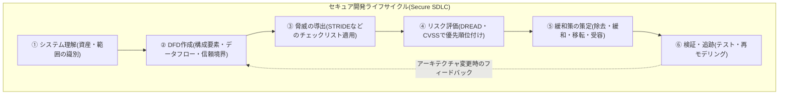
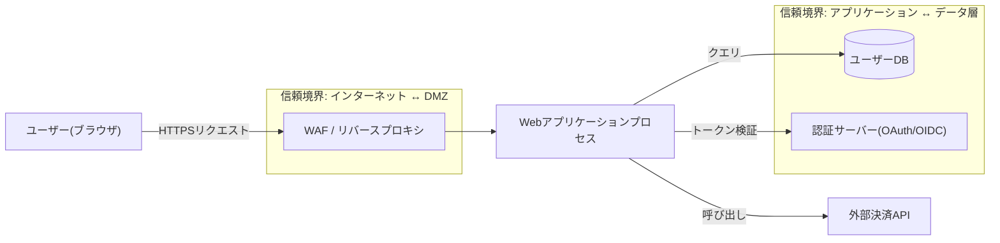

# 脅威モデリング(Threat Modeling)

## 1. 概要

> **脅威モデリング(Threat Modeling)**とは、システムのアーキテクチャとデータフローを構造的に分析して、潜在的な脅威(Threat)と攻撃対象領域(Attack Surface)を**設計段階で事前に識別・分類・評価**し、リスクの大きさに応じて緩和策(Mitigation)を導き出すセキュリティ活動である。

伝統的なセキュリティは、システムを作り終えた後にペネトレーションテスト(Penetration Test)や脆弱性スキャンで欠陥を見つける**事後対応(Reactive)** 型であった。しかし、すでにデプロイされたシステムで発見された欠陥を修正するコストは、設計段階で捕捉するコストよりもはるかに大きい。IBM System Science Instituteの古典的研究とそれを引用した多くのセキュリティ文献は、要件・設計段階で欠陥を除去するコストを1とすると、運用段階で同じ欠陥を修正するコストはおおよそ**数十倍から100倍程度**に達するとしている。正確な倍率は組織や研究によって異なるが、「左へ移動(Shift-Left)するほどコストが急減する」という方向性は一貫している。脅威モデリングはまさにこの事前予防(Proactive)の観点の代表的な実践であり、開発初期に「何を、何から、どのように守るか」に体系的に答える活動である。

脅威モデリングが必要とされる背景は三つに要約される。第一に、**システムの複雑さの爆発的増大**である。マイクロサービス(MSA)、クラウド、API連携、サードパーティSaaSが絡み合うことで攻撃対象領域が指数関数的に広がり、担当者の直観だけでは脅威を漏れなく列挙することが難しくなった。第二に、**規制・コンプライアンスの要求**である。個人情報保護法、ISMS-P、PCI-DSS、そして米国大統領令(EO 14028)に基づくSSDF(NIST SP 800-218)などは、セキュリティを開発ライフサイクル(SDLC)に内在化することを求めており、脅威モデリングはその中核的な成果物として認められている。第三に、**DevSecOpsへの転換**である。デプロイ周期が1日に数十回に及ぶ環境でセキュリティを自動化・常時化するには、設計時点での脅威分析がパイプラインの最初の関門として組み込まれなければならない。

脅威モデリングの特徴は、(1) 特定のツールではなく**思考の手順であり方法論**である点、(2) 完璧なセキュリティではなく**リスクベース(Risk-based)の優先順位付け**を志向する点、(3) 一回限りの文書ではなく、アーキテクチャの変更のたびに更新される**生きた成果物(Living Document)**である点である。

## 2. 脅威モデリングの4つの中核的な問いと全体プロセス

Adam Shostackが整理した脅威モデリングの本質は、四つの問いに凝縮される。「① 我々は何を作っているのか(What are we building?)」、「② 何がうまくいかなくなりうるか(What can go wrong?)」、「③ それに対して何をするのか(What are we going to do about it?)」、「④ 我々はうまくやれたか(Did we do a good job?)」。この四つの問いはそれぞれ資産・構造の識別、脅威の導出、対応の策定、検証の段階に対応しており、脅威モデリングを初めて導入する組織もこのフレームを骨格とすれば方向を見失わない。

以下の概念図は、脅威モデリングがSDLCの中でどのような位置を占め、各段階がどのようにつながっているかという全体構造を示している。

全体プロセスは逐次的であるが、最後の検証段階から再びデータフロー図(DFD)の段階へ戻る**反復型(Iterative)** の構造である点が重要である。新機能が追加されたりインフラが変わったりすると信頼境界(Trust Boundary)が移動するため、脅威モデルは必ず更新されなければならない。これを怠ると、モデルと実際のシステムが食い違う「モデルドリフト(Model Drift)」が発生し、分析の信頼性が崩れる。

### A. システム理解と資産の識別

最初の段階は、保護対象の資産と分析範囲を明確にすることである。資産には、顧客の個人情報(PII)、認証資格情報、決済情報、営業秘密、そしてシステムの可用性そのものが含まれる。資産の**機密度とビジネス影響度**を併せて記述してこそ、その後のリスク評価の基準が定まる。例えばECシステムであれば、「カード番号・CVC」は最高等級の資産であり、漏洩すればPCI-DSS違反と直接的な金銭的損害につながるため、最優先の保護対象となる。この段階で範囲を広げすぎると分析が発散するため、一つのサービス・境界づけられたコンテキスト単位に切り分けてアプローチするのが実務的に効果的である。

### B. データフロー図(DFD)と信頼境界

脅威を体系的に導き出すには、システムを図で表現する必要がある。最も広く用いられる表記法が**データフロー図(Data Flow Diagram, DFD)**であり、四つの要素で構成される。外部エンティティ(External Entity、ユーザー・外部システム)、プロセス(Process、演算の主体)、データストア(Data Store)、データフロー(Data Flow)である。ここに**信頼境界**を重ねて描くことが核心である。信頼境界は信頼レベルが変わる地点 — 例えばインターネットとDMZの間、アプリケーションとデータベースの間 — を示し、データがこの境界を越える地点こそが脅威の集中する場所である。

以下は、WebアプリケーションをDFDで表現し、STRIDEの脅威がどこで発生するかをマッピングした詳細なアーキテクチャ図である。

信頼境界を明示的に描くと、「ユーザー入力がアプリケーションへ渡る地点では改ざん(Tampering)とコマンドインジェクションを、DBアクセス地点では情報漏洩(Information Disclosure)を」重点的に検討せよ、というように脅威の導出が構造化される。すなわちDFDは単なる図ではなく、脅威を漏れなく(MECE)列挙するための**探索地図**の役割を果たす。

DFDを描く際に実務的に留意すべき点は、**抽象化レベル(Level)の選択**である。システム全体を一つのプロセスとして表現するコンテキスト図(Level 0)から始め、分析が必要な部分だけを下位プロセスに分解(Level 1, 2)する階層的なアプローチが推奨される。最初から詳細に描きすぎると維持管理が難しく、抽象的すぎると脅威を見落とす。機密度の高い資産が通過するフローと信頼境界を越えるフローを優先的に詳細化するのが、費用対効果が高い。

### C. STRIDE — 脅威分類体系

STRIDEはマイクロソフトが確立した脅威分類法であり、六つの脅威カテゴリの頭文字である。各カテゴリはセキュリティの基本特性(CIAなど)が**侵害される状況**と正確に対応するという点で体系的である。以下の表で整理するが、各項目がなぜそのように対応するのかは続けて記述する。

| 脅威(Threat) | 侵害されるセキュリティ特性 | 代表的な事例 | 主な緩和策 |
|---|---|---|---|
| **S**poofing(なりすまし) | 認証(Authentication) | 他人のアカウントを詐称したログイン | 強力な認証・MFA・相互TLS |
| **T**ampering(改ざん) | 完全性(Integrity) | 送信データ・パラメータの操作 | ハッシュ・電子署名・入力検証 |
| **R**epudiation(否認) | 否認防止(Non-repudiation) | 取引事実の否認 | 監査ログ・タイムスタンプ・署名 |
| **I**nformation Disclosure(情報漏洩) | 機密性(Confidentiality) | 機密情報の流出・SQLi | 暗号化・アクセス制御・最小権限 |
| **D**enial of Service(サービス拒否) | 可用性(Availability) | DDoS・リソース枯渇 | レート制限・オートスケール・CDN |
| **E**levation of Privilege(権限昇格) | 認可(Authorization) | 一般→管理者権限の奪取 | 権限分離・RBAC・サンドボックス |

Spoofingは身元を偽る脅威であり、認証メカニズムが弱いときに発生する。例えばセッショントークンを奪取したり、予測可能なセッションIDを悪用したりするケースであり、多要素認証(MFA)と安全なトークン管理で緩和する。Tamperingはデータの完全性を破るものであり、HTTPパラメータの操作や中間者攻撃が代表的で、電子署名・メッセージ認証コード(MAC)・サーバー側での再検証で防御する。Repudiationは行為者が自らの行為を否認する脅威であり、改ざん不可能な監査ログとタイムスタンプが必須の対応策である。

Information Disclosureは機密性の侵害であり、SQLインジェクション・過剰なエラーメッセージの露出・暗号化されていない通信が原因となる。保存時・転送時の暗号化と最小権限の原則が核心である。Denial of Serviceは可用性を狙う脅威であり、アプリケーション層のDDoSや正規表現の爆発(ReDoS)のようなリソース枯渇攻撃を含み、レート制限(Rate Limiting)・リバースプロキシ・オートスケーリングで緩和する。Elevation of Privilegeは認可制御を回避してより高い権限を獲得するものであり、権限チェックの漏れ(IDOR)・安全でないデシリアライゼーションなどが原因で、ロールベースアクセス制御(RBAC)とサーバー側の認可検証で防ぐ。このようにSTRIDEは「この要素で六つの脅威がそれぞれどのように実現されうるか」を強制的に点検させることで、分析者の経験に依存せずとも脅威を網羅的に導き出すことを助ける。

## 3. リスク評価と方法論の比較

導き出された脅威をすべて同じ比重で扱うことはできない。リソースは有限であるため**リスクの大きさに応じた優先順位付け**が必須であり、代表的な定性的手法が**DREAD**である。DREADは、潜在的損害(Damage)、再現性(Reproducibility)、悪用の容易さ(Exploitability)、影響を受けるユーザー(Affected Users)、発見の容易さ(Discoverability)の五要素をそれぞれ0~10点で採点し、平均リスクスコアを算出する。例えば、あるSQLインジェクションの脅威がDamage 9、Reproducibility 8、Exploitability 7、Affected Users 9、Discoverability 6であれば、平均7.8で「高(High)」等級となり、最優先の対処対象となる。ただしDREADは採点の主観性が大きいという批判があるため、近年は脆弱性そのものの深刻度の標準である**CVSS(Common Vulnerability Scoring System)**や、組織のリスクマトリクス(発生可能性 × 影響度)と併用する傾向にある。

脅威モデリングの方法論はSTRIDE以外にも複数あり、観点に応じて選択する。

| 方法論 | 観点・中心 | 特徴 | 適した状況 |
|---|---|---|---|
| **STRIDE** | システム・開発者中心 | 脅威カテゴリを網羅、学習が容易 | 一般的なSW・設計段階の標準 |
| **PASTA** | ビジネス・リスク中心 | 7段階、攻撃シミュレーションが精緻 | リスクベースの意思決定が必要なとき |
| **Attack Tree** | 攻撃者・目標中心 | 目標をルートとして攻撃経路を分解 | 特定資産の深層分析 |
| **LINDDUN** | プライバシー中心 | 個人情報の脅威7カテゴリ | GDPR・プライバシー影響評価 |
| **VAST** | 拡張性・自動化中心 | アジャイル・大規模組織への適用 | DevOpsの全社展開 |

方法論の選択でよく犯す誤りは、「最も精緻な方法論が常に正しい」と考えることである。実際には、組織のセキュリティ成熟度、チーム規模、デプロイ周期が選択を左右する。脅威モデリングを初めて導入するチームがいきなりPASTAの7段階を全面適用すると負担が大きく、定着に失敗しやすい。したがって、STRIDEで習慣を身につけた後、高リスク資産に限って精密な方法論を上乗せする段階的な展開が現実的であり、これは後述するトレードオフの考慮事項とも直結する。

STRIDEが「何がうまくいかなくなりうるか」をシステムの観点から幅広く洗い出すとすれば、**PASTA(Process for Attack Simulation and Threat Analysis)**はビジネス目標から出発し、脅威を実際の攻撃シナリオとしてシミュレーションする7段階のリスク中心の方法論であり、経営陣の説得と投資の優先順位決定に強みがある。**Attack Tree**は、「管理者権限の奪取」のような一つの攻撃目標をルートノードに置き、それを達成する下位経路をAND/ORで分解するものであり、特定の高リスク資産を深く掘り下げる際に有用である。**LINDDUN**はSTRIDEのプライバシー版(連結可能性・識別可能性・否認不可能性・検出可能性・情報漏洩・無認識・非遵守)であり、プライバシー影響評価(PIA)と組み合わせて活用される。実務では一つだけを使うよりも、STRIDEで広く洗い出し、高リスク部分にAttack Tree/PASTAを上乗せする**混合戦略**が一般的である。

## 4. 緩和策と実務適用事例

脅威への対応は、リスク管理の一般原則に従う。すなわち、(1) 脅威そのものを除去(Eliminate、例: 不要な機能・ポートの削除)、(2) 統制によってリスクを緩和(Mitigate、例: 入力検証・暗号化)、(3) 第三者に移転(Transfer、例: 決済をPCI-DSS認証を受けたPG事業者に委託・サイバー保険)、(4) 残存リスクを受容(Accept、根拠を文書化)という四つの選択肢の中から、費用対効果を考慮して決定する。ここでの核心は、**すべての脅威をゼロにすることが目標ではなく、許容可能な水準(Risk Appetite)まで下げること**というリスク管理的な思考である。

具体的な事例として、あるフィンテックサービスが送金APIを設計する際に脅威モデリングを実施したとしよう。DFD上の「クライアント→送金プロセス」のフローで、Tampering(金額パラメータの操作)とElevation of Privilege(他人の口座からの送金、IDOR)が導き出されたならば、対応としてサーバー側での金額の再検証・取引署名、そしてリクエスト者が所有する口座かどうかを検証する認可ロジックを組み込むといった具合である。また「送金プロセス→監査ストア」のフローでは、Repudiationを防ぐために改ざん不可能なログ(例: 追記専用ストレージ)とタイムスタンプを設計に反映する。こうすれば、開発完了後のペネトレーションテストでIDORが発見されて緊急パッチを当てるような状況を事前に防ぐことができる。

別の事例として、IoTスマートホームゲートウェイを設計するとしよう。多数の低スペックセンサーがゲートウェイを経由してクラウドへデータを送る構造では、ファームウェアの完全性が脆弱であるため、Tampering(悪性ファームウェアの注入)とSpoofing(なりすましデバイスの登録)が中核的な脅威として導き出される。これに対応してセキュアブート(Secure Boot)とデバイスごとの相互証明書(mTLS)を設計に反映し、大量のデバイスが同時にリクエストを殺到させるDoSを防ぐために、ゲートウェイ側でデバイスごとのレート制限を設ける。このように脅威モデリングでは、ドメイン(Web・フィンテック・IoT)によって強調されるSTRIDEのカテゴリが異なり、その違いは各ドメインの信頼境界と資産の特性に由来する。

産業適用の観点では、マイクロソフトはSDL(Security Development Lifecycle)の必須活動として脅威モデリングを制度化し、無料ツールである**Microsoft Threat Modeling Tool**を配布してきた。オープンソース陣営では、OWASP **Threat Dragon**と、コードで脅威モデルを管理する**pytm**が広く用いられている。特にpytmのように脅威モデルをコードで表現すれば(Threat Modeling as Code)、構成管理・レビュー・CI自動化が可能になり、DevSecOpsパイプラインに自然に統合される。実際、大手クラウド・金融企業では新規サービスの設計レビュー(Design Review)の通過条件として脅威モデルの成果物を求めることが多く、これによって設計上の欠陥がコード・運用段階へ伝播する前にふるい落としている。

## 5. 深掘り — DevSecOps自動化と最新動向

伝統的な脅威モデリングの限界は、**速度と拡張性**であった。セキュリティ専門家がワークショップ形式で手作業の分析を行うため、1日に数十回デプロイされるアジャイル・DevOps環境についていけなかった。これを克服するために登場したのが、**自動化・軽量化の流れ**である。

第一に、**Threat Modeling as Code(脅威モデリングのコード化)**である。前述のpytmやThreagileのように、アーキテクチャを宣言的(YAML・DSL)に記述すると、ツールが自動的に脅威と対応策を生成し、これをGitでバージョン管理しながらCIパイプラインで実行する。コードが変わると脅威モデルも併せて更新されるため、前述の「モデルドリフト」の問題を大きく緩和する。

第二に、**標準化**である。OWASPは脅威モデリングのための共通の語彙と手順を提示しており、脅威情報を機械可読な形で交換するOASISの**Threat Model Manifesto**および関連する標準化の議論が進行中である。MITRE **ATT&CK**の戦術・技法の知識ベースを脅威導出の段階に組み合わせ、抽象的なSTRIDEのカテゴリを実際の攻撃技法として具体化する試みも増えている。

第三に、**DevSecOpsパイプラインへの統合**である。脅威モデリングの結果はそれ自体で終わるのではなく、導き出された緩和策が静的解析(SAST)・動的解析(DAST)・依存関係検査(SCA)のチェックルールに変換されてCI/CDに反映されたときに実効性を持つ。例えば「情報漏洩」の脅威に対応した暗号化要件はSASTルールとして、「権限昇格」の脅威に対応した認可検証は統合テストケースとして、それぞれ自動検証されるよう連携させる。こうすれば、脅威モデルの最後の問いである「うまくやれたか」をパイプラインの指標として常時測定できる。

第四に、**生成AIの組み込み**である。近年では、アーキテクチャ図や設計文書を入力するとLLMがSTRIDEベースの脅威リストと緩和策の草案を提案する実験的なアプローチが広がっている。これは草案作成の時間を大幅に短縮する補助手段として有用であるが、LLMが存在しない脅威を生成したり(ハルシネーション)、文脈上重要な脅威を見落としたりする可能性があるため、**専門家によるレビュー(Human-in-the-loop)を必ず併用**すべきであることが強調されている。すなわちAIは脅威モデリングを代替するものではなく、加速するツールとして位置づけられつつある。ただし、こうしたツール・AI活用の具体的な成熟度は組織や時期によってばらつきが大きいため、導入時にはパイロットによる効果検証を先行させるべきである。

## 6. 考慮事項および示唆点

技術士の観点から、脅威モデリングの導入と定着のためには次の点を考慮すべきである。

- **Shift-LeftとSDLCへの内在化**: 脅威モデリングは設計段階に配置されたときに費用対効果が最大化される。要件・設計成果物のレビュー(Design Review)の正式なゲートとして組み込み、その成果物をセキュリティ要件の根拠として要求工学・テストと連携させるべきである。事後点検用の文書としてだけ残せば、形骸化して実効性がない。

- **コスト・時間とカバレッジのトレードオフ**: すべてのコンポーネントを精密に分析するのが理想的であるが、デプロイ速度を阻害する。信頼境界・高機密資産を中心に範囲をまず集中させ(Risk-based Prioritization)、反復周期ごとに段階的に拡張するのが現実的である。軽量な方法論(VAST)と精密な方法論(PASTA)を資産の等級に応じて差別的に適用するハイブリッド戦略が効果的である。

- **ガバナンスと組織文化**: 脅威モデリングはセキュリティチームだけの活動ではなく、アーキテクト・開発者・運用者が共に参加する協業活動である。担当の役割と責任(R&R)を明確にし、再利用可能な脅威ライブラリ・チェックリストを蓄積し、DevSecOps文化の中で開発者が自ら実施できるよう教育・ツールを支援してこそ持続可能となる。

- **生きた成果物としての維持管理**: アーキテクチャ・インフラ・規制が変われば、信頼境界と脅威も変わる。脅威モデルをコードとして管理してCIと連動させ、変更が発生するたびに自動的に再評価されるようにしてこそ、モデルドリフトを防ぐことができる。また、緩和策の実施状況を脆弱性管理・セキュリティテストの結果と連携して追跡(Traceability)し、「うまくやれたか」という最後の問いに答えられなければならない。

- **関連技術との統合**: 脅威モデリングは単独では完結しない。SBOMベースのサプライチェーン脅威、ゼロトラストアーキテクチャにおける信頼境界の再定義、MITRE ATT&CKベースの脅威インテリジェンス、そしてSIEM・XDRの検知ルールと相互に連携したときに、予防-検知-対応の全サイクルが完成する。特にクラウド・MSA環境では、動的に変化する境界を考慮した継続的脅威エクスポージャー管理(CTEM)との組み合わせが見込まれる。

- **定量的な効果測定とROIの立証**: 脅威モデリングは「起きなかった事故」を予防するものであるため、成果が目に見えにくいという限界がある。したがって、設計段階で除去した脅威の数、ペネトレーションテストで新たに発見された欠陥の減少率、欠陥修正の所要時間(MTTR)の短縮などの指標で効果を定量化し、経営陣に投資価値を立証して活動の継続性を確保することが重要である。

## 参考資料

- OWASP, "Threat Modeling Process", https://owasp.org/www-community/Threat_Modeling_Process
- Microsoft, "Threat Modeling — Security Development Lifecycle", https://learn.microsoft.com/en-us/security/engineering/threat-modeling-tool
- OWASP, "Threat Modeling Cheat Sheet", https://cheatsheetseries.owasp.org/cheatsheets/Threat_Modeling_Cheat_Sheet.html
- NIST, "SP 800-218 Secure Software Development Framework (SSDF)", https://csrc.nist.gov/pubs/sp/800/218/final

---

> **一言まとめ**: 脅威モデリングは、DFDでシステムを構造化し、STRIDEで脅威を網羅的に導き出した後、DREAD・CVSSで優先順位付けして設計段階でリスクを先制的に下げるShift-Leftのセキュリティ活動であり、DevSecOpsの自動化とAIの組み込みによって進化しつつある。
