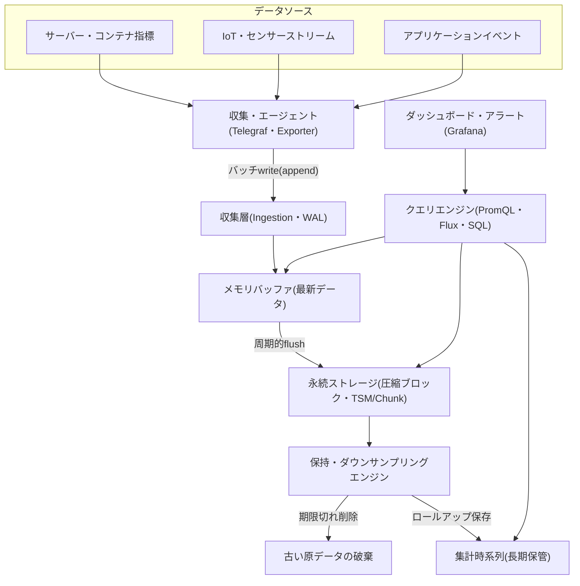
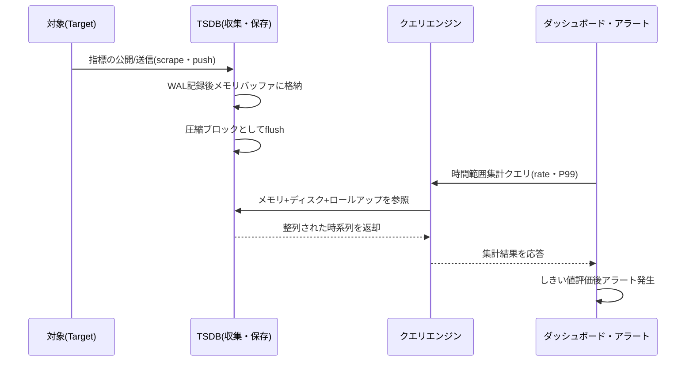

# 時系列データベース(Time Series Database, TSDB)

## 1. 概要

> **時系列データベース(TSDB)**とは、時間(timestamp)を第一級(first-class)の軸とし、時間順に絶え間なく蓄積される測定値(metric)を高速に収集・圧縮・クエリ・保存するよう最適化された特殊用途のデータベースである。リレーショナルDBが「何が真であるか(現在の状態)」を保存するとすれば、TSDBは「いつどのような値であったか(状態の変化履歴)」を保存し、大量のappend-only書き込みと時間範囲集計(range aggregation)に特化している。

時系列データとは、一つの観測対象を時間とともに繰り返し測定した値の並びである。
サーバーのCPU使用率を1秒ごとに記録した値、スマートファクトリー設備の振動センサーが毎秒数千回出力する値、株式の約定価格、家庭用スマートメーターの電力使用量は、いずれも時系列である。
これらは共通して**時間が経過しても再び変わることのない(immutable)事実**であり、圧倒的に**挿入中心(write-heavy)**であり、参照はたいてい「直近N分/特定区間」に対する**時間範囲集計**の形をとる。

このようなデータを従来のリレーショナルDB(RDBMS)にそのまま格納すると、さまざまな点で齟齬が生じる。
RDBMSは任意の行の更新・削除と複雑な結合を前提としてB-treeインデックスと行単位の格納を用いるが、時系列は更新がほとんどなく挿入だけが殺到するため、B-treeインデックスが絶えず分割され(page split)、書き込み性能が急落する。
また毎秒数十万ポイントが無限に蓄積されると保存容量が線形に爆発的に増加するが、汎用DBには時間軸に特化した圧縮や自動期限切れ(retention)の概念がないため、運用負担が大きくなる。
TSDBはまさにこのギャップ — **高速な収集、極限の圧縮、時間範囲クエリ、ライフサイクル管理** — を解決するために設計されたストレージエンジンである。

論述答案では、TSDBを単に「時間データを入れるDB」に矮小化せず、(1) 時系列データモデル(測定値・タグ・タイムスタンプ)の**構造的特性**、(2) LSMベースのappend最適化とデルタ・カラム圧縮という**ストレージエンジン技術**、(3) ダウンサンプリング・保持ポリシーに代表される**データライフサイクル管理**の三つの軸で展開することが望ましい。

### A. 登場背景と必要性

第一に、**オブザーバビリティ(Observability)とIoTの爆発的普及**が決定的な契機である。
マイクロサービスアーキテクチャ(MSA)が広がり、数百のサービスがそれぞれ数百の指標を秒単位で出力し、産業現場では数万のセンサーが同時に測定値を吐き出している。
例えば100個のコンテナがそれぞれ50個の指標を10秒ごとに記録すると、1日だけで約4,300万ポイントが発生し、この規模は汎用DBの挿入処理の限界を容易に超える。

第二に、**保存コスト(TCO)の圧力**である。
時系列は決して止まることなく蓄積されるため、原データをそのまま置いておけば保存コストは無限に増加する。
連続した測定値は値の変化幅が小さいという性質(例: CPU 60% → 61% → 60%)を利用すれば、デルタエンコーディング・ビットパッキングで10倍以上圧縮でき、専用の圧縮がそのまま直接的なコスト削減につながる。

第三に、**クエリパターンの偏り**である。
時系列の参照は、個々の行の検索よりも「過去6時間の5分平均」、「P99応答時間の推移」のような**時間バケットごとの集計**が圧倒的に多い。
このようなクエリを高速に処理するには、時間軸を基準にデータを物理的に整列・分割(パーティショニング)し、事前集計されたロールアップを活用する専用の構造が必要である。

## 2. 時系列データモデルと全体構造

TSDBのデータモデルは、ほとんどが**測定値の名前(measurement/metric) + タグ集合(tags/labels) + フィールド値(field) + タイムスタンプ**の組み合わせで構成される。
ここでタグの一意な組み合わせ一つが、一つの**時系列(series)**を定義する。
例えば`cpu_usage{host="web-01", region="seoul"}`と`cpu_usage{host="web-02", region="seoul"}`は名前は同じだがタグが異なるため別個の時系列であり、各時系列は時間順に整列された(timestamp, value)ペアの連続である。

このモデルを理解する核心的な概念が**カーディナリティ(cardinality)**である。
カーディナリティとは異なる時系列の総数であり、おおよそ各タグがとりうる値の数をすべて掛け合わせた値である。
`host`が1,000種類、`region`が10種類、`metric`が50種類であれば、理論上50万個の時系列が生じる。
カーディナリティが爆発するとインデックスがメモリを食い潰しクエリが遅くなるため、ユーザーID・リクエストIDのように値の種類が無限に増える項目をタグとして使わないことが設計の第一原則である。

上記の構造において、データはエージェントがソースから指標を収集し、収集層へバッチ送信することから始まる。
到着したばかりのデータはまずWAL(Write-Ahead Log)に記録されて耐久性を確保した後にメモリバッファに蓄積され、最新のデータほど参照頻度が高いため、メモリから直接応答する。
バッファが一定サイズに達すると、時間順に整列・圧縮された不変ブロックとしてディスクに書き出され(flush)、保持エンジンが古い原データを期限切れとして削除し、長期保管が必要なものは低解像度のロールアップとして残す。
クエリエンジンはメモリ・ディスク・ロールアップを透過的に横断して結果を組み合わせ、ダッシュボードはこのクエリ結果を可視化する。

### A. ストレージエンジン: LSMと時間軸の圧縮

TSDBが高速な挿入に耐えられる秘訣は、ほとんどが**LSM(Log-Structured Merge)系の構造**にある。
RDBMSのB-treeは挿入位置を探してページを更新するためランダム書き込みが多いが、LSMは入ってくる書き込みをまずメモリ(memtable)に逐次蓄積した後、丸ごと整列された不変ファイルとしてディスクに逐次記録する。
逐次書き込みはランダム書き込みより数十倍速く、SSDの寿命にも有利であるため、毎秒数十万~数百万ポイントのappendに対応できる。
InfluxDBのTSMエンジン、Prometheusのブロック/チャンク構造がこの原理に従っている。

圧縮はTSDBの最も劇的な利点である。
タイムスタンプはたいてい一定間隔(例: 10秒)であるため、**デルタ・オブ・デルタ(delta-of-delta)** エンコーディングによってほとんどを0に近い値にして数ビットで表現し、浮動小数点の測定値は直前の値とXORをとった後に先頭と末尾の0ビットを取り除く**Gorilla圧縮**を適用する。
Facebookが発表したGorilla論文によれば、この技法で時系列ポイント1つを平均約1.37バイトまで削減し、非圧縮比で10倍以上の圧縮率を達成した。
実務的には、生の16バイト(タイムスタンプ8B + 値8B)のポイントが1~2バイトに減れば、保存コストとディスクI/Oが同時に激減する。

### B. データライフサイクル: 保持ポリシーとダウンサンプリング

時系列は「最近のものほど詳細に、過去のものほど粗く」見るのが自然である。
障害をリアルタイムで追跡するときは1秒の解像度が必要だが、1年前の容量の推移を見るときは1時間平均で十分である。
この性質を利用して、TSDBは**ダウンサンプリング(downsampling)**によって古い原データを低解像度のロールアップ(例: 1秒 → 1分の平均/最大/最小)に要約し、**保持ポリシー(retention policy)**によって原データを自動的に期限切れにする。

例えば「原データは7日、1分ロールアップは90日、1時間ロールアップは2年保管」というポリシーを立てれば、直近の障害分析の精度と長期トレンド分析の経済性を同時に確保できる。
例えば毎秒1ポイントを1分平均にダウンサンプリングすればデータ量は1/60に減り、2年分の長期データも実用的なコストで維持できる。
これは汎用DBにはない、時系列ワークロードに特化した中核的な運用機能である。

## 3. 主要製品の類型とアーキテクチャの比較

TSDBは、出自と設計思想によって大きく三つの系統に分かれる。
専用エンジン型(InfluxDB)、モニタリング統合型(Prometheus)、そしてリレーショナル拡張型(TimescaleDB)が代表的であり、それぞれ強みとトレードオフが異なる。

InfluxDBは時系列専用にゼロから設計された専用エンジンであり、独自のストレージフォーマット(TSM)とクエリ言語(Flux/InfluxQL)を備え、高い挿入スループットと圧縮率を実現する。
一方で、SQLエコシステムとの互換性は弱く、クラスタリングなどの高可用性機能が商用版に限定されている点が制約である。

PrometheusはKubernetesのオブザーバビリティにおける事実上の標準であり、**プル(pull)型の収集**と強力なクエリ言語PromQL、アラートルールが組み合わさったモニタリングプラットフォームである。
単一ノードのローカルストレージが基本であるため、長期保管・水平拡張にはThanosやCortex/Mimirのようなリモートストレージ層を追加する必要がある。

TimescaleDBはPostgreSQLの拡張として動作し、標準SQL・結合・トランザクションをそのまま使いながら、内部的には時間基準の自動パーティショニング(ハイパーテーブル)とカラム圧縮を提供する。
既存のリレーショナル資産と人材を再活用できることが最大の強みであり、純粋な専用エンジンと比べて極端な挿入性能はやや譲る。

| 区分 | InfluxDB(専用エンジン型) | Prometheus(モニタリング型) | TimescaleDB(RDBMS拡張型) |
|------|----------------------|------------------------|----------------------------|
| 基盤 | 独自TSMエンジン | 独自ブロック/チャンク | PostgreSQL拡張 |
| 収集 | Push(ラインプロトコル) | Pull(スクレイピング) | SQL INSERT/COPY |
| クエリ | Flux・InfluxQL | PromQL | 標準SQL |
| 強み | 高圧縮・高挿入性能 | クラウドネイティブな監視 | SQL互換・結合 |
| 限界 | SQLエコシステムが弱い | 長期保存は別途構成 | 超高速挿入は譲る |

ただし上記の表は選択の出発点にすぎず、実際の決定は「既に保有している技術スタックとチームの能力、要求されるカーディナリティ、長期保管の要件」によって分かれる。
Kubernetesのオブザーバビリティが中核であればPrometheusが自然であり、既存のPostgreSQL運用人材が厚くSQL分析を並行する必要があればTimescaleDBが総コストの面で有利であり、純粋なIoTの大量収集が目的であれば専用エンジンが優勢、といった具合である。

### A. クエリと可視化の結合

時系列の価値は保存ではなく、**クエリ・可視化・アラート**において実現される。
PromQLの`rate(http_requests_total[5m])`は直近5分間の毎秒リクエスト増加率を計算するが、このように時系列専用言語は、時間ウィンドウ・比率・パーセンタイル(P95/P99)の計算を第一級の演算として提供する。
ほとんどの現場では、このクエリ結果をGrafanaのようなダッシュボードで可視化し、しきい値を超えたときにアラートを発生させるパイプラインとして完成させる。

## 4. 深掘り: 最新動向と実務適用

時系列の保存は近年、**分散オブジェクトストレージベースのアーキテクチャ**へと重心が移りつつある。
Thanos・Grafana Mimir・VictoriaMetricsなどは、最新のデータはローカルで高速に処理しつつ、古い圧縮ブロックはS3のようなオブジェクトストレージへ移し、無制限に近い長期保管と低コストを実現する。
コンピュートとストレージを分離(disaggregation)するこの流れは、収集が急増してもストレージ層を独立して安価に拡張できるようにする。

また、**オブザーバビリティ(Observability)の統合**も強化されつつある。
かつてはメトリクス(TSDB)・ログ・トレースが別々のシステムであったが、OpenTelemetryがこの三つのシグナル(signal)の収集標準を統一したことで、時系列メトリクスをログ・分散トレーシングと相関分析(correlation)する方向へと進化している。
例えば、特定の指標が跳ね上がった瞬間のトレースへ直接ドリルダウンするような統合的なオブザーバビリティが標準になりつつある。

実務事例として、国内外の大手コマース・フィンテック企業はサービス指標を秒単位でTSDBに格納し、SREチームがSLO/エラーバジェットをこのデータで算定している。
製造分野では、設備センサーのストリームをTSDBに保存し、振動・温度の微細な推移から故障を事前に予測(予知保全)しており、ここでTSDBはリアルタイム異常検知モデルの特徴量(feature)の供給源の役割まで担っている。
カーディナリティ管理の失敗は代表的な障害原因であり、リクエストIDをタグに入れて時系列数が数百万に爆発するとメモリが枯渇するため、タグ設計の段階で値の種類を必ず制限しなければならない。

## 5. 考慮事項および示唆点

技術士の観点では、TSDBの導入はストレージの置き換えではなく、**オブザーバビリティ・データライフサイクル戦略の再設計**としてアプローチすべきであり、次の点を総合的に考慮する。

- **カーディナリティのガバナンス**: タグ(ラベル)設計が性能とコストを左右する。値の種類が無限に増えうる項目(ユーザーID、セッションID、完全なURL)はタグではなくログ/トレースに分離し、タグの組み合わせの上限を事前に算定・監視するガバナンス体制を設ける。

- **精度とコストのトレードオフ**: 原データの解像度・保持期間・ダウンサンプリングのポリシーは、分析精度と保存コストのトレードオフの関係にある。障害分析に必要な高解像度の区間とトレンド分析用の長期ロールアップを階層化し、コンプライアンス(監査ログの保存要件)とコストを同時に満たすポリシーを明文化する。

- **整合性・集計モデルの限界の理解**: 時系列の集計は近似的・確率的な特性を持ちうる(例: ヒストグラムベースのパーセンタイルは近似値)。金融精算のように正確な合計が必要な領域と、トレンドの観測で十分な領域を区別して適用範囲を定める。

- **関連技術とのアーキテクチャ統合**: TSDBは単独では完成しない。収集(Telegraf・OpenTelemetry)、可視化・アラート(Grafana)、長期保存(S3・Thanos)、ストリーム処理(Kafka)と組み合わさってこそ価値を生む。特にオブザーバビリティ(ログ・トレース・メトリクス)の統合、SREのSLO/エラーバジェット運用、予知保全・異常検知のようなAIパイプラインとの連携を併せて設計する。

- **展望**: コンピュート・ストレージ分離型のクラウドネイティブTSDBとOpenTelemetryベースのシグナル統合が標準として定着するにつれ、時系列は単なるモニタリングを超えて、リアルタイムの意思決定・予測の中核的なデータ層へと格上げされつつある。

## 参考資料

- Facebook, "Gorilla: A Fast, Scalable, In-Memory Time Series Database", VLDB 2015 — https://www.vldb.org/pvldb/vol8/p1816-teller.pdf
- Prometheus Documentation, "Storage" — https://prometheus.io/docs/prometheus/latest/storage/
- InfluxData, "Time Series Database (TSDB) explained" — https://www.influxdata.com/time-series-database/
- Timescale Documentation, "Hypertables and compression" — https://docs.timescale.com/

---

> **一言まとめ**: 時系列データベースは、時間を第一級の軸としてappend-onlyの大量収集・時間軸圧縮(デルタ/Gorilla)・範囲集計・ダウンサンプリングと保持ポリシーを最適化した専用ストレージであり、オブザーバビリティ・IoT・予知保全のリアルタイムデータ層を担い、カーディナリティのガバナンスと精度・コストのトレードオフが導入の核心的な鍵である。
