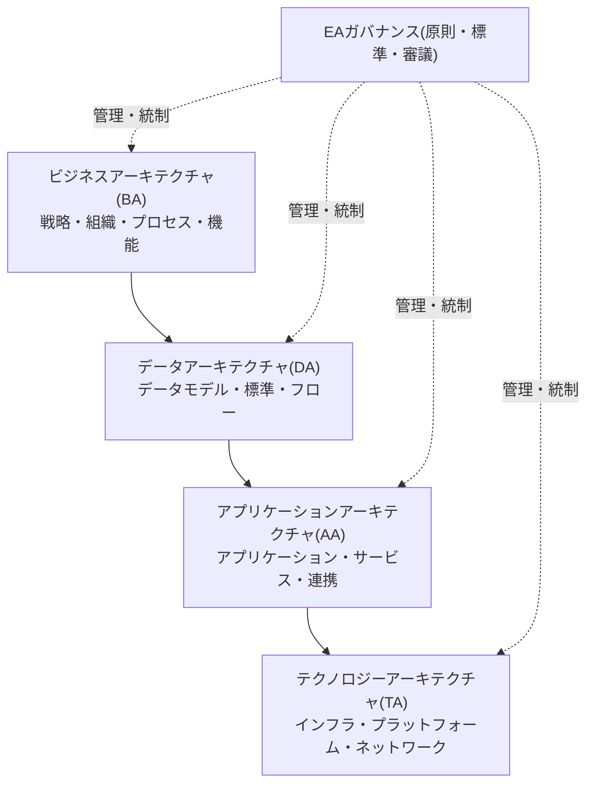
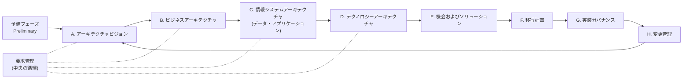

# TOGAF(The Open Group Architecture Framework)とエンタープライズアーキテクチャ

## 1. 概要

### A. 定義

> **エンタープライズアーキテクチャ(EA, Enterprise Architecture)**とは、組織のビジネス戦略とIT資源を整合(alignment)させるために、業務・データ・アプリケーション・技術の現状(As-Is)と目標(To-Be)の構造を標準化された観点で記述し、その間の移行経路を管理する総合的な設計体系である。**TOGAF**はThe Open Groupが制定したオープンなEAフレームワークであり、EAを開発・運用するための方法論(ADM)・参照モデル・ガバナンス体系を総体的に提供する。

EAは特定のシステム一つの設計図ではなく、「企業全体を一つのシステムとみなして描いた青写真」である。都市計画に例えれば、個々の建物(個別の情報システム)の図面ではなく、道路・用途地域・上下水道を規定する都市のマスタープランに相当する。したがってEAの核心的な価値は、個別最適化ではなく、**全社的な観点での重複排除・標準化・相互運用性の確保**にある。

TOGAFは、こうしたEAを「どのように作るか」についての事実上の業界標準の方法論である。特定のベンダーに依存しないオープンな方法論であり、反復的(iterative)な手順であるADM(Architecture Development Method)を中心にアーキテクチャを段階的に発展させる点が特徴である。

### B. 登場背景と必要性

第一に、**ITとビジネスの断絶(business-IT gap)** のためである。部門ごとに個別に発注されたシステムが累積するにつれ、同一の機能が複数のシステムに重複して実装され、データの定義もばらばらで全社統計すら食い違う、いわゆる「サイロ(silo)」が発生した。何がどこにあるのかを全社的に把握する地図が必要になり、これがEA登場の直接的な動因である。

第二に、**投資統制とガバナンスの要求**である。IT投資の規模が大きくなるほど、「このシステムはなぜ必要なのか、既存の資産と重複していないか」を判断する根拠が必要となる。EAは現行資産の一覧と目標構造を提示することで、新規投資の審議(Portfolio Management)の判断根拠を提供する。韓国でも「電子政府法」に基づき、一定規模以上の公共機関にEA(政府はこれを情報技術アーキテクチャ、ITAと称する)の導入が義務付けられたことがある。

第三に、**変化への対応速度**である。デジタルトランスフォーメーション・クラウド移行のように全社的な変化が頻繁になるにつれ、変更がどの業務・データ・システムに波及するか(影響度分析)を迅速に把握できる構造的な地図が必須となった。EAの階層間のトレーサビリティ(traceability)がこの要求を満たす。

## 2. EAの構成観点とフレームワークの比較

EAは通常、四つのアーキテクチャドメイン(BDAT)で構成される。これは単なる分類ではなく、「ビジネスが何をするのか → どのようなデータが必要か → どのアプリケーションがそのデータを扱うのか → どのような技術基盤の上で動作するのか」という因果的な階層をなす。上位階層の要求が下位階層の設計を導き、この連鎖が断たれると「使われないシステム」、「根拠のないデータ」が生まれる。

**ビジネスアーキテクチャ(BA)**は、組織の戦略・目標・業務機能・プロセスを定義する。EAの出発点であり、他のすべての階層に正当性を与える層であって、「この業務機能を遂行するために」という目的なしには、データもアプリケーションも存在理由を持たない。**データアーキテクチャ(DA)**は、業務を支援するのに必要な論理・物理データモデルと全社データ標準を規定し、データの重複と定義の不一致を排除する。**アプリケーションアーキテクチャ(AA)**は、データを処理するアプリケーションポートフォリオとその連携関係を定義し、機能が重複するシステムを識別する根拠となる。**テクノロジーアーキテクチャ(TA)**は、これらすべてが稼働するハードウェア・ソフトウェア・ネットワークの標準を扱う。

フレームワークには複数の種類があり、それぞれ重点が異なる。以下の比較で重要なのは「どれが優れているか」ではなく、**組織の成熟度と目的に応じて選択・組み合わせる**という点である。

| フレームワーク | 特徴 | 強み | 限界 |
|-----------|------|------|------|
| Zachman | 6×6マトリクス(視点×疑問詞)で成果物を分類 | 漏れのない分類体系、文書化の観点 | 方法論(どのように)がない — 作る手順が不在 |
| TOGAF | ADMの反復手順を中心とした方法論 | ベンダー中立、実用的な開発手順を提供 | 成果物の標準が比較的柔軟(曖昧) |
| FEAF | 米国連邦政府の参照モデル中心 | 成果・投資と連携した参照モデル(PRMなど) | 公共に特化、民間適用時は再解釈が必要 |

Zachmanが「何を文書化するか」の分類の枠組みだとすれば、TOGAFは「どのように作るか」の手順を提供するという点で相互補完的である。実務では、Zachmanで成果物体系を定め、TOGAF ADMで開発手順を運用する組み合わせ方式がよく見られる。

## 3. TOGAF ADM(アーキテクチャ開発手法)

TOGAFの核心は、ADMと呼ばれる循環型の開発手順である。ウォーターフォールのように一度で終わらせるのではなく、要求管理を中心に置いて各段階を繰り返しながらアーキテクチャを段階的に成熟させる。この反復性こそが、頻繁な変化に対応しなければならない現代のEAの核心的な要件である。

**予備フェーズ**では、EAを遂行する組織・原則・ガバナンス体系を準備する。**フェーズA(ビジョン)**でステークホルダーと範囲・目標について合意し、**フェーズB~D**でビジネス・データ・アプリケーション・技術の各ドメインのAs-IsとTo-Beを定義して、その差異(gap)を分析する。このギャップ分析が、以降に何を新たに作り、何を廃止するかの根拠となる。

**フェーズE(機会およびソリューション)**では、ギャップを埋める実装候補を導き出し、**フェーズF(移行計画)**でこれを優先順位・コスト・リスクに応じてロードマップとして配置する。**フェーズG(実装ガバナンス)**は実際の実装プロジェクトがアーキテクチャ標準を遵守しているかを統制し、**フェーズH(変更管理)**は運用中に発生する変更要求を評価して再びフェーズAへ循環させる。全過程の中央には**要求管理**が位置し、すべてのフェーズと双方向に接続されているが、これはどのフェーズで発生した要求であっても即座に反映・追跡されることを意味する。

このとき再利用を促進する資産が、**ACF(Architecture Content Framework)**と**エンタープライズ・コンティニュアム(Enterprise Continuum)**である。後者は、汎用的な基盤アーキテクチャ(Foundation)から業界共通のアーキテクチャを経て、組織固有のアーキテクチャへと具体化されるスペクトルを定義し、すでに検証された参照アーキテクチャの再活用を促す。

## 4. 適用事例とEA成熟度

実際の適用例として、ある金融機関が勘定系・情報系・チャネル系のシステムを部門ごとに30余り個別発注して運用していたところ、顧客情報がシステムごとに異なって格納され、統合顧客ビュー(Single View)を作れなかった状況が挙げられる。EAを導入して全社データ標準(顧客識別子・コード体系)を定義し、アプリケーションポートフォリオの機能重複を識別した結果、重複システムの統廃合によって保守コストを削減し、新規システム開発時には標準遵守の審議を通じてサイロの再発を抑制することができる。ここで重要なのは、技術そのものではなく、**標準とガバナンスが結合してこそ効果が持続する**という点である。

公共分野でも、「電子政府法」と「情報システムの構築・運用技術指針」に基づき、汎政府EA(GEAPなど)を通じて省庁間の情報システムの現況を統合管理し、重複投資を事前に審議する体制が運用されてきた。ただし、EAを文書成果物の作成としてのみ捉えると「作っただけで使われないEA(shelf-ware)」になりやすいという点が共通の教訓である。

EAの実効性は成熟度によって管理される。おおよそ (1) 初期(個別の成果物が存在) → (2) 管理(全社標準・リポジトリの構築) → (3) 定義(EAが投資審議プロセスに結合) → (4) 最適化(変更管理・成果測定による自己改善)の段階で発展し、成熟度が第3段階以上に上がって**EA成果物が実際の意思決定に使われるとき**、初めて投資対効果が生まれる。

## 5. 考慮事項および示唆点

技術士の観点では、EA/TOGAFの導入は次の点を総合的に考慮すべきである。

- **文書ではなくガバナンスが目的である**: EAの成否は成果物の完成度ではなく、それがIT投資審議・変更管理のプロセスに実際に結合されるかどうかにかかっている。EAリポジトリ(Repository)と審議プロセスがなければ、EAは死文化する。導入初期から「成果物の作成」ではなく「意思決定での活用」を目標として設計すべきである。

- **成熟度に合わせた段階的導入(トレードオフ)**: すべてのドメインを一度に完成させようとするビッグバン方式は失敗リスクが大きい。ADMの反復性を活用し、優先度の高い業務領域から薄く(thin-slice)完成させて拡張していくほうが現実的である。完全性と実行速度の間のバランスが鍵となる。

- **最新のアーキテクチャ思潮との整合**: クラウド・MSA・データメッシュのように分散・自律を強調する流れと、EAの中央集権的な標準化は衝突しうる。近年では、EAをトップダウンの統制ではなく、**ガードレール(原則・標準)だけを提示してチームの自律を保証する軽量なガバナンス**として再解釈し、アーキテクチャ成果物もコード化(Architecture-as-Code)・自動収集によって最新性を維持しようとする傾向がある。

- **ビジネスアーキテクチャとケイパビリティ中心への転換**: 近年のEAは、技術資産の一覧化を超えて、ビジネスケイパビリティマップを基盤に戦略と投資を結びつける方向へと重心が移りつつある。デジタルトランスフォーメーション・AX戦略を実行ロードマップへと翻訳するツールとしてEAが再評価されており、技術士にはEAを戦略実行のインフラとして位置づける視点が求められる。

- **関連テーマとの関係**: EAは、ITガバナンス(COBIT)、IT投資分析・IT-ROI、ISP/ISMP、デジタルトランスフォーメーションと密接に関連している。答案作成時にこれらとの関係を明示すれば、統合的な理解を示すことができる。

---

> **一言まとめ**: EAはビジネス・データ・アプリケーション・技術(BDAT)の階層で全社のIT青写真を描き、重複排除と整合を達成する体系であり、TOGAFはこれを反復手順(ADM)とガバナンスで実現するオープンな標準方法論であって、文書化ではなく意思決定での活用とガバナンスとの結合が成否を左右する。
