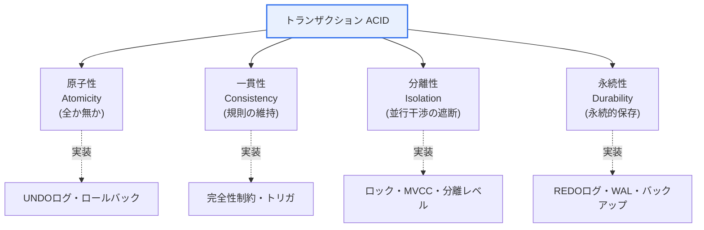
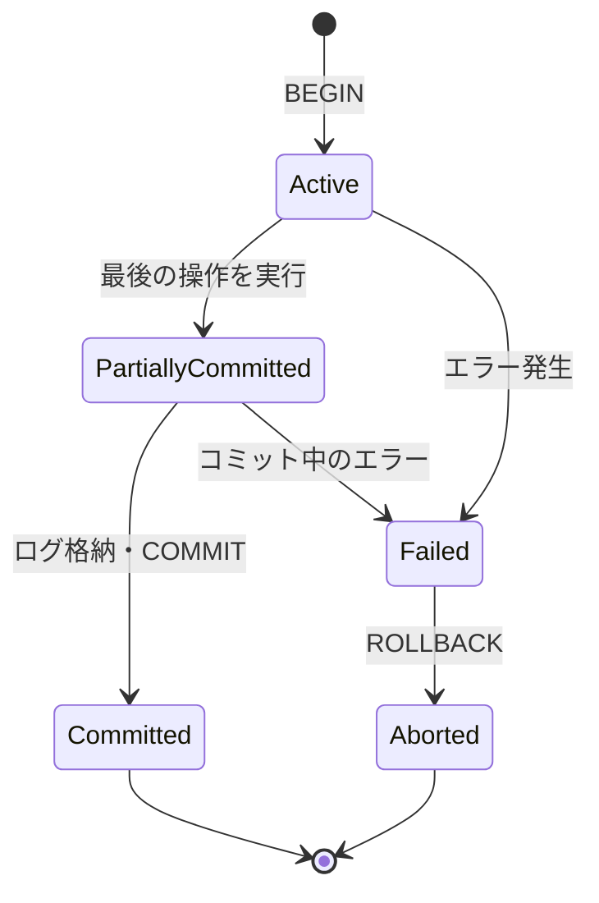

# データベーストランザクションの特性(ACID)

## 1. 概要

### A. 定義
> **トランザクション(Transaction)** とは、データベースの状態を変更する一つの**論理的作業単位(logical unit of work)** であり、複数の読み取り・書き込み操作をまとめて**すべて成功(Commit)するか、すべて失敗(Rollback)するよう**保証するものである。この信頼性が備えるべき四つの性質を規定したものが**ACID(Atomicity・Consistency・Isolation・Durability)** である。

トランザクションの本質は「**全か無か(All or Nothing)**」という原則にある。銀行の口座振替を例にとると、A口座から10万ウォンを出金する操作とB口座に10万ウォンを入金する操作は論理的に一つの事象であるため、必ず一緒に成功するか一緒に失敗しなければならない。もし出金は反映されたのに入金がシステム障害で欠落すれば、10万ウォンがこの世から消え、データは矛盾した状態に陥る。トランザクションはこのような操作の束を一つの単位として扱い、途中でエラーが発生すれば開始時点の状態へ原子的に戻す(ロールバック)。

ACIDは、この信頼性が「どのような性質から構成されるか」を四つの軸に分解したものである。原子性は「分割できないこと」を、一貫性は「規則違反がないこと」を、分離性は「並行実行が逐次実行のように見えること」を、永続性は「一度確定したら消えないこと」を保証する。この四つの性質がともに守られてはじめて、データベースは多数のユーザと障害が常に存在する環境においても「信頼できる記録システム(system of record)」として機能する。銀行・証券・電子商取引・航空予約のように、データの正確性がそのまま信頼であり法的責任でもあるドメインにおいて、ACIDがリレーショナルDBMSの根幹として定着した理由はここにある。

### B. 登場背景と必要性
初期のファイルシステムでは、複数のユーザが同時に同じデータを更新したり、処理の途中で停電が発生したりするとデータが容易に壊れた。更新消失(lost update)、部分更新、ダーティリード(dirty read)といった問題が放置されれば、会計・在庫・予約データの完全性が崩れる。これを根本的に解決するために登場した概念がトランザクションであり、ジム・グレイ(Jim Gray)が1970〜80年代に確立したトランザクション処理理論が今日のACIDの理論的土台となった。

必要性は二つの軸に整理される。第一は**並行性(concurrency)** である。多数のユーザが同時に同じデータを読み書きする環境において、各トランザクションがあたかも単独で実行されているかのように結果の整合性を保証しなければならない。第二は**障害回復(recovery)** である。停電・ディスクエラー・プロセスの強制終了など、いつでも起こりうる障害の中でも、コミットされた結果は生き残り、コミットされていない結果は跡形もなく消えなければならない。ACIDはこの二つの要求を満たすための契約(contract)であり、これを守るロック・ログ・MVCCといったメカニズムがDBMSエンジンの中核を成す。

## 2. ACIDの四つの特性

ACIDは、異なる観点からトランザクションの信頼性を保証する四つの性質の集合である。以下の構造図は、四つの特性が一つのトランザクション概念の下でそれぞれどの観点を担っているかを示している。

### A. 原子性(Atomicity)
原子性とは、トランザクションを構成する操作が**それ以上分割できない一つの塊**として扱われることを意味する。すべての操作が正常に反映されるか(Commit)、一つでも失敗すれば既に実行された操作まですべて取り消されて(Rollback)開始前の状態に戻る。中間状態(例: 出金だけ行われ入金は行われていない状態)が外部に確定結果として残ることは決してない。

原子性がなければどのような問題が生じるかを、再び口座振替で考えてみる。出金のUPDATEが成功した直後にサーバがダウンすると、原子性が保証されないシステムでは出金だけが反映されたまま残り、資産総額が食い違う。原子性は、このとき既に記録された出金を**UNDOログ**を用いて元に戻し、整合性を回復する。このように原子性は「失敗時の安全な後退」を担う。

実装の観点では、原子性は主に**ログベースのロールバック**によって実現される。DBMSはデータを実際に変更する前に変更前の値をUNDOログに先に記録しておき、トランザクションが失敗すればこのログを逆順に適用して原状回復する。したがって原子性は、後述する永続性と同様に、ログ管理の品質に直接依存する。

### B. 一貫性(Consistency)
一貫性とは、トランザクションの実行前と実行後のいずれにおいても、データベースが**あらかじめ定義された規則(完全性制約)** を満たす状態に維持されることを意味する。規則には主キー・外部キー制約、NOT NULL、CHECK制約、そして「すべての口座残高の合計は振替の前後で同一である」といった業務規則が含まれる。トランザクションはある一貫した状態から別の一貫した状態へデータを移行させるものであり、途中の過程で規則に違反したとしても、コミット時点では必ずすべての規則を満たさなければならない。

ここで留意すべき点は、一貫性の責任が**DBMSとアプリケーションに分かれている**ことである。DBMSは宣言された制約とトリガを強制するが、「振替総額の保存」のようなドメイン規則は、アプリケーションが正しいSQLを記述してはじめて守られる。つまり原子性・分離性・永続性が守られていても、開発者が誤ったロジックを入れれば一貫性は崩れうる。この点で一貫性は、純粋なエンジン機能というよりも「エンジンの保証+正しい設計」の共同作業である。

実務事例として在庫管理システムを考える。注文トランザクションは在庫数量を減算するが、在庫が負にならないようCHECK(stock >= 0)制約を設定しておけば、DBMSが規則違反を阻止してコミットを拒否する。このように制約をデータ層に宣言しておけば、アプリケーションにバグがあっても最後の防衛線が機能する。

### C. 分離性(Isolation)
分離性とは、複数のトランザクションが同時に実行されても、**各トランザクションがあたかも単独で逐次実行されたのと同じ結果**になることを保証するものである。すなわち、実行中のトランザクションの中間結果は他のトランザクションから見えてはならず、並行実行が互いの整合性を損なってはならない。完全な分離(直列化可能性、Serializability)を常に強制すると並行性が大きく低下するため、実務では**分離レベル(Isolation Level)** を設けて性能と整合性をトレードオフする。

分離が不完全なときに現れる代表的な異常現象は三つある。**ダーティリード(Dirty Read)** はコミットされていない他者の変更を読むこと、**反復不能読み取り(Non-repeatable Read)** は同じ行を二度読んだのに値が変わっていること、**ファントムリード(Phantom Read)** は同じ条件で検索したのに行数が変わっていることである。ANSI SQLは、これらの異常現象をどこまで許容するかによって四つの分離レベルを定義している。

| 分離レベル | ダーティリード | 反復不能読み取り | ファントムリード |
|---|---|---|---|
| **READ UNCOMMITTED** | 許容 | 許容 | 許容 |
| **READ COMMITTED** | 防止 | 許容 | 許容 |
| **REPEATABLE READ** | 防止 | 防止 | 許容(実装により防止) |
| **SERIALIZABLE** | 防止 | 防止 | 防止 |

分離レベルを上げるほど整合性は向上するが、ロック範囲が広がったり再試行が増えたりして並行性・スループットが低下する。例えば銀行の精算処理にはSERIALIZABLEに近い強い分離が必要であるが、参照が大半を占める商品カタログではREAD COMMITTEDでも十分である。実装方式も二系統に分かれる。伝統的なロックベース(Lock-based)は読み取り・書き込みロックで競合を防ぎ、**MVCC(多版型同時実行制御)** はデータの複数のバージョン(スナップショット)を保持し、「読み取りが書き込みを妨げない」という特性によって並行性を高める。Oracle・PostgreSQL・MySQL InnoDBがMVCCを採用して読み取り性能を確保しているのが代表例である。

### D. 永続性(Durability)
永続性とは、正常に**コミットされたトランザクションの結果が、その後いかなる障害(停電・クラッシュ)が発生しても永続的に保存される**ことを意味する。コミット応答を受け取ったユーザは、その結果が失われないと信頼できなければならない。永続性の中核的な実装技法は**WAL(Write-Ahead Logging、先行書き込みログ)** である。データページをディスクに書き込む前に変更内容をまずREDOログに安全に書き込み、ログがディスクに確実に格納された後でコミットを確定する。

WALのおかげで、コミット直後にサーバが停止しても、再起動時にREDOログを再適用(roll-forward)してコミット済みの変更を復元し、未完了のトランザクションはUNDOで除去(roll-back)して整合性を合わせる。この「ログ優先書き込み」原則が性能と安全性を同時に確保できる理由は、任意位置のデータページを毎回ディスクに書き込むよりも、ログを順次書き込むほうがはるかに高速であり、かつ復旧の根拠を残せるからである。

ただし永続性は、ストレージ層の信頼性に依存するという限界もある。ログがOSバッファにあるだけで実際のディスクにflushされていない状態で電源が落ちればコミットが消失しうるため、実務ではfsyncの強制、バッテリーバックアップキャッシュ、複数のレプリカ(replication)によって永続性を強化する。四つの特性と実装技法を表にまとめると次のとおりである。

| 特性 | 保証内容 | 代表的な実装技法 |
|---|---|---|
| **原子性(Atomicity)** | すべて反映されるか、まったく反映されないか | コミット/ロールバック、UNDOログ |
| **一貫性(Consistency)** | 規則・制約の維持 | 完全性制約、トリガ、正しいアプリロジック |
| **分離性(Isolation)** | 並行トランザクション間の干渉遮断 | ロック・MVCC、分離レベル |
| **永続性(Durability)** | コミット結果の永続的保存 | REDOログ・WAL、fsync、レプリケーション・バックアップ |

## 3. トランザクションの状態遷移とコミットプロトコル

トランザクションは定められたライフサイクル(状態)を経るものであり、この状態管理が原子性・永続性の実質的な実装である。以下の状態図は、トランザクションが開始から完了または取り消しに至るまでの遷移を表している。

トランザクションはBEGINとともに**活動(Active)** 状態に入って操作を実行し、最後の操作まで終えると**部分コミット(Partially Committed)** に移行する。この時点では変更はまだメモリ(バッファ)上にしかない可能性があり、REDOログがディスクに安全に記録されてはじめて**コミット済み(Committed)** として確定する。実行中にエラーが発生すると**失敗(Failed)** 状態となり、ROLLBACKによってUNDOログで原状回復した後、**中止(Aborted)** として終了する。COMMITは結果を永続的に確定し、ROLLBACKは開始状態に戻すという点で、この状態遷移そのものが原子性(中間状態の露出禁止)と永続性(ログ格納後のコミット)の具体的な実行手順である。

分散環境では複数のノードが関与するため、単純なコミットでは原子性を守ることができない。このときに用いるのが**2相コミット(2PC, Two-Phase Commit)** である。コーディネータ(coordinator)がすべての参加者に「コミット可能か」を問う準備(prepare)フェーズと、全員が同意すれば「コミットせよ」と指示する確定(commit)フェーズに分け、いずれか一つのノードでも準備に失敗すれば全体をロールバックする。ただし2PCには、コーディネータがダウンすると参加者が無限に待機するブロッキング問題や、遅延コストが大きいという弱点があるため、大規模分散システムでは後述するSagaのような代替手段が好まれる。

## 4. 分散環境への拡張 — BASE・CAP・Saga

単一ノードで強力であったACIDは、データが複数のノードに分散された途端にコストが急増する。**CAP定理**はその根本的な理由を説明する。分散システムは一貫性(Consistency)・可用性(Availability)・分断耐性(Partition tolerance)の三つを同時に完全に満たすことはできず、ネットワーク分断(P)が避けられない現実においては、CとAのどちらかをある程度譲らなければならない。強い一貫性(ACID)に固執すれば分断時に可用性が低下し、可用性を優先すれば一時的な不整合を受け入れなければならない。

このトレードオフにおいて可用性・拡張性を選んだ陣営が採用したモデルが**BASE(Basically Available, Soft state, Eventually consistent)** である。BASEは常に即時に一貫していることよりも、**結果整合性(Eventual Consistency)** を志向する。すなわち、更新直後はしばらくノード間で値が異なりうるが、一定時間が経過すればすべてのレプリカが同じ値に収束する。大規模ソーシャルメディアの「いいね」数や商品の閲覧数のように、瞬間的な不整合が致命的でないデータに適しており、Cassandra・DynamoDBのようなNoSQLがこのモデルを代表する。

| 区分 | ACID | BASE |
|---|---|---|
| **志向点** | 強い一貫性・整合性 | 可用性・拡張性 |
| **一貫性モデル** | 即時一貫性 | 結果整合性 |
| **代表的な用途** | 金融・会計・予約 | SNS・ログ・レコメンド・キャッシュ |
| **代表的な技術** | RDBMS(2PC) | NoSQL、メッセージベースシステム |

MSA(マイクロサービスアーキテクチャ)ではサービスごとにDBが分離され、一つの業務が複数のDBにまたがるため、従来のトランザクションを使用できない。このとき**Sagaパターン**が代替手段となる。Sagaは長い業務をローカルトランザクションの連鎖に分割し、途中で失敗すれば先に成功したステップを元に戻す**補償トランザクション(compensating transaction)** を実行して論理的な原子性を模倣する。例えば注文→決済→配送の流れで配送予約が失敗すれば、決済取消・注文取消という補償操作を逆順に実行する。Sagaはコレオグラフィ(イベントベース)とオーケストレーション(中央コーディネータ)の二つの方式で実装され、2PCのブロッキングなしに拡張性を得る代わりに、「即時一貫性の放棄」と「補償ロジック設計の負担」を代償として払う。

## 5. 深掘り — 最新動向と実務適用

一時期は「拡張のためにACIDを捨てる」という流れ(NoSQL初期)が優勢であったが、近年は**分散環境でもACIDを復活させようとするNewSQL・分散SQL** が強く台頭している。Google Spannerは原子時計(TrueTime)を利用して地球規模で強い一貫性と外部一貫性(external consistency)を提供し、CockroachDB・YugabyteDB・TiDBなどはこれをオープンソース系で実装して「水平拡張+ACID」の両立を狙っている。これは、開発者に結果整合性の複雑な処理を押し付けることなく拡張性を確保したいという要求が大きいことを示している。

リレーショナル陣営自体のトランザクション処理も進化した。多くのDBMSがMVCCを標準として採用して読み取りと書き込みの競合を減らし、PostgreSQLは直列化可能スナップショット分離(SSI, Serializable Snapshot Isolation)によってロックなしでもSERIALIZABLEレベルを提供する。また、クラウドのマネージドDB(Auroraなど)はログをストレージ層に分離してWALの書き込みとレプリケーションを最適化することで、永続性と可用性を同時に向上させた。実務では、こうした特性を理解したうえで**業務の性格に合った一貫性レベルを選択**することが設計の中核的な能力となる。

情報管理技術士の観点での出題ポイントは、概ね①ACIDの各特性の定義と実装技法を正確に記述し、②分離レベルと異常現象の対応関係を表と事例で提示し、③分散環境におけるACIDの限界をCAP・BASE・2PC・Sagaへと拡張して論じる、という三つの方向である。特に「なぜ分離レベルを下げるのか」「MSAでなぜSagaを使うのか」のように、**トレードオフの理由**を説明する答案が差別化につながる。

## 6. 考慮事項および示唆

1. **分離性と性能のトレードオフが実務の核心である。** 分離レベルを上げれば整合性は向上するが、ロック・再試行によって並行性とスループットが低下する。参照中心の業務はREAD COMMITTEDに、精算・在庫のように正確性が重要な業務はREPEATABLE READ以上にするなど、業務特性に応じた差別的な適用が必要である。

2. **一貫性はエンジンとアプリケーションの共同責任である。** DBMSが制約・トリガで規則を強制しても、ドメイン規則(総額保存など)は正しいSQL設計があってはじめて守られる。制約をデータ層に宣言し、アプリケーションのバグに対する最後の防衛線を置くことが安全である。

3. **分散環境ではACIDを状況に応じて緩和・再構成する。** 2PCは強い原子性を与えるがブロッキング・遅延のコストが大きく、BASE・Sagaは拡張性を与える代わりに結果整合性と補償ロジックの負担を伴う。CAPの制約の下で、データの重要度に応じて強い一貫性と可用性のどちらに重きを置くかを決定しなければならない。

4. **ログベースの復旧が信頼性の物理的基盤である。** UNDO・REDOログ(WAL)によって原子性と永続性が実装されるため、ログ管理・チェックポイント・バックアップ戦略とfsync・レプリケーション構成がデータ完全性の実質を左右する。永続性はストレージ層の信頼性に依存するため、冗長化・レプリケーションで補強しなければならない。

5. **NewSQL・分散SQLによって「拡張性とACIDの両立」を再検討する。** Spanner・CockroachDBなどの登場により、「拡張するにはACIDを捨てなければならない」という前提が揺らいだ。新規システムの設計時には、結果整合性を受け入れる前に、分散SQLでも要求性能を出せるかどうかをまず検討するのが合理的である。

## 参考資料
- Wikipedia, "ACID" — https://en.wikipedia.org/wiki/ACID
- PostgreSQL Documentation, "Transaction Isolation" — https://www.postgresql.org/docs/current/transaction-iso.html
- microservices.io, "Pattern: Saga" — https://microservices.io/patterns/data/saga.html

---

> **一言まとめ**: トランザクションは*すべて成功またはすべて失敗* する論理的作業単位であり、*原子性・一貫性・分離性・永続性(ACID)* をロック・MVCC・ログ(WAL)で実装して信頼性を保証する。分散・NoSQL・MSA環境ではCAPの制約の下でBASE・2PC・Sagaによってトレードオフを調整し、近年はNewSQLが拡張性とACIDの両立を試みている。
