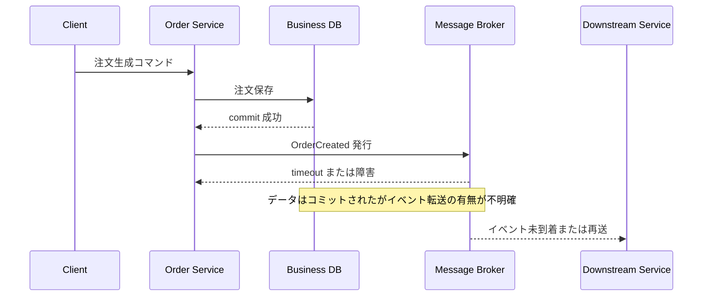
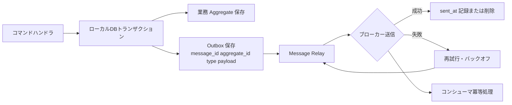
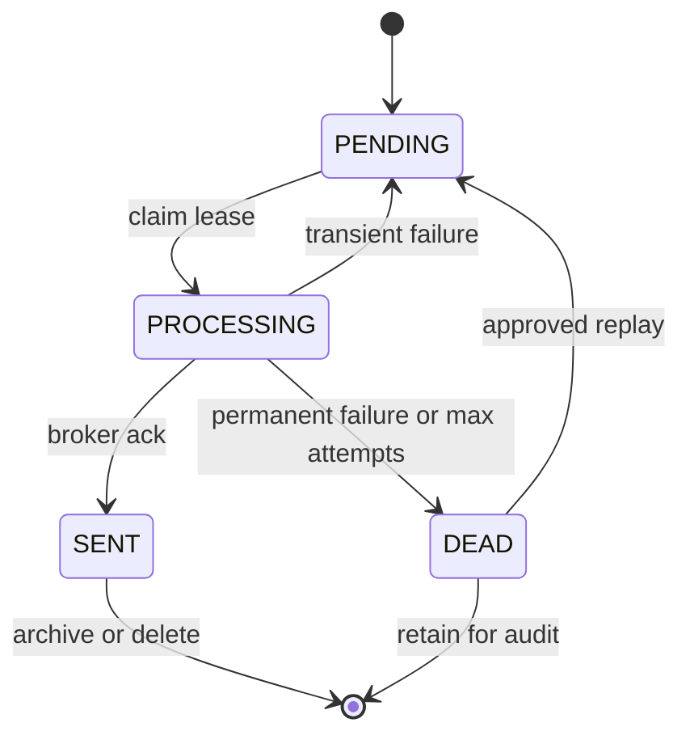

# トランザクショナルアウトボックスパターン(Transactional Outbox Pattern)

## 1. 概要

> トランザクショナルアウトボックスパターンとは、業務データの変更とイベント・メッセージの発行を同一データベースのローカルトランザクションで記録した後、別途のメッセージリレーがコミット済みのアウトボックスをブローカーへ転送する分散システムの設計パターンである。

マイクロサービスにおいて一つのコマンドは、通常二つの副作用を生み出す。
第一に、注文・決済・在庫といった業務状態を自身のデータベースに保存する。
第二に、他のサービスが後続業務を実行できるよう、イベントをメッセージブローカーに発行する。
この二つの保存先は互いに異なるシステムであるため、アプリケーションコードで順番に呼び出すと二重書き込み(dual write)となる。

データベースのコミットが成功した後にプロセスが停止すると、データは存在するがイベントが失われる可能性がある。
逆にブローカーへの発行が先に成功した後でデータベーストランザクションがロールバックされると、存在しない業務事実をコンシューマが処理することになる。
ネットワークタイムアウトは、実際にブローカーが受信したかどうかを呼び出し側に明確に知らせないため、単純な再試行だけでは重複と消失を同時に解決することは難しい。

トランザクショナルアウトボックスは、メッセージをブローカーに直接送る代わりに、データベースのアウトボックステーブルまたはレコードに併せて保存する。
業務テーブルとアウトボックスが同一のローカルトランザクションに含まれれば、コミットされた業務変更には転送すべきイベントが必ず残り、ロールバックされた業務変更にはイベントが残らない。
その後、メッセージリレーがアウトボックスを読み取ってブローカーに送信するため、アプリケーションのリクエスト経路と外部ブローカーの障害を分離できる。

このパターンは、あらゆる分散トランザクションを解決する万能の技法ではない。
一つのサービス内部でデータとイベントの記録を原子化するが、ブローカーへの転送以降のコンシューマ処理までを原子的に束ねるものではない。
したがって、少なくとも1回の配信、重複メッセージ、順序、コンシューマの冪等性、再処理と補償業務を併せて設計しなければならない。

技術士の答案では定義だけを書くよりも、二重書き込みの失敗点、アウトボックスの原子的記録、リレーの再送、コンシューマの冪等性という四つの軸を結び付けて説明することが重要である。

## 2. 登場背景と解決しようとする問題

### 2.1 直接発行方式の二重書き込み

最も直感的な実装は、サービスがデータベースを更新した直後にメッセージブローカーの `publish` APIを呼び出すことである。
二つの呼び出しがともに成功すれば望む結果が得られるが、アプリケーションプロセス・ネットワーク・データベース・ブローカーのいずれか一つでも失敗すれば状態が食い違う。

データベースに先に書き込む方式では、業務状態がコミットされた後にブローカーへの発行が失敗したりプロセスが停止したりする区間が存在する。
このとき在庫サービスや配送サービスは、注文生成の事実を永遠に知ることができない可能性がある。
ブローカーに先に書き込む方式では、コンシューマがイベントを処理している間に元データがロールバックされうるため、より深刻な虚偽の事実を生み出す。

`DB commit`と`broker publish`が互いに異なるリソースに対する独立した動作であるという点が核心である。
データベーストランザクションの中にブローカー呼び出しを入れても、ブローカーが同じトランザクションに参加しなければ原子性は生まれない。
むしろブローカーの遅延のためにデータベース接続を長く占有し、コミットとメッセージ送信の順序を解釈しにくくなる場合がある。

これに対しアウトボックス方式は、ブローカー呼び出しを業務トランザクションから分離する。
業務テーブルとアウトボックス行を一緒にコミットする短いローカルトランザクションを先に終え、リレーはコミット済みの行のみを非同期に送信する。
したがってリクエスト応答の成功条件は「ブローカーが即座に受け取った」ではなく、「業務状態と転送すべきイベントが安全に保存された」と定義される。

### 2.2 失敗マトリクスと保証範囲

失敗を分析する際は、業務DB、リレー、ブローカー、コンシューマを分離して観察しなければならない。
業務DBトランザクションがロールバックされれば、アウトボックスも一緒にロールバックされてイベントが発行されないようにすべきである。
コミット後にリレーが停止した場合、アウトボックス行は残り、再起動後に再試行できなければならない。

| 区間 | 障害例 | 望ましい結果 | 必要な設計 |
|---|---|---|---|
| 業務保存前 | 入力検証・ドメインルールの失敗 | 業務データとイベントがともに存在しない | トランザクションのロールバック |
| 業務保存中 | DBエラー・タイムアウト | 業務データとアウトボックスがともに存在しない | 同一ローカルトランザクション |
| コミット直後 | サービスプロセスの停止 | アウトボックスは残り送信は遅延 | 再起動・再試行 |
| ブローカー送信中 | ネットワーク応答の消失 | 実際の受信有無が不明確 | 重複の許容・メッセージID |
| 消費処理中 | コンシューマの停止 | メッセージの再配信または再処理 | コンシューマの冪等性 |
| 長期障害 | ブローカー・コンシューマの長期不能 | アウトボックスの滞留とアラート | 保存・隔離・運用ランブック |

このパターンの代表的な保証は、「業務トランザクションがコミットされた場合にのみ、イベントがリレーの対象となる」ことである。
しかし「イベントが正確に1回だけブローカーとコンシューマに到着する」という保証は、一般的な実装では成立しない。
リレーが送信成功の応答を受け取る前に停止すれば、再起動後に同じ行を再び送信しうるからである。

したがって、システムの配信セマンティクスをat-least-onceと明示し、重複を正常な運用状況として扱うほうが安全である。
正確に1回のように見える業務結果は、メッセージID、処理履歴、条件付き更新、一意制約を組み合わせてコンシューマ側で実装する。
配信セマンティクスと業務セマンティクスを区別しなければ、ブローカーの機能だけを信じて重複決済や重複予約を許してしまう誤りが発生する。

## 3. 中核構成要素と処理フロー

### 3.1 アウトボックスの論理構造

アウトボックスは、送信すべきイベントを一時的に保存する耐久性のある境界である。
リレーショナルデータベースでは業務テーブルと同じデータベース内の別テーブルとして作成し、ドキュメント型データベースでは業務レコード内部のイベント配列や変更属性として表現できる。
いずれの方式であっても、イベントの業務的意味と送信状態を追跡するための識別子が必要である。

`message_id`は、再送とコンシューマでの重複除去の基準となる。
`aggregate_id`は、同じ注文・アカウント・配送案件に属するイベントを束ね、パーティションキーや順序保証の基準として使用できる。
`event_type`と`schema_version`は、コンシューマがイベントの種類と契約バージョンを解釈できるようにする。

`occurred_at`は業務上の事象が発生した時刻であり、`published_at`はブローカーへの転送時刻であるため、両者を混同してはならない。
`sequence`は同一aggregate内の業務順序を表現できるが、単純なグローバル自動増分値がそのまますべてのサービスの因果順序を意味するわけではない。
`attempt_count`、`last_error`、`next_attempt_at`は、運用者が再試行状態を確認し、指数バックオフを計算するのに使用する。

スキーマ例は次のように設計できる。

| カラム | 意味 | 設計ポイント |
|---|---|---|
| `id` | アウトボックス行の識別子 | 増分キーまたは時間順にソート可能なID |
| `message_id` | 論理的なメッセージID | グローバル一意制約と重複除去に活用 |
| `aggregate_type` | 業務オブジェクトの種類 | コンシューマのルーティングと権限レビュー |
| `aggregate_id` | 業務オブジェクトの識別子 | 同一オブジェクトの順序とパーティションキー |
| `event_type` | イベントの種類 | 契約およびハンドラの選択 |
| `schema_version` | payloadのバージョン | 後方互換・マイグレーションの基準 |
| `payload` | イベント本文 | 機微情報の最小化・シリアライズ規則 |
| `occurred_at` | 業務発生時刻 | 遅延測定と監査追跡 |
| `status` | pending・processing・sent・dead | 状態遷移と再処理の統制 |
| `attempt_count` | 送信試行回数 | バックオフ・隔離の閾値 |
| `last_error` | 直近の失敗概要 | 秘密情報の除外・運用診断 |

アウトボックスのpayloadにはコンシューマが必要とする事実を盛り込むが、元のデータベースを後で照会しなければ意味が完成しない形は慎重に選択する。
イベントの発行時点と消費時点の間に元レコードが変更・削除されると、過去の事実を再現できなくなるからである。
一方で、個人情報や大容量バイナリをイベントに複製すると保存・暗号化・削除の要件が複雑になるため、データ最小化の原則を適用する。

### 3.2 原子的な記録の順序

サービスはコマンドを検証してドメインルールを実行した後、業務変更とアウトボックスイベントを一つのローカルトランザクションに入れる。
業務テーブルを先に保存しアウトボックスを後で保存したとしても、両者が同じトランザクションであれば、順序そのものよりも原子性が重要である。
いずれかの書き込みが失敗すれば全体をロールバックしなければならず、成功応答はこのコミットの後に返す。

アプリケーション層がイベント発行を呼び出しても、実際のブローカー送信を直接行わないよう、イベント保存ポートとメッセージリレーを分離する。
ドメインイベントを収集する場合でも、イベントをアウトボックスレコードに変換する時点でcorrelation ID、causation ID、schema versionを確定する。
こうすることで、同一コマンドの追跡と、複数のサービスにまたがる原因関係を観測できる。

ORMの自動flushやトランザクション境界だけに依存すると、テスト環境や運用環境でイベントの欠落が生じうる。
業務状態の変更ごとに発行するイベントを明示的に決定し、統合テストで「コミットされた状態の数 = アウトボックスイベントの数」と、ロールバック時の「アウトボックス0件」を検証する。
コードレビューのルールやドメインイベントディスパッチャを用いて、開発者がアウトボックスの記録を漏らす可能性も低減する。

### 3.3 メッセージリレー方式

リレーは、アウトボックスをブローカーへ移す別プロセスまたはデータプラットフォームの構成要素である。
最も単純なポーリングパブリッシャは、定期的に`pending`行を照会し、ロック・claimを適用した後にバッチで発行する。
発行成功を確認した後に`sent_at`を記録するか削除し、失敗した行は再試行時刻を更新する。

ポーリング周期が短ければ転送遅延は減るが、DB照会とロックの負荷が増える。
バッチサイズが大きすぎると一度の障害での再送規模とブローカー負荷が大きくなり、小さすぎるとスループットが低くなる。
したがって、目標遅延時間、アウトボックス流入率、平均payloadサイズ、DB IOPS、ブローカーのquotaを用いて、周期とバッチサイズを負荷試験で決定する。

CDC方式は、データベースのトランザクションログや変更ストリームからコミット済みのアウトボックス変更を読み取り、ブローカーに転送する。
ポーリングに比べてアプリケーションDBの照会負荷と転送遅延を減らせるが、ログ保持・スキーマ変更・コネクタ運用・offset復旧を別途管理しなければならない。
CDCは業務テーブルのすべての変更をそのまま公開イベントにするという意味ではなく、明示的なoutboxイベントのみを発行対象に限定するのが安全である。

| 方式 | 長所 | コスト・リスク | 適した状況 |
|---|---|---|---|
| 定期ポーリング | 構造が単純でDBだけで開始可能 | 照会・ロック負荷、遅延の変動 | 小規模または初期導入 |
| トランザクションログCDC | 低遅延、大量処理に有利 | コネクタ・ログ・offset運用の複雑さ | イベント流入が多くプラットフォーム能力のある組織 |
| DBトリガ | 記録漏れの防止が可能 | 業務ルールがDBに隠れ移植性が低下 | 限定的なレガシー統合 |
| アプリケーションイベント収集 | 業務的意味と契約をコードで統制 | 開発者の漏れ・共通ライブラリへの依存 | ドメイン中心のサービス |

リレーの送信と状態記録の間には、再び原子的でない区間が存在する。
ブローカーに正常に送信した後、`sent_at`を記録する前にリレーが停止する可能性があるため、状態行を先に`processing`に変えるだけでは重複はなくならない。
この区間をなくそうとするよりも、再送を許容して同一の`message_id`を維持し、コンシューマが安全に重複を除去できるよう設計する。

### 3.4 並行性・ロック・順序

複数のリレーインスタンスが同じ行を読むと、重複発行が増加しうる。
リレーショナルDBでは`SELECT ... FOR UPDATE SKIP LOCKED`とclaim時刻、所有者、lease期限を組み合わせることができるが、使用するDBのロックセマンティクスと長期トランザクションのコストを検証しなければならない。
行を永続的に占有したリレーが停止した場合、leaseの期限切れ後に別のリレーが回収できなければならない。

同一aggregateのイベント順序が重要であれば、aggregate単位の単一パーティション、sequence検証、逐次claimのいずれかを選択する。
グローバルな順序を強制するとスループットと可用性が低下しうるため、大半の場合は同じ注文・アカウント・機器のように業務上必要な範囲の順序のみを保証する。
異なるaggregate間の行IDの順序が、そのまま業務上の因果関係を意味すると仮定してはならない。

## 4. 重複・順序・再処理の設計

### 4.1 冪等なコンシューマ

重複は、リレーがブローカーの応答を確認できなかった場合、ブローカーの再配信、コンシューマのACK前の障害によって自然に発生する。
コンシューマは`message_id`の処理履歴テーブルに一意制約を設けて既に処理したメッセージを速やかに成功扱いにするか、業務更新そのものを条件付き・冪等にする。
例えば決済承認リクエストでは、注文IDに一意の決済試行キーを設け、同じキーで2回目のリクエストが来た場合は既存の結果を返すようにする。

処理履歴の記録と業務更新も、可能であれば一つのコンシューマローカルトランザクションにまとめる。
業務更新後、処理履歴の記録前に障害が発生すると再処理時に重複した副作用が生じるため、一意キーの衝突を正常な重複シグナルとして活用する。
外部決済APIのようにコンシューマDBの外部で生じる副作用には、提供者のidempotency key、リクエストキー、突合作業を併用しなければならない。

### 4.2 失敗の分類と再試行

一時的なネットワークエラー・ブローカーのthrottling・コンシューマの一時停止には、指数バックオフとjitterを適用して再試行する。
スキーマエラー・必須フィールドの欠落・無効な業務状態は再試行しても成功しないため、無限に再試行する代わりに隔離キューやdead-letter outboxへ送る。
再試行ポリシーには、エラーコード別の最大回数、最大保持時間、運用者による再処理承認の要否を含めなければならない。

再処理では、元のpayloadをそのまま再送することと、新たな補正イベントを作ることを区別する。
単純な再送は、コンシューマのコードが修正された後に過去のイベントを再反映する際に有用であるが、既に部分的に実行された外部の副作用を元に戻すものではない。
金額・在庫・権限のように補償業務が必要な場合は、運用者が原因と結果を確認し、別途の補償コマンドを実行するようにする。

### 4.3 可観測性と運用指標

アウトボックスは非同期の境界であるため、リクエストの成功率だけを見ていると障害を見逃す。
アウトボックス行のoldest age、pending count、publish latency、retry rate、dead-letter count、relay throughputを主要指標として収集する。
`occurred_at`からブローカー発行時刻までの遅延と、発行から消費処理完了までの遅延を分けると、ボトルネックの位置がわかる。

ログにはmessage_id、aggregate_id、correlation_id、event_type、attempt_count、relay_instanceを構造化して記録する。
payload全体や個人情報をログに残さず、追跡IDによって元のイベントと運用記録を結び付ける。
分散トレーシングでは業務リクエストのspanとリレーのspanが異なるプロセスにまたがるため、trace contextをイベントヘッダに安全に伝播する。

保持期間を過ぎたアウトボックスをすぐに削除すると、監査と再処理が困難になる場合がある。
運用DBのhot領域、低コストのarchive、個人情報削除ポリシーを区別し、削除前にバックアップ・突合・再処理の可能性を検討する。
処理完了行を無期限に残すとインデックスと保存コストが増大するため、パーティション、TTL、archive jobを使用するが、規制上の保存要件と衝突しないようにする。

## 5. 関連技術との比較

### 5.1 直接発行および2PCとの比較

直接発行は実装が短いが、DBコミットとブローカー送信の失敗区間をアプリケーションが直接引き受けなければならない。
2PCは複数の参加者のprepareとcommitを調整して原子的コミットを試みるが、参加者のサポート有無とcoordinatorの障害、ロック保持とブロッキングのコストを考慮しなければならない。
アウトボックスはブローカーを分散トランザクションの参加者にせず、DB内にメッセージを先に記録するため、結合度と運用の複雑さを下げる。

| 区分 | 直接発行 | 2PC/XA | トランザクショナルアウトボックス |
|---|---|---|---|
| 原子性の範囲 | 呼び出し順序に依存 | 参加者全体 | 業務DBとoutboxの記録 |
| ブローカーとの結合 | アプリケーションに直接結合 | coordinator・XAのサポートが必要 | リレーが結合 |
| 転送遅延 | 即時に試行 | コミット調整時間 | 非同期の遅延 |
| 重複処理 | 実装により異なる | コミット後も別途考慮 | 冪等なコンシューマが必須 |
| 障害の隔離 | リクエスト経路が影響を受ける | 参加者の障害がトランザクションを阻害 | リレーの滞留で隔離 |
| 運用負担 | 初期は低いが障害時は高い | プロトコル・ロック・復旧が複雑 | outbox・relay・replayの運用 |

アウトボックスが常に2PCより優れているわけではない。
強い原子性が複数のデータストアに必ず必要であり、すべての参加者が検証済みのXAをサポートしているのであれば、2PCを検討できる。
しかし外部ブローカー・SaaS・クラウドサービスがXAに参加しない場合や、高い可用性と疎結合が重要な場合には、アウトボックスの結果整合性がより現実的な選択となる。

### 5.2 CDCとイベントソーシング・Sagaとの関係

CDCは変更内容を読み取って転送する伝送メカニズムであり、アウトボックスはどの業務事実を公開するかを明示的に記録するパターンである。
業務テーブルのすべてのrow changeを外部に公開すると内部スキーマがイベント契約として固定化しうるため、別途のoutboxイベントをCDCで読み取る方式が境界を明確にする。

イベントソーシングは、イベントをシステムの原本事実として保存し、そのイベントを再生して状態を構築するモデルである。
アウトボックスは通常の現在状態テーブルを維持しつつ外部発行を保証することを目的とするため、イベントソーシングなしでも使用できる。
イベントソーシングを導入したシステムでは、イベントストアと外部ブローカーの転送境界をアウトボックスまたはログベースのリレーで設計できる。

Sagaは、複数のサービスにまたがる業務をローカルトランザクションと補償処理の連鎖で調整するパターンである。
各Sagaステップにおいて、自身のDB変更と次のコマンド・イベントを安全に発行するためにアウトボックスを併用できる。
アウトボックスはメッセージ転送の原子性を補完し、Sagaは複数サービスの業務進行・補償ポリシーを担うため、役割を混同してはならない。

## 6. 適用事例

### 6.1 電子商取引の注文

注文サービスは注文状態を`PAID_PENDING`に変更しつつ、`PaymentRequested`をアウトボックスに記録する。
決済が承認されると、決済サービスは処理履歴と決済状態を併せて記録し、`PaymentApproved`を再び自身のアウトボックスに入れる。
在庫・配送サービスは同じ注文IDとイベントIDを使用して、重複予約・重複出庫を防止する。

決済承認イベントの消失は、注文が永遠に待機状態となる問題を引き起こしうるため、pending oldest ageをアラートとして設定する。
決済の再試行でネットワーク応答だけが失われた場合は、同じidempotency keyで決済結果を照会しなければならず、むやみに新しい承認リクエストを作ると二重決済になりうる。
運用者は注文・決済・在庫の状態を突合し、補正コマンドを実行できなければならない。

### 6.2 金融振替と元帳イベント

口座サービスは元帳残高と振替イベントを同じローカルトランザクションで記録する。
イベントには取引ID、アカウント識別子、金額、通貨、元帳sequenceを含めるが、認証情報や不要な個人情報は除外する。
コンシューマは取引IDの一意制約とsequence検証によって、同じ振替を二度反映せず、順序が入れ替わったイベントを隔離する。

金融業務では「一度だけ処理」という表現よりも、元帳の不変条件と突合可能性が重要である。
ブローカーの再送を許容しつつ、最終的な元帳結果が一度だけ反映されるよう、ストレージの制約と処理履歴を設計する。
保存・監査・アクセス制御の要件があるため、アウトボックスのarchiveと削除ポリシーは法務・セキュリティ担当者と共に決定しなければならない。

### 6.3 物流とIoTの状態変化

物流ハブは機器の状態を保存しつつ`DeviceStateChanged`イベントを発行し、監視・保守・通知サービスを更新する。
同じ機器の状態順序が重要であるため、device IDをパーティションキーとして使用し、sequenceが以前の値以下であれば重複・遅延イベントとして処理する。
短い一時的障害は再試行し、長期間オフラインだった端末の古い状態には最新状態による上書きまたは破棄のポリシーを適用する。

秒間イベント数が多い場合、行ごとにポーリングする方式はDBの負担になりうる。
このときはCDCとパーティション化したアウトボックス、バッチリレー、保持周期の調整を組み合わせるが、データベースログとブローカーのスループットを負荷試験する。
運用指標には機器別の遅延と欠落だけでなく、outboxの滞留による監視画面の鮮度も含めなければならない。

## 7. 深掘り: 設計・導入戦略と予想出題ポイント

### 7.1 段階的導入

第一段階では、イベントが必要な中核ユースケースを一つ選定し、業務テーブルと同じDBに最小限のフィールドを持つoutboxを作成する。
同期的なブローカー発行を取り除く前に、既存の発行とアウトボックスによる発行を比較観察するshadowモードを使用できる。
重複イベントがコンシューマに到達しうるため、移行期間中はconsumer idempotencyを先に確保する。

第二段階では、リレーのclaim・lease・backoff・DLQ・再処理を標準化する。
サービスごとに異なる状態名や再試行ルールを作ると運用者が障害に対応しにくくなるため、共通ライブラリとプラットフォームのガードを提供する。
ただしイベント契約はドメインごとに意味が異なるため、一つの巨大な共通payloadモデルに強制しない。

第三段階では、CDCまたはイベントプラットフォームへ拡張し、スキーマレジストリ・契約テスト・保存・アクセス制御を連携させる。
ブローカーが変わってもドメインイベントの意味とmessage_idのルールは維持し、コンシューマ契約の不要な変更を減らす。
導入成果は単純なスループットよりも、イベント欠落率、平均転送遅延、再処理成功率、突合の未解決件数で評価する。

### 7.2 予想答案の構成

試験答案の概要では、二重書き込みと分散トランザクションの背景を提示した後、「業務データとoutboxを同一ローカルトランザクションで保存し、relayが非同期に発行する」と定義する。
概念図には、コマンドハンドラ、DBトランザクション、業務テーブル、outbox、relay、broker、idempotent consumerを漏れなく表示する。

本論では、直接発行の二つの失敗シナリオとアウトボックスの原子的記録を対比する。
ポーリングとCDCの違い、message_id・aggregate_id・sequenceの設計、重複・順序・再試行・DLQ・観測指標を説明すれば、単純な暗記型の答案から脱することができる。

結論では、アウトボックスは「正確に1回」を約束する方式ではなく、ローカルな原子性と再処理可能な結果整合性を提供するものであるという限界を明示する。
業務の重要度に応じて2PC・Saga・イベントソーシングと組み合わせ、冪等なコンシューマ・突合・セキュリティ・コスト・運用能力まで提示すれば、技術士としての判断を示すことができる。

## 8. 考慮事項および示唆

### 8.1 保証範囲を契約として明示

「イベント発行の保証」を、コミットの保証、ブローカー転送の保証、消費処理の保証に分けて文書化する。
サービスレベル目標には、最大転送遅延、最大再試行時間、DLQ処理時間、許容可能な重複率を含める。
業務担当者がこれを理解していなければ、非同期の結果整合性をユーザに誤って表示してしまう可能性がある。

### 8.2 冪等性と順序は業務ごとに設計

すべてのメッセージにグローバルな順序を強制する代わりに、aggregateごとに必要な順序のみを定義する。
コンシューマの処理履歴、条件付き更新、一意キー、外部のidempotency keyを、副作用の種類に合わせて組み合わせる。
重複をエラーとしてのみ記録するのではなく、正常な再配信経路としてテストしなければならない。

### 8.3 保存・保持・個人情報の最小化

アウトボックスはイベントが発行されるまで元のpayloadを保持するため、機微情報が複製される地点となる。
フィールドを最小化し、暗号化・アクセス制御・マスキング・保持期間・削除の伝播を設計する。
処理完了イベントをarchiveする場合でも、監査要件と個人情報削除要件の間の優先順位を事前に決定する。

### 8.4 運用の安全性と障害の隔離

リレーはDBに過度なロックをかけず、障害が発生した一行がバッチ全体を妨げないよう隔離する。
ブローカー障害時にはbackpressure、circuit breaker、rate limitを適用し、outboxの滞留が業務DBの保存領域を枯渇させないよう上限とアラートを設ける。
DLQの再処理は、承認・プレビュー・dry-run・ロールバックまたは補償手順を備えた運用ツールで統制する。

### 8.5 契約の進化とテスト

イベントは内部テーブルのDTOではなく外部コンシューマが依存する契約であるため、フィールドの削除・意味の変更は慎重に行う。
schema version、後方互換ルール、consumer-driven contract test、サンプルpayloadを併せて管理する。
統合テストでは、コミット・ロールバック・リレーの停止・ブローカーACKの消失・重複・順序逆転・DLQ再処理をシナリオとして検証する。

### 8.6 アーキテクチャ選択のバランス

アウトボックステーブルとリレーは追加の保存・運用構成要素を必要とするため、単純なCRUDサービスに無条件に適用するとコストが大きくなる。
逆に、データ変更が他サービスの決済・在庫・権限・監査につながり、イベント消失のコストが大きいのであれば、わずかな転送遅延と運用の複雑さを受け入れる価値がある。
技術士は、トランザクション境界、失敗コスト、スループット、規制、組織能力を基準として、直接発行・アウトボックス・2PC・Sagaを選択しなければならない。

## 参考資料

- AWS Prescriptive Guidance, [Transactional outbox pattern](https://docs.aws.amazon.com/prescriptive-guidance/latest/cloud-design-patterns/transactional-outbox.html)
- Chris Richardson, [Pattern: Transactional outbox](https://microservices.io/patterns/data/transactional-outbox.html)
- Debezium Documentation, [Outbox Event Router](https://debezium.io/documentation/reference/stable/transformations/outbox-event-router.html)

---

> **一言まとめ**: 業務データとイベントを同一ローカルトランザクションでoutboxに記録し、冪等なコンシューマ・順序・再処理の体系を備えたリレーによって結果整合性をもって転送するパターンである。
