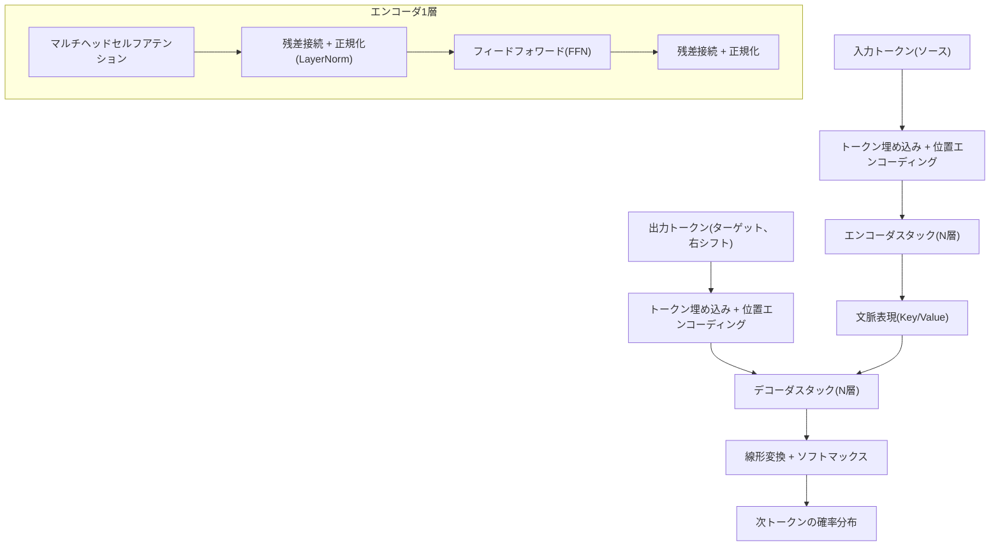
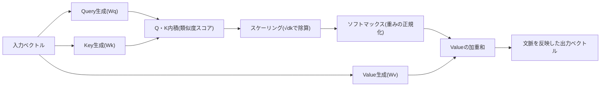

# トランスフォーマー(Transformer)とアテンション(Attention)メカニズム

## 1. 概要

> **定義**: トランスフォーマーとは、再帰(RNN)や畳み込み(CNN)の構造を用いず、**アテンション(Attention)** 演算のみによって入力シーケンス内のすべてのトークン間の関係を並列に計算する深層学習アーキテクチャである。2017年にGoogleの論文「Attention Is All You Need」で提案されて以来、自然言語処理・ビジョン・音声を包含する現代の大規模AIモデルの事実上の標準構造となった。

トランスフォーマーの登場背景は、既存の再帰型ニューラルネットワーク(RNN・LSTM)が抱えていた二つの構造的限界にある。
第一は**逐次処理による並列化の不可能性**である。
RNNは時点tの隠れ状態を計算するためにt-1の状態が先に必要となるため、シーケンス長に比例して逐次的に計算せざるを得ず、これはGPUの大規模並列演算能力を活用できないため大規模学習のボトルネックとなった。
第二は**長距離依存性(long-range dependency)の消失**である。
文の前半の情報が後半まで伝わるには、複数の時点を経て隠れ状態に乗って流れなければならないが、その過程で勾配消失が生じ、遠く離れた単語間の関係が薄れてしまう。

トランスフォーマーは、この二つの問題をアテンションという単一の原理で同時に解決する。
アテンションでは各トークンがシーケンスの**すべての**トークンを一度に参照して関連度(重み)を直接計算するため、逐次依存がなくなり完全な並列処理が可能となり、二つのトークンがどれほど離れていても経路長が定数(O(1))に保たれるため、長距離の関係が損失なく反映される。
こうした並列性と拡張性のおかげで、トランスフォーマーはデータとパラメータを増やすほど性能が予測可能に向上する**スケーリング則(scaling law)**を実現し、GPT・BERT・T5のような超大規模言語モデル(LLM)の共通基盤となった。
答案ではトランスフォーマーを単なる一つのニューラルネットワークではなく、「並列性・長距離依存性・拡張性」という三つの価値を同時に達成した**パラダイム転換**として記述するのが妥当である。

## 2. トランスフォーマーの全体アーキテクチャ

トランスフォーマーは、入力を理解する**エンコーダ(Encoder)**と出力を生成する**デコーダ(Decoder)**をそれぞれN個(原論文では6個)積み重ねたエンコーダ-デコーダ構造を基本形とする。
以下の概念図は、入力トークンが埋め込み・位置エンコーディングを経てエンコーダ・デコーダのスタックを通過し、最終的な確率分布に変換される全体の骨格を示している。

**埋め込みと位置エンコーディング**の段階では、各トークンを固定次元(例: 512次元)の実数ベクトルに変換する。
ところがアテンションは集合(set)演算であり、トークンの順序情報を自ら知ることができないため、「何番目の位置か」をベクトルに加えてやる必要がある。
原論文は異なる周波数の正弦・余弦関数で位置を符号化する**正弦波位置エンコーディング**を使用し、その後、学習型の位置埋め込みや相対位置を反映するRoPE(回転位置エンコーディング)・ALiBiなどが登場して、長い文脈の処理で広く使われている。
位置情報がなければ「犬が人を噛んだ」と「人が犬を噛んだ」を区別できないため、位置エンコーディングは順序が意味を左右する言語において不可欠である。

**エンコーダ**はセルフアテンションとフィードフォワードニューラルネットワークを二つの軸とし、各サブ層ごとに**残差接続(residual connection)**と**層正規化(LayerNorm)**を適用する。
残差接続は入力を出力にそのまま加えることで勾配が深い層まで消失せずに伝わるようにし、層正規化は各層の入力分布を安定させて学習を円滑にする。
この二つの仕組みがなければ、数十層を積み重ねた深層トランスフォーマーの学習は事実上不可能である。

## 3. アテンションメカニズムの原理

トランスフォーマーの心臓部はアテンションであり、その中核演算は**Scaled Dot-Product Attention**である。
以下の図は、一つのトークンがクエリ(Query)を作り、他のすべてのトークンのキー(Key)との類似度を測り、その重みで値(Value)を加重和する過程をプロセスとして表現している。

### A. Query・Key・Valueの直観

アテンションは情報検索(retrieval)にたとえると理解しやすい。
**Query**は「自分が今探している情報」を、**Key**は「各トークンが提供できる情報の索引」を、**Value**は「実際に含まれている内容」を意味する。
あるトークンのQueryを他のすべてのトークンのKeyと内積すると関連度スコアが得られ、このスコアをソフトマックスで正規化して0〜1の重みにした後、Valueを加重和する。
結果として、各トークンの出力ベクトルは自分と関連の大きいトークンの情報を多く含むことになる。
例えば「その動物は道を渡らなかった。それがあまりにも疲れていたからである」において、「それ(it)」のQueryは「動物」のKeyと高い類似度を持ち、「それ」が何を指すのかを文脈から自ら解消する。

### B. スケーリングとソフトマックス

内積スコアをそのままソフトマックスに入れず、キー次元の平方根(√dk)で割る理由は数値的安定性にある。
次元が大きくなると内積値の分散が大きくなり、ソフトマックスが特定のトークンに極端に偏って、その領域で勾配が0に近づき学習が停滞する。
√dkで割るとスコア分布がなだらかになり、複数のトークンに均等に注意を配分でき、勾配も安定する。
このように小さなスケーリング定数一つが深層学習の収束を左右するという点は、トランスフォーマー設計の精緻さを示している。

### C. マルチヘッドアテンション(Multi-Head Attention)

単一のアテンションが一種類の関係しか捉えられないのに対し、**マルチヘッドアテンション**はQ・K・Vを複数(原論文では8個)の低次元部分空間に分割して並列にアテンションを行った後、結果を連結する。
各ヘッドは、文法的関係、照応解決、意味的類似性など、**互いに異なる観点の関係**を学習するよう分化する。
これは一つの文を複数の専門家がそれぞれ異なる観点(構文・意味・共起関係)で同時に解釈して総合することにたとえられ、表現力を大きく高める。
以下の表は、三種類のアテンションの用途を整理した補助資料である。

| 区分 | 位置 | Queryの出所 | Key/Valueの出所 | 役割 |
|------|------|-----------|----------------|------|
| エンコーダセルフアテンション | エンコーダ | 入力 | 入力 | ソース文脈内の相互関係の把握 |
| マスク付きセルフアテンション | デコーダ | 出力(生成済み部分) | 出力 | 未来トークンの遮断、自己回帰生成 |
| エンコーダ-デコーダアテンション | デコーダ | 出力 | エンコーダ表現 | ソースとターゲットの整列(翻訳の対応) |

### D. マスキングと自己回帰生成

デコーダのセルフアテンションは**マスキング(masking)**を適用し、各位置が自分より後(未来)のトークンを見られないようにする。
生成時点ではまだ後の単語が存在しないため、学習時に未来を先に参照するとカンニングとなり、実際の推論と不一致になるからである。
マスクされた位置のスコアを負の無限大にしてソフトマックス後の重みを0にする方式であり、これによりデコーダは左から右へ一トークンずつ生成する**自己回帰(autoregressive)**方式で動作する。
GPT系はこのデコーダ構造のみを採用して次単語予測に特化し、BERT系はエンコーダのみを採用して双方向の文脈理解に特化した。

## 4. 類型比較と産業適用事例

トランスフォーマーは使用目的に応じて三つの系統に分化しており、その違いはどのブロックを採用し、アテンションをどのように制約するかに由来する。
**エンコーダ専用(BERT・RoBERTa)**は双方向の文脈をすべて活用し、分類・固有表現認識・検索用埋め込みのように「理解」が重要なタスクに強い。
**デコーダ専用(GPT・LLaMA)**はマスク付きアテンションで次のトークンを予測する生成に特化しており、対話・要約・コード生成の基盤となる。
**エンコーダ-デコーダ(T5・BART)**は入力を理解して別の形に変換する翻訳・要約に適している。
この三系統の選択は、「入力を理解するだけでよいのか、新たに生成する必要があるのか、変換する必要があるのか」というタスクの性格によって分かれる。

産業適用事例は広範である。
機械翻訳ではトランスフォーマーの導入以降、BLEUスコアが従来のRNNベースに比べて大きく向上し、今日ではほとんどの商用翻訳サービスがトランスフォーマーベースである。
ビジョン分野では、画像をパッチに分割してトークンのように扱う**ViT(Vision Transformer)**が大規模データでCNNを上回る性能を示し、医用画像診断・自動運転の認識に活用されている。
生命科学では、タンパク質配列を言語のように学習したAlphaFold2が構造予測の難題を大きく前進させ、音声ではWhisperが多言語音声認識を統合した。
このようにトランスフォーマーが特定ドメインの構造に依存しない汎用シーケンスモデルであることが、幅広い普及の根本的な理由である。

以下の表は、RNN・CNNとトランスフォーマーの原理的な違いを比較したものである。

| 項目 | RNN/LSTM | CNN | トランスフォーマー |
|------|----------|-----|-----------|
| 処理方式 | 逐次 | 局所並列 | 大域並列 |
| 長距離依存性 | 弱い(消失) | 限定的(受容野) | 強い(O(1)経路) |
| 並列化 | 不可(時点依存) | 可能 | 完全に可能 |
| 計算量 | O(n) | O(n·k) | O(n²·d) |
| 代表的な限界 | 勾配消失 | 大域的文脈の不足 | シーケンス長の二乗コスト |

## 5. 深掘り: 最新動向と効率化研究

トランスフォーマーの最大の弱点は、セルフアテンションがシーケンス長nに対して**O(n²)**の計算・メモリコストを持つことである。
すべてのトークン対の関係を計算するため、文脈が長くなるほどコストが二乗で急増し、長い文書や対話を扱う際のボトルネックとなる。
これを緩和するための研究が活発である。
**スパースアテンション(Sparse Attention)**はすべての対ではなく一部のパターン(局所ウィンドウ + グローバルトークン)のみを計算してコストを準線形に下げ(Longformer・BigBird)、**線形アテンション**はソフトマックスを近似してO(n)の計算量を達成する。
システム最適化の観点では、GPUメモリアクセスを最小化する**FlashAttention**が精度を損なうことなく速度とメモリ効率を大幅に改善し、長文脈学習を実用化した。

推論段階では、既に計算したKey・Valueを再利用する**KVキャッシュ**が自己回帰生成の反復計算を減らす中核技法であり、このキャッシュのメモリ管理(PagedAttentionなど)が大規模サービングの効率を左右する。
また、位置エンコーディングを相対型・回転型(RoPE)に改良し、コンテキストウィンドウを拡張する技法が発展したことで、初期には数百トークン程度であった文脈長が数十万トークンにまで伸びた。
アーキテクチャの面では、必要なエキスパートのサブネットワークのみを活性化して演算量を抑制する**混合エキスパート(MoE)**構造が、超大規模モデルの効率的な拡張手法として浮上している。
ただし、こうした効率化技法は多くの場合、精度とコストの間のトレードオフを伴うため、タスクの文脈長・遅延要件・予算に合わせて選択しなければならない。

## 6. 考慮事項および示唆

技術士の観点から、トランスフォーマーの適用と普及においては次の点を総合的に考慮しなければならない。

- **演算・メモリコストと規模のトレードオフ**: 性能はパラメータ・データ・演算の規模に比例するが、O(n²)のコストとGPUリソースの負担も同時に大きくなる。文脈長の要件、遅延・スループット目標、インフラ予算を定量化し、スパース・線形アテンション、KVキャッシュ、量子化・蒸留といった効率化戦略を選択的に組み合わせる必要がある。
- **データ品質とバイアス・ハルシネーション**: 大規模事前学習データに内在するバイアス・誤りはそのままモデルに学習され、自己回帰生成は事実と異なる内容をもっともらしく作り出すハルシネーションを生む。データクレンジング、RAGによる根拠に基づく応答、出力検証、人間のフィードバックによるアラインメント(RLHF/DPO)によって信頼性を補強しなければならない。
- **適用戦略と開発方式**: 大半の組織にとっては、超大規模モデルを一から学習するよりも、公開された事前学習モデルをファインチューニング・PEFT(LoRA)したり、RAG・プロンプトで活用したりするほうが現実的である。タスクが理解型か生成型かに応じてエンコーダ・デコーダ・エンコーダ-デコーダ系統を選択することが出発点である。
- **セキュリティ・プライバシー・ガバナンス**: 学習・推論データに個人情報・機密が含まれうるほか、プロンプトインジェクション・モデル窃取のような新たな脅威も存在する。データ最小化・アクセス制御・入出力フィルタリングとともに、AIの信頼性・説明可能性(XAI)の観点からのガバナンスを整備しなければならない。
- **展望と連携技術**: トランスフォーマーはマルチモーダル(テキスト・画像・音声の統合)・エージェント・オンデバイス軽量化へと拡張しており、MoE・長文脈・効率的アテンションの研究と結び付いて性能とコストのバランスを進化させている。一方で、状態空間モデル(SSM、Mambaなど)のような代替構造も登場しており、トランスフォーマー一辺倒を超えたアーキテクチャの多様化の可能性にも注視する必要がある。

---

> **一言まとめ**: トランスフォーマーは、再帰・畳み込みを用いずQuery・Key・Valueに基づくセルフアテンションのみでシーケンス全体の関係を並列に計算し、長距離依存性と拡張性を同時に確保したアーキテクチャである。マルチヘッド・位置エンコーディング・エンコーダ/デコーダ構造を通じて現代のLLMとマルチモーダルAIの共通基盤となっており、O(n²)コストの効率化と信頼性・ガバナンスの確保が実務上の中核課題である。
