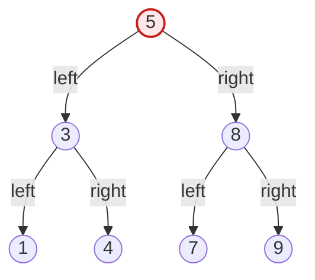

# ツリーソート(Tree Sort)

## 1. 概要

### A. 定義
> ツリーソートとは、ソート対象のデータを**二分探索木(BST, Binary Search Tree)に一つずつ挿入した後、中間順走査(In-order Traversal)で読み出して昇順(または降順)のソート結果を得る比較ベースのソートアルゴリズム**である。「左部分木 < 根 < 右部分木」という二分探索木の不変条件(invariant)をそのままソートに借用する。

ツリーソートの中核原理は、「**二分探索木を中間順走査すると自動的にソートされた順序が得られる**」という性質にある。二分探索木は、任意のノードを基準として、左部分木には自分より小さい値のみが、右部分木には自分より大きい値のみが来るように構成されるデータ構造である。この性質は再帰的にすべてのノードで成り立つため、木全体を「左 → 根 → 右」の順に訪問する中間順走査を行えば、最小値から最大値まで昇順に値が流れ出てくる。すなわち、ソートという目的を達成するためにバブルソートやクイックソートのように別途の比較・交換(swap)ロジックを明示的に設計する代わりに、データを木に挿入する行為そのものが各要素を大小順に合った位置に配置する「隠れたソート」となり、走査はその結果を線形に展開して読み取る過程にすぎない。

このアプローチが興味深いのは、ソートアルゴリズムとデータ構造が事実上表裏一体であることを示している点である。クイックソートが分割統治によってピボットを基準に左右を分ける過程は、ツリーソートが根を基準に左右の部分木を作る過程と構造的に同型(isomorphic)である。実際、ランダムなデータに対するツリーソートの挿入順序をそのまま追うと、クイックソートがランダムなピボットを選択した場合の比較回数と統計的に同一の分布を示す。このためツリーソートは「データ構造で表現したクイックソート」とも呼ばれる。

### B. 登場背景と必要性
伝統的なソートアルゴリズム(バブル・挿入・選択・クイック・マージなど)は、概ね「一度に与えられた配列全体をソートする」静的(batch)ソートを前提としている。しかし実務では、データがストリームのように継続的に流入しつつ、いつでもソート済みの状態で参照・走査できなければならない動的(online)な状況が多い。例えばリアルタイムのランキング表、イベントログの時系列維持、優先度が変化するジョブキューなどがそうである。このとき新しい要素が入るたびに配列全体をO(n log n)で再ソートするのは無駄である。ツリーソートは各挿入をO(log n)(平衡時)で処理しつつ、木自体が常に「ソート可能な状態」を保つため、挿入・削除が繰り返される動的環境に自然に適合する。

また、ツリーソートにはソート結果だけでなく、**ソートされた順序の上での多様な問い合わせ**を副次的に得られるという実用的価値がある。木を維持していれば、最小値・最大値の参照はそれぞれ最左・最右のノードでO(log n)、特定の値の存在確認もO(log n)、ある値の直後(successor)・直前(predecessor)の要素の参照も木構造をたどって即座に可能である。単に「ソート済み配列」だけが必要な場合はクイックソートやマージソートのほうが優れているが、「ソート状態を維持し続けながら問い合わせも併せて処理」しなければならないのであれば木ベースのアプローチが有利であるという点が、ツリーソートを別途学ぶ理由である。

## 2. 動作原理と手順

### A. 全体構造図
ツリーソートは大きく「挿入段階」と「走査段階」の二つの局面に分かれる。挿入段階ではn個の要素がそれぞれ大小比較によって木の中の正しい位置を見つけて配置され、走査段階では完成した木を中間順走査してソート結果を線形に出力する。


### B. 挿入段階 — 木の中で正しい位置を見つける
挿入は根から開始し、各ノードで「挿入する値が現在のノードより小さければ左、大きければ右」を繰り返し、空いた位置に到達したらそこに新しいノードをぶら下げる。各要素の挿入コストは、その時点の木の高さに比例する。よく平衡した木であれば高さが約log₂nであるため、挿入一つあたりO(log n)、n個全体ではO(n log n)である。逆に木が一方に偏ると高さがnに近づき、挿入一つがO(n)、全体がO(n²)に悪化する。したがって挿入段階の性能は、ひとえに「入力順序が木をどれほど平衡させるか」にかかっている。

具体例として、入力が`[5, 3, 8, 1, 4, 7, 9]`の場合を考える。5が根となり、3は5より小さいので左、8は大きいので右、1は5・3より小さいので3の左、4は5より小さく3より大きいので3の右、7は5より大きく8より小さいので8の左、9は8より大きいので8の右に配置される。結果として高さ2の比較的平衡した木ができる。一方、入力が既にソート済みの`[1, 3, 4, 5, 7, 8, 9]`であれば、各要素が直前のノードの右側にのみ付き、右方向に長く伸びた「偏った(skewed)木」となる。これは連結リストと変わらず、高さはn−1となる。

### C. 中間順走査段階 — ソート結果の読み出し
挿入が終わると木を中間順走査する。中間順走査は各ノードで「左部分木をすべて訪問 → 自分を出力 → 右部分木をすべて訪問」の順に再帰的に実行する。上の例の木を中間順走査すると`1, 3, 4, 5, 7, 8, 9`が順に出力され、ソートが完成する。走査はすべてのノードをちょうど一度ずつ訪問するため常にO(n)であり、木の平衡の有無とは無関係である。したがってツリーソートの性能上のボトルネックは走査ではなく挿入段階にある。



上の構造において、中間順走査の訪問順序(1→3→4→5→7→8→9)がそのまま昇順ソートの結果であることが確認できる。降順が必要であれば、「右 → 根 → 左」の順の逆中間順走査(reverse in-order)を行えばよい。

### D. 実装例(擬似コード)
ツリーソートは、挿入関数と中間順走査関数の二つで簡潔に表現される。以下の擬似コードは、各ノードが値(key)と左右の子ポインタを持つ二分探索木を前提としている。挿入は再帰的に位置を探して降りていき、ソートは中間順走査の結果をリストに蓄積する。

```text
function insert(node, key):
    if node is NULL:
        return new Node(key)          # 空き位置に新しいノードを生成
    if key < node.key:
        node.left  = insert(node.left, key)   # 小さければ左へ
    else:
        node.right = insert(node.right, key)  # 大きいか等しければ右へ
    return node

function inorder(node, result):
    if node is NULL: return
    inorder(node.left, result)         # 1) 左部分木
    result.append(node.key)            # 2) 自分を出力
    inorder(node.right, result)        # 3) 右部分木

function treeSort(array):
    root = NULL
    for key in array:
        root = insert(root, key)       # 全体の挿入: 平均 O(n log n)
    result = []
    inorder(root, result)              # 中間順走査: O(n)
    return result                      # ソート結果
```

擬似コードからわかるように、ツリーソートの論理的な複雑さは非常に低い。別途の交換・マージロジックなしに「挿入」と「走査」という二つの標準的な木操作の組み合わせだけでソートが完成し、この単純さが、ツリーソートがデータ構造とアルゴリズムの関係を教える教育用の例として広く用いられている理由である。ただし、この純粋な実装は平衡を保証しないため、実務では`insert`をAVL木・赤黒木の回転を含む平衡挿入に置き換えて最悪ケースを防ぐ。

### E. 重複値と安定性の処理
実務データには同じキーが複数存在しうる。このとき「小さければ左、大きいか等しければ右」のように同値の処理規則を一貫して定めなければならず、そうしなければ重複キーの挿入位置が曖昧になる。また、ツリーソートは基本的に安定ソート(stable sort)ではない。すなわち、キーが同じ要素の元の入力順序がソート後も保存される保証はない。安定性が必要であれば、各ノードに「挿入時刻(順番)」を補助キーとして併せて保存し、キーが同じときには順番で二次比較するよう拡張しなければならない。こうした細部の処理は表だけでは見えてこないものであり、実際の実装で必ず決定しなければならない設計項目である。

## 3. 計算量の分析

ツリーソートの時間・空間計算量は木の平衡状態によって大きく変わり、これを正確に理解することがこのアルゴリズムの核心である。

| 区分 | 時間計算量 | 発生条件 | 備考 |
|---|---|---|---|
| **平均(ランダム入力)** | O(n log n) | データがランダムに混ざり平衡に近い | 挿入 n×O(log n) + 走査 O(n) |
| **最良** | O(n log n) | 完全平衡に近い挿入順序 | クイックソートの最良と同等 |
| **最悪(偏った木)** | O(n²) | 既にソート済み・逆順ソート済みの入力 | 偏った木 → 挿入がO(n)に劣化 |
| **空間** | O(n) | 常に | ノードn個を保存(インプレースソートではない) |

ツリーソートの性能を決定づける変数は、「**入力が木をどれほど平衡させるか**」である。ランダムに混ざったデータは各要素が左右に均等に分散され、木の高さが統計的に約1.39·log₂n程度に収まり、平均O(n log n)となる。しかし既に昇順または降順にソートされたデータを入れると、すべての要素が一方向にのみ付いて高さn−1の偏った木となり、i番目の要素の挿入にi−1回の比較が必要となって総比較回数が1+2+…+(n−1) ≈ n²/2、すなわちO(n²)に悪化する。例えば要素10,000個が既にソート済みであれば、ランダムであれば約13万回(≈ n·log₂n)で済む挿入比較が約5,000万回(≈ n²/2)にまで急増する。これが、ツリーソートが純粋な形では実務であまり使われず、必ず平衡木とともに論じられる理由である。

空間の面では、ツリーソートは入力サイズに比例する別途の木の保存領域O(n)を必要とする非インプレース(out-of-place)ソートである。これは追加領域O(1)のヒープソートやO(log n)のクイックソート(再帰スタック)と対比される短所であり、メモリに余裕のない組込み環境では負担となりうる。

## 4. 他のソート・データ構造との比較

ツリーソートを正しく理解するには、類似アルゴリズムとの「違いが生じる理由」まで把握する必要がある。以下の表は比較の出発点であり、各違いの背景は文章で補足する。

| アルゴリズム | 平均時間 | 最悪時間 | 空間 | 安定性 | 特徴 |
|---|---|---|---|---|---|
| **ツリーソート** | O(n log n) | O(n²) | O(n) | 不安定(拡張すれば可能) | 動的な挿入・問い合わせに有利 |
| **クイックソート** | O(n log n) | O(n²) | O(log n) | 不安定 | キャッシュ効率の高いインプレースソート |
| **マージソート** | O(n log n) | O(n log n) | O(n) | 安定 | 最悪時でも安定した性能 |
| **ヒープソート** | O(n log n) | O(n log n) | O(1) | 不安定 | 木(ヒープ)構造だがインプレース |

ツリーソートとヒープソートはともに木構造を用いるが、目的と実装が異なる。ヒープソートは「完全二分木」形のヒープを配列上に暗黙的に表現し、追加領域O(1)でインプレースにソートし、最悪時でもO(n log n)を保証する。一方ツリーソートは、明示的なポインタベースの二分探索木を別のメモリ上に作ってO(n)の領域を使い、平衡が崩れるとO(n²)に劣化しうる。その代わりツリーソートはソート後も木を維持し、successor/predecessorの問い合わせや範囲検索を続けられるのに対し、ヒープは最大値(または最小値)一つを素早く取り出せるだけであり、任意要素の問い合わせには不向きである。つまり「一度ソートして終わり」であればヒープ・クイックが優れ、「ソート状態を維持しつつ問い合わせを続ける」のであれば木ベースが優れるという実務的な含意が生じる。

ツリーソートとクイックソートが平均・最悪の計算量が同一でありながら実務での選好が分かれる理由は、キャッシュ局所性(cache locality)とメモリアクセスパターンにある。クイックソートは配列を連続メモリ上でin-placeに扱うためCPUキャッシュのヒット率が高いのに対し、ツリーソートはポインタで散らばったノードをたどるためキャッシュミスが頻発し、同じO(n log n)でも実測速度が遅い場合が多い。理論上の計算量が同じでも、定数因子とメモリアクセス特性によって実務性能が分かれるという点は、アルゴリズム選択時に必ず考慮すべき事項である。

## 5. 深掘り — 平衡二分探索木による最悪ケースの回避と応用

ツリーソートのO(n²)の最悪ケースを根本的に解決する方法は、**自己平衡二分探索木(self-balancing BST)** を使用することである。代表的なものにAVL木と赤黒(Red-Black)木がある。AVL木は、すべてのノードで左右部分木の高さの差を最大1に厳格に保つよう、挿入・削除のたびに回転(rotation)操作で平衡をとる。その結果、どのような入力順序が来ても木の高さが常にO(log n)に保証され、既にソート済みのデータを入れても挿入がO(log n)を維持し、全体がO(n log n)となる。赤黒木は平衡条件をやや緩く(色の規則に基づいて)設けて回転回数を減らす代わりに、高さの上限を2·log₂(n+1)で管理する。挿入・削除が頻繁な状況ではAVL木より再平衡コストが低いため、実務でより広く使われている。

実際、多くの標準ライブラリのソート済みコンテナがこの原理を利用している。例えばC++ STLの`std::map`・`std::set`、Javaの`TreeMap`・`TreeSet`は内部的に赤黒木で実装されており、要素を挿入するだけで常にソートされた状態をO(log n)で維持する。これらのコンテナを走査すると自動的にソート順で出てくるが、これがまさに「平衡木で安定化したツリーソート」の実践形である。すなわちツリーソートは学習用アルゴリズムにとどまらず、我々が日々使うソート済みデータ構造の理論的土台として生き続けている。

もう一つの深い応用は、データベースとファイルシステムのインデックスである。B木・B+木は二分ではなく多分岐(multi-way)の平衡探索木であり、ディスクブロック単位のアクセスに最適化されている。これらもまた、「挿入すればソート状態を維持し、走査すればソート結果が得られ、範囲検索を高速化する」というツリーソートの中核アイデアをディスク環境に拡張したものである。リレーショナルデータベースでインデックス列に`ORDER BY`を指定すると、別途のソートなしにインデックスの走査だけでソート結果が得られるのも同じ原理である。このようにツリーソートの発想は、アルゴリズム理論からシステムソフトウェアのインデックス全般へと幅広く拡張されている。

## 6. 考慮事項および示唆

情報管理技術士の観点では、ツリーソートは単一アルゴリズムの性能を超えて、「データ構造の選択がアルゴリズムの性能を決定する」という原理を示す事例としてアプローチすべきである。

1. **平衡木によって最悪ケースを設計段階で除去する。** 純粋なツリーソートはソート済み・逆順ソート済みの入力に対してO(n²)と脆弱であるため、実務適用時にはAVL木・赤黒木のような自己平衡木を基本前提としてO(n log n)を保証しなければならない。入力データが事前にソートされているかどうかを予測できないのであれば、平衡木の採用は選択ではなく必須である。
2. **ワークロード特性に合わせてソート戦略を選択する。** 「ソート結果が一度だけ必要」であればキャッシュ効率の高いクイックソートや最悪時も安定したマージソートが、「ソート状態を継続的に維持しながら挿入・削除・問い合わせを繰り返す」のであれば平衡二分探索木ベースのアプローチが有利である。トレードオフは時間計算量だけでなく、空間・安定性・問い合わせのサポート範囲まで併せて比較衡量しなければならない。
3. **メモリ・キャッシュの制約を併せて考慮する。** ツリーソートはO(n)の追加領域と、ポインタ追跡によるキャッシュミスというコストを伴う。組込み・モバイルのようにメモリとキャッシュが限られた環境では、インプレースソート(ヒープ・クイック)や配列ベースのデータ構造のほうが適している場合があるため、理論上の計算量だけでなく実行環境の物理的制約を反映して決定しなければならない。
4. **安定性の要求を事前に定義する。** ソート後に同一キーの元の順序の保存(安定性)が必要な業務(例: 多段階ソート、同点処理)であれば、ツリーソートには順番の補助キーを設ける拡張が必要である。要求分析の段階で安定性・重複キーの処理規則を明確にしなければ、実装後に微妙なソートの誤りにつながりうる。
5. **システムソフトウェアとの連携を理解する。** ツリーソートの発想は、STL/JCFのソート済みコンテナ、データベースのB+木インデックス、ファイルシステムのインデックスへと拡張される。単なるアルゴリズムの問題で終わらせず、「ソート状態を維持するデータ構造」という観点からインデックス・クエリ最適化の設計と結び付けて考えることが、技術士レベルのアプローチである。

---

> **一言まとめ**: ツリーソートは*二分探索木に挿入した後、中間順走査でソート* するアルゴリズムであり、平均O(n log n)であるが、ソート済みの入力では偏った木となりO(n²)まで悪化するため、AVL木・赤黒木などの自己平衡木で最悪ケースを除去する。ソート状態を維持しつつ問い合わせまで処理すべき動的データ環境(STL map、DBのB+木インデックス)にその発想が生きている。
