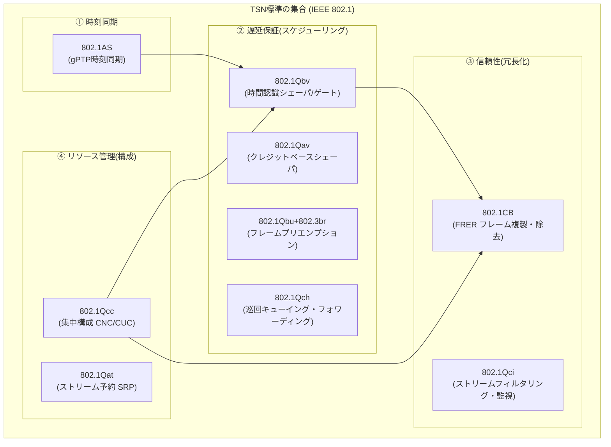
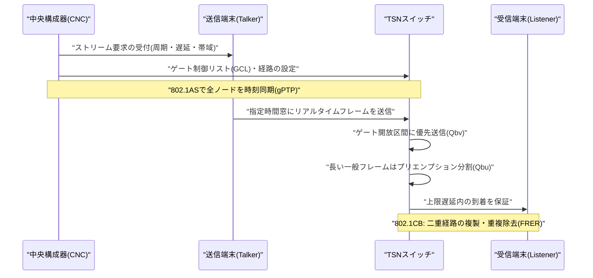

# 時間確定型ネットワーキング(TSN, Time-Sensitive Networking)

## 1. 概要

### A. 定義
> **TSN(Time-Sensitive Networking)** とは、標準イーサネット(IEEE 802.3)上で**決められた時間内にフレームが必ず到着することを保証(bounded low latency)** し、**遅延のばらつき(ジッタ、jitter)をマイクロ秒(µs)レベルに抑制**し、**無損失の冗長化**まで提供するよう、IEEE 802.1ワーキンググループが標準化した**確定性(deterministic)イーサネット技術の集合**である。従来のイーサネットが「いつかは到着する(best-effort)」ものであったとすれば、TSNは「**約束した時刻に到着する**」ことを保証する。

TSNの本質を理解するには、まず従来型イーサネットの限界を押さえる必要がある。標準イーサネットはCSMA/CDから出発し、スイッチング・全二重へと発展して帯域幅は飛躍的に拡大したが、依然として**フレームの伝達時刻を保証しない。** スイッチ内部のキューに複数のトラフィックが集中すると、優先度の低いフレームは後回しにされ(head-of-line blocking)遅延がばらつき、最悪遅延(worst-case latency)の上限を数学的に保証することができない。オフィス用データ(ファイル転送・Web)では数十msの遅延変動は問題にならないが、**ロボットのモーション制御・自動車の操舵・電力系統の保護継電器**のように、数百µs以内に命令が届かなければ事故につながるリアルタイム制御の領域では致命的である。

このため産業現場では長らく、PROFINET IRT、EtherCAT、SERCOS IIIのような**ベンダーごとの産業用イーサネット(Industrial Ethernet)** が使われてきた。しかしこれらは互いに互換性がなく、標準IT機器と混在させることもできないため、工場内に制御網(OT)と情報網(IT)が物理的に分離した二重のネットワークを生み出した。TSNはまさにこの問題に対し、**国際標準のイーサネット一つでリアルタイム制御トラフィックと一般ITトラフィックを同じケーブル上に共存(convergence)** させようという発想から出発している。

### B. 登場背景と必要性
TSNが台頭した決定的な背景は、**スマートファクトリー・インダストリー4.0とIT/OT融合(convergence)** の要求である。製造現場がデジタルツイン・AI予知保全・クラウド分析へと進化するにつれ、現場のセンサ・PLC・ロボットが生み出すリアルタイム制御データと、上位の分析システムが要求する大容量の情報データが**一つの網を流れる**ことで、経済性と管理効率が確保される。ところがベンダー依存の産業用イーサネットはIT網と断絶しており、データを上位に上げるにはゲートウェイ・プロトコル変換というボトルネックを経なければならなかった。TSNは標準イーサネットの開放性・低価格・豊富なエコシステムをそのまま活用しつつ確定性を加えることで、この壁を取り払う。

第二の推進力は**自動車(In-Vehicle Network)と自動運転**である。車両内部ではCAN・LIN・FlexRayなどの異種バスが乱立し、配線(ハーネス)の重量と帯域幅の限界が深刻であったが、自動運転センサ(カメラ・LiDAR)のギガビット級データをリアルタイムに運ぶには、確定性のある高帯域バックボーンが必要であった。実際、TSNの母体は2005年に始まったオーディオ・ビデオのリアルタイム伝送標準**AVB(Audio Video Bridging)** であり、自動車・プロオーディオ業界の要求を受けて2012年にワーキンググループの名称がTSNへと拡張され、産業制御全般へと適用範囲が広がった。第三に、**5Gフロントホール・電力網の保護制御(IEC 61850)・プロオーディオ**など、マイクロ秒の同期と上限遅延が求められる分野が共通基盤を必要としていたことが標準化を加速させた。

要するに、TSNの必要性は三つの流れに収斂する。**①異種リアルタイムネットワークの統一**(ベンダーごとの産業用イーサネットを一つの標準に)、**②IT/OT融合**(制御網と情報網の物理的な一本化)、**③大容量・リアルタイムの併存**(自動運転・5Gのように大きな帯域と厳格な遅延を同時に求めるアプリケーション)である。従来のbest-effortイーサネットは帯域を拡大するだけではこの三つの要求を同時に満たすことができなかったため、「イーサネットに時間(time)を導入する」というアプローチが必然的な選択となった。

## 2. TSNの4大機能軸と全体構造

TSNは単一の標準ではなくIEEE 802.1の**複数の下位標準(amendment)の集合**であり、機能的には**①時刻同期、②遅延保証(スケジューリング/シェーピング)、③信頼性(冗長化)、④リソース管理(構成)** の4つの軸に分かれる。以下の図は、この4大軸と代表的な標準の関係を示した全体構造図である。

**時刻同期(802.1AS, gPTP)** は、TSNの最も基礎となる土台である。確定的なスケジューリングは、網内のすべてのスイッチ・端末が**同じ時刻(共通クロック)** を共有してはじめて成立する。802.1ASはIEEE 1588 PTPをイーサネット環境向けにプロファイル化したgPTP(generalized Precision Time Protocol)であり、グランドマスタを頂点とする時刻配信ツリーを構成して**µs以下(通常1µs以内)の同期精度**を達成する。各ノードはリンク遅延と滞留時間(residence time)を測定・補正するため、マルチホップを経ても誤差が累積しない。時刻がずれると後続の時刻表(ゲートスケジュール)が崩れるため、802.1ASはグランドマスタの多重化(hot-standby)とBMCA(最適マスタ選定)によって同期そのものの信頼性も確保する。

**遅延保証(スケジューリング・シェーピング)** はTSNの心臓部である。中核となる**802.1Qbv(Time-Aware Shaper, TAS)** は、スイッチ出力ポートの各キューの前に**時間ベースのゲート(gate)** を置き、gPTP時刻に合わせて組まれた**ゲート制御リスト(GCL, Gate Control List)** に従ってゲートを開閉する。例えばサイクルの特定区間には制御トラフィックのキューだけを開いて残りを閉じ、その時間窓(protected window)にはリアルタイムフレームのみが回線を独占するようにする。こうすることで、最悪遅延の上限がスケジュールによって数学的に確定する。補助的に**802.1Qav(Credit-Based Shaper, CBS)** はAVBに由来する技法であり、クレジットを消費・充電しながら特定のストリームが帯域を独占できないよう平滑化(平均帯域の保証)する。**802.1Qbu/802.3br(フレームプリエンプション、Frame Preemption)** は、既に送信中の長い一般フレームを細かく分割してその間に緊急(express)フレームを割り込ませることで、ゲートが閉じる直前に大きなフレームがかかっていることで生じる「ガードバンドの浪費」と待機遅延を減らす。

### A. 確定性トラフィックの流れ(プロセス詳細図)
以下の図は、一つのリアルタイムストリームが送信端末から時刻表に従ってスイッチを通過し、受信端末に到着するまでの手順を示した詳細プロセス図である。

より単純な代替手段として、**802.1Qch(Cyclic Queuing and Forwarding, CQF)** も広く使われている。CQFは時間を同じ長さのサイクルに細かく分割し、偶数・奇数の二つのキューを交互に使う方式であり、あるサイクルに入ったフレームを必ず次のサイクルで送出する。その結果、フレームの遅延がホップ数 × サイクル長として**確定的に計算**されるため、GCLをストリームごとに精密に組まなければならないQbvよりも設計・検証が単純である。その代わりサイクル境界に合わせてバッファリングするため最小遅延がやや大きくなるというトレードオフがあり、超低遅延が必要なモーション制御にはQbvを、多数のストリームを単純かつ予測可能に扱う必要がある大規模網にはCQFを選ぶ、というように使い分ける。

定量的な感覚をつかむと、1Gbpsリンクで1,500バイトの最大フレーム一つを送出するのに約12µsかかる。プリエンプション(Qbu)がなければ、ゲートが開く直前にこの大きなフレームが送信を開始した場合、緊急フレームは最大12µs余計に待たなければならず、こうした遅延がマルチホップごとに累積すると上限を守ることが難しくなる。フレームプリエンプションは、この12µs級のブロッキングを数µs単位に切り分けて割り込ませることで、最悪遅延を大きく引き下げる。このようにTSNの各シェーパは、「フレーム一つの送信時間」という物理的な下限の上で遅延予算をどう配分するかを扱う技法である。

**信頼性・冗長化(802.1CB, FRER)** は、無損失を要求する制御網の必須要素である。FRER(Frame Replication and Elimination for Reliability)は、送信側でフレームに連番を付けて**二つ以上の異なる経路に複製送信**し、受信側で**先に到着した一つだけを取り、重複を除去**する。一方の経路が切れても他方の経路のフレームが到着するため、障害時にも再送待ちなしに**途切れのない(seamless)冗長化**が実現される。併用される**802.1Qci(Per-Stream Filtering and Policing)** は、ストリームごとに時間・帯域を監視し、誤動作したり悪意をもって暴走したりするトラフィック(babbling idiot)が時刻表を破壊できないよう入口で遮断する。例えば発電所の保護継電システムでは、継電器と遮断器を結ぶトリップ(trip)信号はたった1フレームの消失でも事故に直結するため、FRERで地理的に分離された二つの経路に複製して送り、リングの切断・スイッチの故障時にも無損失を確保する。これは、再送で損失を挽回するTCP方式がリアルタイム制御では遅延のために使えないという根本的な制約を、「あらかじめ複製しておく」という空間的な冗長化で回避したものである。

**リソース管理・構成(802.1Qcc)** は、上記のすべての機能をどのように設定・配布するかを扱う。確定的なスケジュールは、どの端末がどのような周期・遅延・帯域のストリームを要求しているかを全体として把握してはじめて計算できるため、802.1Qccは**集中型モデル(CNC: Centralized Network Configuration + CUC: Centralized User Configuration)** を定義する。CUCが端末の要求(Talker/Listener)を収集し、CNCが網のトポロジーに基づいて各スイッチのGCLと経路を計算して配布する。これはSDNの中央コントローラの概念と通じており、TSNをSDN・NETCONF/YANGで管理しようとする流れと自然に結び付く。802.1Qccはこのほか、各ノードが隣接ノードと要求をやり取りして自らリソースを予約する**完全分散モデル**と、分散予約と中央計算を折衷した**ハイブリッド(hybrid)モデル**も定義している。実務では、スケジュール最適化の品質と全体の可視性から集中型モデルが産業オートメーションの主流として採用される傾向にあるが、単純・小規模な網では分散モデルのほうが構築の負担が少ない。

## 3. 主要標準の整理(補助表)

先に説明した標準を機能軸別に整理すると次のとおりである。表は比較・整理のための補助手段であり、各標準が「なぜ必要か」は上の本文の記述によって理解すべきである。

| 機能軸 | 標準(Amendment) | 役割 | 中核概念 |
|---|---|---|---|
| ① 時刻同期 | 802.1AS (gPTP) | 全ノードへの共通時刻の配信 | グランドマスタ・滞留時間補正、µs以下の同期 |
| ② 遅延保証 | 802.1Qbv (TAS) | 時間ベースのゲートスケジュール | GCL、protected window |
| ② 遅延保証 | 802.1Qav (CBS) | 帯域の平滑化 | クレジットの充電・放電 |
| ② 遅延保証 | 802.1Qbu/802.3br | フレームプリエンプション | express/preemptable、ガードバンドの削減 |
| ② 遅延保証 | 802.1Qch (CQF) | 巡回キューイング・フォワーディング | 確定的遅延・実装の単純化 |
| ③ 信頼性 | 802.1CB (FRER) | 無損失の冗長化 | 複製・連番・重複除去 |
| ③ 信頼性 | 802.1Qci (PSFP) | ストリームのフィルタ・監視 | 暴走トラフィックの入口遮断 |
| ④ リソース管理 | 802.1Qcc | 集中構成 | CNC/CUC、YANGモデル |
| ④ リソース管理 | 802.1Qat (SRP) | ストリーム予約 | 帯域の事前予約 |

ここで実務上重要な含意は、**「TSNを導入する」ことが「9つの標準をすべて有効にする」ことを意味しない**という点である。産業ごとに必要な標準の組み合わせが異なるため、IEC/IEEE 60802(産業オートメーション)、IEEE 802.1DG(自動車)、IEEE 802.1BA(オーディオ・ビデオ)のような**プロファイル**が、各アプリケーションに合った標準のサブセットとパラメータを規定する。例えば自動車プロファイルはgPTP・CBS・FRERを重視し、産業オートメーションプロファイルはQbv・Qbu・Qccを中核とする、といった具合である。

## 4. 類似技術との比較 — 違いが生じる理由

TSNを既存のリアルタイムネットワークと比較すると、その位置付けが明確になる。以下の比較は単なる項目の羅列ではなく、**なぜそのような違いが生じ、実務上何を意味するのか**までを併せて見るものである。

| 区分 | 標準イーサネット | 産業用イーサネット(EtherCATなど) | TSN |
|---|---|---|---|
| 確定性 | なし(best-effort) | あり(ベンダー専用) | あり(国際標準) |
| 遅延保証 | 上限なし | 数十µs | µs〜数百µsの上限 |
| 標準性・互換性 | 開放・汎用 | ベンダー依存 | 開放・汎用(IEEE) |
| IT/OT融合 | 困難(確定性の欠如) | 困難(閉鎖的) | 容易(共存設計) |
| エコシステム・価格 | 非常に豊富・低価格 | 限定的・高価格 | イーサネットエコシステムを活用 |

一つ留意すべき点は、TSNが産業用イーサネットを「置き換える(replace)」というよりも、その下位層を標準化された**共通層として吸収**するということである。PROFINET・EtherNet/IPなどは上位のアプリケーション・オブジェクトモデルをそのまま維持しつつ、伝送層だけをTSNに移植する方向へと進化しているため、ユーザは慣れ親しんだ上位プロトコルを使いながら確定性とIT融合の利点を得られる。この点がTSN採用を加速させる実務的な誘因である。

標準イーサネットとの根本的な違いは、**「時間概念の有無」** である。標準イーサネットのスイッチはフレームが来ればキューに入れて順に送出するだけで、「今が何µsか」を知らない。これに対しTSNスイッチはgPTPで共通時刻を把握し、その時刻に合わせてゲートを開閉するため、キュー競合が発生してもリアルタイムフレームの最悪遅延の上限が揺らがない。この違いが、「一般ITトラフィックと制御トラフィックを同じ回線上で安全に混在させられるか」という実務上の結果に直結する。

産業用イーサネット(EtherCAT・PROFINET IRTなど)との違いは、**「開放性」** にある。これらも確定性を提供するが、ベンダー固有の方式であるため互いに通信できず、上位のITインフラと連携するにはゲートウェイが必要である。TSNはこの確定性機能を**IEEE標準イーサネットの一部として取り込んだ**ため、異なるベンダーのTSN機器が相互運用でき、一般のスイッチ・サーバと一つの網を構成する。実際、PROFINET・EtherNet/IP・OPC UAのような上位の産業プロトコルも、自らの下位伝送層をTSN上に移す方向(OPC UA over TSNなど)に収斂しつつある。

### 具体的な適用事例
第一に、**自動車のゾーン(Zonal)アーキテクチャ**である。最新のSDV(Software-Defined Vehicle)は数十個のECUを数個のゾーンコントローラに統合し、これをギガビットイーサネットのバックボーンで結ぶが、カメラ・LiDARの大容量ストリームと操舵・制動の安全制御信号を一つのTSNバックボーンで運ぶ。100BASE-T1/1000BASE-T1の車載イーサネットと組み合わせることで、配線重量を減らしつつ安全信号の上限遅延を保証する。第二に、**スマートファクトリーのモーション制御**であり、多軸ロボットの同期誤差が数µsを超えると加工精度が崩れるため、gPTP+Qbvの組み合わせでサイクル同期をとる。第三に、**5Gフロントホール**であり、無線基地局の分散ユニット(DU)と無線ユニット(RU)の間(eCPRI)の厳格な遅延・同期要件をTSNブリッジが満たすことで、通信事業者がフロントホールをイーサネットベースに統合するのを支援する。

第四に、**プロオーディオ・放送(AV)** 分野である。TSNのルーツであるAVBは、大規模なコンサートホール・スタジオで数百チャンネルのオーディオをµs同期で伝送するのに使われてきた。複数のスピーカーがわずかでもずれると音像が乱れるため、gPTP同期とCBSの帯域保証が決定的な役割を果たす。この事例は、TSNが産業制御だけでなく「正確なタイミング」が品質を左右するあらゆる分野の共通インフラであることを示している。

## 5. 深掘り — 標準化動向とSDN・OTセキュリティとの連携

TSNエコシステムにおいて近年最も注目すべき流れは、**アプリケーション別プロファイルの定着と上位プロトコルの収斂**である。産業オートメーション分野では、IECとIEEEが共同作業した**IEC/IEEE 60802 TSN産業オートメーションプロファイル**が定着しつつあり、異なるベンダー機器の相互運用性を検証する試験・認証体系(Avnu Allianceなど)が成熟してきている。特に**OPC UA over TSN**は、上位の情報モデル(OPC UA)と下位の確定的伝送(TSN)を組み合わせ、フィールドレベルからクラウドまで一つの意味体系でデータを流すインダストリー4.0の事実上の標準通信スタックとして浮上している。

第二の深掘り論点は、**SDN・集中構成(CNC)との結合**である。802.1Qccの集中型モデルは、CNCが網全体を俯瞰してスケジュールを計算・配布するという点でSDNコントローラと概念が同じであり、実際にNETCONF/RESTCONFとYANGデータモデルでTSNスイッチを遠隔構成する標準化が進められている。これはTSNを静的な設定技術から、**動的にストリームを追加・再計算するインテリジェントな確定性ネットワーク**へと進化させる。ただしスケジュール計算(GCLの算出)は、ストリーム数が増えるほど組合せ爆発的に複雑になるNP困難問題であるため、ヒューリスティクス・ILP、さらに近年では強化学習を活用したスケジューリング研究が活発である。

第三に、**OTセキュリティとの連携**が重要になっている。TSNがIT/OTを一つの網に統合することで、かつて物理的に隔離(air-gap)されていた制御網がITの脅威にさらされる。時刻同期(gPTP)を狙ったスプーフィング・遅延攻撃はゲートスケジュール全体を崩壊させうるため、802.1Qciのストリーム監視、MACsec(802.1AE)によるリンク層暗号化、そしてIEC 62443・ゼロトラスト原則との結合が必須の設計要素として扱われる。すなわちTSNの設計は、いまや「確定性の確保」と「セキュリティの組み込み」を切り離せない段階に至っている。

第四に、**ハードウェア・シリコンエコシステムの成熟**が普及の鍵である。Qbvのゲート開閉をµsの誤差なく行うには、スイッチASIC/FPGAレベルのハードウェアタイムスタンプとゲートロジックが必要であり、端末(NIC)にもgPTPのハードウェアサポートが必要である。初期にはこうしたTSN対応シリコンは少数のベンダーに限られ高価であったが、主要なスイッチ・SoCメーカーがTSN機能を標準ラインナップに組み込んだことで参入障壁が下がりつつある。ただし、ソフトウェアスイッチング(仮想スイッチ)だけではハードウェア級の精度を出すことが難しいという点で、クラウド・コンテナ環境への確定性の拡張は依然として研究・標準化が進行中の領域である。

## 6. 考慮事項および示唆(技術士の観点)

- **適用戦略 — 全面置き換えではなく段階的融合**: TSNの導入は既存の制御網を一度に撤去する方式ではなく、バックボーン・中核セルからTSNスイッチを配置し、レガシーの産業用イーサネットをゲートウェイで吸収しながら拡大していく**ブラウンフィールド戦略**が現実的である。初期には確定性が不可欠なストリームのみをQbvで保護し、残りはbest-effortとする部分適用が、リスク・コストの面で有利である。

- **トレードオフ — 確定性 対 柔軟性/利用率**: 時刻表(GCL)ベースのスケジュールは、上限遅延を保証する代償として保護区間に他のトラフィックを入れられないため回線利用率が低下し、ストリーム変更時の再計算の負担も大きい。逆にスケジュール窓を緩く設定すれば利用率は上がるが、確定性の余裕が小さくなる。アプリケーションのリアルタイム等級(ハード/ソフトリアルタイム)に応じてQbv(厳格)・CBS(平滑)・CQF(単純)の中から適切なシェーパを選択する設計判断が核心である。

- **標準・相互運用のリスク**: TSNは多数の標準の組み合わせであるため、ベンダーがサポートする標準のサブセットやプロファイルへの準拠状況がまちまちでありうる。導入時には**プロファイル(60802/802.1DGなど)への適合性と相互運用認証**を調達要件に明記し、PoCで異種ベンダーの混在を検証してベンダーロックインを防止しなければならない。

- **運用・検証体制の確保**: 確定性は設計だけで終わるものではなく、運用中も維持されなければならない。ストリームの追加・変更のたびにGCLを再計算・無停止で配布するオーケストレーション、リアルタイムの遅延・ジッタ・同期誤差を常時計測するモニタリング、そして導入前にスケジュールが上限を守るかどうかを検証する**ネットワーク計算法(network calculus)・シミュレーションに基づく事前検証**を併せて整備する必要がある。これは、TSNが単なる機器の導入ではなく、設計・検証・運用を包含するエンジニアリング能力であることを意味する。

- **展望と連携技術**: TSNは、5G URLLCの有線区間、デジタルツインのリアルタイムデータパイプライン、時分割の確定性が求められるエッジAI推論などと結び付き、**確定性インフラの共通基盤**として拡大していく見通しである。SDN・OPC UA・MACsec・IEC 62443との統合設計能力が、今後のスマート製造・自動運転アーキテクトの中核的な競争力となるであろう。

## 参考資料
- IEEE 802.1 Time-Sensitive Networking (TSN) Task Group — https://1.ieee802.org/tsn/
- Avnu Alliance, TSNの概要および認証 — https://avnu.org/
- IEC/IEEE 60802 TSN Profile for Industrial Automation (概要) — https://1.ieee802.org/tsn/60802/

---
> **一言まとめ**: TSNは、標準イーサネット上に時刻同期(802.1AS)・時間認識スケジューリング(802.1Qbv)・無損失冗長化(802.1CB)・集中構成(802.1Qcc)を加えて上限遅延と低ジッタを保証する確定性イーサネット技術の集合であり、IT/OT融合・自動運転・スマートファクトリーのリアルタイム通信基盤となる。
