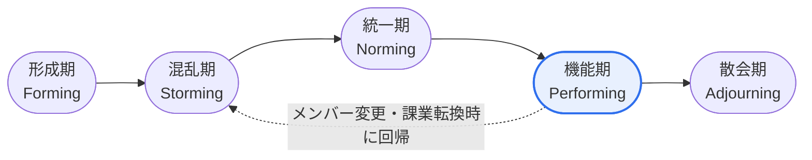

# タックマン(Tuckman)のはしごモデル — チームの発達と段階別の特徴

## 1. 概要

### A. 定義
> Bruce W. Tuckman(1965)が提示した**チーム発達段階モデル**であり、チームが結成されてから成果を上げるまでに経る過程を、はしご(Ladder)を登ることにたとえた理論である。**PMBOK**の資源マネジメント(チームの育成, Develop Team)領域において、チームの成長理論として引用される。

タックマンモデルの中核的な洞察は、「チームは作られた直後から成果を上げることはできない」ということである。個人が集まったからといってすぐに協力が生まれるわけではなく、互いを探り合い、対立を経験し、規範を確立するという**一定の発達過程**を必ず経る。各段階ではチームの感情と生産性が明確に異なるため、リーダーが今チームがどの段階にあるかを診断し、それに合った介入を行ってはじめて成長を促進できる。

### B. 登場背景および必要性
Tuckmanは多様な集団研究を総合してチーム発達の共通パターンを初期の4段階(Forming〜Performing)に整理し、1977年にMary Ann Jensenとともに課業終了後の**Adjourning(散会期)** を追加して5段階に拡張した。このモデルが実務で重要な理由は、各段階の特性とリーダーの介入方法が異なるからである。特に対立が頂点に達する混乱期を放置するとチームは成果段階に到達できないため、**段階の診断 → 状況に合わせたリーダーシップ**という処方を提供する点で実践的な価値が大きい。

## 2. チーム発達の5段階(はしご図)



発達ははしごを登るように**順次上昇**するのが基本であるが、実際のチームは必ずしも一方向にだけ進むわけではない。新メンバーが加わったり、課業が大きく変わったり、埋もれていた対立が再燃したりすると、チームは以前の段階へ**回帰(Regression)** し、再び混乱期を経験することがある。したがってリーダーは、機能期に到達したからといって管理の手を緩めてはならず、回帰の可能性を前提としてチームの状態を継続的に点検しなければならない。

### 段階別の対立・生産性の推移

```chart
{
  "type": "line",
  "data": {
    "labels": ["形成期", "混乱期", "統一期", "機能期", "散会期"],
    "datasets": [
      { "label": "対立の水準", "data": [2, 5, 3, 1.5, 1], "borderColor": "#e11d48", "backgroundColor": "rgba(225,29,72,0.12)", "tension": 0.35, "fill": true },
      { "label": "生産性", "data": [1, 2, 3.5, 5, 3], "borderColor": "#2f6fed", "backgroundColor": "rgba(47,111,237,0.12)", "tension": 0.35, "fill": true }
    ]
  },
  "options": {
    "plugins": { "legend": { "position": "bottom" } },
    "scales": { "y": { "min": 0, "max": 6, "title": { "display": true, "text": "相対的水準" } } }
  }
}
```

> 混乱期に対立が頂点に達し、これを乗り越えると生産性は機能期に最高潮に達する。(数値は相対的な傾向を示す例示である)

このグラフの核心的なメッセージは、**対立と生産性が反比例するわけではない**という点である。対立が最高潮となる混乱期を回避せずに健全に通過してはじめて信頼と規範が確立され、その上に立って生産性が機能期に飛躍的に高まる。すなわち混乱期は取り除くべき問題ではなく、成長のために通過しなければならない関門である。

## 3. 段階別の特徴

各段階では、チームメンバーの心理状態、対立・生産性の水準、そしてそれに合ったリーダーシップが異なる。**形成期**は互いに慎重に探り合う時期であり、役割と目標が曖昧であるため、リーダーは**指示型**として方向性と規則を明確に示し、不確実性を減らす。**混乱期**は主導権や仕事の進め方をめぐる対立が表面化する最も困難な局面であり、リーダーは対立を抑え込むよりも**コーチ型**として仲裁・傾聴し、建設的に解決へ導く。**統一期**に至ると信頼と規範が確立され協力が定着するため、リーダーは**援助型**として自律性を与え、**機能期**にはチームが自ら問題を解決する自己組織化の段階であるため、**委任型**として権限を委ねる。**散会期**には成果を認め、感情面の締めくくりを支援する。

| 段階 | 中核的特徴 | 対立 / 生産性 | リーダーシップ(状況対応型) |
|---|---|---|---|
| **形成期**<br>Forming | 相互の探り合い、役割・目標が曖昧、礼儀正しく独立的な行動 | 対立 低 / 生産性 低 | **指示型** — 明確な目標・役割・規則の提示 |
| **混乱期**<br>Storming | 意見の衝突、主導権争い、役割・優先順位をめぐる対立の表出 | 対立 最高 / 生産性 低調 | **コーチ型** — 対立の仲裁・調整、傾聴 |
| **統一期**<br>Norming | 信頼・規範・役割の確立、協力・凝集性の形成 | 対立 緩和 / 生産性 上昇 | **援助型** — 参加の促進、自律性の付与 |
| **機能期**<br>Performing | 相互依存、自己組織化、自律的な問題解決 | 対立 低 / 生産性 最高 | **委任型** — 権限委譲、成果管理 |
| **散会期**<br>Adjourning | 課業完了後の解散、成果の振り返り、感情面の締めくくり | 省察・締めくくり | **承認・支援** — 成果の承認、移行の支援 |

## 4. 段階別の管理戦略

管理戦略の核心は、**各段階の特性に逆らわない介入**である。形成期にはキックオフミーティングとグラウンドルールの共有によって不確実性を減らし、混乱期には対立を自然な成長過程として認め、早期の安定化を支援する。特に混乱期の管理はチームの成否を左右する分水嶺である。統一期には確立された規範を文書化・標準化して協働を安定させ、機能期には過度な介入を控えつつ目標を引き上げて成果を維持する。散会期には振り返りと教訓(Lessons Learned)を整理し、チームメンバーの功績を認める。

- **形成期**: キックオフミーティング、目標・R&R・グラウンドルールの共有によって不確実性を低減
- **混乱期**: 対立を自然な過程として認め、早期の安定化支援がチームの成否を左右
- **統一期**: 確立された規範を文書化・定着させ、協働ツール・プロセスを標準化
- **機能期**: 過度な介入を控え、目標の引き上げ・継続的なフィードバックで成果を維持
- **散会期**: 振り返り(Retrospective)、成果物・教訓の整理、チームメンバーの功績の承認

## 5. 考慮事項および示唆(技術士の観点)

1. **状況対応型リーダーシップ(Situational Leadership)との連携** — 段階ごとに指示→コーチ→援助→委任へとリーダーシップスタイルを切り替えることが、このモデルの実践的な核心である。画一的な単一のリーダーシップは、かえって特定の段階で逆効果を生む。
2. **混乱期(Storming)の管理が鍵** — この段階を越えられなければ、チームは決して成果段階に到達できない。目標は対立の回避ではなく、健全な表出と解消である。
3. **回帰可能性の前提** — 人員交代・課業変更時に下位段階が再発するのは当然のことと捉え、管理体制を柔軟にしておく。
4. **アジャイルとの整合性** — スクラムの自己組織化チームはPerforming段階を志向する点で軌を一にしており、スプリントレトロスペクティブは段階の診断・改善のツールとなる。
5. PMBOKのチームの育成(Develop Team)と動機付け理論の文脈で、答案に活用しやすい。

---

> **一言まとめ**: チームは*形成 → 混乱 → 統一 → 機能(→ 散会)* のはしごを登っていき、対立が頂点となる混乱期を健全に通過してはじめて成果が飛躍するため、リーダーは各段階に合った**状況対応型リーダーシップ(指示→コーチ→援助→委任)** で介入し、成果段階への到達を促進する。
