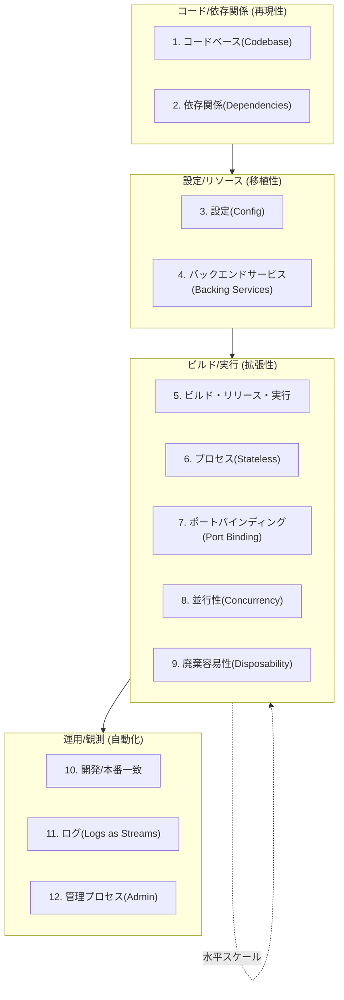
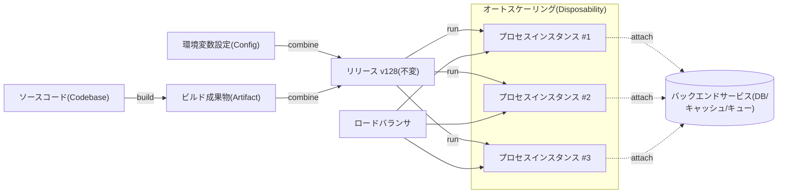

# 12要素アプリ(The Twelve-Factor App)

## 1. 概要

> **定義**: 12要素アプリとは、SaaS(Software as a Service)型アプリケーションを、宣言的な設定、実行環境との疎結合、ステートレスなプロセス、継続的デプロイに適した形で構成するための12の設計原則の集合であり、移植性・拡張性・運用自動化をコードレベルで保証するための方法論である。

12要素アプリは、2011年にクラウドプラットフォームHerokuのエンジニアたちが、数多くのSaaSアプリケーションの運用経験を整理して発表した方法論である。
当時の多くのアプリケーションは、特定サーバのファイルパス、手作業で編集した設定ファイル、人が直接行うデプロイ手順に強く縛られており、そのため同じコードが開発・ステージング・本番でそれぞれ異なる動作をする、いわゆる「環境の乖離(divergence)」問題が頻発していた。
12要素アプリはこうした結合を断ち切り、アプリケーションがどの実行環境でも同一に動作し、新しいインスタンスを数秒以内に追加・破棄でき、コード変更が自動化されたパイプラインを通じて再現可能な形でデプロイされるようにすることを目標とする。

核心は、アプリケーションと実行環境を分離することにある。
従来のデプロイでは、アプリケーションが特定の機器の状態(ローカルディスク上のセッション、サーバに埋め込まれた設定、手動でインストールされたパッケージ)に依存するため、機器そのものがアプリケーションの一部となってしまう。
12要素は逆に、アプリケーションを「実行環境について何も仮定しない自己完結的なコードの束」と定義し、環境ごとに異なるすべてのもの(接続情報・シークレット・リソースの場所)を外部から注入する。
この観点の転換は、その後に登場したコンテナ・オーケストレーション・イミュータブルインフラ・GitOpsの思想的土台となり、今日のクラウドネイティブアプリケーション設計の基本文法として定着した。

12要素を単なるチェックリストとして羅列的に暗記することは、技術士の観点からは失敗した理解である。
各要素は独立した規則ではなく、「ステートレス・移植性・自動化」という共通の目標を異なる角度から強制する仕組みであり、一つの要素を守ると他の要素も守りやすくなる相互強化の構造を持っている。
例えば設定を環境変数で外部化(要素3)すれば、同一のビルド成果物を複数の環境にデプロイ(要素5)しやすくなり、それがさらに破棄可能なステートレスプロセス(要素6・9)と水平スケール(要素8)を可能にする。

### 1.1 登場背景と必要性

第一に、クラウド環境においてインスタンスは「家畜(cattle)であってペット(pet)ではない」という運用パラダイムが広まったためである。
かつてはサーバ一台一台に名前を付けて丁寧に管理していたが、オートスケーリングとスポットインスタンスが一般化するにつれ、インスタンスはいつでも生成・破棄される代替可能なリソースとなった。
アプリケーションが特定インスタンスのローカル状態に依存していると、こうした環境ではデータ損失や障害が発生するため、ステートレス設計が必須となった。

第二に、デプロイ頻度が急激に高まったためである。
年単位・月単位のリリースが日単位・時間単位のデプロイへと変わるにつれ、人が介在する手動デプロイ手順はボトルネックであり事故の原因ともなった。
ビルド・リリース・実行を厳格に分離し(要素5)、設定をコードから切り離して(要素3)はじめて、ロールバックと再現が可能な自動デプロイパイプラインを構築できる。

第三に、開発環境と本番環境の差異が事故を誘発していたためである。
開発者のノートPCではうまく動作するのに本番では失敗するという問題の多くは、バックエンドサービス・ライブラリ・ランタイムのバージョン不一致に起因する。
12要素は開発/本番一致(要素10)を明示的な原則として掲げ、環境の乖離を設計段階で抑制する。

### 1.2 目標と適用範囲

12要素の第一の目標は**移植性(portability)**である。
設定・リソース・実行環境への依存を外部に押し出せば、同一のコードがローカルのDocker、オンプレミスのKubernetes、パブリッククラウドのマネージドサービスのいずれでも同一に動作する。
第二の目標は**拡張性(scalability)**であり、ステートレスプロセスとポートバインディングによってインスタンスを水平に複製して負荷を吸収する。
第三の目標は**運用自動化と可観測性**であり、ログをイベントストリームとして扱い(要素11)、管理タスクを一回限りのプロセスとして実行(要素12)することで、デプロイ・運用を再現可能なコードにする。
ただし12要素は、状態を扱うデータベース・メッセージブローカーのようなバックエンドサービスそのものの設計指針ではなく、ステートフルなワークロードやバッチパイプラインにはそのまま適用しにくいという限界も併せて理解しておく必要がある。

## 2. 12要素の全体構造

12の要素は個別の規則のように見えるが、実際には「コードベース → 依存関係 → 設定 → 実行/デプロイ → 運用/観測」というアプリケーションのライフサイクルの流れに沿って配置できる。
以下の構造図は、12要素を性格に応じて四つのグループに分類したもので、各グループが移植性・拡張性・自動化という共通目標にどのように寄与するかを示している。

各要素を単に守ることを超えて、この流れの中で要素同士がどのように互いを強化しているかを理解することが重要である。
例えば一つのコードベースから複数のデプロイ(要素1)を生み出すには、それら複数のデプロイの違いが設定(要素3)だけで表現されていなければならない。
設定がコードにハードコーディングされていればデプロイごとにコードが分岐し、それはビルド・リリース・実行の分離(要素5)を崩す。

### 2.1 コードベース・依存関係(再現性の基盤)

**要素1(コードベース)**は、バージョン管理される一つのコードベースと複数のデプロイを1:Nで対応させることを求める。
同一のコードベースから開発・ステージング・本番という複数のデプロイが派生し、デプロイ間の違いはコードではなく設定だけで表現されなければならない。
もし本番用と開発用のコードが別々のリポジトリにあるなら、それは一つのアプリではなく複数のアプリからなる分散システムであり、各リポジトリがそれぞれ12要素に従わなければならない。
マイクロサービス環境ではサービスごとにコードベースを置きつつ、共有コードは別ライブラリとして分離し、依存関係として取り込む方式が推奨される。

**要素2(依存関係)**は、すべての依存関係を明示的に宣言し、分離することを求める。
システム全体にインストールされたパッケージに暗黙的に依存すると、実行環境が変わったときに「自分の環境では動くのに」という問題が発生する。
`package.json`・`requirements.txt`・`pom.xml`・`go.mod`のようなマニフェストで依存バージョンを固定し、仮想環境・コンテナで分離すれば、どの機器でも同一のライブラリ群が再現される。
実際、2016年にnpmの`left-pad`パッケージが削除されて無数のビルドが壊れた事件は、依存関係を明示的に固定(lock)せず実行時にリモートから取得する方式がいかに脆弱であるかを示した代表的な事例である。

### 2.2 設定・バックエンドサービス(移植性の核心)

**要素3(設定)**は、環境ごとに異なるすべての値をコードから分離し、環境変数として注入することを求める。
データベースの接続文字列、外部APIキー、クレデンシャルのようにデプロイごとに異なる値をコードや設定ファイルに入れると、その値が誤ってリポジトリにコミットされて漏洩したり、環境ごとにコードが分岐したりする。
12要素の判別基準は明確である — 「今このコードベースをオープンソースとして公開してもシークレットが漏れないか?」であり、答えが「いいえ」であれば設定の分離が不十分である。
ただし環境変数方式は数百の設定を管理する際にグルーピングが難しいという批判があり、今日ではVault・AWS Secrets Managerのようなシークレット管理サービスやKubernetesのConfigMap/Secretと併用する形へと発展している。

**要素4(バックエンドサービス)**は、データベース・キャッシュ・メッセージキュー・メールサーバなど、ネットワーク経由でアクセスするすべてのリソースを「アタッチされたリソース(attached resource)」として扱うことを求める。
つまりローカルのMySQLであれマネージドのRDSであれ、アプリケーションコードはURL形式の設定を変えるだけで済むよう抽象化されていなければならず、コードを変更せずにリソースを交換・再アタッチできなければならない。
この原則のおかげで、障害が起きたデータベースをレプリカに置き換えたり、開発環境のローカルキャッシュを本番のマネージドRedisに切り替えたりすることが、設定変更だけで可能になる。

### 2.3 プロセス・スケール(拡張性の実現)

**要素5(ビルド・リリース・実行)**は、コードを実行可能な成果物にする過程を三つの段階に厳格に分離する。
ビルドはコードと依存関係を実行可能なバンドルに変換し、リリースはそのビルドに当該環境の設定を結合して固有の識別子(例: v128)を付与し、実行はそのリリースをランタイム上で起動する。
すべてのリリースは不変(immutable)であり固有のIDを持つため、問題が起きれば直前のリリースに即座にロールバックできる。
運用中の実行段階でコードを直接修正すること(hotfixをサーバ上で直接編集すること)はこの原則への真っ向からの違反であり、そうして行った変更は次のデプロイで失われる。

**要素6(プロセス)**と**要素9(廃棄容易性)**は、アプリケーションをステートレス(stateless)に実行し、いつでも素早く起動・終了できるようにすることを求める。
プロセスはいかなるリクエストもローカルメモリやディスクに永続的な状態として残さず、持続すべき状態はすべてバックエンドサービスに押し出す。
そうしてはじめて、インスタンスが停止してもデータが失われず、オートスケーラーがインスタンスを自由に追加・回収できる。
廃棄容易性には特に高速な起動(数秒以内の開始)とグレースフルシャットダウン(graceful shutdown — SIGTERM受信時に処理中のリクエストを終えてから終了)が含まれ、これはKubernetesのPod再スケジューリングやスポットインスタンス回収といった状況における無停止運用の前提となる。

**要素7(ポートバインディング)**は、アプリケーションが外部のWebサーバ(Apache・Nginx)に載せられて実行されるのではなく、自らポートを開いてサービスを完結的に提供(self-contained)することを求める。
**要素8(並行性)**は、負荷処理をプロセスモデルによってスケールすることを求める — 一つのプロセスを重く大きくする垂直スケールではなく、Web・ワーカーなど役割ごとのプロセスを水平に複製(scale-out)して負荷を分散する。
以下のデプロイフロー図は、要素5・6・8・9がどのように噛み合って無停止デプロイと水平スケールを実現するかを示している。

### 2.4 開発/本番一致と観測(自動化の完成)

**要素10(開発/本番一致)**は、開発・ステージング・本番の間の時間のギャップ・人のギャップ・ツールのギャップを最小化することを求める。
かつては開発者がコードを書いてから数日〜数週間後にようやく本番に反映され(時間のギャップ)、開発者と運用者が分かれており(人のギャップ)、開発はSQLite・本番はOracleのように異なるバックエンドを使っていた(ツールのギャップ)。
12要素は、継続的デプロイで時間のギャップを縮め、DevOps文化で人のギャップを縮め、コンテナによってすべての環境で同一のバックエンドを使用することを推奨する。

**要素11(ログ)**は、ログをアプリケーションが直接ファイルとして管理する対象ではなく、時系列に流れるイベントストリームとして扱うことを求める。
アプリケーションはログを標準出力(stdout)に流すだけであり、収集・ルーティング・保存・分析は実行環境(例: Fluentd・Loki・ELK)が担当する。
この分離のおかげで、アプリケーションはログの保存場所やローテーションを気にする必要がなく、インスタンスが破棄されてもログは中央のシステムに保存される。

**要素12(管理プロセス)**は、データベースマイグレーション・一回限りのスクリプトのような管理タスクを、アプリと同一のコードベース・設定・リリース環境で一回限りのプロセスとして実行することを求める。
管理タスクを別のツールや別バージョンのコードで行うと、本番コードと管理コードが分岐して不整合が生じるため、必ず同一のリリースにアタッチされた一回限りのプロセス(例: `rails db:migrate`、KubernetesのJob)として実行しなければならない。

## 3. 要素別の違反事例と遵守方式の比較

12要素を正しく理解するには、「守らなかったときに何が起こるか」を併せて見る必要がある。
以下の表は、代表的な違反パターンとそれによる実務上の問題、そして遵守方式をまとめたものである。
表の各行は単なる対比ではなく、違反がなぜ拡張性・移植性を崩すのかという因果を含んでいる。

| 要素 | よくある違反 | 発生する問題 | 遵守方式 |
|---|---|---|---|
| 3. 設定 | DBパスワードをコード/設定ファイルにハードコーディング | リポジトリ公開時のクレデンシャル漏洩、環境ごとのコード分岐 | 環境変数・Secret Managerで注入 |
| 6. プロセス | セッションをローカルメモリに保存 | インスタンス再起動時にログインが解除、水平スケール不可 | セッションをRedisなど外部ストアに分離 |
| 8. 並行性 | 単一プロセスの垂直スケールにのみ依存 | 物理的限界への到達、単一障害点 | 役割別プロセスの水平複製 |
| 9. 廃棄容易性 | 終了シグナルの無視、遅い起動 | デプロイ・スケーリング時のリクエスト消失 | graceful shutdown + 高速起動 |
| 11. ログ | アプリがローカルファイルに直接書き込み・ローテーション | インスタンス破棄時のログ消失、分析が困難 | stdoutストリーム → 中央収集 |

特にセッション状態の扱い(要素6)は、実務で最も頻繁に違反される箇所である。
初期に便宜上セッションをアプリケーションメモリに保存しておき、トラフィック増加でインスタンスを増やした途端に「ログインが何度も解除される」という障害を経験するのが典型例である。
このときスティッキーセッション(sticky session)で一時的に回避することはできるが、これは特定のインスタンスにユーザを固定するため、インスタンス破棄時には依然として状態が失われ、負荷分散も歪む — 根本的な解決策はセッションを外部ストアに分離することである。

## 4. 深掘り: コンテナ・Kubernetes時代の12要素と拡張(Beyond 12-Factor)

12要素が発表された2011年はコンテナオーケストレーションが一般化する前であったが、今日のコンテナ・Kubernetesエコシステムは12要素を事実上インフラのレベルで実装している。
コンテナイメージは依存関係の分離(要素2)と開発/本番一致(要素10)をイメージレベルで保証し、KubernetesのConfigMap/Secretは設定の外部化(要素3)を、Serviceオブジェクトはバックエンドサービスのアタッチ(要素4)を、Deploymentのローリングアップデートはビルド・リリース・実行の分離(要素5)と廃棄容易性(要素9)を自動化する。
すなわち12要素はコンテナ時代に廃れたのではなく、アプリケーションが守るべき契約を定義し、その契約をプラットフォームが代わりに履行する形へと進化したのである。

一方、Cloud FoundryのエンジニアKevin Hoffmanは、2016年の著書『Beyond the Twelve-Factor App』において、マイクロサービスとクラウドネイティブの時代に合わせて元の12要素を再解釈し、三つを追加した15要素を提案した。
追加された要素の第一は**APIファースト(API First)**であり、サービスを作る前にAPI契約を先に定義することで、チーム間の並行開発とコンシューマ駆動の契約テストを可能にする。
第二は**テレメトリ(Telemetry)**であり、ログを超えてアプリケーション性能指標(APM)・ドメイン指標・ヘルスチェックを観測データとして併せて収集することを求める。
第三は**認証・認可(Authentication & Authorization)**であり、セキュリティを後付けではなく設計初期から組み込む(OAuth2・OIDC・RBAC)ことを強調する。

こうした拡張は12要素の限界を補完する。
元の12要素はステートレスなWebアプリケーションを前提としているため、状態を必ず保持しなければならないデータベース・ストリーミング処理・機械学習の学習ワークロードにはそのまま適用しにくい。
また、サービスが数百に増えるマイクロサービス環境では、サービス間通信・観測・セキュリティ・契約管理が中核課題となるため、サービスメッシュ・APIゲートウェイ・分散トレーシングといった補完技術と併せて設計しなければならない。
実務的には、Netflix・Spotifyのような大規模SaaS企業は12要素の原則を基本としつつ、そこにカオスエンジニアリング・サーキットブレーカー・プラットフォームエンジニアリングを組み合わせ、自社環境に合わせて拡張して運用している。

## 5. 考慮事項および示唆

**第一に、12要素は目的ではなく手段であることを明確にしなければならない。**
12の項目をすべて守ったという事実そのものが、良いアーキテクチャを保証するわけではない。
例えばサービス境界が誤って設定されたマイクロサービスは、どれほど12要素を守っても分散トランザクションと通信コストに苦しむ。
技術士の観点では、12要素を「移植性・拡張性・自動化という目標を達成するためのツール」と位置付け、システムの性格(ステートレスなWeb vs. ステートフルなバッチ)に応じて選択的に適用する判断が必要である。

**第二に、ステートレス原則と状態管理のトレードオフを理解しなければならない。**
プロセスをステートレスにすればスケールは容易になるが、状態を外部ストアに押し出した分だけ、バックエンドサービス(DB・キャッシュ・キュー)の性能・可用性がシステム全体のボトルネックかつ単一障害点となる。
したがってステートレス設計を採用する際は、必ずバックエンドサービスの冗長化・シャーディング・レプリケーションとキャッシュ一貫性戦略を併せて設計しなければならず、ステートレス化が状態の問題の消滅ではなく、状態の問題の移動であることを認識しなければならない。

**第三に、設定の外部化とシークレット管理のセキュリティ水準を併せて高めなければならない。**
環境変数で設定を注入する元の12要素の方式は簡便であるが、プロセスの環境変数は子プロセスに継承されたり、クラッシュダンプ・プロセス一覧に露出したりするリスクがある。
機微なクレデンシャルは環境変数ではなく、Vault・Secrets Managerのような専用のシークレット管理システムから実行時に動的に取得し、短寿命のトークンと自動ローテーション(rotation)を適用することが、ゼロトラストの観点から望ましい。

**第四に、組織・プロセスの変化が伴ってはじめて実効を上げる。**
開発/本番一致(要素10)と継続的デプロイは技術だけでは達成されず、開発と運用が協働するDevOps文化、コードでインフラを管理するIaC、パイプラインの自動化が併せて整っていなければならない。
12要素をコードにのみ適用し、デプロイ・運用プロセスが依然として手動であればその効果は限定的であるため、プラットフォームエンジニアリングを通じてセルフサービスのデプロイ環境を提供する方向で、組織能力も併せて成熟させなければならない。

**第五に、今後の展望として、12要素はサーバレス・プラットフォーム標準に吸収されつつある。**
サーバレス(FaaS)とマネージドコンテナプラットフォームは、ステートレス・廃棄容易性・ポートバインディングといった原則をランタイムが強制するよう設計されており、開発者が意識しなくても12要素に従うようにしている。
今後はアプリケーションが12要素の契約を遵守しているかをプラットフォームが自動的に検証・強制する方向へと発展し、開発者の関心は個別要素の遵守からドメイン設計とサービス境界の定義へと移っていくと見込まれる。

## 参考資料

- The Twelve-Factor App (原文): https://12factor.net/
- Kevin Hoffman, "Beyond the Twelve-Factor App", O'Reilly, 2016
- CNCF Cloud Native Glossary: https://glossary.cncf.io/
- Kubernetes Documentation — ConfigMaps and Secrets: https://kubernetes.io/docs/concepts/configuration/

---

> **一言まとめ**: 12要素アプリは、設定・リソース・実行環境をコードから分離し、プロセスをステートレスかつ廃棄容易に設計することで移植性・拡張性・運用自動化を保証するSaaS設計方法論であり、コンテナ・Kubernetes・サーバレス時代のクラウドネイティブアーキテクチャがこれを継承・拡張している。
