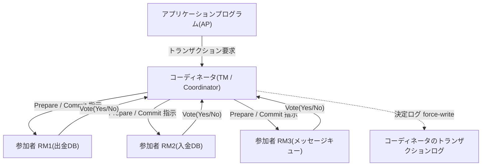
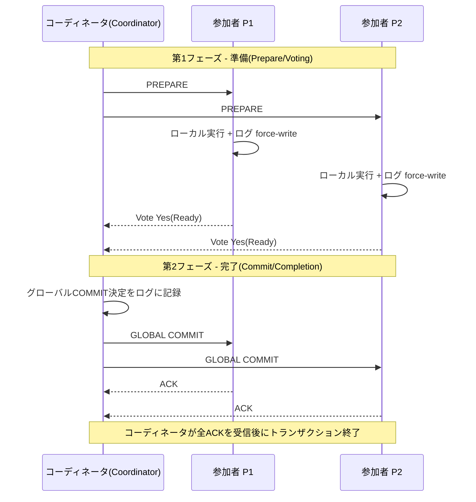
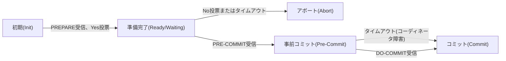

# 2相コミット(2PC)と3相コミット(3PC)プロトコル

## 1. 概要

> **定義**: 原子的コミットプロトコル(ACP, Atomic Commit Protocol)とは、一つのトランザクションに参加した複数の分散ノードが、そのトランザクションの最終結果を**すべてコミット(Commit)するか、すべて取り消す(Abort)** ことを保証する合意手続きであり、2相コミット(2PC, Two-Phase Commit)はその代表的な実装、3相コミット(3PC, Three-Phase Commit)は2PCのブロッキングの限界を緩和するための拡張である。

分散トランザクションの本質的な難しさは、一つの論理的作業が物理的に異なるリソースマネージャ(RM, Resource Manager)にまたがって実行されるという点に端を発する。例えば銀行の口座振替は、出金DBと入金DBという二つの独立したストレージにそれぞれ更新を加えるが、どちらか一方だけが反映されれば、お金が消えたり複製されたりする致命的な整合性の崩壊が発生する。単一ノードのトランザクションではACIDの原子性(Atomicity)をログとロールバックだけで保証できるが、分散環境では各ノードが独立して障害・遅延・ネットワーク断を経験するため、「すべて成功したか」を**一度の命令で決定することはできない**。ここで、参加者の意思をまず問い(投票)、全員の準備が整ったときにのみ確定を通知する2段階の構造が必要となる。

こうした原子的コミットの必要性は、1980年代の分散データベースとトランザクション処理モニタ(TP Monitor)の登場とともに標準化された。X/Openが定義したDTP(Distributed Transaction Processing)モデルとXAインタフェースが代表的であり、今日でもJTA/JTS(Java Transaction API)、メッセージキューのトランザクションブリッジ、異種DB間の連携において2PCが実務的に使われている。ただしマイクロサービスとクラウドネイティブ環境では、2PCの同期的なロックとブロッキング特性が拡張性を阻害するため、後述するSaga・イベントベースの結果整合性モデルにかなりの部分が置き換えられつつある。それでも2PC/3PCは「なぜ強い一貫性は高くつくのか」を説明する基準点であり、CAP・FLP不可能性定理と直結する理論的土台であるため、技術士の観点から必ず正確に理解しておかなければならない。

原子的コミットを合意(consensus)問題の特殊な形として捉える見方も重要である。各参加者がYes/Noを提案し、全員が同一の最終決定(commit/abort)に到達しなければならないという点で合意に似ているが、「一つでもNoがあれば必ずabortでなければならない」という制約が加わった、より厄介な問題である。このため、非同期ネットワークにおいて一つでもノードが停止しうるのであれば、「常に終了し、かつ常に正しい」ノンブロッキングな原子的コミットは存在しえないことが理論的に証明されている。2PCがブロッキングを受け入れ、3PCが整合性のリスクを受け入れているのは、この不可能性をそれぞれ異なる方法で回避した結果であり、二つのプロトコルのあらゆるトレードオフはこの根本的な限界から派生している。

- **原子性の保証**: 参加者全員のコミットまたは全員の取消しにより、部分的な完了(partial commit)を根本から遮断する。
- **役割の分離**: コーディネータ(Coordinator/TM)と参加者(Participant/RM)の明確な責任分担。
- **ログベースの復旧**: 各ノードが決定を**強制書き込み(force-write)** してから応答することで、障害後の再開を可能にする。

## 2. 全体構造と参加主体

分散トランザクションのコミットは、一つのコーディネータが複数の参加者を指揮するスター(star)型の制御フローを持つ。以下の構造図は、アプリケーションプログラム(AP)がトランザクションマネージャ(TM=コーディネータ)を介して複数のリソースマネージャ(RM=参加者)を束ねる、X/Open DTPモデルの骨格を示している。コーディネータはトランザクションの開始・終了を司り投票を集計し、参加者は実際のデータ更新とローカルログの管理を担当する。この構造の要点は、**決定権限がコーディネータ一か所に集中**していることであり、これは一貫した結果を保証する長所であると同時に、コーディネータが単一障害点(SPOF)となる弱点の根源でもある。

このスター構造において、コーディネータの役割は独立したトランザクションマネージャのプロセスが担うこともあれば、参加ノードの一つが兼ねることもある。いずれにせよコーディネータはトランザクション識別子(XID)を発行してすべての参加者が同一のトランザクションを指せるようにし、参加者リストと投票結果を管理する。参加者が動的に追加される場合(トランザクションの途中で新しいリソースが登録される場合)には、コーディネータがそれを参加者集合に組み入れなければならず、この登録情報もまた決定前に安定的に保存されていなければ、再起動後に漏れなく全員へ決定を通知することはできない。要するにコーディネータは、「誰がこのトランザクションに属していたか」というメンバーシップと、「何を決定したか」という結果の両方に責任を負う単一の権威点である。

コーディネータと参加者は、それぞれ自身の状態を安定記憶(stable storage)上のログに記録する。このログがプロトコルの信頼性を支える柱である。参加者は「Yes」に投票する前に、自身がコミットできるすべての変更をREDO/UNDOログとして**先にディスクへ強制書き込み**しなければならず、そうしてはじめて投票後に障害が起きても、再起動時にコーディネータの最終決定に従ってコミットまたは取消しを完結できる。同様にコーディネータは、最終決定(global commit/abort)をログに強制書き込みしてから参加者に通知する。この「先に記録し、後で通知する」というWAL(Write-Ahead Logging)原則が守られなければ、障害後にノードごとに異なる結論に達して原子性が崩れる。

一方、参加者が「Yes」に投票した瞬間から最終通知を受け取るまでの区間を**不確定(in-doubt/uncertain)状態**と呼ぶ。この状態の参加者は自らコミットするか取り消すかを決定できず、ひたすらコーディネータの指示を待たなければならず、その間当該リソースに対するロック(lock)を保持し続ける。不確定区間の存在こそが2PCのブロッキング問題と性能低下の直接的な原因であり、3PCが解決しようとする標的でもある。

メッセージ複雑度の観点では、参加者がN人のとき、標準的な2PCはコーディネータ基準で最低`3N`回のメッセージ(Prepare N + Decision N + ACK N)と、コーディネータ1回・参加者各2回のログ強制書き込みを必要とする。この同期的な往復とディスクI/Oが遅延の下限を規定するため、参加者数が多いほど、また地理的に分散しているほど、コミット遅延は線形以上に増加する。推定アボートのような最適化がこのコストを減らそうとする理由はここにあり、大規模分散ではプロトコル自体を合意ベースに切り替えるほうが有利になる。

## 3. 2相コミット(2PC)の手順

2PCはその名のとおり、**投票フェーズ(Voting/Prepare Phase)** と**完了フェーズ(Completion/Commit Phase)** の二つのラウンドで構成される。第一フェーズでコーディネータはすべての参加者に`PREPARE`を送って「コミットの準備はできているか」を問い、各参加者はローカルでトランザクションを実行・検証した後、ログを強制書き込みして`Yes(Ready)`または`No(Abort)`で応答する。第二フェーズでコーディネータは投票を集計し、**一人でもNoであるか応答がなければグローバルアボート**、全員がYesであればグローバルコミットを決定し、それをログに記録した後にすべての参加者へ通知する。参加者は通知どおりにコミット/取消しを確定して`ACK`を返し、コーディネータはすべてのACKを受け取るとトランザクションを終了する。

以下のシーケンス図は、正常なコミット経路を段階ごとに示している。各矢印がネットワークの往復であり、参加者数がNであれば最低2回のブロードキャスト往復と多数のログ強制書き込みが発生する点に注目すべきである。この同期的な往復が、2PCの遅延(latency)とスループットの限界を規定する。

**A. 準備フェーズの意味とロックの保持。** 参加者が`Yes`に投票するということは、単なる応答ではなく「私は今後いかなる状況においてもこのトランザクションをコミットできることを保証する」という契約である。したがって投票前に、完全性制約、トリガ、ディスクの空き容量など、コミットの成否を左右するあらゆる条件を検証し、変更分とロックを確実に確保しなければならない。この時点から参加者は関連レコードに対する排他ロックを最終通知まで保持するため、他のトランザクションは当該リソースを待つことになる。一件の分散トランザクションが複数ノードのロックを長時間つかんだままにする構造はスループットを大きく低下させ、実務では一つの2PCが数十ミリ秒から数百ミリ秒のロック保持時間を引き起こし、高TPSのサービスでボトルネックになる事例は珍しくない。

この契約的な性格のため、準備フェーズは事実上「実行は終えたが確定だけを保留した」状態でなければならない。もし参加者が`Yes`に投票しておきながら、実際にはコミットできない状況(ロック解除、セッション終了、リソース回収)に陥れば原子性が崩壊するため、リソースマネージャはYes投票以降のトランザクションを特別に保護(prepared状態の隔離)する。このため準備フェーズはリソース消費が大きく、コーディネータが長く応答しなければpreparedトランザクションが蓄積してリソースを蝕むという副作用を生む。運用者はこうしたin-doubtトランザクションを監視し、最後の手段としてのみ管理者介入(heuristic decision)を認めるポリシーを定めなければならない。

**B. 完了フェーズと最適化(Presumed Abort/Commit)。** 標準的な2PCは、決定ログの記録、通知、ACKの収集、終了ログの記録に至るまで多数のログI/Oを必要とする。これを減らすため、**推定アボート(Presumed Abort)** と**推定コミット(Presumed Commit)** の最適化が広く使われている。推定アボートは、コーディネータがトランザクション情報を失った(ログにない)問い合わせに対して「アボートされた」と応答しても安全であるという性質を利用し、アボート時のログ記録とACKを省略する。大半の商用DBMS(例: Oracleの分散トランザクション、X/Open XAの実装)は推定アボートを標準として採用し、正常なコミット経路のオーバーヘッドを最小化している。このように「頻繁な経路を安くする」という設計哲学は、トランザクションシステム全般に共通する原理である。

**C. 失敗シナリオとブロッキング問題。** 2PCの致命的な弱点は、**第1フェーズ以降にコーディネータが停止した場合**に表れる。参加者全員が`Yes`に投票して不確定状態に入った直後にコーディネータがダウンすると、参加者は最終決定がコミットなのかアボートなのかを知る手段がない。自らコミットすればコーディネータがアボートを決定していたリスクが、自らアボートすればその逆のリスクがあるため、参加者は**コーディネータが復旧するまで無期限に待機(blocking)** し、ロックを保持し続けなければならない。このブロッキングは、単一ノードの障害がシステム全体の進行を止めてしまうという、可用性の面での根本的な欠陥である。参加者同士が互いに問い合わせる**協調終了プロトコル(cooperative termination)** によって一部の状況(誰かが既に決定の通知を受けている場合)は解消できるが、全員が不確定状態であれば依然として待機するしかない。

**D. 障害箇所別の復旧規則。** プロトコルの堅牢さは、「どの時点で停止しても、再起動後に正しい結論へ収束する」ことから生まれる。以下の表は障害の発生箇所に応じた復旧規則を整理したものであり、その根拠はすべて先に説明したログ強制書き込み(WAL)の原則にある。参加者が投票前に停止すればログに何の痕跡もないため安全にアボートとみなし、投票後(不確定状態)に停止すればログのReady記録を根拠にコーディネータへ最終決定を再照会する。コーディネータが決定ログを残す前に停止すればアボートとし、残した後に停止すればログの決定を再伝播する。

| 障害箇所 | ログの状態 | 再起動後の処理 |
|-----------|-----------|----------------|
| 参加者、投票前 | Prepareの記録なし | アボートとみなす(推定アボート) |
| 参加者、投票後(不確定) | Readyの記録あり | コーディネータに決定を再照会、それまでロックを保持 |
| コーディネータ、決定前 | グローバル決定の記録なし | グローバルアボート |
| コーディネータ、決定後 | Commit/Abortの記録あり | 当該決定を参加者に再伝播 |

この表が示すように、2PCの整合性はいかなる障害の組み合わせにおいても決して崩れない。ただし「不確定状態でロックを保持したまま再照会を待つ」という項目こそが先に指摘したブロッキングの実体であり、可用性と整合性の間の根本的な緊張関係を改めて確認させてくれる。

## 4. 3相コミット(3PC)の手順と比較

3PCは、2PCのブロッキングを緩和するために完了フェーズを**事前コミット(Pre-Commit)** フェーズとしてもう一段階分割したプロトコルである。中核となるアイデアは、「コミットを確定する前に、全員がコミットの準備ができているという事実そのものを先に全員へ伝播する」ことである。コーディネータは全員の`Yes`投票を確認してもすぐにはコミットせず、`PRE-COMMIT`を配信して参加者に「まもなくコミットされる」ことを認識させた後、参加者のACKを受け取ってはじめて`DO-COMMIT`を送る。こうすることで、コーディネータが停止しても、生き残った参加者は自分がPre-Commitを受け取ったかどうかによって最終決定を**自律的に推論**できる。誰かがPre-Commitを受け取っていれば全員がYesであったことを意味するのでコミットで、誰も受け取っていなければアボートで終了する、という具合である。

上の状態遷移図の要点は、**事前コミット状態でタイムアウトが発生した場合はアボートではなくコミットへ進む**という規則である。この「タイムアウトに基づく自律的終了」が、3PCを**ノンブロッキング(non-blocking)** にしている。つまりコーディネータが応答しなくても、参加者は無期限に待機する代わりに、定められた規則に従って自ら終了できる。しかしこのノンブロッキング性は、あくまで**ネットワーク分断がなくノード障害のみが存在する**という前提(同期ネットワークの仮定)の下でのみ成立する。実際にネットワーク分断が起きると、分断された両側のグループが互いに異なるタイムアウト判断を下し、一方はコミット、他方はアボートとなる**不整合(split-brain)** が発生しうる。このため3PCは理論的な優美さにもかかわらず商用システムではほとんど採用されておらず、代わりに後述の深掘りで扱う合意ベース(Paxos/Raft)のアプローチが実務の標準となった。

二つのプロトコルの違いは単なるフェーズ数ではなく、**どのような障害の仮定の下でどの性質を放棄するか**にある。以下の表はそのトレードオフを整理したものであり、各項目の「理由」は前述の本文の記述に基づいている。

| 区分 | 2相コミット(2PC) | 3相コミット(3PC) |
|------|----------------|----------------|
| ラウンド数 | 2フェーズ(Prepare→Commit) | 3フェーズ(Prepare→Pre-Commit→Commit) |
| コーディネータ障害時 | ブロッキング(無期限待機)が発生 | タイムアウトによりノンブロッキングで終了 |
| ネットワーク分断 | 安全(整合性を維持、代わりに待機) | 不整合のリスク(split-brain) |
| メッセージ/遅延 | 少ない(2往復) | 多い(3往復、遅延増加) |
| 実務での採用 | 広範(XA、JTA、DBMS) | まれ(主に理論・教育用) |

ここから得られる実務的な含意は明確である。2PCは**整合性(Safety)のために可用性(Liveness)を犠牲に**し、3PCは特定の障害モデルで可用性を得る代わりに**分断状況での整合性リスク**を受け入れ、遅延も増える。結局、「完全な原子的コミットをノンブロッキングで達成することは非同期ネットワークでは不可能」というFLP(Fischer-Lynch-Paterson)不可能性定理の影が、二つのプロトコルの双方に落ちているのである。

実務で3PCが敬遠された理由をもう少し具体的に見ると、第一に追加ラウンドによる遅延の増加が大半のワークロードで許容しがたいこと、第二に3PCのノンブロッキング性が成立する「同期ネットワーク・ノード障害のみが存在」という仮定が実際のデータセンター(可変遅延・タイムアウトの誤判定・部分的分断)と食い違うこと、第三に同じ労力をかけるのであれば、いっそPaxos/Raftでコーディネータを複製するほうが、分断状況でも整合性を守りつつ高可用性を得られるより良い解決策であることである。すなわち3PCは、「2PCと合意ベースのコミットの間の過渡的なアイデア」として理解するのが正確である。

## 5. 深掘り: 実務適用と代替手段 — XA、Saga、合意ベースのコミット

**A. XA/DTPと異種リソースの連携。** 実務において2PCが最も確実に生き続けている領域は、X/Open XAインタフェースを通じた異種リソースの連携である。例えば注文処理で、リレーショナルDBの更新とJMSメッセージの発行を一つの原子的単位にまとめる必要がある場合、JTAトランザクションマネージャ(例: Narayana、Atomikos)が二つのリソースをXAで登録し、2PCでコミットする。この方式は強い一貫性を提供するが、ロック保持時間が長く、リソースマネージャのどれか一つでもXAをサポートしていなければ全体が成立しないという制約がある。そのため高性能が求められる決済・注文ドメインでは、XAの代わりに**メッセージ発行をDBトランザクションに組み込むOutboxパターン + CDC**で迂回する事例が増えている。

XAの運用で特に注意すべき部分が**ヒューリスティック決定(heuristic outcome)** である。コーディネータの応答が長時間遅延すると、リソースマネージャが管理者の介入や独自のポリシーによってpreparedトランザクションを強制的にコミット/ロールバックすることがあるが、このときコーディネータの最終決定と食い違うと`heuristic mixed/hazard`という整合性違反が記録される。これは自動的には復旧されないデータ不整合であるため、運用標準にはヒューリスティック決定の許容条件、発生時のアラート、事後の手動による整合性調整手順を必ず含めなければならない。すなわち2PCを導入するということは、「正常経路の強い一貫性」だけでなく、「例外経路の運用負担」まで併せて引き受ける決定であることを認識しなければならない。

**B. Sagaと結果整合性。** マイクロサービスは、サービスごとにDBを所有する「database-per-service」の原則のため、2PCのグローバルロックとは根本的に相性が悪い。代替手段として広く使われているのがSagaパターンであり、一つのビジネストランザクションを複数のローカルトランザクションの連鎖に分割し、失敗時には**補償トランザクション(compensating transaction)** で元に戻す。Sagaはロックを長く保持しないため拡張性に優れるが、中間状態が外部に露出する**結果整合性(eventual consistency)** を受け入れなければならず、分離性が弱いためセマフォ・バージョンチェックのようなアプリケーションレベルでの補完が必要である。すなわち2PCの強い一貫性とSagaの高い可用性はCAPの観点からの選択の問題であり、ドメインの整合性要求の水準によって決定すべきである。

具体的な比較のために、毎秒数千件の注文を処理しなければならないEコマースの決済フローを想定してみる。決済承認・在庫引当・ポイント付与の三つのサービスを2PC(XA)で束ねると、三つのノードのロックが一トランザクションあたり数十〜数百ms保持され、ロック競合によって実効スループットが急落し、どれか一つのサービスの瞬間的な障害が決済全体をブロッキングしてしまう。一方、同じフローをオーケストレーション型のSagaで構成すると、各サービスがローカルトランザクションを即座にコミット・解放するためスループットは数倍に向上するが、「決済は承認されたが在庫引当に失敗 → 決済取消の補償」のような中間的な不整合区間を、ユーザや精算ロジックが許容できるよう設計しなければならない。このように同じ要求を二つの方式で実装したときのスループット・整合性の差が、プロトコルの選択がすなわちアーキテクチャの決定であることを示している。

**C. 合意ベースの原子的コミット。** 3PCの分断に対する脆弱性を根本的に解決したアプローチが、**Paxos Commit**とRaftベースのコミットである。そのアイデアは、コーディネータの決定を単一ノードではなく複製された合意グループに下させ、コーディネータの障害を合意プロトコルのリーダー選出で吸収することである。Google Spannerはこの原理を大規模に実装した代表例であり、各シャード(Paxosグループ)の上に2PCを載せつつ、コーディネータと参加者の状態をすべて複製することでブロッキングとSPOFを同時に除去し、TrueTime(原子時計+GPS)によって外部一貫性まで保証する。これは「2PCの原子性 + 合意の高可用性」を組み合わせた現代的な定石と評価されている。このように現場の流れは、2PCを捨てるのではなく、その弱点であるコーディネータの信頼性を合意によって補強する方向へと進化してきた。

**D. 予想出題方向と答案構成戦略。** 技術士試験において本テーマは、単独で出題されるよりも、「分散トランザクションの原子性保証方策」、「MSAにおけるデータ一貫性」、「CAP/BASEと強い一貫性の比較」のような上位の問題の中核的な論拠として登場する傾向がある。したがって答案は、(1)2PCの手順とログの原理をシーケンス図で正確に提示し、(2)ブロッキング問題を明確に指摘したうえで、(3)3PCの限界とSaga・Paxos Commitという代替手段まで結び付け、「なぜ強い一貫性は高くつき、現場はどのように折り合いをつけているのか」というストーリーで締めくくる構成が高得点に有利である。短答形式(1時限目)で出題された場合は、「2PC=原子性の保証、短所=ブロッキング、代替=3PC/Saga」の要点を表とともに凝縮して提示する。

## 6. 考慮事項および示唆

原子的コミットプロトコルは、「分散環境において強い一貫性はタダではない」という命題を最も鮮明に示すテーマである。技術士の観点からは、単に手順を暗記することを超えて、プロトコルの選択がすなわち可用性・性能・運用の複雑さに関するアーキテクチャ上の意思決定であることを、次のように整理できる。

- **一貫性-可用性トレードオフの明示的な選択(適用戦略)**: 強い原子性が必ず必要な金融・在庫ドメインには2PC/XAを、規模と可用性が優先されるユーザ向けサービスにはSaga・イベントベースの結果整合性を採用するというように、ドメインごとの整合性要求をまず定義し、プロトコルはその後に選択しなければならない。「全区間2PC」は拡張性を損なうアンチパターンである。
- **コーディネータの高可用性確保(トレードオフの管理)**: 2PCの最大のリスクであるコーディネータのSPOFは、コーディネータログの複製、スタンバイコーディネータ、さらにはPaxos/Raftベースのコーディネータ複製によって緩和しなければならない。単純な3PCの導入は、遅延の増加と分断時の整合性リスクを新たに抱え込むことになるため慎重であるべきである。
- **ロック保持時間と性能の観測(運用)**: 分散トランザクションのロック保持時間、in-doubtトランザクション数、コーディネータのログI/Oを常時監視し、タイムアウトと自動解消(heuristic decision)のポリシーを明確に規定しなければならない。heuristic commit/rollbackは整合性を崩しうるため、監査ログと事後の整合性検証を必ず併用する。
- **標準・技術の連携と展望(連携技術)**: XA/JTA、Outbox+CDC、Sagaオーケストレーション、Spanner型の合意ベースコミットは相互排他的なものではなく、階層的に組み合わされる。今後はTrueTime・ハイブリッド論理時計(HLC)に基づく外部一貫性の保証、クラウドのマネージド分散DB(NewSQL)の普及によって、アプリケーションがコミットプロトコルを直接扱わずに委任する方向へと抽象化が進むと見込まれる。
- **アーキテクチャ意思決定の原則(設計判断)**: プロトコルの選択は性能の数値一つで決めるのではなく、ドメインの整合性違反時のコスト(金銭的損失・規制・信頼)と、遅延・可用性の要求を併せて比較衡量するリスクベースの判断でなければならない。強い一貫性が必須となる中核的な元帳(ledger)にのみ2PCを局所的に適用し、周辺ドメインはSagaで分離する「一貫性境界の設定」が実務上の定石である。
- **テスト・検証戦略(品質保証)**: 分散コミットの欠陥は正常経路ではなく障害の組み合わせにおいて表れるため、コーディネータ/参加者の各フェーズでの強制終了を注入するカオステストと、障害後の整合性再検証(reconciliation)の自動化をCIに組み込まなければならない。「正常時にはうまくいく」という検証だけでは、原子性の保証を信頼することはできない。

## 参考資料

- X/Open, "Distributed Transaction Processing: The XA Specification" — https://pubs.opengroup.org/onlinepubs/009680699/toc.pdf
- Gray, J. & Lamport, L., "Consensus on Transaction Commit(Paxos Commit)", ACM TODS — https://lamport.azurewebsites.net/pubs/pubs.html#consensus-on-transaction-commit
- Google, "Spanner: Google's Globally-Distributed Database", OSDI 2012 — https://research.google/pubs/pub39966/
- Microsoft Docs, "Two-Phase Commit / Distributed Transactions" — https://learn.microsoft.com/en-us/windows/win32/cossdk/two-phase-commit-protocol

---

> **一言まとめ**: 2PCは準備・完了の2フェーズの投票によって分散トランザクションの原子性を保証するが、コーディネータ障害時にブロッキングするという弱点がある。3PCは事前コミットフェーズを加えてノンブロッキング性を狙うがネットワーク分断に弱いため、現場ではXA・Saga・Paxos/Raftベースの合意コミットによって、整合性と可用性をドメインに合わせて折り合いをつけている。
