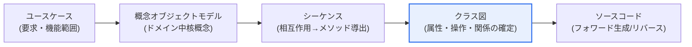
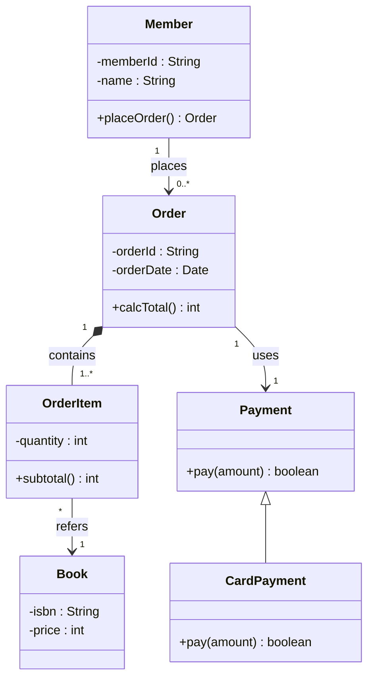

# UMLクラス図とオブジェクトモデリング

## 1. 概要

### A. 定義
> **クラス図(Class Diagram)** は、システムを構成する**クラスとその属性(attribute)・操作(operation)、そしてクラス間の関係(関連・集約・コンポジション・汎化・依存)を表現**するUMLの代表的な構造(静的)図であり、オブジェクト指向分析・設計(OOAD)の最終成果物であると同時に、ソースコードへとつながる設計の青写真である。

クラス図がオブジェクト指向設計の中心に位置する理由は、「**システムの骨格(構造)を1枚に収める**」という点にある。UMLの各種図はそれぞれ異なる視点を表現する。ユースケース図が「何をするのか(要求・機能範囲)」を、シーケンス図・コミュニケーション図が「どのように流れるのか(動的相互作用)」を示すとすれば、クラス図は「何で構成されるのか(静的構造)」を示す。オブジェクト指向開発はこの3つの視点を行き来しながら段階的に精緻化されるが、その収束点こそがクラス図である。

オブジェクト指向分析・設計の典型的な流れは次のとおりである。まず問題領域(ドメイン)から中核概念(名詞)を抽出して**概念オブジェクトモデル(ドメインモデル)** を作成し、シナリオごとの相互作用を**シーケンス図**で具体化する。このとき、オブジェクト間でやり取りされるメッセージがそのまま受信オブジェクトのメソッド(操作)へと昇格する。最後にこれらを統合し、属性・操作・関係が確定した**クラス図**として完成させる。例えばオンライン書店であれば、「会員・書籍・注文・ショッピングカート」が概念オブジェクトとなり、「注文する・決済する・在庫を減算する」という相互作用がメソッドとなり、それらの関係(1つの注文は複数の注文明細を持つ、会員は複数の注文を行う)がクラス図の関連・多重度として整理される。すなわちクラス図は、分析・設計活動の最終的な収束点であり、実装と文書をつなぐ結節点である。

### B. 登場背景と必要性
構造化手法の時代には、データ(ERD)と機能(DFD)を分離してモデリングしていたが、データとそれを扱う振る舞い(操作)がばらばらに管理されるため、変更に弱かった。オブジェクト指向は**データと操作を1つのオブジェクト(クラス)にカプセル化**することでこの問題を解決し、その構造を視覚的に標準化したものがUMLクラス図である。UMLはBooch・Rumbaugh(OMT)・Jacobson(OOSE)の方法論が統合され、OMGによって標準化(現在はUML 2.x)されたものであり、クラス図はその中でもコード生成・リバースエンジニアリング(Reverse Engineering)と直接結びつく最も実務的な図である。複雑なシステムほど構造を共有・検証するための共通言語が必要であり、クラス図は開発者・設計者・利害関係者が構造について合意するためのコミュニケーション手段として不可欠である。

### C. モデリングの流れの概観

## 2. クラス図の構成要素

### A. クラスの表現と可視性
クラスは3つの区画に分かれた矩形で描く。最上段に**クラス名**、中段に**属性**、下段に**操作(オペレーション)** を記述する。属性と操作の前には**可視性(visibility)** 記号を付けてアクセス範囲を明示する。`+`はpublic(外部公開)、`-`はprivate(自クラス内部のみ)、`#`はprotected(継承関係でのアクセスを許可)、`~`はpackage(同一パッケージ内部)である。例えば`- balance : int`は残高が外部から直接アクセスできない隠蔽属性であることを、`+ withdraw(amount : int) : boolean`は外部から呼び出し可能な引き出し操作であることを意味する。可視性は単なる表記ではなく、**カプセル化・情報隠蔽**というオブジェクト指向の原則を図のレベルで強制する仕組みである。属性をprivateで隠し、publicメソッド経由でのみアクセスを許可すれば、内部実装が変わっても外部との契約(インタフェース)は維持され、変更の波及が小さくなる。

### B. 関係(Relationship)の種類と意味
クラス図の真の表現力は**クラス間の関係**にある。関係は結合の強さと意味によって複数の種類に分かれ、どの関係を選択するかが設計品質を左右する。

**関連(Association)** は2つのクラスが構造的に結び付き、互いを認識・参照する関係であり、実線で描いて両端に**多重度(multiplicity、例: 1, 0..1, 1..\*, \*)** を表記する。例えば「会員1人は0件以上の注文を行う」は、会員 `1` — 注文 `0..*` と表現される。方向(navigability)の矢印により、どちらがどちらを参照するかを明示できる。

**集約(Aggregation)とコンポジション(Composition)** はいずれも「全体-部分(whole-part, has-a)」関係であるが、結合の強さが異なる。集約(白抜きのひし形)は部分が全体から独立して存在し得る緩やかな所有(例: 部署と社員 — 部署がなくなっても社員は存在する)を、コンポジション(塗りつぶしのひし形)は部分が全体のライフサイクルに従属する強い所有(例: 注文と注文明細 — 注文が削除されれば注文明細も同時に消滅する)を意味する。この微妙な違いが、実装におけるオブジェクトの生成・破棄の責任と参照管理の方式を決定する。

**汎化(Generalization)** は継承(is-a)関係であり、白抜き三角形の矢印を親(上位)クラスに向けて描く。子は親の属性・操作を受け継ぎ、特化する(例: 「決済」を親として「カード決済・口座振替・簡易決済」が子)。**実現(Realization)** はインタフェースと実装クラスの関係(点線+三角形)であり、**依存(Dependency)** はあるクラスが別のクラスを一時的に(引数・ローカル変数として)利用する弱い関係(点線矢印)である。

| 関係 | 表記 | 意味 | 結合度 |
|---|---|---|---|
| **関連(Association)** | 実線 + 多重度 | 構造的参照 | 中 |
| **集約(Aggregation)** | 白抜きひし形 | 全体-部分(独立して存続) | 弱 |
| **コンポジション(Composition)** | 塗りつぶしひし形 | 全体-部分(ライフサイクル従属) | 強 |
| **汎化(Generalization)** | 白抜き三角形 | 継承(is-a) | 強 |
| **実現(Realization)** | 点線 + 三角形 | インタフェース実装 | 中 |
| **依存(Dependency)** | 点線矢印 | 一時的利用 | 弱 |

### C. 構造例の図
以下はオンライン書店ドメインの簡略化したクラス構造であり、関連・多重度・コンポジション・汎化が同時に現れる例である。

この図は、テキストによる仕様よりもはるかに凝縮して構造を伝える。`Order`と`OrderItem`を結ぶ塗りつぶしのひし形(`*--`)は、注文が消えれば注文明細も消えるコンポジションであることを、`Payment`と`CardPayment`を結ぶ三角形(`<|--`)は、カード決済が決済の一種であることを一目で示している。

## 3. 概念オブジェクトモデル・シーケンスとの連携

**概念オブジェクトモデル(ドメインモデル)** は設計以前の段階であり、問題領域の中核概念(ドメインオブジェクト)とその関係のみを識別する。この段階では実装の詳細(メソッドシグネチャ・可視性・データ型)はまだ確定せず、「このドメインにはどのような概念があり、互いにどう絡み合っているか」だけを描く。こうすることで、利害関係者とドメインの言葉(ユビキタス言語)で意思疎通しやすくなり、技術的な偏りなく問題の本質に集中できる。

続いて**シーケンス図**で特定のシナリオに沿ってオブジェクト間のメッセージを定義すると、そのメッセージがそのまま受信オブジェクトの**操作(メソッド)** へと昇格する。例えば「注文オブジェクトが決済オブジェクトにpay(amount)メッセージを送る」と設計すれば、決済クラスには`pay(amount)`操作が生まれる。このように動的モデル(シーケンス)から導出した操作を静的モデル(クラス)に反映して設計を精緻化し、逆にクラス構造がシーケンスの実現可能性を検証する。両モデルは相互補完的に循環しながら収束していく。[[uml-sequence]]

| モデル | 視点 | 主な成果物 | 決定事項 |
|---|---|---|---|
| **概念オブジェクトモデル** | ドメイン概念(静的) | 中核オブジェクト・関係 | 何が存在するか |
| **シーケンス** | 動的相互作用 | メッセージ→メソッド | 誰が何を呼び出すか |
| **クラス** | 静的構造(確定) | 属性・操作・関係 | どのような構造で実装するか |

この連携で最も重要なのは**責務の割り当て(Responsibility Assignment)** である。どのメッセージをどのオブジェクトが処理するか(すなわちどのクラスにメソッドを置くか)を適切に決めれば、凝集度が高く結合度の低い設計となり、誤れば特定のクラスに責務が集中する「God Class」が生まれる。これらの原則を体系化したものがGRASPパターン(Information Expert, Creator, Controllerなど)であり、クラス図はその結果を収める器である。

## 4. 深掘り — 設計パターン・コード連携と実務適用

クラス図は**デザインパターンを表現し伝達するための標準言語**としても用いられる。GoFデザインパターン(Strategy・Observer・Factory・Decoratorなど)はいずれもクラス図によってその構造が定義されており、例えばStrategyパターンは、`Context`が`Strategy`インタフェースに依存し、具象戦略がそれを実現する構造として表現される。これにより「決済方式をStrategyパターンで分離しよう」という設計意図を、図1枚で合意できる。

実務においてクラス図は、**フォワードエンジニアリング(Forward Engineering)とリバースエンジニアリング(Reverse Engineering)** を通じてコードと双方向に結び付く。Enterprise Architect、Visual Paradigm、IntelliJ/EclipseのUMLプラグインといったツールは、クラス図からクラスの骨格コードを自動生成したり(フォワード)、レガシーソースからクラス構造を抽出して図として可視化したりする(リバース)。後者は、文書が不十分なレガシーシステムを把握する場合や、保守時の影響範囲を分析する場合に特に有用である。近年はコードファースト(Code-First)の文化が広がり、重厚なCASEツールの代わりに**PlantUML・Mermaid**のようにテキストで図を記述し、コードリポジトリでバージョン管理する(diagram-as-code)方式が増えている。これにより設計文書がコードとともに進化し、「文書と実装の不一致」問題が軽減される。ただし、ドメインが複雑なシステムでは、1枚のクラス図にすべてを詰め込もうとするのではなく、ドメイン駆動設計(DDD)の境界づけられたコンテキスト単位で分割し、凝集度の高いモデルを維持するのが実務上のコツである。

## 5. 考慮事項および示唆(技術士の視点)

1. **モデル間の整合性(Consistency)維持**: ユースケース→概念オブジェクト→シーケンス→クラスが一貫してつながっていなければならない。特にシーケンスのメッセージとクラスの操作、概念モデルの関係とクラスの関連が食い違うと、設計の信頼性が崩れる。CASEツールのモデル整合性チェック(consistency check)やdiagram-as-codeのレビューによって、整合性を継続的に検証する必要がある。

2. **適切な抽象化レベルと進化的詳細化**: 分析段階のクラスはドメイン中心にシンプルに保ち、設計段階で徐々に可視性・データ型・実装の詳細を加えていく。最初から過度に詳細化すると、要求変更時の保守・修正コストが急増する。「分析クラス → 設計クラス → 実装クラス」という段階的な洗練が望ましい。

3. **結合度・凝集度と関係選択のトレードオフ**: 集約/コンポジション/汎化/依存のいずれを用いるかが結合の強さを決める。継承(汎化)は強力な再利用をもたらすが、親の変更が子全体に波及するため、「継承よりもコンポジションを優先せよ(Favor composition over inheritance)」という原則に従い、柔軟性が求められる箇所ではコンポジション・インタフェースで結合度を下げる判断が必要である。

4. **コード生成・リバースエンジニアリングと文書-実装の一貫性**: クラス図はコードとの双方向変換が可能であるため、設計-実装の一貫性維持やレガシー理解に強みを持つ。しかし自動生成コードは骨格しか提供しないため過信してはならず、diagram-as-code(Mermaid/PlantUML)で図をリポジトリに置き、コードとともに進化させる運用戦略が有効である。

5. **大規模ドメインにおけるモデル分割**: システムが大きくなると、単一のクラス図は可読性を失う。パッケージ・サブシステム単位で分割し、DDDの境界づけられたコンテキスト・集約(Aggregate)の概念を適用して凝集度の高いモデル境界を設定することで、保守性と拡張性が確保される。

## 参考資料
- OMG, Unified Modeling Language (UML) 2.5.1 仕様: https://www.omg.org/spec/UML/
- IBM Developer, "UML basics: The class diagram": https://developer.ibm.com/articles/the-class-diagram/
- Mermaid, Class diagram ドキュメント: https://mermaid.js.org/syntax/classDiagram.html
- Refactoring Guru, GoFデザインパターン(構造図): https://refactoring.guru/design-patterns

---

> **一言まとめ**: クラス図は*クラスとその属性・操作、関連・集約・コンポジション・汎化・依存の関係を表現するUMLの静的モデル*であり、概念オブジェクトモデル→シーケンス(メッセージ→メソッド)→クラスへと続くオブジェクト指向設計の収束点であると同時に、コードと双方向に結び付く青写真である。モデル間の整合性・適切な抽象化・関係の選択(結合度)が設計品質の鍵となる。
