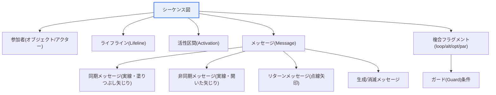
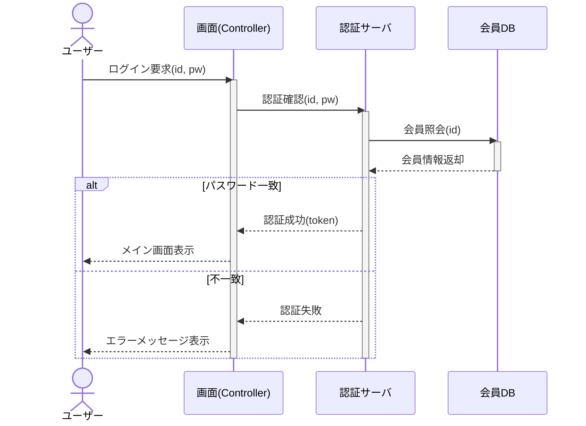

# UMLシーケンス図(Sequence Diagram)

## 1. 概要

### A. 目的と概念
> **シーケンス図(Sequence Diagram)** は、オブジェクト(Object)間でやり取りされる**メッセージを時間順に表現**するUMLの動的(behavioral)図であり、特定のシナリオにおいてオブジェクト群がどのように相互作用し協調するかを示す。UML 2.xでは、相互作用(Interaction)を表現する代表的な図に分類される。

シーケンス図の核心は、「**誰が誰に、いつ、何を要求するのかを時間の流れとして描く**」点にある。クラス図がシステムの静的構造(何があるのか、structural)を示すとすれば、シーケンス図は動的な振る舞い(どのように動作するのか、behavioral)を示す。例えば「会員がログインする」というシナリオでは、ユーザー→画面→認証サーバ→DBへとメッセージが順に流れ、応答が戻ってくる過程を、上から下への時間軸に沿って描く。こうすることで、ユースケースの内部処理の流れ、オブジェクト間の責務の分配、メソッド呼び出しの順序が一目で明らかになり、設計検証とコミュニケーションに役立つ。

特にシーケンス図は、1つのユースケースが実際にどのようなオブジェクト協調によって実現されるかを具体化する橋渡しの役割を果たす。ユースケース図が「何をするのか(what)」というシステムの外部視点の要求を記述するとすれば、シーケンス図はそのユースケースが「どのように処理されるのか(how)」をオブジェクト協調として解き明かす。この過程で各オブジェクトがどのような責務(メソッド)を持つべきかが自然に導出されるため、シーケンス図はクラス図の操作(オペレーション)を発見・検証する設計ツールとしても用いられる。

### B. 登場背景と必要性
オブジェクト指向設計において、静的構造(クラス)だけではシステムが実際に「動作」する姿を検証することは難しい。クラス図は「このようなクラスとメソッドがある」と述べるだけで、それらのメソッドがどのような順序で協調して1つの機能を完成させるのかは示せない。ここに生じる空白が設計誤りの温床となる。情報をまったく持っていないオブジェクトが呼び出されたり、応答を待つべき箇所で非同期に投げられたり、特定のオブジェクトに責務が過度に集中したりする問題(God Object)は、静的構造を見ただけでは表面化しない。

シーケンス図はこのような動的な流れを時間軸の上に明示的に展開することで、設計者が着手前に協調の妥当性を検証できるよう支援する。また、開発者・企画者・QAが1つのシナリオを同じ図で理解できるようにし、コミュニケーションコストを下げる。欠陥が要求・設計段階で発見されるほど修正コストが指数関数的に低くなるという点(欠陥早期発見の経済性)から、シーケンス図は費用対効果の高い設計検証手段である。

### C. コミュニケーション図との関係
シーケンス図と**コミュニケーション(協調)図**は、同じ相互作用を異なる視点から表現する双子である。シーケンス図は**時間順序**を強調(縦の時間軸)して「いつ」に焦点を当て、コミュニケーション図はオブジェクト間の**接続関係(リンク)** を強調して「どのように接続されているか」に焦点を当てる。2つの図が保持する情報は本質的に同一であり、相互変換が可能である。時間の流れが重要なシナリオ(トランザクション処理の順序など)にはシーケンス図が、オブジェクト間の構造的な接続が重要な場合にはコミュニケーション図がより適している。

## 2. 全体構造と構成要素

以下の構造図は、シーケンス図を構成する要素が互いにどのように関係しているかを概念的に整理したものである。

次は、実際のログインシナリオをシーケンス図の文法で表現した例である。同期要求は実線矢印(`->>`)、リターンは点線矢印(`-->>`)で描き、活性区間と条件分岐(alt)を併せて表現している。

### A. 参加者とライフライン(Lifeline)
相互作用に参加する実体は、上部に矩形(オブジェクト)またはアクター記号で配置され、各参加者から下へ伸びる**縦の点線**がライフラインである。ライフラインは時間の流れ(上→下)を表す軸であると同時に、そのオブジェクトが相互作用の間存在していることを意味する。オブジェクトの表記は通常`オブジェクト名:クラス名`の形式(下線付き)で書き、特定のインスタンスではなく役割のみを強調する場合は、オブジェクト名またはクラス名だけを記すこともある。ライフラインをどう並べるか(参加者の選定と配置)が図の可読性を大きく左右するため、協調の中核となるオブジェクトだけを選び、流れの方向(左→右)が自然になるよう配置するのがよい。

### B. 活性区間(Activation Bar)
ライフラインの上に重ねて描く細い縦長の矩形が活性区間(実行仕様、execution specification)であり、**そのオブジェクトが実際に処理(演算)を行っている区間**を表す。活性区間があれば、どのオブジェクトがいつからいつまで制御を握っているのか、呼び出しが入れ子(nested)になっているのかが明らかになる。例えば上の例では、画面(S)の活性区間が認証サーバ(A)の呼び出しを包み、Aの活性区間がさらにDB呼び出しを包む入れ子構造になっている。この入れ子が過度に深い場合、特定の流れに制御が過剰に束縛されているというシグナルであり、設計をリファクタリングする手がかりとなる。

### C. メッセージ(Message)の種類
メッセージはシーケンス図の実質的な内容であり、矢印の形と線の種類によって意味が区別される。**同期メッセージ**(実線+塗りつぶし三角の矢じり)は、呼び出し側が応答を受け取るまで待機する要求であり、一般的なメソッド呼び出しに相当する。**非同期メッセージ**(実線+開いた矢じり)は応答を待たずに制御を渡す要求であり、メッセージキューへの発行やイベント送信のように、呼び出し直後に次の処理へ進む場合に用いる。**リターンメッセージ**(点線矢印)は呼び出しに対する応答であり、省略可能であるが、結果値の流れを明確にするには表記するのが望ましい。このほか、オブジェクトを新たに生成する**生成メッセージ**(対象オブジェクトをその時点に配置)、オブジェクトを破棄する**消滅メッセージ**(ライフラインの末端に×印)、自分自身を呼び出す**自己メッセージ**(self message、自分に戻る矢印)がある。

同期と非同期の区別は単なる表記上の問題ではなく、システム特性を決定する。例えば決済承認のように結果を必ず確認しなければならない流れは同期で、通知送信やログ蓄積のように結果を待つ必要のない流れは非同期で設計する方が、性能・応答性の面で有利である。シーケンス図はこの決定を矢印の形で明示させ、設計意図を文書に刻み込む。

### D. 複合フラグメント(Combined Fragment)とガード
単純な逐次の流れだけでは、条件分岐・繰り返しといった制御構造を表現できない。UML 2.0はそのために**複合フラグメント**を導入した。代表的な演算子として、条件分岐の**alt**(複数の選択肢のうち1つ)、オプション実行の**opt**(条件を満たす場合のみ)、繰り返しの**loop**、並列実行の**par**、クリティカル領域の**critical**などがある。各フラグメントは矩形のフレームで囲み、左上に演算子を、各分岐には**ガード(Guard)条件**`[条件]`を記す。上のログイン例の`alt [パスワード一致] / else`が代表的な条件分岐の表現である。フラグメントを適切に用いれば、1枚の図に正常フローと例外フローを併せて収めることができ、シナリオごとに別々の図を何枚も描くよりも凝集度の高い表現が可能となる。

| 構成要素 | 内容 | 表記 |
|---|---|---|
| **オブジェクト/アクター** | 相互作用に参加する実体 | 上部の矩形・アクター記号 |
| **ライフライン(Lifeline)** | オブジェクトの存在期間・時間軸 | 縦の点線 |
| **活性区間(Activation)** | 処理(演算)の実行区間 | ライフライン上の細い矩形 |
| **同期メッセージ** | 応答を待つ呼び出し | 実線・塗りつぶし矢じり |
| **非同期メッセージ** | 応答を待たない呼び出し | 実線・開いた矢じり |
| **リターンメッセージ** | 呼び出しに対する応答 | 点線矢印 |
| **複合フラグメント** | 条件・繰り返し・並列の制御 | フレーム(alt/opt/loop/par) |
| **ガード(Guard)** | メッセージ実行条件 | `[条件]` |

## 3. 作成手順

シーケンス図は、次の手順で作成すれば漏れなく描くことができる。各段階は前段階の成果物を入力として、段階的に詳細化されていく。

| 手順 | 内容 | 着眼点 |
|---|---|---|
| **① シナリオ選定** | 表現するユースケース・シナリオを決定 | 正常フロー・主要な例外フローを優先 |
| **② オブジェクト識別** | 参加オブジェクトを上部に配置、ライフライン | 中核となる協調オブジェクトのみ選別 |
| **③ メッセージ配列** | 時間順にメッセージを上→下に配置 | 要求・応答の対応を明確に |
| **④ 活性区間の表示** | 処理区間に活性区間 | 入れ子の深さを点検 |
| **⑤ 条件・繰り返しの追加** | alt・loop・opt・parフラグメント | 例外・分岐フローを含める |
| **⑥ レビュー・整合性確認** | クラス・ユースケースと照合 | メソッドの存在・責務の妥当性 |

特に②段階のオブジェクト識別と⑥段階の整合性確認が品質を左右する。メッセージの受信オブジェクトは、必ずそのメッセージを処理する責務(メソッド)と必要な情報を持つオブジェクトでなければならず(情報エキスパートパターン、Information Expert)、この点検を通じてクラス図にどの操作を追加すべきかが確定する。

## 4. 比較 — シーケンス図 vs コミュニケーション図 vs ステートマシン図 vs アクティビティ図

動的な図には複数の種類があり、目的に応じて選択しなければならない。よくある誤りは、どのような流れでもシーケンス図1つで押し通すことであり、これは表現力のミスマッチを生む。シーケンス図は**オブジェクト間相互作用の時間順序**に強いが、1つのオブジェクトがイベントに応じて状態を変えていく様子(ステートマシン図)や、条件・並列を含む業務手順全体の流れ(アクティビティ図)を表現するには不向きである。

| 区分 | 強調点 | 適した状況 | 限界 |
|---|---|---|---|
| **シーケンス** | オブジェクト間メッセージの時間順序 | ユースケース内部の協調、呼び出し順序 | オブジェクトが多い・流れが複雑な場合に難読 |
| **コミュニケーション** | オブジェクト間の接続関係 | 構造的な接続の強調 | 時間順序の把握が困難 |
| **ステートマシン** | 1つのオブジェクトの状態遷移 | イベント駆動の状態変化 | 複数オブジェクトの協調表現に不向き |
| **アクティビティ** | 処理の流れ・分岐・並列 | 業務プロセス・ワークフロー | オブジェクトごとの責務表現が弱い |

違いが生じる根本的な理由は、各図が捉えようとする「軸」が異なるためである。シーケンス図は時間を、ステートマシン図は1つのオブジェクトがたどる生涯を、アクティビティ図は制御の流れを、それぞれ1次元の軸とする。実務では1つの機能を理解する際に、ユースケース(要求)→アクティビティ(業務手順)→シーケンス(オブジェクト協調)→ステートマシン(中核オブジェクトの生涯)を相補的に併せて描き、多角的に検証する。

## 5. 深掘り — 実務活用と予想出題傾向

実務においてシーケンス図は、設計の文書化を超えてさまざまな局面で活用される。第一に、**API・マイクロサービス間相互作用の設計**である。サービスAがBを同期で呼び出し、Bがさらにメッセージキュー経由でCに非同期イベントを発行する流れをシーケンス図で描くと、同期/非同期の境界と障害伝播のポイント(例: Bの応答遅延時のAのタイムアウト)が明確になり、レジリエンス(サーキットブレーカー、タイムアウト)設計へとつながる。第二に、**認証・セキュリティプロトコルの説明**である。OAuth 2.0の認可コードフローやSAMLベースのSSOのように、多者間のメッセージ交換が核心となるプロトコルでは、シーケンス図が事実上の標準的な説明手段である。第三に、**欠陥分析・レビュー**である。実際のログ(呼び出しトレース)をシーケンス図として復元すれば、どの区間で想定外の呼び出しが発生したかを視覚的に特定できる。

ツールの面でもシーケンス図は取り組みやすい。PlantUML・Mermaidのようなテキストベースのツールを用いれば、図をコードとして管理(diagram-as-code)し、バージョン管理・レビューが可能になる。この学習ノートサイトもMermaidの`sequenceDiagram`文法で図をレンダリングしている。これは、要求・設計が頻繁に変わるアジャイル環境において、図を最新の状態に保つうえで有利である。

技術士試験の観点では、シーケンス図は「UML動的図の種類と比較」「ユースケース実現(realization)」「オブジェクト指向設計手順」と併せて頻繁に出題される。答案作成の戦略としては、① 静的図 vs 動的図という構図の中でシーケンス図の位置付けを示し、② 構成要素を例示図とともに提示し、③ コミュニケーション図・ステートマシン図・アクティビティ図との比較で「いつ何を使うか」を論じ、④ API・セキュリティプロトコルなどの実務活用で締めくくれば、深みを確保できる。

## 6. 考慮事項および示唆

1. **動的設計の検証ツールとしての価値を活かすべきである。** シーケンス図はユースケースの内部処理の流れとオブジェクト間の責務分配を具体化し、設計の完全性・妥当性を早期に検証し、クラスの操作を発見するために用いられる。文書の装飾ではなく設計思考のツールとして活用してこそ、効用が大きい。
2. **適切な抽象化レベルが可読性を左右する。** すべてのメッセージを描くと図が複雑になり、かえって理解を妨げる。中核シナリオ・主要な相互作用を中心に描き、詳細は別の図に分離するか参照(ref)フラグメントに委ねて、1枚あたりの情報密度を管理しなければならない。
3. **他のUML図との整合性を維持しなければならない。** ユースケース(何を)→シーケンス(どう流れるか)→クラス(どのような構造で)と続く連鎖において、シーケンス図のメッセージはクラスのメソッドと1対1で対応しなければならない。整合性が崩れれば、設計文書全体の信頼が失われる。
4. **同期/非同期の選択はアーキテクチャ上の決定であると認識すべきである。** 矢印の形1つが応答性・結合度・障害伝播に影響を与える。シーケンス図はこの決定を明示化するため、性能・レジリエンス要求を考慮して慎重に選択し、その根拠を文書に残さなければならない。
5. **生きた文書(diagram-as-code)として維持すべきである。** コードが変われば図も更新されてこそ価値が保たれる。Mermaid・PlantUMLで図をコード化してバージョン管理に含めれば、最新性を維持しやすく、レビュー・協業にも有利である。

## 参考資料
- OMG, Unified Modeling Language(UML) Specification: https://www.omg.org/spec/UML/
- Mermaid Sequence Diagram ドキュメント: https://mermaid.js.org/syntax/sequenceDiagram.html

---

> **一言まとめ**: シーケンス図は*オブジェクト間のメッセージを時間順に表現*するUMLの動的図であり、オブジェクト・ライフライン・活性区間・メッセージ(同期/非同期/リターン)・複合フラグメント(alt/loop/opt/par)・ガードで構成され、ユースケースの内部協調の流れを具体化して、オブジェクトの責務と同期/非同期の境界を早期に検証する動的設計ツールである。
