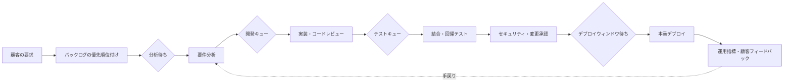

# バリューストリームマッピング(VSM, Value Stream Mapping)によるリーン・DevOpsプロセス改善

## 1. 概要

### A. 定義

> **バリューストリームマッピング(Value Stream Mapping, VSM)**とは、顧客の要求が入力されてから価値が提供されるまでの流れ全体を、業務・情報・待ち・品質のデータとともに可視化し、ムダとボトルネックを取り除いてリードタイムと提供成果を改善する、リーン(Lean)に基づく分析手法である。

VSMは単なる業務フロー図や組織図とは異なる。
業務フロー図はどの活動がどの順序で実行されるかを表現することに集中するが、VSMは活動間の待ち時間、手戻り、キュー、承認の遅延、バッチサイズ、欠陥率を併せて見る。
そのため、実際に顧客にとっての価値を生む時間と価値を生まない時間を切り分け、リードタイム全体がなぜ長くなるのかを説明できる。

VSMでいうバリューストリームとは、特定チームの内部手順ではなく、顧客の要求が成果物へと転換されるエンドツーエンドの経路である。
ソフトウェアサービスであれば、アイデア・要求の受付から、要件分析、開発、テスト、セキュリティレビュー、デプロイ、運用フィードバックまでが一つの流れとなりうる。
製造であれば、受注、資材調達、生産、検査、出荷、顧客への引き渡しまでをつなぐ。
範囲を狭くとりすぎると前後のボトルネックを見落とし、広くとりすぎるとデータ収集と改善の優先順位付けが難しくなる。

### B. 登場の背景と必要性

第一に、機能ごとの最適化が全体の成果を保証しないためである。
開発チームが高い開発生産性を達成しても、テストチームの待ち行列が大きくなれば、顧客が機能を受け取る時点は早まらない。
購買部門が大量購入で単価を下げても、在庫と検収の遅延が増えれば、受注から引き渡しまでの総リードタイムはかえって長くなることがある。
VSMはチームごとの効率ではなく、流れ全体を改善の対象とする。

第二に、知識労働の流れは目に見えにくい。
ソフトウェアの要件、コードレビュー、承認、デプロイ権限、テスト環境は、物理的な仕掛品のように積み上がりはしないが、チケット・ブランチ・承認待ち・リリースキューといった形で滞留する。
VSMはこうした待ちとハンドオフを業務データとして表現し、目に見えない仕掛り(Work in Process, WIP)を浮かび上がらせる。

第三に、デジタルトランスフォーメーションとDevOpsにおいては、自動化だけではボトルネックは消えない。
ビルドとデプロイを自動化しても、要件承認、環境へのアクセス申請、手動の回帰テスト、変更審査委員会が週単位でしか開かれなければ、全体の提供速度は制限される。
流れの制約を先に確認せずツールだけを導入すれば、自動化された待ち行列が作られるにすぎない。

第四に、顧客価値と内部活動を同じ基準で結びつける必要がある。
作業量、コード行数、会議回数のような活動量だけを測ると、顧客が実際に得る成果を見落としかねない。
VSMは、顧客要求の到着率、処理率、リードタイム、品質、フィードバック周期を併せて見ることで、サービス成果と運用指標を結びつける。

### C. 中核的な目的と適用範囲

VSMの第一の目的は、現状(Current State)を事実に基づいて描くことである。
現状マップは理想的な手順ではなく、最近の代表的な業務が実際にたどった経路を示す。
正常な経路だけでなく、差し戻し、手戻り、例外承認、緊急要求といった迂回の流れも含めて初めて、ボトルネックの原因を見つけられる。

第二の目的は、将来状態(Future State)の設計である。
将来状態とは、あらゆる待ちをなくすという宣言ではなく、顧客価値に寄与しない待ちを減らして流れを安定させるための運用上の仮説である。
各改善課題には、責任者、測定指標、実験期間、中止基準を付け、実行可能なバックログへと変換する。

第三の目的は、継続的改善ループの定着である。
一度作ったマップを文書リポジトリに保管するだけでは成果は生まれない。
変更前後のリードタイム、処理率、欠陥の流出、手戻り率を比較し、結果に応じてポリシーと自動化を調整しなければならない。

適用範囲は、単一製品の機能開発、顧客サポートのチケット、データパイプライン、インフラ変更、セキュリティ脆弱性への対処、製造・物流の流れなどに広げることができる。
ただし、緊急対応や創造的な研究のように業務の結果と経路が大きく変わる領域では、反復可能な部分をまず選ぶ必要がある。
一度に全社全体を描くよりも、顧客の成果が明確で改善の必要性が高い流れから始めるほうが効果的である。

## 2. VSMの構成概念と測定指標

### A. 流れの基本要素

VSMは、顧客と供給者、プロセスボックス、プロセス間の仕掛り、情報の流れ、資材または作業の流れ、データボックスで構成される。
ソフトウェアでは、顧客を内部ユーザーやAPIの利用者とみなし、資材の流れをチケット・コミット・ビルド・リリースといったデジタル作業物の流れとして解釈できる。
表記記号そのものよりも重要なのは、開始点と終了点、作業の単位、流れの境界について、参加者が同じ意味で合意することである。

顧客要求の到着率とは、一定期間に流入する作業の数を意味する。
処理率とは、同じ期間に完了して顧客に提供された作業の数である。
到着率が処理率を継続的に上回るとWIPと待ち時間が増加し、処理率のほうが大きくても需要の変動が大きければ、遊休と過負荷が交互に現れることがある。

プロセスボックスには、担当する役割、作業時間、待ち時間、バッチサイズ、稼働率、直行率(First Pass Yield, FPY)、手戻り率を記録する。
作業時間は実際に手を動かして処理した時間であり、待ち時間は次の工程や承認・環境・情報を待った時間である。
二つの時間を混同すると、自動化すべき作業とポリシーによって取り除くべき待ちを区別しにくくなる。

情報の流れは、要求の優先順位、承認基準、テスト結果、変更ポリシー、運用フィードバックがどのように伝達されるかを示す。
情報が口頭の会議や個人のメッセンジャーにしか存在しないと、流れの再現性が下がり、担当者の不在時に滞留する。
そのためVSMでは、情報の出所、伝達周期、品質、意思決定の権限も併せて記録する。

### B. リードタイムとプロセスタイム

全体のリードタイム(Lead Time)とは、顧客が要求した時点から顧客が成果を受け取る時点までの経過時間である。
プロセスタイム(Process Time)とは、各工程で実際の作業に投入された時間を合計した値である。
両者の差が大きいということは、作業そのものが遅いというよりも、待ち、ハンドオフ、承認、手戻りが流れを支配していることを意味しうる。

例えば、機能要求が10日後に開発に着手され、開発2日の後に5日間テストキューで待ち、セキュリティレビューを1日行った後、次のデプロイウィンドウまで7日待つとしよう。
実際の作業時間は3日だが、顧客のリードタイムは25日となる。
この場合、開発者のコーディング速度だけを上げても全体の改善効果は小さく、テストキューとデプロイポリシーによる待ちを減らすことが優先である。

リトルの法則\(L = \lambda W\)は、安定したシステムにおいて、システム内の平均作業量\(L\)が平均処理率\(\lambda\)と平均滞在時間\(W\)の積になるという関係を示す。
同じ処理率でWIPを減らせば平均滞在時間を下げる余地が生まれ、同じWIPで処理率を上げれば滞在時間が短くなりうる。
しかし変動の大きい環境では、単にWIPを増やして処理率を維持しようとするよりも、キューの変動とボトルネックの保護容量を併せて管理しなければならない。

### C. 主要指標の表

| 指標 | 意味 | 解釈上の注意点 |
|---|---|---|
| リードタイム | 要求から顧客への提供までの時間 | 平均だけでなくP85・P95と分布を併せて確認 |
| プロセスタイム | 実際の処理に投入された時間 | 会議・手戻りを含めるかの測定ルールを明確に定義 |
| WIP | 着手したが完了していない作業量 | チームごとの合計ではなく流れ全体で追跡 |
| 処理率 | 単位時間当たりに完了した作業数 | 作業サイズと完了の定義が一貫している必要がある |
| FPY | 手戻りなしに次工程へ通過した割合 | 品質ゲートの厳しさの変化に影響される |
| 待ち比率 | 待ち時間/リードタイム全体 | 待ちを一律に除去するより統制・価値の有無を判断 |
| デプロイ頻度 | 一定期間の本番反映回数 | 頻度だけを上げて失敗率が増えていないかを確認 |

表の指標は互いに独立した目標ではない。
デプロイ頻度だけを上げるために検証を省略すれば、変更失敗率と復旧時間が悪化しうる。
逆に品質を理由にすべての変更を大規模なバッチにまとめれば、待ち時間と変更リスクが大きくなる。
したがって、フロー指標と品質・安全の指標を併せて見て、特定の指標の改善が他の指標を損なっていないかを確認する。

## 3. VSMの作成手順と概念図

### A. 準備と範囲の設定

最初のステップは、改善すべき顧客の成果を明確に定めることである。
「開発プロセスの改善」のような広い表現よりも、「決済エラーの修正要求を受け付けてから、検証済みの修正版が本番に反映されるまでの時間の短縮」のように開始・終了イベントを定義する。
顧客、プロダクトオーナー、開発、テスト、セキュリティ、運用、サポートなど、実際の流れを生み出す役割を参加させなければならない。

作業単位の大きさも固定する必要がある。
一つのエピックと一つの欠陥修正とでは処理時間と承認経路が異なるため、一つのマップで混在させると平均値が意味を失う。
最初は機能・欠陥・運用変更のうち一つを選び、共通の完了条件と期間の範囲を決める。

観察期間には、システムの記録とインタビューを併用する。
チケットの作成・状態変更時刻、コードレビュー時刻、CIの実行結果、デプロイ承認、監視アラートを抽出しつつ、記録に残らない口頭での待ちや業務の切り替えもインタビューで補う。
異なるソースの時刻が一致しない場合は、どの記録を基準とするかを先に合意しなければならない。

### B. 現状マップの作成

現状とは、理想的な順序をきれいに描くことではない。
代表的な作業を選び、実際にたどった経路に沿って、各工程の作業時間、待ち時間、WIP、品質と例外を記入する。
現場の担当者に「なぜここで待つのか」を問い、個人の態度よりもポリシー・権限・依存関係・容量を原因として探る。

以下の流れは、ソフトウェア変更の典型的な現状を単純化したものである。
図では矢印の数よりも、各キューがどの工程の前に存在するのか、情報がどこで遅れるのかが重要である。

現状マップには、工程ごとの平均だけでなく、観測された範囲とばらつきを残す。
例えばコードレビューの平均待ち時間が1日であっても、緊急変更は20分、金曜午後の変更は4日ということもある。
P95が急激に高い場合は、容量不足、優先順位の衝突、特定担当者への依存といったテール遅延を別途分析しなければならない。

### C. 将来状態の設計

将来状態には、顧客の需要を一度に押し込むプッシュ方式から、処理可能な容量に合わせて引き取るプル(Pull)方式へ転換する方向性が含まれる。
工程ごとにWIP制限を設定し、作業が完了して次工程に空きが生じたときにのみ新たな作業を引き取る。
この方式は、忙しそうに見える作業を増やすよりも、滞っている作業を先に終わらせるよう促す。

将来状態では、完了の定義を流れ全体へと拡張する。
開発完了がコードのマージを意味し、本番デプロイが別チームの目標になっていると、機能は実際に顧客価値が生まれるまでWIPとして残る。
検証・セキュリティ・文書・運用監視までを含めた完了条件を定義すれば、部分的な完了という錯覚を減らせる。

改善項目は一度に多く実行しない。
最も長い待ち、または最も大きな変動を生む制約を一つ選び、小さな実験で原因の仮説を検証する。
例えばテストキューのWIPを減らすためにリスクベースの回帰テストと自動並列実行を導入し、前後のP85リードタイムと欠陥流出率を比較する。

### D. 実行と学習

実行段階では、マップに示したボトルネックを改善バックログへと変換する。
各項目には、問題の記述、原因の仮説、期待効果、責任者、前提条件、測定指標、実験期間を記録する。
「自動化する」という解決策よりも、「手動承認で平均3日待つ変更のうち、低リスク変更の60%を自動検証後に承認する」のように、範囲を測定可能な形で書くべきである。

実験が成功しても、標準化しなければ以前のやり方に戻ってしまう。
パイプライン設定、権限、ランブック、作業テンプレート、教育資料、ダッシュボードに変更内容を反映し、一定期間後にマップと指標を再度更新する。
失敗した実験も、原因と学びを記録しておけば、次の改善の探索範囲を狭める資産となる。

## 4. リーン・DevOps・アジャイルとの連携

### A. リーン原則との関係

VSMは、価値、バリューストリーム、フロー、プル、継続的改善というリーンの観点を、視覚的な分析手順として具体化する。
顧客が対価を払う理由のない承認待ち、重複入力、不要な移送、過剰な機能、欠陥の修正は、ムダの候補となる。
しかし、規制上の証跡や安全検証のように、顧客と組織がリスクを減らすために必ず必要な活動は、単純に非付加価値活動として削除してはならない。

リーンの観点は、ムダを減らすと同時に品質をプロセスの中に作り込む。
後工程の検査を強化して欠陥を捕まえるよりも、前工程での明確な完了条件、自動テスト、小さなバッチ、迅速なフィードバックによって欠陥の流入を減らすほうが、流れの安定性にとって有利である。
VSMは、この原則をどの工程で適用すれば効果が大きいかを示す。

### B. アジャイルとの関係

アジャイルは短い反復と顧客フィードバックを重視し、VSMは反復が実際の顧客への提供につながるエンドツーエンドの流れを測定する。
スプリント内で多くのストーリーを開発完了しても、テストと本番デプロイが次のスプリントに先送りされれば、顧客価値はまだ生まれていない。
したがってスプリントのベロシティは、VSMの処理率や顧客リードタイムを代替できない。

アジャイルチームは、VSMを用いてスプリントの境界を越える待ちとハンドオフを確認できる。
プロダクトバックログの優先順位決定、UX・セキュリティレビュー、運用準備、顧客フィードバックの遅延を併せて見ると、チーム内部の振り返りでは見えなかったシステム上の制約が明らかになる。
ただし、チーム間比較のためのランキング表として使うとデータの隠蔽や作業の分割を招くため、フロー改善のために用いるべきである。

### C. DevOpsとの関係

DevOpsの自動化・協働・継続的デリバリーは、VSMの将来状態を実現する中核的な手段である。
CIは統合のフィードバックを前倒しし、自動テストは手動による待ちを減らし、継続的デプロイと段階的デプロイはデプロイのバッチとリスクを下げる。
オブザーバビリティは、デプロイ後の顧客の成果を迅速に確認できるようにするため、流れの終了点を運用データにまで拡張する。

しかし、ツールをつなぐだけではバリューストリームは生まれない。
各チームが異なる完了の定義と優先順位を持ち続けたり、パイプラインは自動化されたが運用権限の承認が手動であったりすれば、ボトルネックは次の工程へ移るだけである。
VSMは、ツール導入前後のリードタイム全体と待ちの分布を比較し、自動化が実際に顧客の成果を改善したかを検証させる。

## 5. 比較と事例

### A. プロセスフロー図・SIPOC・VSMの比較

プロセスフロー図は活動と分岐の構造を理解しやすく、標準業務手順を教育したり統制したりする際に有用である。
SIPOCは、供給者、入力、プロセス、出力、顧客を高いレベルで整理し、範囲について素早く合意する。
VSMはこれに時間、WIP、品質、情報と資材の流れを組み合わせて、改善の優先順位を決める。

三つの手法は、代替関係というよりも階層的な補完関係とみるのが適切である。
まずSIPOCで顧客の成果と境界を合意し、フロー図で正常・例外の手順を詳細化したうえで、VSMで実際の待ちと成果を定量化する。
逆に、最初からVSMを巨大な全社マップのように作ると、範囲をめぐる議論とデータ不足によって実行力が落ちる。

| 区分 | プロセスフロー図 | SIPOC | VSM |
|---|---|---|---|
| 中核の問い | どの順序で処理されるか | 誰が何をやり取りするか | どこで価値が滞るか |
| 主な関心事 | 活動・分岐・責任 | 境界・入出力・顧客 | 時間・WIP・品質・流れ |
| 時間データ | 任意 | ほぼなし | 中核 |
| 改善の用途 | 手順の標準化 | 範囲・利害関係者の整合 | ボトルネック除去・リードタイム短縮 |
| 適した時点 | 運用手順の設計 | 初期の問題定義 | 現状診断と継続的改善 |

### B. ソフトウェアデプロイの事例

ある金融サービス組織が、モバイル決済エラー修正のリードタイムを短縮するためにVSMを実施したと仮定する。
要求の受付から本番反映までの平均は18日だったが、実際の開発・テスト作業は4日にすぎず、残りは優先順位待ち、セキュリティレビューのキュー、週1回のデプロイウィンドウで発生していた。
特に緊急度の低い欠陥は担当者の確認が遅れ、平均よりも長いテール遅延が現れていた。

第一の改善は、欠陥の種類とリスク度を分類し、小規模な変更のための自動検証経路を作ったことである。
第二の改善は、セキュリティチームを最終承認者としてだけ置くのではなく、脅威モデルのテンプレートとパイプラインの検査ルールを前工程に提供したことである。
第三の改善は、デプロイウィンドウをなくす代わりに段階的デプロイと自動ロールバックの基準を整備し、低リスク変更の待ち日数を減らしたことであった。

成果は一つの平均値では判断しなかった。
P85リードタイム、デプロイ失敗率、平均復旧時間、欠陥の本番流出、セキュリティ例外の件数を併せて見て、速度の改善が統制の弱体化につながっていないかを確認した。
この事例の要点は、開発者をより速く働かせたことではなく、顧客価値と直接結びつかない待ちと大きなバッチを減らした点にある。

### C. 製造・データパイプラインの事例

製造現場では、受注変更が生産計画、資材準備、加工、検査、出荷へと伝わる間に、承認と再計画が繰り返されることがある。
VSMで工程ごとのサイクルタイムと待ち在庫を示せば、ボトルネック設備の稼働率を上げるだけでなく、前後の工程のバッチサイズと引き渡しルールを調整できる。
検査不合格を後工程だけで処理すると手戻りと納期遅延が累積するため、原因工程へのフィードバックを前倒しする改善が必要である。

データパイプラインでは、データ要求、スキーマレビュー、収集、変換、品質検証、カタログ登録、モデル・レポートの提供までを一つの流れとみなせる。
変換作業を自動化しても、スキーマ変更の承認と個人情報のレビューがメールのキューに積み上がれば、データプロダクトのリードタイムは短くならない。
契約ベースのスキーマ、自動品質検証、機微情報ポリシーの検査をパイプラインに統合すれば、待ちを減らしつつ統制の証跡を残せる。

## 6. 深掘り: デジタルVSMとフローベースの運用

### A. ツールデータの連結

デジタルVSMは、チケットシステム、Git、CI/CD、テスト管理、変更管理、オブザーバビリティシステムのイベントを、共通の作業識別子で連結する。
各ツールの状態名は異なるため、「開始」「待ち」「処理」「検証」「デプロイ」「完了」の正規化ルールを先に定義しなければならない。
識別子が途切れたり、作業を複数のチケットに恣意的に分割したりすると、リードタイムと処理率が歪む。

自動収集は便利だが、データがそのまま現実であるという意味ではない。
状態を変えずにメッセンジャー上で処理した作業、緊急の迂回デプロイ、手動承認、失敗後の再試行は、システムログに部分的にしか残らないことがある。
ダッシュボードは外れ値を隠すのではなく、手動補正の根拠とデータ品質の状態を併せて示すべきである。

### B. バリューストリームマネジメントとプロダクト中心の運用

組織がプロダクト・プラットフォームチーム中心へと転換する際には、VSMの境界もプロジェクトの完了ではなく、継続的なプロダクトの成果として再設定できる。
要求を受け付けて一度納品するのではなく、利用量・障害・顧客満足・コストを観察しながら次の改善へとつなげる循環的な流れを管理する。
このとき、運用フィードバックがバックログと優先順位に実際に反映されているかが要点である。

フローベースの運用は、チームの業務量を最大化することではなく、顧客価値の安定した提供を目標とする。
したがって遊休容量はムダではなく、緊急作業と変動を吸収する緩衝容量でありうる。
計画に対して100%の稼働を強いれば、小さな変動でもキューが爆発し、品質・学習・改善活動が真っ先に犠牲になる。

## 7. 考慮事項および示唆

### A. 範囲と顧客価値の統制

VSMの開始点と終了点は、組織の都合ではなく顧客の成果で定義しなければならない。
部門内部の処理量だけを改善すると、ボトルネックが他部門や顧客接点へ移ることがある。
最初は代表的なカスタマージャーニーを一つ選び、改善後に周辺の流れへ広げる段階的なアプローチが望ましい。

### B. 測定体系とデータ品質

リードタイム・処理率・WIPの定義とタイムスタンプの基準を文書化しなければならない。
平均値だけを報告すると長い遅延や変動を見落とすため、中央値、P85・P95、分布、層別分析を併用する。
自動収集データは欠落・重複・状態変更の誤りを点検し、個人情報や人事評価に誤用されないよう、アクセス権限と保存ポリシーを設ける。

### C. 速度と統制のバランス

承認工程を一律に削除することは改善ではない。
規制・安全・セキュリティのリスクを分類し、低リスクの変更には自動化された検証と事後モニタリングを適用し、高リスクの変更には人による判断と証跡を維持する。
統制の目的を保ちながら待ちと重複入力を減らす、リスクベースの設計が必要である。

### D. 組織と行動の変化

VSMをチームごとの生産性評価や順位競争に使うと、作業を細かく分割したり状態を操作したりする副作用が生じる。
指標の主体は個人ではなくシステムであり、遅延の原因は非難ではなく、学習と構造改善の対象として扱うべきである。
プロダクト・開発・運用・セキュリティ・品質が共通の指標と改善バックログを共同で所有するとき、サイロを減らすことができる。

### E. 持続可能性とガバナンス

将来状態マップは一度で完成する設計書ではなく、運用環境と需要の変化に応じて更新する管理成果物である。
四半期ごと、あるいは重要な組織・ツール・規制の変更後に流れを再検討し、改善課題の効果が維持されているかを確認する。
アーキテクチャ上の意思決定、サービスレベル目標、変更ポリシー、監査証跡をVSMと結びつければ、速度の改善とガバナンスを併せて管理できる。

### F. 技術士の観点からの示唆

技術士はVSMを、単なる現場の図式化ではなく、ビジネス戦略、プロセス、アプリケーション、データ、インフラをつなぐエンタープライズ改善のフレームワークとして活用すべきである。
顧客価値の流れとシステムアーキテクチャの依存関係を併せて分析すれば、ボトルネックが組織の規定なのか、容量なのか、技術的負債なのかを区別できる。
改善案は、期待効果だけでなく、投資額、運用リスク、移行の順序、ロールバックの条件まで含めて初めて、経営陣の意思決定に使えるものとなる。

## 8. 一言まとめ

---

> **一言まとめ**: バリューストリームマッピングは、顧客の要求から成果の提供までの時間・待ち・WIP・品質を併せて可視化し、チームごとの最適化ではなくエンドツーエンドの流れのボトルネックをリスクベースで改善する、リーン・DevOpsの中核的手法である。
