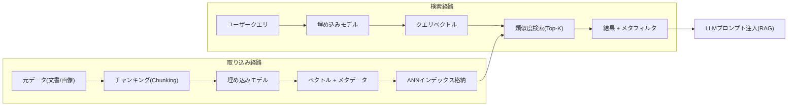
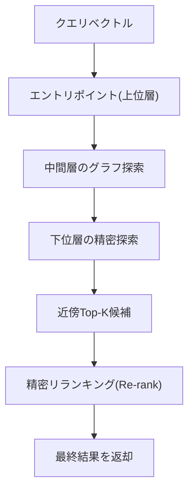

# ベクトルデータベース(Vector Database)

## 1. 概要

> **ベクトルデータベース**とは、テキスト・画像・音声などの非構造化データを埋め込み(Embedding)モデルで変換した高次元ベクトルを格納し、クエリベクトルとの**意味的類似度(Similarity)** を近似最近傍(ANN, Approximate Nearest Neighbor)探索によって高速に見つけて返すデータ管理システムである。

従来のリレーショナルデータベースは、値の**完全一致(Exact Match)** や範囲条件に最適化されており、「この文と意味が似ている文書を探せ」といったクエリを処理できない。しかし生成AIと検索拡張生成(RAG)が普及するにつれ、自然言語の質問の*意味*に近い知識をリアルタイムに検索し、LLMのプロンプトに注入する必要性が急増した。このとき文書・画像を数百〜数千次元のベクトルで表現すれば、「意味が近いもの」がそのまま「ベクトル空間上で距離が近いもの」となるため、大規模ベクトルに対する高速な類似度検索エンジンが必要になった。ベクトルデータベースは、まさにこの空白を埋めるために登場した。

ベクトルデータベースの中核的な価値は3つある。第一に、**意味ベースの検索**により、キーワードが完全に一致しなくても文脈的に関連する結果を見つける。第二に、数億件規模のベクトルでもミリ秒単位で応答できるよう、**ANNインデックス**によって精度とレイテンシのバランスを調整する。第三に、RAG・レコメンデーション・異常検知・重複排除など、多様なAIパイプラインの**知識ストア(Knowledge Store)** としての役割を果たす。

## 2. 動作原理および全体構造

ベクトルデータベースは、元データを埋め込みに変換する**取り込み(Ingestion)** 経路と、クエリをベクトル化して類似ベクトルを探す**検索(Query)** 経路に分かれる。取り込み段階では、文書を適切なサイズに分割(Chunking)した後に埋め込みモデルでベクトル化し、ベクトルと原文・メタデータを併せてインデックスに格納する。検索段階では、ユーザーのクエリを同じ埋め込みモデルでベクトル化し、ANNインデックスを探索して上位K個(Top-K)の類似ベクトルを取得する。

ここで重要な原理は、**取り込みと検索で同一の埋め込みモデルを使用**しなければならないという点である。異なるモデルで作ったベクトルは座標系が異なり、距離の比較が無意味になるためである。したがって埋め込みモデルを交換すると、格納済みのベクトル全体を再計算(Re-indexing)する必要があり、これは運用上の大きなコスト要因となる。

### A. 類似度の測定方式

類似度はベクトル間の距離として定義される。代表的なものとして、2つのベクトルがなす角度のコサインを見る**コサイン類似度**、ベクトルの内積をそのまま用いる**内積(Dot Product)**、座標間の直線距離を見る**ユークリッド距離(L2)** がある。文書検索のようにベクトルの方向(意味)が重要で、大きさ(文書の長さ)の影響を減らしたい場合には、コサイン類似度が広く用いられる。埋め込みを正規化すればコサイン類似度と内積は事実上同一になるため、大規模サービスでは計算が単純な内積が好まれることもある。

| 測定方式 | 計算の概念 | 主な用途 | 特徴 |
|---|---|---|---|
| コサイン類似度 | ベクトル方向の角度 | 文書/文検索 | 大きさの影響を排除、方向重視 |
| 内積(Dot) | ベクトル内積 | レコメンデーション、正規化埋め込み | 計算が単純、大きさを反映 |
| ユークリッド(L2) | 直線距離 | 画像/座標 | 絶対距離に敏感 |

### B. ANNインデックスアルゴリズム

数億個のベクトルをすべて比較する全探索(Brute-force)は正確だが遅い。そこで、わずかな精度を犠牲にする代わりに速度を劇的に高めるANNインデックスを用いる。代表的なアルゴリズムは、グラフベースの**HNSW(Hierarchical Navigable Small World)**、クラスタ分割ベースの**IVF(Inverted File)**、ベクトルを圧縮してメモリを節約する**PQ(Product Quantization)** である。HNSWは階層的なグラフをたどって近傍を探索し、高い再現率と低いレイテンシを同時に達成するため事実上の業界標準となったが、メモリ使用量が大きいという欠点がある。IVFはベクトル空間を複数のセルに分割し、クエリに近い一部のセルのみを探索するため大容量に有利であり、PQと組み合わせる(IVF-PQ)とメモリを大幅に削減できるため、超大規模サービスで好まれる。

このとき、精度(再現率)と速度・メモリはトレードオフの関係にある。HNSWの`ef_search`(探索幅)を大きくすれば再現率は上がるがレイテンシが増え、IVFの探索セル数(`nprobe`)を増やしても同様である。実務では目標SLA(例: p99 50ms、再現率95%)を定めたうえでパラメータをチューニングする。

### C. メタデータフィルタリングとハイブリッド検索

実際のサービスでは、「2024年以降に作成された、セキュリティカテゴリの文書のうち意味が類似するもの」のように、ベクトル類似度と構造化条件を併せて指定する必要がある。そのため、ベクトルとともに格納したメタデータによって**事前/事後フィルタリング(Pre/Post-filtering)** を行う。さらに、キーワードの完全一致に強い**スパース検索(BM25など)** と、意味検索に強い**密ベクトル検索**を組み合わせた**ハイブリッド検索**が最近の標準として定着しつつある。固有名詞・コード・数値のように埋め込みが苦手とする部分を、キーワード検索が補完するためである。

## 3. 構築タイプの比較

ベクトル検索は、専用エンジンとして構築することも、既存データベースの拡張機能として実装することもできる。専用ベクトルDB(例: Pinecone, Milvus, Weaviate, Qdrant)は大規模処理と多様なインデックス・フィルタ機能に強みがあるが、システムが1つ増えるため運用の複雑さが増す。逆にリレーショナルDBの拡張(PostgreSQLのpgvectorなど)は、既存データとトランザクション・結合を併用できるため導入の障壁が低いが、超大規模・超低レイテンシの要求では専用エンジンに劣る場合がある。したがって、データ規模、既存スタック、チームの能力を総合的に考慮して選択しなければならない。

| 区分 | 専用ベクトルDB | RDB拡張(pgvectorなど) | 検索エンジン統合(Elasticsearchなど) |
|---|---|---|---|
| 強み | 超大規模・多様なANN | 既存データとの統合・結合 | キーワード+ベクトルのハイブリッド |
| 弱み | 別途の運用負担 | 超大規模での性能限界 | ベクトル機能は相対的に後発 |
| 適した状況 | 数億ベクトルのAIサービス | 中小規模・トランザクション併用 | 既存検索資産の再利用 |

例えば社内規程文書数万件を対象とするRAGチャットボットであれば、pgvectorから始めて運用を単純化する方が合理的であるが、数億件の商品・レビューを扱うコマースのレコメンデーションであれば、IVF-PQベースの専用エンジンでメモリとレイテンシを制御する方がよい。

## 4. 深掘り — RAG品質と最新動向

ベクトルデータベースの成否は、そのままRAGの回答品質に直結する。検索が不十分であればLLMが根拠のない回答を生成(ハルシネーション)するため、チャンキング戦略(段落・意味単位の分割)、埋め込みモデルの選択(ドメイン適合性)、Top-Kの件数、そして取得した候補を並べ直す**リランキング(Re-ranking)** モデルの組み合わせが重要である。最近では、複数の文を圧縮した単一ベクトルが情報を失う問題を補うため、トークン単位の複数ベクトルで精度を高める**ColBERT型の後期相互作用(Late Interaction)** 手法や、要約で検索して原文を返す多段階検索戦略が注目されている。また、埋め込み次元を状況に応じて切り詰めて使う**Matryoshka埋め込み**は、格納コストと精度を柔軟に調整する手段として広がりつつある。標準化の面では、pgvectorが事実上のオープン標準として定着し、主要クラウドのマネージドDBに幅広く搭載される流れが鮮明である。

## 5. 考慮事項および示唆

技術士の観点では、ベクトルデータベースの導入は単なるストレージの選択ではなく、AIサービスアーキテクチャ全体のトレードオフを調整する意思決定である。

- **精度-性能-コストの三角トレードオフ**: HNSW/IVFのパラメータ、ベクトル次元、量子化レベルは、再現率・レイテンシ・メモリを同時に左右する。目標SLAと予算をまず定義し、ベンチマークから逆算するのが望ましい。
- **埋め込みモデルへの依存と再インデックス戦略**: モデルの交換は全ベクトルの再計算を引き起こすため、無停止の再インデックス(Blue-Green Index)とバージョン管理体系を事前に設計しなければならない。
- **データガバナンス・セキュリティ**: 原文と埋め込みに個人情報が含まれる可能性があり、埋め込み逆推定(Embedding Inversion)によって原文が一部復元される危険もあるため、アクセス制御・暗号化・マスキングをベクトル層まで拡張しなければならない。
- **ハイブリッド・リランキングの併用**: 純粋なベクトル検索だけでは固有名詞・数値に弱いため、キーワード検索とリランキングモデルを組み合わせてRAG品質を確保する。
- **運用の可観測性**: 再現率・レイテンシ・インデックスの鮮度(Freshness)を指標化してオブザーバビリティ体系で常時監視し、データ増加に備えたシャーディング・水平スケール戦略を併せて用意しなければならない。

今後、ベクトル検索はRDB・検索エンジンに基本機能として吸収され、「特殊なシステム」から「普遍的な機能」へと成熟する見通しであり、マルチモーダル埋め込みとエージェント型検索の普及によって、その重要性はさらに高まるであろう。

## 参考資料
- pgvector プロジェクト, https://github.com/pgvector/pgvector
- Malkov & Yashunin, "Efficient and robust approximate nearest neighbor search using HNSW", https://arxiv.org/abs/1603.09320

---
> **一言まとめ**: ベクトルデータベースは、埋め込まれた高次元ベクトルをANNインデックスで高速に類似度検索し、RAG・レコメンデーション・異常検知の意味ベースの知識ストアとして機能するものであり、精度・性能・コストのトレードオフ調整が核心である。
