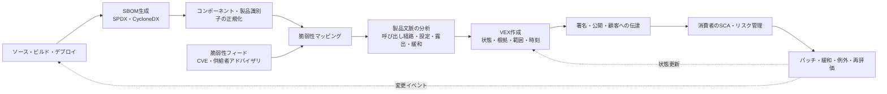
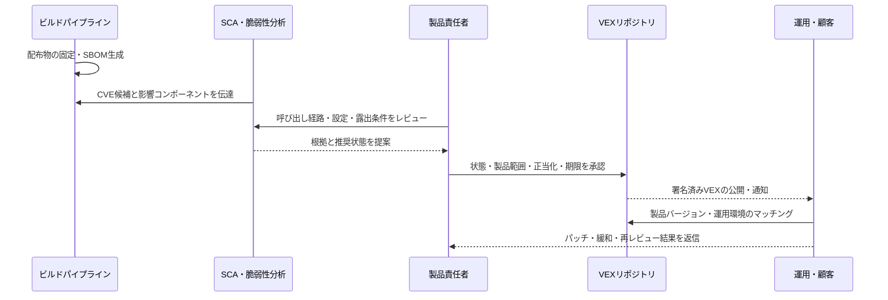

# VEX(Vulnerability Exploitability eXchange)に基づくSBOM脆弱性影響分析とサプライチェーン対応

## 1. 概要

### A. 定義

> VEX(Vulnerability Exploitability eXchange)とは、特定のソフトウェア製品と脆弱性の関係を、供給者が機械可読な状態値と根拠によって宣言し、当該脆弱性が製品に影響を与えるか、どのような措置が必要かを伝達するセキュリティアドバイザリ(advisory)形式である。

現代のソフトウェアは、自ら作成したコードよりも、オペレーティングシステム、オープンソースライブラリ、コンテナイメージ、ビルドプラグイン、モデルランタイムといった外部コンポーネントの比重が大きい場合が多い。新たなCVEが公開されると、SCAツールはSBOMと脆弱性データベースを突き合わせて潜在的なアラートを生成する。しかし、コンポーネントが存在するという事実は、脆弱なコードパスが実際の製品で実行されるという事実とは異なる。

例えば、製品に画像変換ライブラリが含まれていても、脆弱なパーサが無効化されていたり、攻撃者が到達できないサーバ側の機能でのみ使われていたりすることがある。逆に、ランタイム設定によって普段は見えなかったプラグインが外部入力を処理するならば、バージョン番号だけでは十分な判断を下すことはできない。VEXはこのギャップを、「コンポーネントが存在するか」から「この製品の文脈において脆弱性がどのような状態にあるか」へと拡張する。

CISAはVEXを、製品が既知の脆弱性の影響を受けるかどうかを示すセキュリティアドバイザリとして説明し、SBOMと併用すれば脆弱性の実際の影響をより迅速に評価できると提示している([CISA SBOM](https://www.cisa.gov/sbom))。したがって、VEXはSBOMを置き換えるリストではなく、SBOM・脆弱性情報・製品分析結果を結びつける影響判断のレイヤである。

### B. 登場背景と必要性

第一に、脆弱性アラートの規模が手作業によるレビュー能力を超えた。一つの製品が数百の推移的依存関係を持つと、公開された一つの脆弱性が複数のバージョンやディストリビューションにまたがって繰り返しアラートとして現れる。すべてのアラートを同じ緊急度で処理すれば、セキュリティチームは実際にインターネットに露出した脆弱性よりも、悪用不可能なアラートに多くの時間を費やすことになる。

第二に、ソフトウェアサプライチェーンは一つの組織の境界を越える。オープンソースプロジェクトはライブラリの脆弱性を知っていても、そのライブラリを含む最終製品の実際の呼び出し経路を知ることは難しい。製品供給者は自らのビルド・設定・呼び出し構造を分析できるため、下位コンポーネントの脆弱性が完成品に与える影響を製品単位で説明しなければならない。

第三に、顧客は「CVEがある」というリストよりも、「自社製品を今どのように運用すべきか」を必要としている。影響を受けるならパッチや緩和策が必要であり、影響を受けないならその判断根拠と再レビューの条件が必要である。VEXはこの決定を、人が読める説明とツールが処理する状態値の両方で同時に伝達する。

### C. 目標と非目標

VEXの目標は、脆弱性ごとの製品影響状態を信頼できる識別子と根拠で表現し、供給者・運用者・監査人が同じ事実を再利用できるようにすることである。この目標を達成するには、製品のバージョン範囲、脆弱性識別子、状態変更時刻、作成主体、調査根拠が互いに追跡可能でなければならない。

一方でVEXは、脆弱性の存在を隠すための免罪符ではない。「NOT AFFECTED」と表示するには、製品構成、呼び出し可能性、緩和統制といった根拠が必要であり、その根拠が変われば状態を再評価しなければならない。また、VEXはパッチ管理システムやリスク受容の決裁を自動的に代替するものではない。

## 2. 中核概念と全体構造

### A. SBOM・脆弱性情報・VEXの関係

SBOMは、製品を構成するコンポーネントと依存関係を説明する。脆弱性データは、特定のコンポーネントやコードに既知の欠陥が存在するという事実、深刻度、影響を受けるバージョンと修正バージョンを説明する。VEXは、この二つの情報を製品の実際のビルド・設定・実行文脈に当てはめた上で、製品レベルの影響状態を宣言する。

この三つのレイヤを分離してこそ責任が明確になる。SBOMが欠落していれば何を評価すべきかが分からず、脆弱性情報が古ければリスクシグナルが遅れる。VEX分析がなければすべての潜在アラートが同じに見え、VEXの根拠がなければ消費者は供給者の宣言を検証できない。

| レイヤ | 中核となる問い | 代表的な成果物 | 主な責任 |
|---|---|---|---|
| 構成の透明性 | 製品に何が含まれているか? | SBOM、依存関係、ハッシュ | ビルド・製品供給者 |
| 脆弱性の知識 | どの欠陥がどのバージョンに存在するか? | CVE、CWE、CVSS、修正バージョン | 脆弱性機関・供給者 |
| 影響判断 | この製品で実際に影響を受けるか? | VEX statement、状態の根拠 | 製品供給者・運用者 |
| 対応の実行 | 何をいつ措置するか? | チケット、パッチ、緩和、例外承認 | サービス運用・リスクオーナー |

この関係においてVEXを単なる「脆弱性リストのフィルタ」とみなしてはならない。フィルタはアラートを消すことはできるが、VEXはなぜそのアラートを減らしたのか、どの製品範囲に適用されるのかを記録として残す。したがってVEXは、脆弱性管理のエビデンスであり、サプライチェーンにおけるコミュニケーションの契約として機能する。

### B. VEX参照アーキテクチャ

上記構造の中心は製品文脈の分析である。SBOMと脆弱性データの単純な結合は「可能性のある候補」を生み出すにすぎず、実際のVEX状態は製品のコードパスとデプロイ条件を確認した上で決定しなければならない。同じライブラリバージョンであっても、機能フラグ、コンパイルオプション、オペレーティングシステムのパッチ、ネットワーク露出によって影響は異なり得る。

### C. 製品と脆弱性の関係を表現するstatement

VEXの基本単位は、特定の製品、特定の脆弱性、状態、そしてその判断を下した主体と時点の組み合わせである。製品は名前だけでなく、バージョン、パッケージURL(PURL)、ハッシュ、供給者識別子など、消費者が同一の対象を特定できる識別子を使用しなければならない。脆弱性もCVEだけに依存せず、供給者のアドバイザリIDや他の標準識別子を併用することができる。

一つの文書が複数のstatementを含むことはできるが、各statementの適用範囲は曖昧であってはならない。「製品全体が安全である」のような範囲の広い文よりも、「製品4.2.1の特定構成においてCVE-XXXXはNOT AFFECTED」のように製品・バージョン・脆弱性の交差点を明示する方が、検証と自動化に有利である。

statementにおいては、状態と同じくらい時間性が重要である。製品が再ビルドされたり設定が変わったりすれば、以前のNOT AFFECTEDの判断はもはや正しくない可能性がある。したがって、文書の発行日、修正日、状態の有効範囲、次回再レビューの条件を管理し、同一製品に対する最新文書がどれかを消費者が判断できるようにしなければならない。

## 3. 状態の意味とデータモデル

### A. 四つの中核状態

CISAが整理した代表的な状態は、NOT AFFECTED、AFFECTED、FIXED、UNDER INVESTIGATIONである([CISA VEX Use Cases](https://www.cisa.gov/sites/default/files/publications/VEX_Use_Cases_Document_508c.pdf))。状態名の綴りをそのまま保存することよりも、組織のツールがその状態をどのような措置に結びつけるかまで定義しなければならない。

| 状態 | 意味 | 基本措置 | 誤った使い方 |
|---|---|---|---|
| NOT AFFECTED | 製品の文脈において脆弱性の影響を受けない | アラートをクローズするが根拠・再評価条件を保存 | 根拠なしにアラートを削除 |
| AFFECTED | 脆弱性が製品に影響を与え、措置が必要 | パッチ・アップグレード・緩和・露出遮断 | CVSSだけを見て製品への影響を断定 |
| FIXED | 当該製品バージョンまたはビルドに修正が反映済み | 修正バージョンをデプロイし旧バージョンを終了 | ソースの修正のみで配布物を未検証 |
| UNDER INVESTIGATION | 影響の有無をまだ確定できていない | 調査期限・暫定緩和・追跡チケットを設定 | 調査中の状態を長期的なクローズとして使用 |

NOT AFFECTEDは「脆弱性が存在しない」とは異なる。脆弱なコンポーネントがSBOMに存在していても、製品が当該関数や脆弱な経路を使用していないという意味であり得る。逆にAFFECTEDは、必ずしもリモートコード実行が確認されたという意味ではなく、製品の条件において影響の可能性があり対応が必要であるという判断である。

FIXEDも、製品が永遠に安全であることの保証ではない。修正バージョンが新たな脆弱性を含む可能性があり、顧客が脆弱な旧イメージやキャッシュをデプロイし続ける可能性もある。したがって、修正状態は製品のリリース識別子とデプロイ検証結果に結びつけなければならない。

UNDER INVESTIGATIONはリスクを隠す状態ではなく、不確実性を明示する状態である。消費者はこの状態に遭遇したら、深刻度、外部露出、悪用の兆候を基準に暫定的な緩和や隔離を適用しなければならない。供給者は、調査完了の目標日と後続文書の発行条件を提示すべきである。

### B. NOT AFFECTEDの正当化

NOT AFFECTEDの品質は、状態名よりも正当化理由にかかっている。脆弱なコードを製品に含めていない場合、影響を受けないバージョンのみでビルドしている場合、脆弱な機能をコンパイル・設定から除外している場合、当該コードに到達できない構造である場合とでは、それぞれ異なる統制と再レビュー条件が必要となる。

代表的な正当化の観点は次のとおりである。

1. **コンポーネントの不在**: 製品SBOMの実際の配布成果物に脆弱なコンポーネントが存在しない。
2. **脆弱な機能の未使用**: コンポーネントは存在するが、脆弱な関数・モジュール・プロトコルがビルドやランタイムで使用されない。
3. **到達不能**: 攻撃者が脆弱なコードパスに入力を渡せないよう、権限・ネットワーク・呼び出し構造が制限されている。
4. **緩和策の適用**: パッチでなくとも、設定、サンドボックス、入力検証、隔離といった統制が脆弱性の影響を除去するか、許容可能な水準まで低減している。
5. **影響範囲の不一致**: 脆弱性が要求するオペレーティングシステム・アーキテクチャ・ビルドオプションが製品環境と異なる。

正当化は「開発者が確認した」程度で終わらせず、分析ツールのバージョン、テスト結果、コードパス、設定ファイル、製品バージョンといった証拠を参照しなければならない。また、緩和策に依存するNOT AFFECTEDは、緩和統制が除去されたり設定が変わったりしたときに自動的に再レビューされるよう、イベントを連携させる必要がある。

### C. 最小データ要素

CISAの2023年の最小要件文書は、VEXの形式や実装に依存せず、文書メタデータ、製品情報、脆弱性情報、製品状態を定義している([CISA Minimum Requirements for VEX](https://www.cisa.gov/sites/default/files/2023-04/minimum-requirements-for-vex-508c.pdf))。組織はこの最小要素に内部統制・署名・根拠のフィールドを追加しつつも、相互運用性のために中核的な意味を勝手に変えてはならない。

文書メタデータには、形式識別子、文書識別子、作成者とその役割、タイムスタンプ、文書バージョンが含まれる。製品情報には、供給者・製品名・バージョンだけでなく、可能であればPURL、CPE、ハッシュ、製品ファミリーと下位コンポーネントの識別子を含めて対象の曖昧さを減らす。

脆弱性情報には、CVEまたは供給者の脆弱性ID、脆弱性の説明、関連参考資料が含まれる。製品状態には四つの状態のいずれかと状態が適用される製品範囲が含まれ、状態を決定した根拠と推奨措置が併せて記載されてこそ、消費者は自動化と人によるレビューの両方を実施できる。

| データ領域 | 必ず答えるべき問い | 運用上補強すべき情報 |
|---|---|---|
| 文書メタデータ | 誰がいつどの文書を作成したか? | 署名、ツールバージョン、文書の廃止・置換関係 |
| 製品 | どの製品・バージョン・ビルドに適用されるか? | PURL、ハッシュ、配布チャネル、環境プロファイル |
| 脆弱性 | どの欠陥を評価したか? | CVE・供給者ID・CVSS・悪用情報 |
| 状態 | 影響を受けるか、修正済みか? | 正当化、緩和、SLA、再レビュー条件 |
| 追跡性 | どのような根拠で判断したか? | テスト・コード分析・承認チケット・監査ログ |

## 4. フォーマット・標準・相互運用性

### A. フォーマットは表現方式であり、意味は分離すべきである

VEXは一つのファイルフォーマットだけを意味するものではない。同じ製品影響状態を、CSAF VEXプロファイル、OpenVEX、CycloneDX、SPDX Security Profileなどで表現できる。したがって、特定ツールのJSONスキーマに依存する前に、製品・脆弱性・状態・根拠という意味モデルを組織内部で定義しなければならない。

OpenVEXは、VEXの最小要件を満たすよう設計された軽量で埋め込み可能な実装であり、statementを製品・脆弱性・状態の組み合わせとして扱う([OpenVEX specification](https://github.com/openvex/spec/blob/main/OPENVEX-SPEC.md))。ただし、公式リポジトリが明記しているとおり、仕様の成熟度とツールのサポート範囲を確認した上で運用標準として採用すべきである。

CycloneDXは、SBOMとサプライチェーン情報を併せて表現する拡張可能なモデルの中でVEX機能を提供し、脆弱性が特定の製品文脈において実際に悪用可能かどうかを伝達することに焦点を当てている([CycloneDX VEX](https://cyclonedx.org/capabilities/vex/))。SPDX 3系はSecurity Profileにおいて脆弱性と製品の影響・修正関係を表現できるため、既存のSPDX資産とVEXを統合しようとする組織が検討できる([SPDX Security](https://spdx.dev/learn/areas-of-interest/security/))。

CSAFは、セキュリティアドバイザリを交換するための標準化された文書構造とプロファイルを提供し、供給者が脆弱性の告知と製品状態を企業間で配布する際に適している。どのフォーマットを選ぶにしても、供給者・消費者のツールが同一の製品識別子と状態の意味を使用し、変換の過程で正当化や時間情報を失わないことが核心である。

### B. VEXの生成・消費パイプライン

生成段階では、ビルド成果物のハッシュとSBOMを併せて固定しなければならない。ソースリポジトリの依存関係宣言だけを見てVEXを作成すると、パッケージマネージャの解決結果、ビルドフラグ、コンテナレイヤ、オペレーティングシステムのパッケージが漏れる可能性がある。消費段階では、VEXが適用される製品識別子と現在のデプロイバージョンをまず照合し、一致しない文書を恣意的に適用してはならない。

署名は、文書が特定の供給者から発行され、伝送中に改ざんされていないことを確認するのに役立つ。しかし、署名は状態判断の正確性までは保証しない。消費者は署名検証とともに、発行主体の信頼ポリシー、文書の最新性、根拠の十分性、製品バージョンの範囲を評価しなければならない。

### C. 競合と優先順位

一つの製品に対して、オープンソースプロジェクト、オペレーティングシステム供給者、アプリケーション供給者がそれぞれ異なるVEXを発行することがある。このとき、最も広い範囲の「NOT AFFECTED」を無条件に優先するのは危険である。製品供給者が最終ビルド・設定まで把握しているならば最終製品のアドバイザリを優先しつつ、下位供給者の根拠と状態変更履歴も保存しなければならない。

組織は、文書の優先順位、製品識別子の一致条件、最新性の判断、競合発生時の手動レビュー手順をポリシーとして定める必要がある。例えば、製品ハッシュが一致する供給者の署名を最も高い信頼度とみなし、バージョン文字列のみが一致する外部の宣言は候補情報として扱うことができる。

## 5. 運用プロセスと実装戦略

### A. 検知から状態決定まで

1. **資産ベースラインの確定**: 現在運用中の製品・バージョン・デプロイイメージ・設定プロファイルを識別する。
2. **SBOMの確保**: ビルド時に生成したSBOMを配布物のハッシュと結びつけ、推移的依存関係とオペレーティングシステムのパッケージを含める。
3. **脆弱性候補の生成**: CVE、供給者アドバイザリ、悪用の兆候、内部テスト結果を候補として収集する。
4. **影響範囲のマッピング**: 脆弱なコンポーネントが実際に製品に含まれているか、そのバージョン範囲を確認する。
5. **製品文脈の分析**: 脆弱な関数の呼び出し、入力の到達可能性、権限、ネットワーク露出、緩和統制をレビューする。
6. **状態と措置の決定**: 四つの状態のいずれかを選択し、パッチ・緩和・調査期限を決定する。
7. **承認と発行**: 製品セキュリティ責任者が根拠をレビューし、署名可能なVEXを発行する。
8. **消費者への通知と再評価**: 顧客・運用システムに伝達し、新たなビルド・設定・脆弱性情報が届けば再評価する。

各段階の成果物を連携させてこそ、監査において「なぜこの脆弱性をクローズしたのか」を説明できる。特に、状態決定の前に製品のデプロイバージョンを固定しなければ、テストしたコードと顧客が実行したコードが異なる可能性がある。技術士の観点では、VEXを文書作成業務ではなく、DevSecOpsの意思決定フローとして設計することが核心である。

### B. 自動化と人によるレビューの分担

自動化に適した領域は、SBOM生成、PURLの正規化、脆弱性候補のマッチング、同一文書の配布、署名検証、状態変更の通知である。一方、呼び出し経路の実質的な到達可能性、業務への影響、補完的統制、リスク受容は、静的解析の結果だけでは確定しにくく、人によるレビューが必要である。

ツールが「使用されていないコード」と表示したからといって即座にNOT AFFECTEDと決定せず、ランタイムプラグイン・リフレクション・動的ロード・スクリプト拡張といった迂回経路を確認しなければならない。自動化とは判断者を排除することではなく、反復作業を減らし、判断者が根拠を必要とする部分に集中できるようにする方式であるべきである。

運用プラットフォームでは、VEXの状態を脆弱性チケットのエビデンスとして表示しつつ、原本文書と署名検証結果を併せて保管する。状態がFIXEDに変わればパッチチケットが自動生成され、NOT AFFECTEDの根拠が期限切れになればUNDER INVESTIGATIONに戻すといったポリシーも設計できる。

### C. 指標とサービスレベル

VEX導入の成果を発行文書数だけで評価すると、形式だけが増える恐れがある。次のような指標を製品リスクと併せて管理するのが適切である。

| 指標 | 意味 | 解釈時の注意点 |
|---|---|---|
| アラートから状態決定までの時間 | 調査・判断の迅速性 | すべてのアラートを速くクローズすることが目標ではない |
| 根拠を含む状態の比率 | 宣言の説明可能性 | テンプレートのコピーよりも証拠リンクの有効性を点検 |
| 適用製品の識別成功率 | 消費者が文書を自動照合できる度合い | バージョン名だけで照合すると誤検知の可能性 |
| AFFECTEDの措置完了率 | 実際のリスク低減 | 緩和のみでパッチが遅延していないかを確認 |
| 長期化したUNDER INVESTIGATIONの比率 | 不確実性の蓄積 | 期限・オーナー・暫定統制を結びつける必要 |
| VEX更新の漏れ率 | 変更イベントへの対応水準 | リリース・設定・新規CVEイベントと照合 |

サービスレベルは、脆弱性の深刻度と外部露出を基準に差別化する。インターネットに露出した認証回避の脆弱性には短い調査・緩和目標を課し、内部のバッチ処理でのみアクセス可能な低リスク項目は、分析根拠を残しつつ一定の処理時間を許容することができる。重要なのは、状態値が対応の優先順位と実際のチケットにつながることである。

## 6. 比較と適用事例

### A. SBOM・VEX・SCA・CSAFの比較

SBOMは構成の透明性、SCAはコンポーネントと脆弱性の自動照合、VEXは製品文脈における影響状態、CSAFはセキュリティアドバイザリ交換の構造を中心とする。これらを互いに代替する関係として配置すると、あるレイヤの不足を他のレイヤが補えなくなる。

| 区分 | SBOM | SCA | VEX | CSAF |
|---|---|---|---|---|
| 主な目的 | コンポーネントと関係の公開 | 候補脆弱性の検知・優先順位付け | 製品影響状態と根拠の伝達 | アドバイザリ文書交換の標準 |
| 問い | 何が含まれているか? | どの脆弱性と一致するか? | 実際の製品に影響を与えるか? | アドバイザリをどう配布・解釈するか? |
| 主な成果物 | SPDX・CycloneDX文書 | アラート・チケット・レポート | 状態statement | CSAF文書・プロファイル |
| 限界 | 影響の有無を断定できない | コードの到達可能性と業務文脈が不足 | 正確なSBOM・根拠が必要 | 製品分析自体は行わない |

例えば、SCAがLog4jのCVEを発見するとアラートを生成するが、VEXは製品が当該JNDI機能を使用していないのか、あるいはパッチ適用済みの配布版なのかを説明する。逆に、VEXがAFFECTEDを発行したならば、SCAアラートの優先順位とパッチチケットが実際の措置につながらなければならない。

### B. 事例1: 商用SaaS供給者

商用SaaS供給者が毎週コンテナイメージをビルドすると仮定する。ビルドごとにイメージダイジェストとSBOMを保存し、新たなCVEが公開されると、SCAが影響を受ける可能性のあるイメージとパッケージを探す。製品セキュリティチームは、運用設定、ネットワーク経路、呼び出しテストを確認してVEXを作成し、顧客ポータルに最新文書を公開する。

このとき顧客は、イメージタグではなくダイジェストと製品リリース識別子を基準にVEXを照合しなければならない。イメージタグが再利用されると、「FIXED」の文書が旧イメージに誤って適用される恐れがある。供給者は新しいイメージがデプロイされたら以前のVEXの適用範囲を終了し、顧客に置き換え対象と期限を通知しなければならない。

### C. 事例2: 金融機関の内部オープンソースプラットフォーム

金融機関が共通のJavaプラットフォームを複数のグループ会社のサービスに展開しているとしよう。同じライブラリを使用していても、サービスごとに公開API、ネットワーク経路、有効化されたモジュールが異なる。中央のセキュリティチームが一つのVEXをすべてのサービスに強制すると、特定サービスの実際の露出を見落とす恐れがある。

したがって、中央プラットフォームは共通コンポーネント・パッチ情報と基本分析を提供し、各サービスオーナーは自らの実行プロファイルに関する追加のstatementを作成する階層型モデルが適切である。「到達不能」の正当化は、サービスごとのAPI仕様やファイアウォール・権限設定が変わったときに自動的に再評価しなければならない。

### D. 事例3: 組込み・医療機器製品

組込み製品は現場に設置されたバージョンが長期間維持され、アップデートが規制上の承認や安全性試験と結びついていることがある。この場合、AFFECTEDの脆弱性を発見しても、即座にファームウェア全体を置き換えることは難しい。VEXは、影響を受けるモデルとファームウェアバージョンを区別し、パッチ適用までの間、無効化・ネットワーク隔離・ユーザへの案内といった緩和策を伝達する手段となる。

医療機器や産業機器では、NOT AFFECTEDの判断も安全機能と相互作用し得るため、セキュリティチーム単独の判断ではなく、製品安全・品質・規制担当者の承認を含めなければならない。状態文書は製品ライフサイクル全体にわたって維持されるべきであり、販売終了モデルだからといって顧客に必要なセキュリティ情報を削除してはならない。

## 7. 深掘り: 最新動向と出題との関連

### A. SBOMの消費中心から証拠に基づくリスク管理へ

CISAのSBOM資料は、SBOMがコンポーネントリストを提供し、VEXがそのリストに対する脆弱性影響の文脈を補完すると説明している([CISA SBOM FAQ](https://www.cisa.gov/sites/default/files/2024-07/SBOM%20FAQ%202024.pdf))。最近の実務の方向性は、SBOMを提出して終わるのではなく、供給者と消費者が同一の識別子・状態・根拠を自動的に交換する方向へと移行している。

NISTのソフトウェアサプライチェーンに関するガイダンスも、供給者が脆弱性の影響情報を自動化された機械可読なアドバイザリ形式で提供できるべきだという方向性を示している([NIST Software Security in Supply Chains](https://www.nist.gov/itl/executive-order-14028-improving-nations-cybersecurity/software-supply-chain-security-guidance-23))。したがって技術士は、VEXを一つのツールの機能ではなく、調達要件、製品セキュリティポリシー、インシデント対応、供給者契約をつなぐガバナンス要素として論述することができる。

### B. 想定される答案構成と関連テーマ

試験の答案で「SBOMはリスト、VEXは影響状態」という対比だけを書くのは浅い。良い答案は、構成の透明性の限界、製品文脈の分析、状態の正当化、フォーマットの相互運用性、署名・監査、自動化と人によるレビューの境界を順に提示する。最後に、VEXが誤っていたり更新が遅れたりした場合のサプライチェーンリスクと、それを低減する実行戦略を技術士の観点から結びつけなければならない。

関連付けられるテーマは、SBOM・SCA・DevSecOps・CSAF・ゼロトラスト・ソフトウェアサプライチェーンセキュリティ・脆弱性管理・調達セキュリティである。特に、VEXはSBOMと重複するものではなく、SBOMの「構成の事実」を製品の「影響判断」へと変換するレイヤであることを強調すれば、概念間の関係が鮮明になる。

## 8. 考慮事項および示唆点

### A. 識別子の整合性

製品名とバージョン文字列は組織ごとに異なる表記をされ得るため、PURL、ハッシュ、CPE、供給者識別子を併せて管理する。識別子がずれると、正しいVEXであっても消費者のSCAと照合されず、アラートが残ったり誤ってクローズされたりする。識別子の標準化は技術的な問題ではなく、供給者契約とリリース管理ポリシーの一部である。

### B. 根拠と説明可能性

NOT AFFECTEDとFIXEDは特に根拠が重要である。コード分析結果、テストケース、設定、パッチコミット、デプロイイメージのダイジェストを監査可能なリンクとして残し、根拠が失われないよう保存ポリシーを設ける。根拠のない状態の自動クローズは短期的な指標を改善するが、長期的な信頼を損なう。

### C. 最新性・ライフサイクル

VEXは発行後も、製品リリース、設定、新たな悪用情報、脆弱性情報の訂正に応じて変わり得る。文書の発行日と修正日だけでなく、適用製品範囲、置換文書、失効条件を管理し、長期化したUNDER INVESTIGATIONを自動的に警告する。販売終了製品についても、サポート契約と規制要件に合わせて文書の保存と通知を設計しなければならない。

### D. 供給者と消費者の責任分離

供給者は製品文脈の分析と正確な状態宣言に責任を持ち、消費者は自らのデプロイ設定と露出条件に責任を持つ。供給者のVEXがNOT AFFECTEDであっても、消費者が脆弱な別のパッケージやカスタム設定を追加したならば、その判断をそのまま拡張することはできない。契約書には、文書形式・提出時期・状態変更の通知・インシデント時の協力範囲を明記する。

### E. セキュリティと信頼

VEXリポジトリはサプライチェーンセキュリティの中核資産であるため、文書の改ざん・リプレイ攻撃・権限の濫用から防御しなければならない。署名、伝送の暗号化、アクセス制御、文書バージョン、廃止・置換の履歴、監査ログを適用しつつ、公開VEXには不要な内部パスや機微な運用情報を露出させない。

### F. 自動化の限界

静的解析を通過したからといって、動的ロード・リフレクション・プラグイン・運用者の設定まで安全であると断定することはできない。自動化は候補の生成と反復的な照合に優先的に用い、製品の業務文脈と攻撃の到達可能性は、セキュリティ・開発・運用担当者のレビューで補完する。状態を自動的にクローズするポリシーには、例外条件と定期的なサンプル監査を設ける。

### G. リスクベースの優先順位付け

CVSSスコアだけで対応順序を決めると、資産の重要度と実際の露出を見落とす可能性がある。インターネット露出、認証の要否、悪用コードの公開、データの機微性、緩和の可能性、復旧コストを併せて評価し、VEXの状態をチケットの優先順位と結びつける。VEXはリスクを消し去る文書ではなく、限られた対応リソースをより正確に配分するための判断材料である。

### H. 移行戦略

最初からすべての製品に完璧なVEXを求めるよりも、インターネットに露出した製品と中核的なサプライチェーンからベースラインを作る。ビルドパイプラインでSBOMを自動生成し、高深刻度のアラートについて根拠のあるVEXを試験的に発行した後、フォーマット・識別子・承認・SLAを標準化する。その後、調達や顧客ポータル、インシデント対応と連携させれば、文書が実際の運用価値へと転換される。

## 参考資料

1. [CISA Software Bill of Materials (SBOM)](https://www.cisa.gov/sbom)
2. [CISA Minimum Requirements for Vulnerability Exploitability eXchange (VEX)](https://www.cisa.gov/sites/default/files/2023-04/minimum-requirements-for-vex-508c.pdf)
3. [CISA Vulnerability Exploitability eXchange (VEX) – Use Cases](https://www.cisa.gov/sites/default/files/publications/VEX_Use_Cases_Document_508c.pdf)
4. [CISA SBOM FAQ 2024](https://www.cisa.gov/sites/default/files/2024-07/SBOM%20FAQ%202024.pdf)
5. [NIST Software Security in Supply Chains](https://www.nist.gov/itl/executive-order-14028-improving-nations-cybersecurity/software-supply-chain-security-guidance-23)
6. [OpenVEX Specification](https://github.com/openvex/spec/blob/main/OPENVEX-SPEC.md)
7. [CycloneDX VEX Capabilities](https://cyclonedx.org/capabilities/vex/)
8. [SPDX Security Profile](https://spdx.dev/learn/areas-of-interest/security/)

---

> **一言まとめ**: VEXは、SBOMが発見した脆弱性候補を製品・バージョン・実行文脈に当てはめ、NOT AFFECTED・AFFECTED・FIXED・UNDER INVESTIGATIONの状態と根拠として伝達し、サプライチェーンにおける検知・判断・対応・再評価を結びつける機械可読なセキュリティアドバイザリである。
