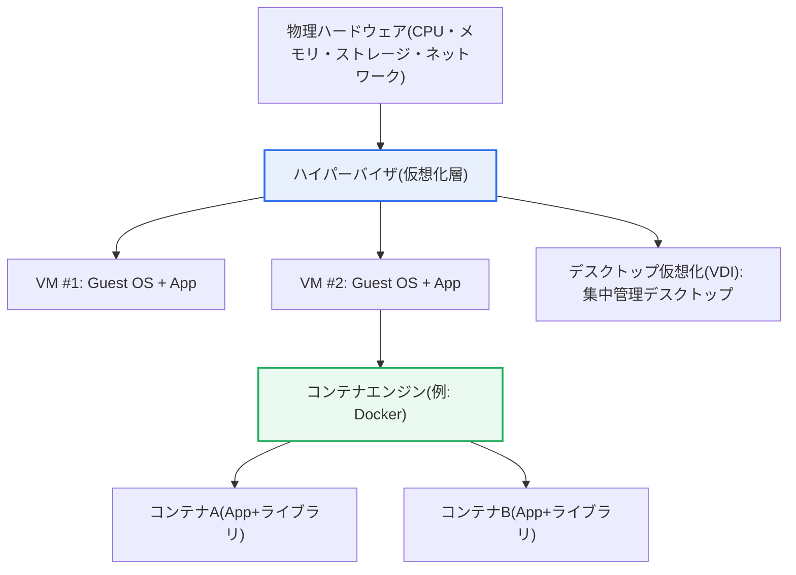
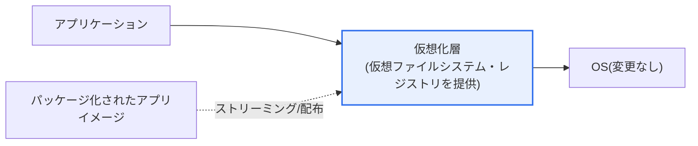

# 仮想化(Virtualization)

## 1. 概要

### A. 定義

> **仮想化**とは、物理リソース(CPU・メモリ・ストレージ・ネットワーク・OS・アプリケーション)を**論理的に抽象化し、1つの物理リソースを複数あるかのように分割して使ったり、複数の物理リソースを1つにまとめて使ったりできるように**する技術である。リソース使用率(utilization)を高め、必要に応じてリソースを即座に増やしたり移動したりできる柔軟な運用を可能にする。

仮想化の本質は、「**物理的な実体と論理的な利用を分離(decoupling)すること**」にある。従来の環境では、アプリケーションが特定のサーバ・OSに強く結び付いており、サーバ1台に1つのサービスを載せる方式が一般的であった。この場合、大半のサーバは平常時にリソースの10〜20%程度しか使わず、残りを遊ばせるという無駄が生じ、障害時に別のサーバへ移すことも困難であった。仮想化はこの物理的な従属を断ち切り、1台の物理サーバ上に複数の仮想サーバ(VM)を載せて遊休リソースを無駄なく分け合い、必要に応じてリソースを即座に再配分したり、別の物理サーバへ移動(ライブマイグレーション)したりできるようにする。

この抽象化はサーバに限定されない。アプリケーション・デスクトップ・ネットワーク・ストレージなど、ITスタックのさまざまな層でそれぞれ異なる方式によって行われる。例えばアプリケーション仮想化は、プログラムをOSに直接インストールせず隔離された実行環境で動かすことで、インストールの競合なくどこでも実行できるようにし、ネットワーク仮想化(SDN・NFV)は物理ネットワークの上にソフトウェアで定義された論理ネットワークを載せる。仮想化が重要である理由は、それが**クラウドコンピューティングの根幹技術**だからである。「必要な分だけ分けて使い、負荷に応じて柔軟に増やし、移す」というクラウドの弾力性(elasticity)は、根本的に仮想化のリソース分割・移動能力から出発している。

### B. 登場背景と必要性

仮想化が台頭した背景には、いくつかの構造的要因がある。第一に、**リソースの無駄の問題**である。サーバ1台に1サービスという方式は安定性はあるものの、リソース使用率が極めて低く、データセンターの規模が大きくなるほど電力・スペース・管理コストが指数関数的に増大した。仮想化は複数のワークロードを1台の物理サーバに高密度で集約(consolidation)し、この無駄を削減する。

第二に、**俊敏性(agility)への要求**である。事業環境が急速に変化するにつれ、新しいサーバ・環境を数週間ではなく数分で用意する必要性が高まった。物理サーバは調達・設置に時間がかかるが、仮想サーバはイメージの複製によって即座に生成・削除できるため、プロビジョニング速度を飛躍的に高めた。

第三に、**環境依存とインストール競合の問題**である。プログラムが特定のOS環境に強く結び付くと、「自分のPCでは動くのに、あのPCでは動かない」という移植性の問題が絶えず発生する。アプリケーション仮想化とコンテナは、実行環境そのものを一緒にパッケージングすることでこの問題を解決し、これがDevOps・クラウドネイティブの潮流の基盤となった。

### C. 一般的なOSにおけるプログラムの動作方式

仮想化の利点を理解するには、まず一般的なOSでプログラムがどのように動作するかと対比してみる必要がある。一般的なOSでは、プログラムはインストール過程でOSが管理するリソース(CPU・メモリ・ファイルシステム・レジストリ・ライブラリ)に直接結び付き、設定ファイルと共有ライブラリをシステムのあちこちに配置する。この方式は性能面では直接的であるが、プログラムがOS環境に強く結合するという根本的な限界を生む。

その結果、さまざまな問題が発生する。異なるプログラムが同じ共有ライブラリの別バージョンを要求すると競合が生じ(いわゆる「DLL地獄」)、あるプログラムのインストール・削除が別のプログラムの動作に影響を与え、特定のOSバージョン・設定でのみ動作するよう環境に依存して移植が難しくなる。また、削除後もレジストリ・設定の残骸が残り、システムが次第に乱雑になる。仮想化系の技術は、まさにこの「強い結合」を断ち切り、隔離・移植性・無競合を提供する方向へと発展した。

## 2. 仮想化の階層構造と類型

仮想化を理解する最良の枠組みは、「どの層を抽象化するか」である。以下の全体構造図は、物理ハードウェアの上に仮想化が適用される代表的な層(サーバ・デスクトップ・アプリケーション・コンテナ)を一目で示している。

上の構造において、ハイパーバイザは物理ハードウェアを複数のVMに分配する中核層であり、各VMは独立したゲストOSを持つ。コンテナはそれよりも上位の、OSカーネルを共有するより軽量な隔離単位である。このように仮想化は「どの層まで抽象化するか」によって隔離の強さと重さが変わる。以下の表は代表的な類型を整理したものである。

| 類型 | 抽象化対象 | 内容 | 代表例 |
|---|---|---|---|
| **サーバ仮想化** | ハードウェア/OS | ハイパーバイザにより物理サーバ上で多数のVMを稼働 | VMware ESXi, KVM, Hyper-V |
| **デスクトップ仮想化(VDI)** | デスクトップ環境 | 中央サーバでデスクトップを生成し端末に提供 | Citrix, VMware Horizon |
| **アプリケーション仮想化** | アプリケーション | プログラムを隔離環境でインストールせずに実行 | App-V, ThinApp |
| **コンテナ** | OSユーザー空間 | OSカーネル共有、軽量な隔離でアプリをパッケージング | Docker, containerd |

### A. サーバ仮想化とハイパーバイザ

サーバ仮想化は仮想化の原型であり、最も広く使われている形態である。中核要素である**ハイパーバイザ(VMM, Virtual Machine Monitor)** は、物理ハードウェアとゲストOSの間に位置し、CPU・メモリ・I/Oを複数のVMに分配・隔離する。ハイパーバイザは大きく2種類に分かれる。ハードウェア上で直接動作する**Type-1(ベアメタル)** は性能・安定性に優れ、サーバ・データセンターで使われ(例: ESXi, Xen, KVM)、既存のOS上でアプリケーションのように動作する**Type-2(ホスト型)** は、開発・テスト用のデスクトップ環境で利便性重視で使われる(例: VirtualBox, VMware Workstation)。

サーバ仮想化の実務的な価値は「集約による効率化」である。複数の低負荷サーバを少数の高性能物理サーバ上にVMとして集約すれば、物理サーバの台数が減り、電力・スペース・冷却・管理コストが大きく削減される。実際、データセンター統合プロジェクトでは、物理サーバに対するVM集約比率が数倍から十数倍に達することが珍しくなく、これはリソース使用率を平常時の10〜20%台からはるかに高い水準へ引き上げた結果である。

また、サーバ仮想化は運用の柔軟性を大きく高める。VMはファイル(イメージ)として存在するため、スナップショットで特定時点の状態を保存・復元し、ライブマイグレーションでサービスを停止せずに別の物理サーバへ移動し、障害時には自動的に別ノードで再起動(HA)できる。こうした能力が、そのままクラウドの自動スケーリング・自己修復機能の土台となる。

### B. アプリケーション仮想化

アプリケーション仮想化は、プログラムとOSの間に**仮想化層(隔離された実行環境)** を置き、プログラムがOSに直接インストールされることなく、この層の中で実行されるようにする。以下のプロセス詳細図はその動作原理を示している。

動作の核心は「仮想層がOSの代わりを務める」点にある。プログラムが必要とするファイル・レジストリ・設定を仮想化層が仮想的に提供するため、実際のOSはまったく変更されない。その結果、他のプログラムとのインストール競合がなく、1つのパッケージを複数のPCでインストールせずに実行でき、プログラムを削除してもOSに残骸が残らない。必要な部分だけをダウンロードして実行するストリーミング方式で配布すれば、大規模組織においてソフトウェアの配布・更新を中央で一括管理することも容易になる。

この技術の実務的な含意は「管理コストの削減」と「標準化」である。数千台の業務PCを運用する企業で、アプリケーションごとに個別のインストール・パッチ適用を行うことは莫大なコストを要する。アプリケーション仮想化を用いれば、標準化されたパッケージを中央から配布・回収できるため管理が単純になり、異なるバージョンのプログラムを競合なく1台のPCで同時に運用することもできる。以下の表は一般的な方式との違いを比較したものである。

| 区分 | 一般的な方式 | アプリケーション仮想化 |
|---|---|---|
| **インストール** | OSに直接インストール | 隔離環境で実行(インストール不要) |
| **競合** | ライブラリ・設定の競合(DLL地獄) | 隔離により競合なし |
| **移植性** | 環境に依存 | どこでも実行 |
| **管理** | 個別のインストール・パッチ | 中央での配布・回収、標準化 |

### C. デスクトップ仮想化(VDI)とリモートデスクトッププロトコル

デスクトップ仮想化(VDI, Virtual Desktop Infrastructure)は、ユーザーのデスクトップ環境を個人のPCではなく中央データセンターのサーバ上で生成し、その画面をユーザー端末に転送する方式である。実際の演算・データはすべて中央にあり、端末は画面の入出力のみを担うため、端末を紛失・盗難されてもデータが流出せず、OS・セキュリティパッチを中央で一括適用できるため、セキュリティ・管理面の利点が大きい。在宅・リモートワークの普及に伴い、VDIの活用度は大きく高まった。

VDIのユーザー体験を左右するのが**リモートデスクトッププロトコル**である。中央サーバの画面をいかに効率的に圧縮・転送するかによって応答性と画質が変わるため、用途(事務・グラフィック作業)と帯域幅の状況に合ったプロトコルの選択が重要である。例えば低帯域の遠隔地では帯域幅最適化に強いプロトコルが、高画質なグラフィック作業にはピクセル単位の転送に強いプロトコルが有利である。

| プロトコル | 特徴 |
|---|---|
| **RDP** | マイクロソフト標準、Windows環境で広く使用 |
| **PCoIP** | ピクセル単位の転送、高画質・グラフィック作業に強い |
| **HDX / ICA** | シトリックスベース、帯域幅最適化に強み |
| **SPICE** | オープンソース(KVM系)、Linux仮想化環境 |

## 3. 比較 — VMとコンテナ

仮想化を論じる際に最もよく登場する比較が、VMとコンテナである。いずれも「隔離された実行環境」を提供するが、隔離の層が異なるため性格が大きく分かれる。**VMはハイパーバイザによってハードウェアを仮想化し、各VMが独立したゲストOSを持つ**のに対し、**コンテナは1つのホストOSカーネルを共有しながらユーザー空間のみを隔離**する。この構造的な違いが、重さ・起動速度・隔離強度・移植性のすべての違いを生む。

| 区分 | 仮想マシン(VM) | コンテナ |
|---|---|---|
| **隔離単位** | ゲストOSを含む(ハイパーバイザ) | プロセスレベル(カーネル共有) |
| **重さ・起動** | 重く、起動に数十秒以上 | 軽く、起動は数秒以内 |
| **隔離強度** | 強い(OS単位の完全隔離) | 相対的に弱い(カーネル共有) |
| **密度** | 物理サーバあたり数十台 | 物理サーバあたり数百〜数千個 |
| **移植性** | イメージが大きく重い | イメージが小さく移植が容易 |

この違いが生じる理由は「何まで複製するか」にある。VMはOS全体を丸ごと抱えるため重いが、カーネルまで分離されるため隔離が強く、異なるOS(Linux・Windows)を1台の物理サーバで同時に動かすことができる。コンテナはカーネルを共有してOSを重複搭載しないため軽く高速であるが、カーネルを共有する分、隔離強度はVMより弱く、ホストと同系統のカーネルを使わなければならない。

実務的な含意は「用途に応じて選択するか、併用する」ということである。強い隔離と異種OSが必要であればVMが、高い密度と迅速なデプロイ・スケーリングが必要なマイクロサービスにはコンテナが適している。実際のクラウドでは、セキュリティ隔離のためにVMの上にコンテナを載せるハイブリッド構成が広く用いられており(例: マネージドKubernetesがVMノード上でコンテナを運用)、最近ではコンテナの利便性とVMの隔離を組み合わせた軽量マイクロVM(例: Firecracker系)技術もサーバレスインフラで活用されている。

### D. 完全仮想化と準仮想化

サーバ仮想化をさらに深く見ると、ゲストOSがハードウェアにアクセスする方式によって、完全仮想化(Full Virtualization)と準仮想化(Para-Virtualization)に分かれる。この区分は、「性能と互換性のどちらを優先するか」というトレードオフを理解するうえで有用である。

完全仮想化は、ハイパーバイザがハードウェアを完全に模倣するため、ゲストOSを修正せずにそのまま載せることができ、互換性に優れる。ただし、特権命令をハイパーバイザが横取りして処理(トラップ・エミュレーション)する過程でオーバーヘッドが生じることがある。準仮想化は、ゲストOSが自身が仮想環境にあることを認識するよう一部修正され、ハイパーバイザへ直接要求(ハイパーコール)することでオーバーヘッドを減らすが、ゲストOSの修正が必要という制約がある。

今日では、Intel VT-x・AMD-Vのような**ハードウェア支援仮想化**が普及し、CPUが仮想化を直接補助することで完全仮想化のオーバーヘッドを大きく削減した。その結果、ゲストOSを修正しなくても高い性能が得られるようになり、完全仮想化と準仮想化の実務的な境界はかなり薄れた。これは「ソフトウェアによる模倣」から「ハードウェアレベルの支援」へと重心が移った代表的な事例であり、仮想化性能向上の中核的な原動力となった。

## 4. 深掘り — クラウド・コンテナ時代における仮想化の発展

仮想化は、それ自体が目的というよりも、「より上位の運用モデル」を支える土台として発展してきた。第一の流れは**クラウドコンピューティング**である。サーバ仮想化がリソースの分割・移動・自動化を可能にしたことで、ユーザーは物理サーバを所有しなくても必要な分だけコンピューティングを借りて使い(IaaS)、負荷に応じて自動的に増減させる(オートスケーリング)弾力的な運用を行えるようになった。クラウドの従量課金・セルフサービス・弾力性は、いずれも仮想化のリソース抽象化能力の上に築かれたものである。

第二の流れは**コンテナとオーケストレーション**である。コンテナがアプリケーションを実行環境とともに標準イメージとしてパッケージングしたことで、「開発–テスト–運用」環境間の不一致問題が解消され、それを大規模にデプロイ・スケーリング・復旧するためのオーケストレータ(Kubernetes)が事実上の標準となった。この組み合わせが、マイクロサービスアーキテクチャとDevOps・CI/CDを実質的に可能にした。すなわち、仮想化 → クラウド → コンテナ → クラウドネイティブへと続く進化の連鎖を理解することが核心である。

第三の流れは**仮想化の拡張(層の拡大)** である。初期のサーバ仮想化を超えて、ネットワークをソフトウェアで定義するSDN・NFV、ストレージを抽象化するソフトウェア定義ストレージ(SDS)へと拡大し、データセンター全体をソフトウェアで定義・自動化するSDDC(Software-Defined Data Center)の概念へと発展した。ここに、隔離と利便性を両立させた軽量マイクロVM、サーバ管理そのものを抽象化するサーバレス(FaaS)まで加わり、「何をどこまで抽象化するか」のスペクトラムは広がり続けている。試験答案では、この進化の文脈とともに「VM・コンテナ・サーバレスのトレードオフ(隔離・密度・運用負担)」を対比して記述すれば、深みが表れる。

## 5. 考慮事項および示唆(技術士の視点)

1. **隔離レベルと密度のトレードオフを基準に選択する。** VMは強い隔離を提供するが重く、コンテナは軽く密度が高いが隔離が弱い。規制・セキュリティ要求が高いワークロードはVM(またはマイクロVM)に、迅速なスケーリングが必要なステートレスサービスはコンテナに配置するなど、要件に合わせた混合戦略が現実的である。

2. **クラウド・DevOpsの基盤技術として統合的にアプローチする。** 仮想化は単独の技術ではなく、クラウドの弾力性、コンテナベースのデプロイ(Kubernetes)、CI/CD自動化を貫く土台である。導入時には個別技術ではなく、「自動化された運用パイプライン」全体の観点で設計してこそ効果が最大化される。

3. **性能オーバーヘッドとリソース競合を管理する。** 仮想化層は管理上の利便性を与える代わりに性能オーバーヘッドを引き起こし、1台の物理サーバにワークロードを過密に集約すると、リソース競合(noisy neighbor)によって性能が不安定になり得る。オーバーコミット比率の設定、性能監視、リソース隔離ポリシーによってバランスを取らなければならない。

4. **新たな攻撃対象領域とセキュリティ隔離を考慮する。** ハイパーバイザからの脱出(VM escape)、コンテナのカーネル共有に起因する隔離の脆弱性、イメージのサプライチェーン脆弱性など、仮想化固有の脅威が存在する。最小権限、イメージスキャン、ネットワーク分離・マイクロセグメンテーション、カーネル強化など、多層防御を併用しなければならない。

5. **ライセンス・コスト・ロックイン(lock-in)を戦略的に管理する。** 商用ハイパーバイザ・VDIのライセンスコストと特定ベンダーへの依存リスクを考慮し、オープンソース(KVM・コンテナ標準)と商用ソリューションをバランスよく組み合わせ、移植性の高いコンテナ標準を採用してベンダーロックインを緩和することが、長期的に有利である。

## 参考資料

- Red Hat, "What is virtualization?": https://www.redhat.com/en/topics/virtualization/what-is-virtualization
- VMware Glossary, "Hypervisor": https://www.vmware.com/topics/glossary/content/hypervisor.html
- Docker, "Docker overview": https://docs.docker.com/get-started/docker-overview/
- Kubernetes Documentation, "Concepts": https://kubernetes.io/docs/concepts/

---

> **一言まとめ**: 仮想化は*物理リソースを論理的に抽象化*してリソース活用と柔軟性を高める技術であり、サーバ仮想化(ハイパーバイザ)・アプリケーション仮想化(インストール不要・競合なし)・デスクトップ仮想化(VDI)・コンテナへと層が拡張され、VMとコンテナの隔離・密度のトレードオフを中心に、クラウド・DevOps・クラウドネイティブの根幹を成す。
