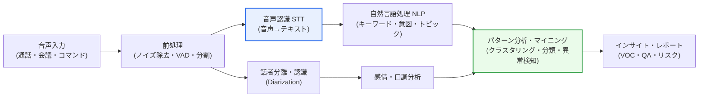
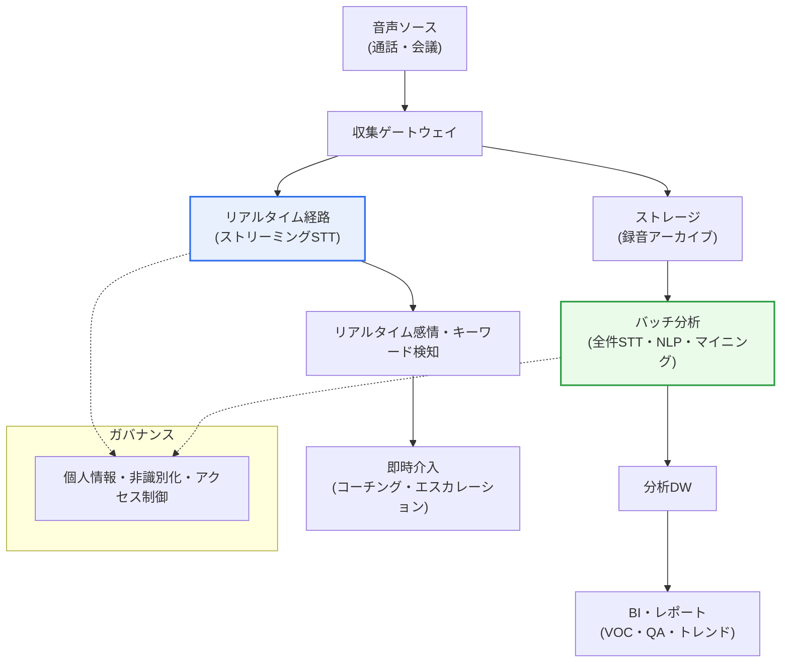

# 音声データマイニング(Voice/Speech Data Mining)

## 1. 概要

### A. 定義
> **音声データマイニング**は、通話・問い合わせ対応・会議・音声コマンドなどの**非構造化音声データから、テキスト・感情・話者・意図・トピックなどの有用な情報とパターンを自動的に抽出**するデータマイニング手法である。音声認識(STT, Speech-to-Text)を基盤として、自然言語処理(NLP)と統計・機械学習ベースのパターン分析を組み合わせた**多段階パイプライン**である点が特徴である。

音声データマイニングが台頭した背景には、コールセンター・音声アシスタント・会議・顧客相談・現場無線などで**膨大な音声データが日々蓄積されながら、その大半が分析されないまま死蔵**されてきたという事情がある。テキストデータは検索・集計・分析が容易であるが、音声は「再生して最後まで聞いてみなければ」内容がわからない**逐次的・非構造的な媒体**であり、活用が根本的に困難であった。例えば1日に数万件の通話が流入するコールセンターで、人がすべての通話を聴取して品質を評価することは物理的に不可能であり、実際には1〜3%程度をサンプル聴取(QA)するにとどまってきた。音声データマイニングはこの限界を正面から突破する。音声をテキストに変換し(STT)、そこに含まれる意味・感情・トピック・話者を自動分析することで、**眠っていた音声資産を定量化可能なインサイトツールへと転換**する。

中核的な価値は「**規模(scale)の転換**」にある。人がサンプルしか聞けなかったものを、機械は全件(100%)分析する。その結果、繰り返される顧客の不満、解約の兆候、応対品質の低下、規定違反の発言のように、**サンプル聴取では見逃していたシグナルを統計的に捕捉**できる。すなわち音声データマイニングは、単なる録音を超えて、音声という媒体を「検索・集計・予測が可能な構造化データのように」扱えるようにする技術である。

ここでテキストマイニングとの関係も明確になる。音声データマイニングは、STTという関門を通過した後はかなりの部分でテキストマイニング・NLPの方法論を再利用するが、**話者・口調・イントネーション・無音など「テキストにはない音響情報」まで併せて扱う**という点で、より範囲が広い。また入力が常に完全なテキストではなく、STTが生成した「誤りを含み得るテキスト」であるという点で、ノイズに強い(robust)分析設計が求められるという違いもある。

### B. 特徴
音声データマイニングの性格は次のように要約される。

- **多段階パイプライン:** 前処理→STT→話者/感情認識→NLP→パターン分析の直列構造であり、前段の誤りが後段へ伝播する。
- **音響+言語の結合:** テキストの意味だけでなく、ピッチ・強度・話速のような音響特徴も併せて活用する。
- **全件分析:** サンプル聴取の限界を超え、100%の通話を自動分析して統計的なシグナルを捕捉する。
- **非構造化→構造化への転換:** 逐次的・非構造的な音声を、検索・集計可能な構造化データへ変換する。
- **生体情報の取り扱い:** 声紋・私的な会話などの機微情報を扱うため、個人情報・倫理の統制が不可欠である。

### C. 目的
主な目的は、**顧客の声(VOC)分析、応対品質管理(QA)、金融リスク・コンプライアンス監視、サービス自動化**である。通話の中に散在する非構造化情報を定量化し、意思決定と業務改善の根拠とする。例えば「なぜこんなに料金が高いのか」という表現の頻度が、特定の料金プランの発売直後に急増したとすれば、これは商品設計や案内プロセスの欠陥を示唆する**先行シグナル(early signal)** として活用される。

## 2. 主要技術とパイプライン構造

音声データマイニングは単一のアルゴリズムではなく、**複数の信号処理・AI技術が直列に接続されたパイプライン**である。前段の出力が後段の入力となるため、いずれか1つの段階の誤りが後段へ伝播(error propagation)する。特に**最初の関門であるSTTの精度が、全体の結果の品質を左右**する。STTが「返金」を「変金」と誤って書き起こせば、後段の感情分析・意図分類・集計がすべて狂ってしまうからである。

**A. 前処理と音声認識(STT).** パイプラインの出発点である。まずノイズ除去、無音区間を取り除く音声区間検出(VAD, Voice Activity Detection)、発話単位の分割といった前処理が行われる。続いて音響モデル・言語モデル(またはエンドツーエンドのニューラルネットワーク)によって音声をテキストに変換する。STTの難しさは**実環境の多様性**にある。背景雑音、方言・訛り、ドメインの専門用語(医薬品名・金融商品名)、2人が重なって話す重複発話などが精度を低下させる。そのため、ドメイン別の語彙辞書とカスタム学習が精度確保の鍵となる。

**B. 話者分離・認識(Diarization & Recognition).** 「**誰が**(who)いつ話したか」を切り分ける段階である。話者分離(diarization)は、通話の中でオペレーターと顧客の発話を区別して対話構造を復元し、話者認識(recognition)は音声の声紋(voiceprint)の特徴から特定の個人を識別する。この情報があってはじめて、「顧客が怒った後にオペレーターがどう応対したか」のような**役割・順序に基づく分析**が可能になる。話者認識は金融機関の声紋認証にも用いられるが、同時に強力な生体情報であるため、個人情報の問題も併せて引き起こす。

**C. 感情・口調分析(Emotion/Sentiment).** テキストの単語だけでなく、**音声固有の音響特徴(ピッチ・強度・話速・震え)** まで活用して話者の感情状態を推定する。同じ「大丈夫です」でもイントネーションによって満足と冷笑に分かれるため、テキストのみを見る感情分析よりも、音声ベースの感情分析の方が豊かなシグナルを与える。コールセンターでは、顧客の怒りが閾値を超えるとリアルタイムで管理者にエスカレーションするために用いられる。

**D. NLPとパターン分析・マイニング.** 変換されたテキストから自然言語処理によってキーワード・トピック(topic)・意図(intent)・固有表現を抽出し、その上にデータマイニングの正統的な手法(クラスタリング・分類・相関ルール・異常検知)を適用して洞察を導出する。例えば通話理由を自動分類して類型別のボリュームを集計し、平常時と異なる急増パターンを異常検知で捉えるといった具合である。この段階こそが「録音」と「マイニング」を分ける本質であり、**個々の通話の理解を超えて、集団全体のパターン・トレンドを発見**する。

| 技術 | 役割 | 実務上の難点 |
|---|---|---|
| **前処理・STT** | 音声→テキスト変換 | 雑音・方言・専門用語・重複発話 |
| **話者分離・認識** | 発話者の区別・識別 | 短い発話・類似した声質 |
| **感情・口調分析** | 音響+テキストによる感情推定 | 反語・文脈依存 |
| **NLP** | キーワード・意図・トピック抽出 | 口語体・非文・ドメイン語彙 |
| **パターン分析** | クラスタリング・分類・異常検知 | ラベル不足・クラス不均衡 |

## 3. 処理方式: バッチ分析とリアルタイム分析

音声データマイニングは「いつ分析するか」によって、バッチ(事後)分析とリアルタイム(通話中)分析に分かれ、目的が互いに異なる。バッチ分析は、終了した通話を集めて夜間などに一括処理し、**トレンド・パターン・品質統計**を抽出することに強みがある。一方、リアルタイム分析は、通話が進行している間に感情・キーワードを即座に検知し、**オペレーター支援・エスカレーションのような即時介入**を可能にする。

両方式は要求条件が異なる。バッチは精度と詳細分析を優先するため重いモデルを使ってもよいが、リアルタイムは数百ミリ秒以内の応答が必要であり、レイテンシと精度のトレードオフを受け入れる。実務では通常、**リアルタイムで即時対応し、バッチで全件の品質・トレンドを集計**するハイブリッド構成を採る。以下は2つの経路を1つのアーキテクチャにまとめた詳細構造図である。

| 区分 | バッチ(事後)分析 | リアルタイム(通話中)分析 |
|---|---|---|
| **目的** | トレンド・品質・VOC統計 | 即時介入・オペレーター支援 |
| **優先条件** | 精度・詳細性 | 低レイテンシ(数百ms) |
| **代表的用途** | 全件QA、解約予測 | 感情エスカレーション、リアルタイムコーチング |

この区分はインフラ設計にも直接影響を与える。リアルタイムパイプラインにはストリーミングSTTと低レイテンシのメッセージングが必要であり、バッチパイプラインでは大容量ストレージ・分散処理が鍵となるため、2つの経路を1つのアーキテクチャにまとめつつ、リソースとモデルを分離して運用する設計が一般的である。

## 4. 活用分野と事例

音声データマイニングの価値は、産業ごとの課題と結び付いたときに具体化する。以下の表の各分野は、「全件分析」という共通の利点を異なる目的に応用している。

| 分野 | 活用 | 中核的効果 |
|---|---|---|
| **コールセンター・CS** | 応対品質(QA)・VOC分析、リアルタイムコーチング | サンプル→全件の品質管理、解約予測 |
| **金融・コンプライアンス** | 不完全販売・リスク発言の検知、声紋認証 | 規定違反の自動摘発 |
| **医療** | 診療会話の自動記録、音声特徴による疾患スクリーニング | 記録負担の軽減 |
| **音声アシスタント・IoT** | 意図把握・サービス自動化 | 無人応対 |

**A. コールセンター・顧客サービス.** 最も成熟した領域である。全通話を自動分析して応対品質を全件評価し、特定のキーワード(解約・不満・競合他社名)が出現した際にリアルタイムでオペレーターを支援したり、管理者に通知したりする。サンプル1〜3%しか聞いていなかった従来のQAを100%に引き上げるという点で、「規模の転換」が最も明確に表れる。さらに、繰り返される問い合わせ類型を集計してFAQ・自動音声応答(IVR)を改善したり、通話理由・感情のトレンドから**顧客の解約を事前に予測**したりすることにも活用される。

**B. 金融・コンプライアンス.** 規制の厳しい産業であるため、活用価値が大きい。販売過程におけるリスク説明の漏れのような**不完全販売を自動検知**してコンプライアンスリスクを下げ、録音義務のある通話に声紋認証を組み合わせることもある。特定の禁止表現や誇大広告的な発言をルール・モデルで常時監視し、事後の紛争や制裁のリスクを先制的に管理する。

**C. 医療.** 医師と患者の会話を自動的に診療記録として整理(ambient clinical documentation)し、医療従事者の文書作成負担を軽減する。また、声の微細な音響特徴から特定疾患の早期シグナルを探る研究も進められている。ただし、この分野の臨床的精度はまだ検証段階であるため、診断の代替ではなく**補助指標として慎重に活用**すべきであり、医療情報保護の規定を厳格に遵守しなければならない。

**D. 音声アシスタント・IoT.** スマートスピーカー・車両・家電において、ユーザーの発話意図を把握してサービスを無人で自動化する。ここではリアルタイム性と短いコマンドに対する正確な意図分類が鍵であり、蓄積された音声コマンドのログをマイニングして、よく使われる機能・失敗パターンを分析し、製品を改善するという好循環が生まれる。

## 5. 深掘り: ファウンデーションモデルと生成AIへの飛躍

音声データマイニングは近年、**大規模音声ファウンデーションモデル**と**生成AI(LLM)** の組み合わせによって質的な飛躍を遂げつつある。かつてはSTT・感情・意図分析をそれぞれ別のモデルとして構築・チューニングする必要があったが、膨大な音声で事前学習された汎用STTモデル(例: Whisper系)が登場したことで、**多言語・雑音環境における認識精度と適用の容易さが大きく向上**した。

ここにLLMを組み合わせれば、単純なキーワード抽出を超えて、**通話要約・主要論点の抽出・フォローアップ対応の自動生成・通話分類**を自然言語の指示だけで実行できるようになり、分析の柔軟性と速度が飛躍的に高まる。例えば以前は「通話理由の分類」のために数千件のラベル付きデータで専用の分類器を学習させる必要があったが、今ではLLMに分類基準をプロンプトとして提示するだけで同様の結果が得られ、新しい類型の追加や基準変更にかかるリードタイムが大きく短縮される。

技術の流れは3つの方向に要約される。

- **リアルタイム・エッジ処理:** 通話終了後にバッチで分析する方式から、通話中にリアルタイムで感情・解約リスクを検知して即時介入する方向へ移行している。
- **マルチモーダルへの拡張:** 音声だけでなく、テキストチャット・映像・画面共有も併せて分析し、顧客体験を統合的に理解する。
- **分析から行動へ:** 洞察の導出にとどまらず、要約・応対ドラフト・ナレッジベースの更新まで自動化する「agentic」な方向へ進化している。

ただし、このような自動化が拡大するほど、生成結果の事実誤り(ハルシネーション)と個人情報の露出を統制するガバナンスも併せて求められる。利便性と統制のバランスをどう設計するかが、成熟した導入の鍵となる。

## 6. 考慮事項および示唆

1. **STTの精度が全体品質の上限を決定する。** パイプラインの最初の段階の誤りが後段へ伝播するため、雑音・方言・専門用語・話者重複の環境で認識率を引き上げるドメイン特化が、事業の成否を分ける最初の関門である。精度指標(WER、単語誤り率)を継続的に管理しなければならない。
2. **音声はそれ自体が機微な生体個人情報である。** 音声には話者を識別できる声紋と私的な会話が含まれるため、収集・利用の同意、目的の限定、非識別化・仮名化、保存期間・アクセス制御が必ず併せて実施されなければならない。特に話者認識(声紋)は変更不可能な生体情報であり、漏洩時の被害は永続的である。
3. **生成AIとの組み合わせは活用範囲と速度を拡大するが、信頼性の管理が前提である。** LLMベースの自動要約・インサイト生成は強力であるが、事実誤り・バイアス・ハルシネーションのリスクがあるため、重要な意思決定には根拠(元の発話)のトレーサビリティと検証手順を併せて設計しなければならない。
4. **評価バイアスと労働・倫理の問題を考慮しなければならない。** 全件の感情・品質分析はオペレーターに対する過剰な監視(surveillance)につながり得るうえ、感情認識モデルは文化・個人差に起因するバイアスを内包する。指標を「監視」ではなく「コーチング・改善」のツールとして設計し、透明性と異議申し立ての手続きを備えることが、持続可能性の条件である。
5. **技術士の視点による導入戦略。** パイロットは、STT精度の検証 → 少数のユースケース(例: 解約防止、不完全販売の検知)での成果実証 → リアルタイム・マルチモーダルへの拡張という段階的アプローチが望ましく、データガバナンス・個人情報保護を初期アーキテクチャに組み込む(privacy by design)ことで、事後のリスクを低減できる。

## 参考資料
- OpenAI, "Introducing Whisper"(大規模音声認識モデル): https://openai.com/index/whisper/
- 韓国 個人情報保護委員会, 個人情報保護法(生体情報などの機微情報の処理根拠): https://www.pipc.go.kr

---

> **一言まとめ**: 音声データマイニングは、*前処理・STT・話者/感情認識・NLP・パターン分析*へと続くパイプラインによって非構造化音声から情報・パターンを全件抽出し、コールセンター・金融・医療に活用するものであり、音声ファウンデーションモデル・生成AIによって飛躍しつつも、STTの精度と音声という生体個人情報の保護が中核的な課題である。
