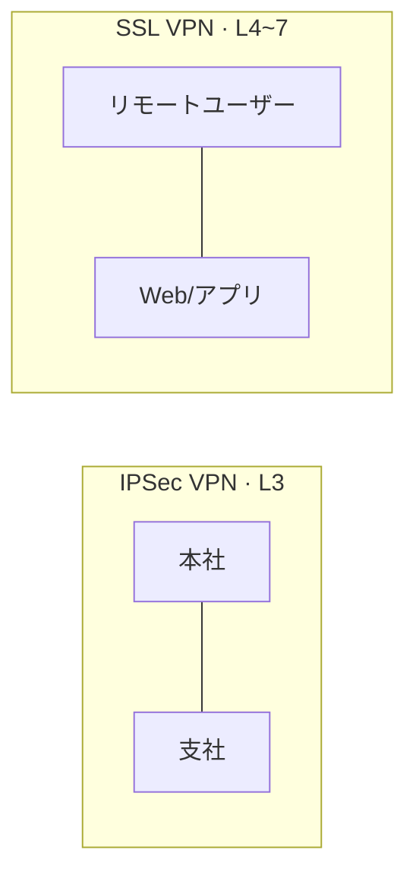

# VPN(Virtual Private Network)

## 1. 概要

### A. 定義
> 公衆ネットワーク(インターネット)上に**暗号化された仮想的な専用通信路(トンネル)** を構成し、物理的には公衆網を経由しながらも、論理的には専用網のように安全にデータを送受信する技術。

### B. 登場背景および必要性
拠点間の通信や在宅勤務者の社内接続のために物理的な**専用線(Leased Line)** を敷設する方式は安全であるが、コストが地域・距離に比例して急増する。インターネットはすでに世界中に張り巡らされておりコストは安いが、誰でもパケットを覗き見できるオープンな網であるため、そのまま使えば盗聴・改ざん・なりすましのリスクが大きい。VPNはこの両者の長所だけを取り入れ、**安価なインターネット上に暗号化・認証・完全性を施したトンネル**を載せることで、専用線レベルのセキュリティをはるかに低いコストで実現する。リモートワークの普及とクラウド利用の増加により「いつでもどこでも安全な接続」への需要が高まるなか、VPNは企業ネットワークの基本構成要素となった。

## 2. IPSec VPN vs SSL VPN

両方式の違いは、**トンネルをネットワークスタックのどの層に構築するか**に由来し、その選択が用途を分ける。**IPSec VPN**はネットワーク層(L3)でIPパケットそのものを暗号化するため、いったんトンネルが確立されれば、その上のすべてのアプリケーショントラフィックが透過的に保護される。ユーザーが意識しなくてもネットワーク全体が接続されるため、**支社-本社間の常時接続(Site-to-Site)** に適しているが、専用クライアントのインストールと設定が必要である。一方、**SSL VPN**はトランスポート層〜アプリケーション層(L4〜7)でTLSによって保護し、Webブラウザだけで接続できるため、インストール不要で利便性が高い。その代わり特定のアプリケーション単位でアクセスを開放する方式であるため、きめ細かなアクセス制御が容易であり、不特定の場所から接続する**リモートユーザー(Remote Access)** に適している。要するに、「ネットワーク全体を接続するのか(IPSec)、必要なアプリだけを開放するのか(SSL)」が選択基準である。

| 区分 | IPSec VPN | SSL VPN |
|---|---|---|
| **動作層** | ネットワーク(L3) | トランスポート〜アプリケーション(L4~7) |
| **接続方式** | 専用クライアントが必要 | Webブラウザ(インストール不要) |
| **主な用途** | 拠点間常時接続(Site-to-Site) | リモートユーザー接続(Remote Access) |
| **アクセス範囲** | ネットワーク全体 | 特定のアプリケーション単位 |
| **セキュリティプロトコル** | ESP/AH, IKE | TLS/SSL |
| **長所** | 広範囲・透過的な接続 | きめ細かなアクセス制御・利便性 |

## 3. VPNの技術要素

VPNの安全性は、5つの要素が鎖のようにかみ合ったときに成立する。**トンネリング**は元のパケットを新しいヘッダで包み(カプセル化)、公衆網を通過させる骨格であり、L2TP・PPTPやIPSecのESP/AH、SSL/TLSが用いられる。カプセル化だけでは内容が見えてしまうため、**暗号化**がデータの機密性を担い、AESのような共通鍵でペイロードを隠す。しかし、相手がなりすました攻撃者であれば暗号化も無意味であるため、**認証**がIKE・電子署名・証明書によって通信の両端を検証する。伝送中にビットが改ざんされたかどうかは、**完全性**がHMAC・ハッシュによって検出する。最後に、共通鍵を安全に共有し定期的に更新する**鍵管理**がなければ前述のすべてが崩れるため、IKE(Internet Key Exchange)がセッション鍵を安全に交換・更新する。

| 要素 | 説明 | 代表技術 |
|---|---|---|
| **トンネリング(Tunneling)** | 元のパケットのカプセル化 | L2TP・PPTP・IPSec(ESP/AH)・SSL/TLS |
| **暗号化(Confidentiality)** | データの機密性 | 共通鍵(AESなど) |
| **認証(Authentication)** | 両端の身元検証 | IKE・電子署名・証明書 |
| **完全性(Integrity)** | 偽造・改ざんの検出 | HMAC・ハッシュ |
| **鍵管理** | セッション鍵の交換・更新 | IKE |

IPSecには2つのカプセル化**モード**がある。**トランスポート(Transport)モード**はペイロードのみを暗号化して元のIPヘッダを維持するため、エンドツーエンドの通信に用いられ、**トンネル(Tunnel)モード**は元のIPヘッダを含むパケット全体を暗号化して新しいヘッダで包むため、ゲートウェイ間のSite-to-Site接続に用いられる。

## 4. 考慮事項および示唆
- **性能とセキュリティのバランス**: 暗号化・復号はCPUオーバーヘッドを引き起こすため、すべてのトラフィックをトンネルに送るのではなく、社内宛てのトラフィックのみをトンネリングし、一般のインターネット通信は直接出ていくようにする**スプリットトンネリング**ポリシーによって、性能とセキュリティを折衷する。
- **境界ベースの信頼の限界**: 従来のVPNは「トンネルに入れば内部者として信頼する」モデルであるため、1つのアカウントが奪取されると内部網全体が露出する。この限界から、リソースごとにアクセス時点で継続的に検証する**ZTNA(Zero Trust Network Access)** へと進化しつつある。
- **最小権限・継続的検証の併用**: VPNを維持する場合でも、ユーザー・デバイス・状況をアクセスのたびに評価するゼロトラストの原則と組み合わせ、「接続=信頼」という等式を崩す方向で運用しなければならない。

---

> **一言まとめ**: VPNは*公衆網の上に暗号化トンネルで仮想専用網を構成*する低コストのセキュリティ技術であり、ネットワーク層のIPSec(拠点間)とアプリケーション層のSSL(リモート接続)に分かれ、トンネリング・暗号化・認証・完全性・鍵管理を中核要素とし、境界型の信頼の限界を越えてZTNAへと進化している。
