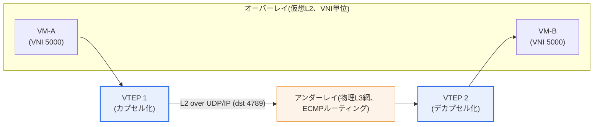
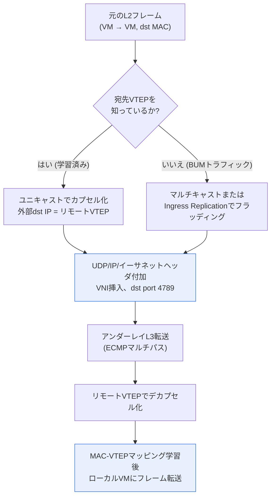

# VXLAN(Virtual eXtensible LAN)

## 1. 概要

### A. 定義
> **VXLAN(Virtual eXtensible LAN)** は、物理ネットワーク(L3)の上に**仮想的なL2オーバーレイネットワーク**を構成するMAC-in-UDPトンネリング技術である。L2イーサネットフレームをUDP/IPパケットの中にカプセル化し、ルーティング可能なL3網を横断して転送するとともに、24ビットの**VNI(VXLAN Network Identifier)** によって約1,600万(2²⁴)個の論理ネットワークを提供し、VLANのスケーラビリティの限界を克服する。標準はIETF **RFC 7348**(2014)に定義されている。

VXLANが登場した根本的な背景は、「**VLANの4,094個という上限と物理的な位置の制約**」である。従来のVLANは、IEEE 802.1QタグのVLAN IDが12ビットであるため、理論上4,096個(予約分を除くと実際に使えるのは4,094個)しか作成できない。この数は小規模なキャンパス網では十分であるが、数万〜数十万の顧客(テナント)のネットワークを互いに隔離しなければならないパブリッククラウド・大規模データセンターでは到底足りない。1つのデータセンター内で複数の事業者がそれぞれ数百のセグメントを要求すれば、12ビットの空間はすぐに枯渇する。

もう1つの背景は、**サーバ仮想化の爆発的な普及**である。1台の物理サーバに数十台の仮想マシン(VM)が載るようになり、ネットワークが管理すべきMACアドレス数とセグメント数が急増した。特にVMを別のラック・別のデータセンターへ**ライブマイグレーション**するには、元のL2ドメイン(同一ブロードキャストドメイン)が移動先まで延伸されている必要があるが、純粋なL2網を地理的に拡張することは、スパニングツリー(STP)による帯域幅の浪費と大規模な障害伝播のリスクを生む。VXLANはこの問題を、「L2フレームをL3(UDP)パケットの中にカプセル化」して**アンダーレイ(物理網)とオーバーレイ(論理網)を分離**することで解決する。論理ネットワークを物理トポロジーから切り離すため、物理的な位置に関係なく大規模な隔離ネットワークを作成し、VMを自由に移動させることができる。

### B. 必要性と特徴
クラウドインフラは、多数のテナントのネットワークを安全に隔離しながら、ワークロードをデータセンター全域に柔軟に配置・移動できなければならない。VXLANは、この**マルチテナンシー**と**ワークロードの可搬性**を物理網の制約なしに実現する、ネットワーク仮想化の事実上の標準である。アンダーレイは実績のあるL3ルーティング(ECMPベースのマルチパス)で帯域幅を最大限に活用し、オーバーレイはその上で論理的なL2サービスを提供するため、STPなしでも大規模な拡張が可能である。

特徴をまとめると次のとおりである。第一に、**スケーラビリティ**: 24ビットのVNIにより、セグメント数を4千余りから1,600万へと拡張する。第二に、**位置独立性**: L3上のオーバーレイであるため、サブネットの境界を越えて同一のL2ドメインを維持する。第三に、**アンダーレイの活用度**: L3 ECMPで複数の経路にトラフィックを分散するため、STPがリンクの半分を遮断していた純粋なL2網よりも効率的である。第四に、**ハードウェア/ソフトウェアの柔軟性**: VTEPをハイパーバイザ(ソフトウェア)にもToRスイッチ(ハードウェア)にも配置できる。

## 2. 全体構造 — オーバーレイ/アンダーレイとVTEP

VXLANの中核部品は**VTEP(VXLAN Tunnel End Point)** である。VTEPはオーバーレイとアンダーレイの境界に立ち、カプセル化・デカプセル化を担うトンネル終端点である。送信元VTEPは、ローカルVMが送信した元のL2イーサネットフレームを受け取り、その前に8バイトの**VXLANヘッダ**(VNIを含む)を付加し、さらにその前に**UDPヘッダ**(宛先ポート4789)、**外部IPヘッダ**(送信元・宛先VTEPのIP)、**外部イーサネットヘッダ**を順に被せる。こうして作られたUDPパケットはアンダーレイで通常のIPトラフィックのようにルーティングされ、宛先VTEPがヘッダを剥がして(デカプセル化)元のフレームを宛先VMに届ける。VMからは自分が同じスイッチに接続されているように見えるが、実際にはL3網を横断して通信している。

**VNI(24ビット)** は、そのフレームがどの仮想ネットワークに属するかを識別する。異なるテナントが偶然同じプライベートIP・同じVLAN IDを使っていても、VNIが異なれば完全に隔離される。これがマルチテナンシーにおける隔離の基盤である。

**アンダーレイとオーバーレイの分離**が、VXLANの考え方の核心である。アンダーレイはVTEPのIP間でパケットを高速かつ安定的に運ぶことだけに専念すればよく(オーバーレイの存在を知る必要がない)、オーバーレイはアンダーレイの物理トポロジーを気にせずに論理的なL2サービスを提供する。この関心の分離によって、物理網はシンプルなルーテッドのリーフ・スパインファブリックに標準化し、サービスの多様性はすべてオーバーレイ層でソフトウェア的に処理するという、現代のデータセンター設計が可能になった。

主要な構成要素を整理すると次のとおりである。

| 要素 | 役割 | 備考 |
|---|---|---|
| **VTEP** | カプセル化・デカプセル化の終端点(トンネル端点) | ハイパーバイザ(ソフトウェア)またはToRスイッチ(ハードウェア) |
| **VNI** | 24ビットの仮想ネットワーク識別子 | 約1,600万個、テナント/セグメントの隔離 |
| **VXLANヘッダ** | 8バイト、VNI・フラグを含む | RFC 7348 |
| **UDP** | 宛先ポート**4789**(IANA割り当て) | 送信元ポートは内部フローのハッシュ → ECMP分散 |
| **オーバーレイ** | 仮想L2ネットワーク | VM/コンテナが認識するセグメント |
| **アンダーレイ** | 物理L3ルーティング網 | ECMP・リーフ・スパインファブリック |

## 3. カプセル化の過程とデータプレーンの詳細

VXLANが実際のパケットを処理する過程を、小項目ごとに詳しく見ると次のとおりである。

**A. カプセル化のオーバーヘッドとMTU.** VXLANは、元のフレームの前に外部イーサネット(14) + 外部IP(20) + UDP(8) + VXLAN(8) = 合計**50バイト**のヘッダを追加する(IPv4・タグなしの場合)。したがって、アンダーレイがデフォルトのMTU 1,500バイトであれば、オーバーレイで1,500バイトのフレームを送った瞬間に合計1,550バイトとなり、フラグメンテーション(fragmentation)やドロップが発生する。実務では、アンダーレイのMTUを**9,000バイト(ジャンボフレーム)** に引き上げるか、少なくとも1,550バイト以上に設定してこの問題を予防する。MTUの不一致は、VXLAN導入初期の現場で最もよく見られる性能・接続障害の原因であるため、ファブリック全区間でMTUを一貫して揃えることは、事実上必須の事前作業である。

**B. 送信元UDPポートとECMP.** VXLANは、外部UDPの宛先ポートを4789に固定する一方で、**送信元ポートは内部(元の)フレームのヘッダをハッシュして生成する。** こうすることで、異なる内部フローが異なる送信元ポートを持つようになり、アンダーレイのECMPルータが5タプルのハッシュで経路を選ぶ際に、オーバーレイのフローが複数の物理経路に均等に分散される。アンダーレイから見れば、VXLANの内部を覗かなくてもUDPの5タプルだけで負荷を分散できるため、リーフ・スパインファブリックの帯域幅を最大限に活用できる。

**C. BUMトラフィックとMAC学習.** 初期のVXLAN(RFC 7348のデータプレーン学習方式)は、宛先MACが不明な場合の**BUM(Broadcast・Unknown unicast・Multicast)** トラフィックを、アンダーレイの**マルチキャストグループ**(VNIごとにグループをマッピング)へフラッディングして処理していた。リモートVTEP群はこのフラッディングを受信し、元のフレームの送信元MACと外部IPの送信元(リモートVTEP)を対応付けて「MAC ↔ VTEP」マッピングを学習する。しかし、アンダーレイのマルチキャストを大規模に運用・管理することは難しく、マルチキャストの代わりに各リモートVTEPへ個別のユニキャストで複製して送る**Ingress Replication(Head-End Replication)** 方式や、コントロールプレーンでMAC情報を配布する方式(4章のEVPN)が広く使われるようになった。

例えば、ある通信事業者のクラウドで、VNI 5000に属するVM-A(サーバラック1)が同じVNIのVM-B(サーバラック20)と初めて通信する際、VTEP1はVM-Bの位置を知らないためBUMとしてフラッディングし、VM-Bが応答した瞬間にVTEP1は「VM-BのMACはVTEP2にある」と学習し、以降はユニキャストで直接カプセル化する。この学習・フラッディングの負荷が規模に比例して大きくなることが、データプレーン学習方式の根本的な限界である。

## 4. VLAN・その他のオーバーレイとの比較

VXLANとVLANは、いずれもネットワークセグメントを隔離するという目的は同じであるが、**どこで・どのように隔離するか**が根本的に異なる。VLANは1つのL2ブロードキャストドメインの中でタグによってフレームを区別するため、隔離の範囲が物理的なL2ドメインに閉じ込められる。一方VXLANは、L2フレームをL3パケットで包んでルーティング可能な網のどこへでも送ることができるため、隔離の範囲が物理的な位置と無関係になる。この違いにより、VLANは小規模・固定配置の環境に、VXLANは大規模・動的なクラウド環境に適している。

| 区分 | VLAN | VXLAN |
|---|---|---|
| **識別子** | 12ビット(4,094個) | 24ビット(約1,600万) |
| **カプセル化** | 802.1Qタグ(4バイト) | MAC-in-UDP(約50バイトのオーバーヘッド) |
| **伝送層** | L2ローカル | L3上のオーバーレイ(位置に無関係) |
| **マルチパス** | STPでリンクの半分を遮断 | アンダーレイECMPで全経路を活用 |
| **可搬性** | 物理的位置の制約 | VM/コンテナの自由な移動 |
| **適した規模** | 小規模キャンパス | 大規模クラウド・データセンター |

表だけでは「なぜ違いが生じるのか」が見えないため、実務的な含意を補足する。VLANがSTPによってリンクの半分を遊ばせる理由は、L2にループ防止メカニズムがなければブロードキャストストームが発生するためである。VXLANはアンダーレイをL3とすることでこの問題をIPルーティング(TTL・ECMP)に委ねるため、物理リンクをすべて活用しながらもループが発生しない。ただし、その代償としてカプセル化のオーバーヘッド(50バイト)とVTEPの処理負荷が生じる。すなわちVXLANは、「スケーラビリティ・可搬性・帯域幅の活用」を得る代わりに「オーバーヘッド・複雑性」を支払うトレードオフである。

類似のオーバーレイ技術とも比較される。**NVGRE**(マイクロソフト主導、GREベース)と**STT**はVXLANと競合したが、VXLANはUDPベースであるため既存のECMP・ロードバランサ基盤と相性が良く、幅広いベンダーのサポートを得て事実上の市場標準となった。最近では、サービスのメタデータを格納できる**Geneve**(RFC 8926)が次世代の汎用オーバーレイとして台頭しており、VMware NSX-Tなどがこれをデフォルトのカプセル化として採用している。

## 5. 深掘り — BGP EVPNコントロールプレーンと実務適用

VXLANの進化において最も重要な変化は、**コントロールプレーンの導入**である。RFC 7348の純粋なデータプレーン学習(フラッド・アンド・ラーン)方式は、規模が大きくなるほどBUMトラフィックとマルチキャストの運用負担が急増するという限界があった。これを解決するため、**BGP EVPN(Ethernet VPN, RFC 7432 / VXLANデータプレーンはRFC 8365)** が標準のコントロールプレーンとして定着した。

EVPNの中核となる考え方は、「MAC・IP情報をフラッディングで学習するのではなく、**MP-BGPで明示的に広告**しよう」というものである。各VTEPは、自らが学習したローカルVMのMAC/IPを、BGP EVPNルート(Type-2など)として他のVTEPに配布する。そうすればリモートVTEPは最初から「MAC ↔ VTEP」マッピングを把握しているため、未知のユニキャストのフラッディングはほぼ消え、ARPもプロキシ応答で抑制できる。また、EVPNは**分散エニーキャストゲートウェイ**をサポートし、すべてのリーフスイッチが同一のゲートウェイIP/MACを共有するため、VMがどのラックへ移動しても最適な経路でルーティングされる。これはVM可搬性の実質的な完成である。

実務での適用事例は幅広い。大規模クラウド・通信事業者のデータセンターの多くは**VXLAN-EVPNのリーフ・スパインファブリック**として設計されており、Cisco(ACI・NX-OS)、Arista(EOS)、Juniper(QFX)などの主要ベンダーがこれを標準アーキテクチャとして提供している。サーバ仮想化の分野では、**VMware NSX**がオーバーレイ(NSX-VはVXLAN、NSX-TはGeneve)によってネットワーク仮想化を実装し、コンテナ/Kubernetesの分野では、**Flannelのvxlanバックエンド**や**CalicoのVXLANモード**がノード間のPodネットワークをオーバーレイで接続する。例えばKubernetesクラスタでFlannel VXLANを使えば、異なるノード上のPodが、物理サブネットが異なっていても同一のクラスタネットワークに属しているかのように通信する。このようにVXLANは、ハードウェアスイッチからソフトウェアCNIまで、層を横断して使われる汎用オーバーレイとなった。

## 6. 考慮事項および示唆(技術士の視点)

1. **マルチテナンシー・ワークロード可搬性の基盤インフラ.** VXLANは、SDN・クラウドデータセンターにおいて物理網と論理網を分離し、柔軟性を最大化する中核である。導入時には、オーバーレイ(サービス)とアンダーレイ(転送)の役割を明確に分離して設計し、アンダーレイはシンプルで高信頼なL3ファブリックに標準化する戦略が有効である。

2. **MTU・オーバーヘッドに関する事前設計が必須.** 50バイトのカプセル化オーバーヘッドにより、アンダーレイのMTUをジャンボフレーム(9000B)などに引き上げる必要があり、これを見落とすと、断続的な大容量転送の失敗という再現が難しい障害につながる。性能の観点では、VTEPのハードウェアオフロード(NICのVXLAN offload)のサポート有無がスループットを左右するため、機器選定時に確認しなければならない。

3. **コントロールプレーン(EVPN)の採用によるスケーラビリティ・運用性の確保.** 小規模なPoCであればマルチキャスト学習でも対応できるが、本番規模ではBGP EVPNを導入してBUMトラフィックを抑制し、分散エニーキャストゲートウェイで可搬性を完成させるのが定石である。これは「データプレーン単独 → コントロール/データプレーンの分離」というネットワーク設計のトレンドとも一致する。

4. **セキュリティ・可視性のトレードオフ.** オーバーレイはトラフィックをカプセル化して隠すため、既存のファイアウォール・IDSが内部フレームを見られないという可視性の低下が生じる。マイクロセグメンテーション(NSX分散ファイアウォールなど)とオーバーレイ対応のテレメトリを併せて導入する必要があり、VXLAN自体は暗号化を提供しないため、データセンター間の区間ではIPsec/MACsecを併用することが望ましい。

5. **次世代オーバーレイ(Geneve)との連携の展望.** サービスチェイニング・メタデータ伝達の要求が高まるにつれ、拡張可能なGeneveへの移行が進んでいる。新規設計の際は、ベンダーのロードマップと標準(RFC 8926)の動向を考慮してオーバーレイのカプセル化方式を選択することが、長期的なトレードオフにおいて有利である。

## 参考資料
- RFC 7348, "Virtual eXtensible Local Area Network (VXLAN)": https://datatracker.ietf.org/doc/html/rfc7348
- RFC 8365, "A Network Virtualization Overlay Solution Using EVPN": https://datatracker.ietf.org/doc/html/rfc8365
- RFC 8926, "Geneve: Generic Network Virtualization Encapsulation": https://datatracker.ietf.org/doc/html/rfc8926

---

> **一言まとめ**: VXLANは*L3の上に24ビットVNIベースのL2オーバーレイ*を作るMAC-in-UDP(ポート4789)トンネリングであり、VLANの4,094個という限界を克服して大規模クラウド・データセンターのマルチテナンシーとVM可搬性を実現し、BGP EVPNコントロールプレーン・分散エニーキャストゲートウェイによってスケーラビリティと運用性を完成させる。
