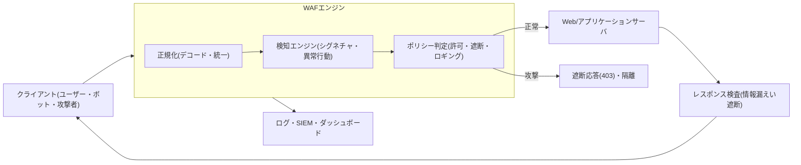
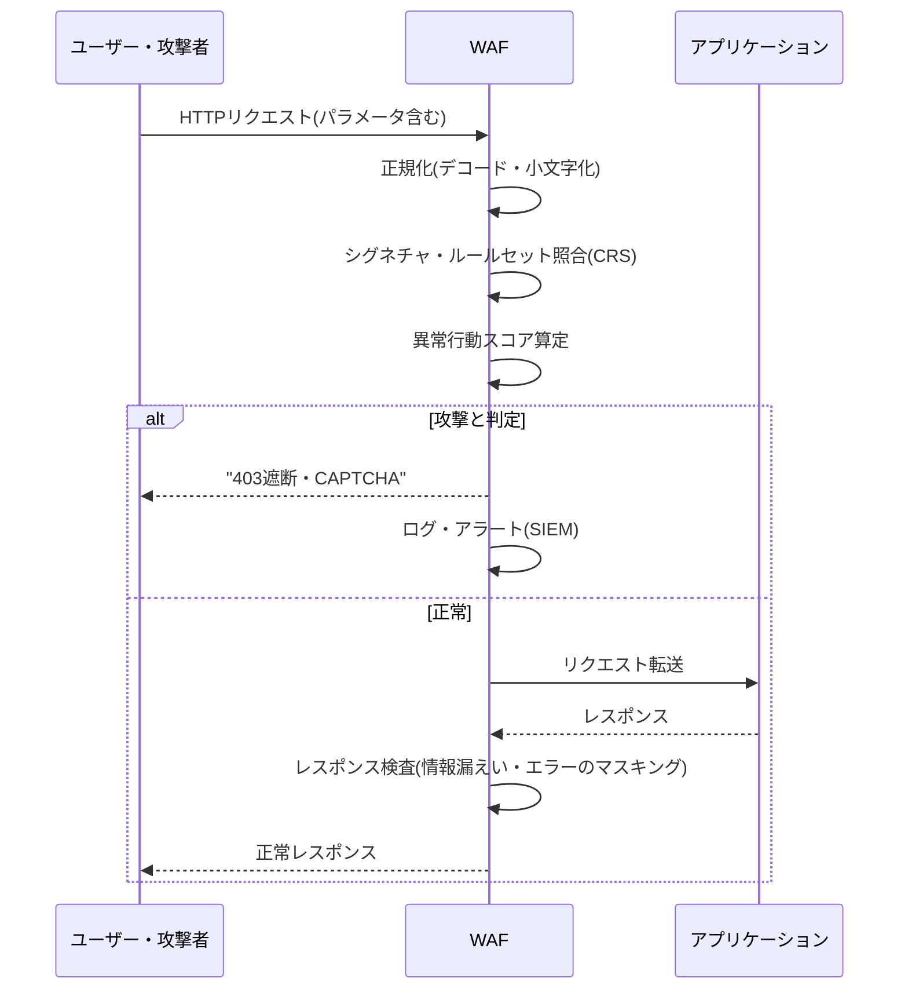

# WAF(Web Application Firewall, Webアプリケーションファイアウォール)

## 1. 概要

### A. 定義および登場背景
> **WAF**は、HTTP/HTTPSトラフィックを**アプリケーション層(L7)で解釈**し、SQLインジェクション・クロスサイトスクリプティング(XSS)など**Webアプリケーションを狙った攻撃パターンを検知・遮断**するセキュリティ機器またはサービスである。ネットワークファイアウォールがポート・IPのレベルで通路を開閉するとすれば、WAFはその通路を通過した**リクエストの内容(payload)と文脈**を理解し、正常なリクエストと攻撃リクエストを区別する。

WAFが登場した根本的な背景は、「**防御の重心がネットワークからアプリケーションへ移った**」という認識の転換にある。従来のネットワークファイアウォールは、3・4層で送信元IP・宛先ポートを基準にアクセスを制御する。しかしWebサービスは、その定義上80/443ポートを誰にでも開放しておかなければならず、攻撃者も正常なユーザーとまったく同じように、その開かれた扉から入ってくる。すなわちファイアウォールの観点からは、SQLインジェクションのリクエストとログインのリクエストは**まったく同じ正常なHTTPトラフィック**に見える。攻撃はペイロードの中に隠れているため、それを除外するにはリクエスト本文を解析し、`' OR 1=1--`のような悪性文字列や`<script>`タグの挿入を理解しなければならない。まさにこの「**内容を理解しなければ判断できない領域**」を担うためにWAFが生まれた。

もう1つの背景は、**攻撃対象領域の移動を示す統計**である。長年にわたる侵害事故分析において、Webアプリケーションの脆弱性は外部からの侵害の最も一般的な侵入経路として指摘されてきた。OWASPは3〜4年周期で`OWASP Top 10`を通じて、インジェクション・認証の脆弱性・アクセス制御の不備などのWeb脆弱性を標準化して発表している。アプリケーションコードを完全に安全に書くことが理想であるが、数百万行のレガシーコードとサードパーティライブラリが絡み合う現実では、すべての脆弱性をソースレベルで除去することは難しい。WAFは、**脆弱性が残っていても、それを狙う攻撃を前段で遮断**することで、根本的な対策が展開されるまでの時間を稼ぐ「**仮想パッチ(Virtual Patching)**」の手段として定着した。

### B. 必要性
Webは、組織の外部公開窓口の中で最も広い面積を占めており、その分攻撃が集中する。規制面でもPCI-DSSは、カード情報を扱うWebアプリケーションに対して**WAFの導入または定期的なコードレビューのいずれかを義務化**しており、韓国の電子金融監督規定・情報保護管理体系(ISMS-P)もWebセキュリティ統制を求めている。自社コードの修正が即座にできない脆弱性に迅速に対応でき、未知のボット・自動化攻撃まで緩衝するという点で、WAFはWebサービスに不可欠な防御層となった。

### C. WAFの中核的特徴
WAFの特徴は3つに集約される。第一に**アプリケーション文脈の認識(Context-aware)**であり、単なるパケットではなく、HTTPメソッド・URL・ヘッダ・Cookie・ボディ・パラメータの意味を解釈して判断する。第二に**双方向検査(Bidirectional)**であり、入ってくる攻撃リクエストだけでなく、出ていくレスポンスでサーバエラー・個人情報・ソースコードが露出することまで遮断する。第三に**仮想パッチによる時間の確保(Shielding)**であり、脆弱性をコードから除去する前であっても、その脆弱性を狙う攻撃を前段で無力化し、対応時間を稼ぐ。この3つの特徴が組み合わさることで、WAFは「脆弱にならざるを得ないWebを、脆弱な状態のまま運用しつつも防御できるようにする」現実的なセキュリティ層として機能する。

## 2. WAFの全体構造と配置方式

WAFは特定の1つのアルゴリズムではなく、**クライアントとWebサーバの間に位置してリクエスト・レスポンスを双方向に検査**するプロキシ型アーキテクチャとして理解すべきである。以下は、リクエストがWAFを通過しながら判定される全体構造図である。



WAF処理の出発点は常に「**正規化(Normalization)**」である。攻撃者は検知を回避するために、URLエンコード・Unicode・二重エンコード・大文字小文字の変形・コメント挿入などでペイロードを偽装する。例えば`SELECT`を`SEL%45CT`や`SeLeCt/**/`に変えれば、単純な文字列比較ではこれを見逃す。したがってWAFは、検査に先立ってリクエストをデコード・小文字化・空白整理し、**1つの標準形に統一**してから検知エンジンに渡す。正規化が不十分であれば、その上のどれほど精緻な検知ルールも回避されるため、正規化はWAF性能の隠れた土台である。続いて検知エンジンがリクエストを検査し、ポリシーエンジンが許可・遮断・ロギングのいずれかに判定し、レスポンス方向でもサーバが漏らすエラーメッセージ・住民登録番号・カード番号の露出を除外する。

### A. 3つの配置(Deployment)方式
WAFを貫く最初の設計上の決定は、「**トラフィック経路のどこに、どのように挟み込むか**」である。**インラインのリバースプロキシ(Reverse Proxy)** 方式は、WAFがWebサーバの前段ですべてのトラフィックを終端(terminate)し、代わりに受け取って検査した後にサーバへ転送する。リクエスト・レスポンスを完全に制御できるため、遮断・書き換え・SSL終端を自在に行えるが、WAFがそのまま単一障害点(SPOF)となり、遅延(latency)が加わるという代償がある。大半の商用WAFとクラウドWAFがこの方式を採る。

**透過ブリッジ/インライン(Transparent Bridge)** 方式は、WAFがIPを持たず、ネットワーク区間にブリッジのように挟まってトラフィックをスニッフィング・遮断する。既存のネットワーク構成を変更しないため導入は簡単であるが、レスポンスの書き換えのような能動的な操作には制約がある。**アウトオブバンド(Out-of-Band)・ミラーリング**方式は、トラフィックのコピーだけを受け取って検知・ロギングのみを行い、実際の遮断は行わないか、TCPリセットで事後対応する。性能への影響がないため監視目的には適しているが、リアルタイムの遮断力は弱い。

実務では、サービスの重要度と許容遅延に応じてこの3方式を組み合わせる。例えば決済・ログインのように必ずリアルタイムの遮断が必要な経路はインラインのリバースプロキシで終端し、遅延に敏感な大容量コンテンツ配信区間はミラーリングで検知のみを行うといった具合である。最近では、アプリケーションサーバの内部にモジュールとして組み込む**組み込み型**(例: Apacheの`mod_security`、Nginxモジュール)と、DNSをサービス提供者に向けるだけで済む**クラウド型SaaS WAF**が広く使われている。組み込み型はサーバリソースを共有するため別途機器が不要という利点があるが、サーバの台数分だけルールを配布・管理しなければならず、クラウド型は世界中のエッジで処理するためスケーラビリティに優れるが、トラフィックが外部を経由するという特性があるため、配置方式の選択そのものが性能・コスト・データ管理権を分けるアーキテクチャ上の意思決定となる。

### B. 検知方式 — ネガティブ・ポジティブセキュリティモデル
WAFの第二の中核原理は、「**何を基準に正常と攻撃を分けるか**」である。**ネガティブセキュリティモデル(Blacklist)**は「**既知の悪いものを防ぐ**」というアプローチであり、SQLインジェクション・XSSなどの攻撃シグネチャ(パターン)を登録しておき、一致するリクエストを遮断する。導入が容易で誤検知(false positive)が少ないが、シグネチャにない新種・変形の攻撃は見逃す可能性がある(検知漏れ、false negative)。オープンソースのルールセットである`OWASP Core Rule Set(CRS)`が代表的であり、ModSecurityのようなエンジンと組み合わせて使用される。

**ポジティブセキュリティモデル(Whitelist)**はその正反対で、「**許可された正常なリクエストのみを通過させ、残りはすべて遮断する**」というアプローチである。各URL・パラメータが受け付けられるデータ型・長さ・形式(例: メールアドレス欄はメールアドレスの正規表現のみ許可)を学習または定義しておき、このプロファイルから外れれば遮断する。理論上はゼロデイ攻撃まで防げるため防御力は最も強いが、アプリケーションの正常な動作を漏れなく定義・学習しなければならないため、構築・維持のコストが大きく、誤検知も増えやすい。実務のWAFは両モデルを併用し、共通の脅威はネガティブ(CRS)で幅広く防ぎ、機微なURLはポジティブで緻密に締め付ける。

### C. 異常行動・機械学習ベースの検知
第三の軸は、「**パターンではなく行動で判断する**」異常行動(Anomaly)検知である。シグネチャ方式だけでは、正常な文法をそのまま用いるクレデンシャルスタッフィング・スクレイピング・異常なリクエストの急増(L7 DDoS)を区別することが難しい。そこで現代のWAFは、セッションごとのリクエスト頻度、User-Agentの分布、パラメータ値の統計的な逸脱、リクエストの順序などを学習して「**普段と異なる行動**」にスコアを付け、閾値を超えれば遮断・チャレンジ(CAPTCHA・JS検証)を行う。特に人間とボットを区別する**ボット管理(Bot Management)**、そして高度な攻撃のパターン変化に追随するMLベースの適応型ルールが、最近のWAFの差別化ポイントとして浮上している。ただし、学習データが偏っていたり正常トラフィックが急変したりすると誤検知が急増するため、初期の一定期間は遮断せずに検知・ロギングのみを行う「**学習モード**」で運用するのが定石である。

### D. WAF導入・チューニングのライフサイクル
WAFは、導入時点よりも導入後の運用が成否を分ける。実務における定着の手順は、概ね次の流れに従う。

1. **資産・トラフィックの識別**: 保護対象のWeb/APIエンドポイントを一覧化し、正常トラフィックの特性(パラメータ・データ型・リクエスト量)を把握する。
2. **検知専用(モニタリング)モードでの運用**: ルールを遮断ではなくロギングのみで一定期間稼働させ、実際のトラフィックでどのような正常リクエストがルールに引っかかるか(誤検知候補)を観測する。
3. **誤検知のチューニング・例外の定義**: 観測された誤検知を分析してルールを緩和したり、特定のURL・パラメータを例外処理したりして、正常な業務を妨げないよう調整する。
4. **遮断モードへの移行**: 信頼性が確保されたルールから順次遮断に切り替え、危険度の高い攻撃群は強く遮断する一方、曖昧なルールは保守的に適用する。
5. **継続的な更新・観測**: 新規CVE・攻撃トレンドに合わせてルールセットを更新し、SIEM連携のダッシュボードで攻撃傾向と誤検知率を常時監視しながらルールを再調整する。

この循環の核心は、「**遮断を急がないこと**」である。検証なしに全面遮断から始めると正常な取引が妨げられてサービスの信頼が崩れ、運用チームはルールを丸ごと無効化するという最悪の選択に追い込まれる。したがってWAFは、SWのデプロイのように段階的・反復的に成熟させる**運用プロセスそのもの**として扱わなければならない。

## 3. 主な防御対象の攻撃と処理フロー

WAFが実際にどのような攻撃をどのように防ぐのかを、OWASP Top 10を中心に見ていく。以下は、1つのリクエストが検知・判定されるプロセスの詳細図である。



代表的な防御対象は次のとおりである。**SQLインジェクション(SQLi)**は、入力値にSQL構文を挿入してDBを操作・窃取する攻撃であり、WAFは`UNION SELECT`、`' OR '1'='1`、インラインコメントなどのパターンと文法の逸脱を検知する。**クロスサイトスクリプティング(XSS)**は、`<script>`・イベントハンドラ・JavaScript URIをレスポンスに埋め込んで他のユーザーのセッションを奪取する攻撃であり、入力・出力の双方向でタグ・エンコードを検査する。**パストラバーサル・ファイルインクルージョン(LFI/RFI)**、**コマンドインジェクション(Command Injection)**、**XML外部エンティティ(XXE)**、**サーバサイドリクエストフォージェリ(SSRF)** なども、それぞれ特徴的なシグネチャで遮断する。

特に実戦でWAFの価値を証明した事例が**仮想パッチ**である。2021年末に世界を襲った`Log4Shell`(Apache Log4jのリモートコード実行、CVE-2021-44228)事態では、多くの組織がライブラリを即座に交換できない状況に置かれた。このとき多数の企業は、`${jndi:ldap://`形式の悪性文字列を検知・遮断するWAFルールを数時間以内に展開し、根本的なパッチが適用されるまで攻撃を防いだ。これは「コードを直せなくても攻撃は防ぐ」というWAFの存在理由を象徴的に示した出来事である。同時にこの事例は限界も露呈した。攻撃者は`${${lower:j}ndi:`のように文字列を細かく分割してルールを回避する亜種を素早く作り出し、防御側は正規化とルールを何度も更新しなければならなかった。これは後述する「仮想パッチは一時しのぎ」という命題を実証している。

実務でもう1つよく引用されるのが、**クレデンシャルスタッフィング・スクレイピングへの防御**である。流出したアカウントリストを投入する自動ログイン試行は、文法上完全に正常なリクエストであるためシグネチャでは捕捉できない。このときWAFの異常行動・ボット管理機能が、IP・セッションごとのログイン失敗率、短時間でのリクエスト急増、ヘッダのフィンガープリント(fingerprint)の異常を根拠にボットを識別し、CAPTCHA・遮断で対応する。特に航空・Eコマースで在庫・価格を収集するスクレイピングボットや、チケットのマクロなどは売上・サービス品質に直接影響を与えるため、最近ではWAF導入の実質的な動機が、従来のインジェクション防御から**ボット・自動化トラフィックの管理**へと重心を移しつつある。

1つのリクエストを例に処理過程を具体化すると、理解が明確になる。攻撃者がログインフォームの`id`パラメータに次のような値を入れたとしよう。

```
id=admin'%20OR%20'1'%3D'1&pw=x
```

WAFはまず、URLエンコードされた`%20`(空白)と`%3D`(=)をデコードして`admin' OR '1'='1`に正規化する。続いてCRSのSQLiルールが、`' OR '1'='1`という常に真(tautology)となる典型的なインジェクションパターンと、引用符・論理演算子がパラメータ値に現れるという文法の逸脱を検知する。異常行動スコアまで合算して閾値を超えれば、リクエストはアプリケーション(DB)に届く前に`403`で遮断され、元のペイロード・送信元IP・一致したルールIDがログに残り、SIEMの相関分析に活用される。このようにWAFは、「**サーバが危険なクエリを実行する前の段階でリクエスト自体を無力化**」するという点で、事後検知ツールとは根本的に異なる。

### A. WAFと類似・連携技術の比較
WAFは単独で完結するものではなく、隣接するセキュリティ技術との役割分担が重要である。以下の表は比較の整理であるが、その違いが生じる理由も併せて理解すべきである。

| 区分 | 動作層 | 検査対象 | 主な防御目的 | WAFとの関係 |
|------|-----------|-----------|--------------|--------------|
| ネットワークファイアウォール | L3/L4 | IP・ポート・セッション | 通路の開閉 | WAFの下位層、相互補完 |
| IPS(侵入防止) | L3~L7 | 広範なネットワーク攻撃 | 既知の攻撃シグネチャの遮断 | Web特化の深さではWAFが優位 |
| WAF | L7(HTTP) | リクエスト/レスポンスのペイロード・文脈 | Webアプリ攻撃の遮断 | Webアプリケーション専任 |
| RASP | アプリのランタイム内部 | 実行コンテキスト・データフロー | 実行時点の攻撃遮断 | 文脈の精度が高い、WAFと併用 |
| API Gateway | L7(API) | APIスキーマ・認証・クォータ | APIアクセス制御 | WAF機能の一部を内蔵する傾向 |

IPSとWAFの決定的な違いは、「**Webの文脈を理解しているか**」にある。IPSもL7シグネチャを持つが、ネットワーク全体を広く走査することに重点があるため、セッション・パラメータ・エンコードが絡み合うWeb攻撃の微妙な変形を深く解釈することはできない。

一方、**RASP(Runtime Application Self-Protection)**は、アプリケーション内部で実際の実行経路とデータフローを見るため誤検知が少なく正確であるが、言語・フレームワークに依存し、性能負荷がある。WAFがアプリケーションの「外側」でリクエストを見て推定するとすれば、RASPは「内側」で実際の実行結果を見て判断するといえ、両者は競合関係ではなく、互いの死角を埋める補完関係にある。実務では、WAFで前段を広く防ぎ、RASPで中核トランザクションを精密に補強する**多層防御(Defense in Depth)**が推奨され、ここにセキュアコーディング・SAST/DASTのような開発段階の統制まで加わって、はじめてWebセキュリティが完結する。

## 4. 深掘り — クラウドWAFとWAAPへの進化

最近のWAF市場における最大の潮流は、**オンプレミスのアプライアンス型からクラウドベースのサービス型(SaaS WAF)への転換**である。AWS WAF、Azure WAF、Cloudflare、AkamaiなどはDNSをサービス提供者に向けるだけで世界中のエッジでトラフィックを検査・遮断し、CDN・L7 DDoS防御と組み合わせて大容量攻撃も吸収する。機器の導入・保守の負担がなく、ルールセットが自動更新されるという利点から、新規サービスではクラウドWAFを基本的な選択肢とするケースが増えている。ただし、トラフィックが第三者のインフラを経由するため、**SSL復号地点の信頼性の問題とデータ主権(Data Sovereignty)** の問題、そしてベンダーロックイン(lock-in)が新たな考慮事項として浮上している。

もう1つの進化は、個別機能の統合、すなわち**WAAP(Web Application and API Protection)**への拡張である。ガートナーは、従来のWAFに**ボット管理・L7 DDoS防御・APIセキュリティ**を統合した概念としてWAAPを定義している。APIファースト(API-First)アーキテクチャとマイクロサービスが普及するにつれ、人が見るWebページだけでなく、機械が呼び出すAPIエンドポイントが新たな攻撃対象領域となったためである。APIはスキーマ(OpenAPI仕様)が明確であるためポジティブモデルを適用しやすい対象であり、WAAPはスキーマ検証・認証トークンの検査・異常な呼び出しの検知を併せて行う。この観点から、WAFは独立した製品から、**APIゲートウェイ・CDN・ゼロトラストアクセス制御と融合する統合エッジセキュリティプラットフォーム**の一翼へと再編されつつある。

予想される出題傾向としては、▲WAFの検知モデル(ネガティブ vs ポジティブ)のトレードオフを記述し、特定の状況での選択を論ぜよ ▲Log4Shellなどの実例を挙げて仮想パッチの意味と限界を論ぜよ ▲クラウドWAF導入時のSSL復号・データ主権の観点からの考慮事項を提示せよ ▲WAF・IPS・RASPを比較し、多層防御の設計方策を提示せよ、などが有力である。

## 5. 考慮事項および示唆(技術士の視点)

WAFを成功裏に定着させるには、「機器の導入」ではなく「運用能力とプロセス」の観点からアプローチしなければならない。技術士の答案では、次のトレードオフと戦略を併せて論じるべきである。

- **誤検知と検知漏れのバランス(精度-可用性のトレードオフ)**: WAFの最大の難題は、正常なユーザーをブロックする誤検知である。遮断ルールを強くするほど検知漏れは減るが、正常な取引が妨げられて売上・評判の損失につながる。したがって新規ルールは、必ず「検知専用モード」で十分に観測してから遮断に切り替え、例外(whitelist)をきめ細かくチューニングする**段階的適用戦略**が必要である。WAFは「設置すれば終わり」ではなく、**継続的なチューニングを前提とした運用型の統制**であると認識しなければならない。

- **暗号化トラフィックとSSL/TLS復号**: 今日のトラフィックの大半はHTTPSであるため、WAFがペイロードを検査するにはSSLを復号しなければならない。これは性能負荷とともに、**復号地点で平文の機微情報が露出するという新たなリスク**を生む。復号鍵の管理(HSM連携)、検査後の再暗号化、PFS(Perfect Forward Secrecy)環境における検査方式を併せて設計しなければならない。

- **仮想パッチは一時しのぎであるという限界の認識**: WAFのルールベースの遮断は根本的な対策ではない。攻撃者はルールを回避する変形を絶えず試みるため、仮想パッチで時間を稼いだ後は、必ず**ソースコードの修正・セキュアコーディング・SAST/DAST**によって脆弱性を除去しなければならない。WAFを理由にコードのセキュリティをおろそかにすれば、かえってリスクが蓄積する。

- **DevSecOps・可観測性との統合**: WAFルールもコードと同様に、バージョン管理・テスト・自動デプロイ(Policy as Code)の対象として扱わなければ、デプロイの速度に追随できない。WAFのログをSIEM・SOARと連携すれば、攻撃検知から対応・遮断までの自動化(プレイブック)が可能になり、ダッシュボードで攻撃傾向を観測してルールを先制的に調整できる。

- **性能・スケーラビリティとSPOFへの対応**: インラインWAFは遅延と単一障害点を引き起こすため、冗長化・オートスケーリング・フェイルオープン/フェイルクローズのポリシーを明確に定義しなければならない。特にフェイルオープン(障害時にトラフィックを通過させる)とフェイルクローズ(障害時に遮断する)のどちらを選ぶかは、可用性とセキュリティのどちらを優先するかという組織の経営判断であり、サービスの特性に応じて変えるべきである。

- **規制・認証への準拠と説明責任**: WAFは、PCI-DSSのWebセキュリティ要件、ISMS-PのWeb脆弱性統制、電子金融監督規定などのコンプライアンス対応手段としても機能する。ただし監査の局面で意味を持つためには、「遮断した」という結果だけでなく、ルール変更履歴・遮断ログ・例外承認記録も併せて保存されていなければならないため、WAFポリシーを変更管理(構成管理)体系に組み込み、誰が・いつ・なぜルールを変更したのかを追跡可能な状態に保つ必要がある。

- **連携技術および展望**: WAFは、ゼロトラスト・CDN・APIゲートウェイ・クラウドネイティブセキュリティと融合しながら、WAAP・エッジセキュリティへと収束しつつある。生成AIを活用した攻撃ペイロードの自動変形が増えるにつれ、防御側もMLベースの適応型検知と脅威インテリジェンス連携を強化する方向へ進化する見通しである。ただしAIベースの検知は、判断根拠を説明しにくいブラックボックス問題を抱えており、誤検知発生時の原因究明と監査対応のための説明可能性(XAI)の確保が今後の課題として残る。

## 参考資料
- OWASP, "Web Application Firewall" および "OWASP Top 10", https://owasp.org/www-project-top-ten/
- OWASP, "Core Rule Set (CRS)", https://coreruleset.org/
- OWASP, "Virtual Patching Best Practices", https://owasp.org/www-community/Virtual_Patching_Best_Practices
- Gartner, "Web Application and API Protection (WAAP)", https://www.gartner.com/en/information-technology/glossary/web-application-firewall-waf
- MITRE, "CVE-2021-44228 (Log4Shell)", https://nvd.nist.gov/vuln/detail/CVE-2021-44228

---
> **一言まとめ**: WAFは、HTTPトラフィックをL7で解釈し、SQLi・XSSなどのWebアプリケーション攻撃を正規化→シグネチャ(ネガティブ)・プロファイル(ポジティブ)・異常行動の検知によって遮断する防御層であり、仮想パッチによって脆弱性対応の時間を稼ぎ、クラウドWAF・WAAPへと進化しつつも、誤検知のチューニング・SSL復号・SPOF・コードセキュリティの併用が中核的な課題である。
