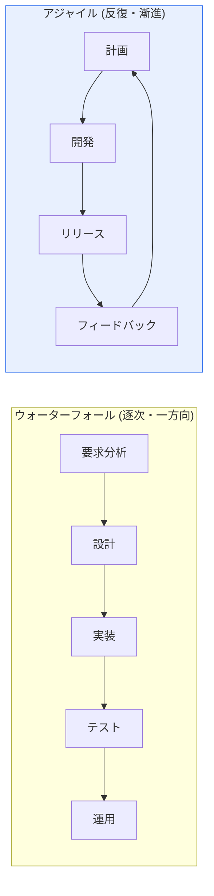

# ウォーターフォール(Waterfall)とアジャイル(Agile)開発方法論の比較

## 1. 概要

### A. 定義
> **ウォーターフォールモデル**は、要求分析→設計→実装→テスト→運用を、滝が流れ落ちるように逐次的・一方向に進める伝統的な方法論であり、**アジャイル**は、2〜4週間の短い反復(Iteration/Sprint)で動作するソフトウェアを段階的に作り上げ、変化に柔軟に対応する方法論である。

2つの方法論の対立は、結局のところ「**変化(Change)をどう捉えるか**」という哲学の違いに帰着する。ウォーターフォールは変化を**コストとリスク**とみなし、前段階で要求を完全に確定させ、その後の変更を統制・最小化することで予測可能性を確保しようとする。一方アジャイルは、変化を**避けられないもの、むしろ価値あるもの**として受け入れ、反復のたびに実際に動作する成果物を顧客に見せ、フィードバックによって方向を修正する。この根本的な視点の違いが、文書化・顧客参加・リスク管理など、あらゆる実践方式の違いを生む。

### B. 登場背景
ウォーターフォールは1970年代、大規模で安定したシステム(国防・製造)の開発において、体系的な管理のために定着した。しかし要求が頻繁に変わり、市場投入のスピードが重要なWeb・モバイルの時代が到来すると、「完璧な計画は不可能である」という認識から、2001年に**アジャイルソフトウェア開発宣言(Agile Manifesto)** が登場した。「計画に従うことよりも変化への対応を、包括的なドキュメントよりも動くソフトウェアを重視する」という価値がその核心である。

## 2. プロセス構造の比較

ウォーターフォールでは各段階が完了してはじめて次へ進むため、プロジェクトの終盤になってようやく完成品を見ることができる。この構造の致命的な弱点は、**欠陥や要求の誤解が後半に発見されるほど、修正コストが指数関数的に大きくなる**という点である(要求段階の欠陥を運用段階で修正すると、コストは数十〜数百倍になる)。一方アジャイルは、反復のたびに動作する成果物が生まれるため、問題や誤解を**早期に・頻繁に発見**して修正コストを下げる。

## 3. 特徴および長所・短所の比較

ウォーターフォールの長所は、計画・スケジュール・成果物が明確であるため**管理と監理が容易**であり、要求が安定した大規模プロジェクトにおいて予測可能性が高いことである。短所は、変更に弱く、顧客が終盤になってようやく結果を確認するため、方向を誤るリスクが大きいことである。アジャイルの長所は、**変化への対応力と迅速な価値提供**、リスクの早期発見であるが、短所は、成果物・スコープが流動的であるため大規模・契約型の事業には適用が難しく、チームの熟練度と自律性によって成果が大きく左右されることである。

| 区分 | ウォーターフォール | アジャイル |
|---|---|---|
| **進め方** | 逐次的・段階完結型 | 反復・漸進的 |
| **要求変更** | 困難(初期に確定・統制) | 柔軟に受け入れる |
| **文書化** | 詳細・重視 | 最小化(動くSWを優先) |
| **顧客参加** | 初期・終了時が中心 | 全過程で継続的に参加 |
| **結果の確認** | 終盤に一括 | 反復ごとに確認 |
| **長所** | 管理・監理が容易、予測可能性 | 変化への対応、迅速な価値提供・リスクの早期発見 |
| **短所** | 変更に弱い、後半の欠陥が高コスト | スコープ管理が難しい、熟練度に依存 |

## 4. 選択基準とハイブリッド

方法論に正解はなく、あるのは**プロジェクト特性への適合性**だけである。要求が明確で、規制・安全性が重要な組込み・公共・金融の基幹システムにはウォーターフォール(またはVモデル)が適しており、要求が不確実で市場対応のスピードが重要なWeb・モバイルサービスにはアジャイルが有利である。現実の大規模プロジェクトでは、上位の計画はウォーターフォールのように、開発はアジャイルのように運営する**ハイブリッド(Water-Scrum-Fall)** や、SAFe・LeSSのような**大規模アジャイルフレームワーク**によって折衷する。

## 5. 考慮事項および示唆

1. **方法論よりもチームの能力・組織文化が成功を左右**する。アジャイルは、自律的・協力的なチーム文化が前提とならなければ「名ばかりアジャイル」となって失敗する。
2. **文書化のバランス**が必要である。アジャイルが文書を最小化するからといって、トレーサビリティ・保守に必要な最小限の文書まで無くしてはならない。
3. DevOps・CI/CDと組み合わせたときに、アジャイルの「迅速な価値提供」が実際に実現され、最近ではこの組み合わせが標準となりつつある。

---

> **一言まとめ**: ウォーターフォールは変化を統制して*予測可能性*を、アジャイルは変化を受け入れて*柔軟性と迅速な価値提供*を追求するものであり、要求の安定性・規制・市場スピードなどのプロジェクト特性に応じて選択するかハイブリッドで折衷するが、成功の鍵はチームの能力と文化である。
