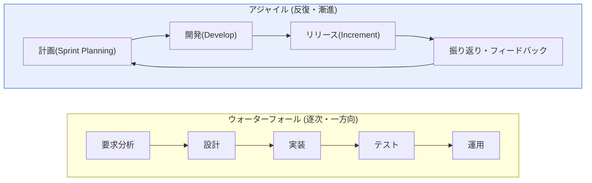
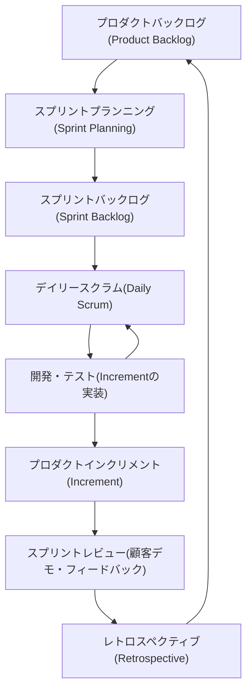

# ウォーターフォール(Waterfall)とアジャイル(Agile)開発方法論の比較

## 1. 概要

### A. 定義

> **ウォーターフォール(Waterfall)モデル**とは、要求分析→設計→実装→テスト→運用の各段階を、滝が上から下へ落ちるように逐次的・一方向に進め、各段階が完了・承認されて初めて次の段階へ移行する、計画駆動(Plan-driven)・文書中心の伝統的な開発方法論である。
>
> **アジャイル(Agile)**とは、2~4週間単位の短い反復(Iteration/Sprint)で「動くソフトウェア(Working Software)」を漸進的に引き渡し、反復ごとに顧客のフィードバックを受けて方向を修正する、変化適応(Change-adaptive)・経験主導(Empirical)の方法論である。

二つの方法論の対立は、表面的には「逐次対反復」というプロセスの違いに見えるが、その根は**「変化(Change)をどう捉えるか」という哲学の違い**にある。ウォーターフォールは変化を**コストとリスクの源泉**とみなす。そのため前段階で要求をできる限り完全に確定し、その後に生じる変更は構成管理(Configuration Management)と変更管理委員会(CCB)によって統制・最小化することで、予測可能性(Predictability)を確保しようとする。この観点から見れば、良いプロジェクトとは「計画どおりに進むプロジェクト」である。

一方アジャイルは、変化を**避けられないものであり、むしろ競争優位を生み出す価値**として受け入れる。市場・技術・顧客の要求はプロジェクト期間内に必ず変わるという前提に立ち、反復ごとに実際に動く成果物を顧客に見せ、そのフィードバックによって次の計画を再調整する。この観点から見れば、良いプロジェクトとは「計画をよく守ったプロジェクト」ではなく、「最も価値のあるものを最も早く引き渡したプロジェクト」である。この根本的な観点の違いが、文書化の水準、顧客参加の時期、リスク管理の方式、品質確保の戦略など、以降のあらゆる実践(Practice)の違いを派生させることを理解するのが、二つの方法論を比較するうえでの要点である。

### B. 登場の背景と必要性

ウォーターフォールモデルは、1970年にWinston Royceが論文で示した逐次モデルに由来する。興味深いことに、Royceはこの単線的なモデルの危険性を警告してフィードバックループを強調したが、実務では管理・契約がしやすい一方向の形だけが広く採用された。1970~80年代の大規模で安定したシステム(国防、航空、製造制御)では、要求が比較的明確で変更もまれであったため、段階ごとの成果物と承認ゲートで進捗を管理するウォーターフォールがよく適合した。米国防総省の標準(DoD-STD-2167A)などがこの方式を制度化したことで、ウォーターフォールは事実上の業界標準となった。

しかし1990年代後半、Web・インターネットの普及によって状況は一変した。要求は開発途中でも頻繁に変わり、市場投入の速度(Time-to-Market)が品質と同じくらい重要になり、「完璧な事前計画は不可能である」という認識が広まった。こうした背景のもと、2001年に17人のソフトウェア専門家が集まり、**アジャイルソフトウェア開発宣言(Agile Manifesto)**を発表した。その4つの価値は、①プロセスやツールよりも**個人と対話**、②包括的なドキュメントよりも**動くソフトウェア**、③契約交渉よりも**顧客との協調**、④計画に従うことよりも**変化への対応**である。この宣言は特定の技法ではなく、XP・スクラム・カンバン・FDDなど多様な軽量(Lightweight)方法論を包括する共通の価値体系として、今日のソフトウェア開発の主流パラダイムとなった。

## 2. プロセス構造の比較

ウォーターフォールとアジャイルの最も目立つ違いは、「完成品をいつ見られるか」である。以下の図は、二つの方法論の全体的な流れを対比した構造図である。

ウォーターフォールでは各段階が完了して初めて次へ進むため、実行可能な完成品はプロジェクトの**後半(テスト段階以降)**になってようやく現れる。この構造の致命的な弱点は、**欠陥や要求の誤解が後半に発見されるほど、修正コストが指数関数的に増大する**点である。Barry Boehmのコスト増加曲線の研究によれば、要求段階で発見すれば1のコストで直せる欠陥が、設計段階では数倍、運用段階では数十~数百倍のコストを要する。要求を誤解したまま6か月開発した後に、ようやく顧客が「これではない」と言う状況が、ウォーターフォールの典型的な失敗シナリオである。

一方アジャイルは、スプリントが終わるたびに「潜在的にリリース可能なプロダクトインクリメント(Potentially Shippable Increment)」を生み出す。そのため問題や要求の誤解を**早期に、そして頻繁に**発見し、修正コストを下げる。ただしこれはただではない。反復ごとに計画・開発・統合・テストを繰り返すため、会議・調整のオーバーヘッドが発生し、蓄積されたインクリメントが一貫したアーキテクチャを保つよう、継続的なリファクタリングと技術的負債の管理が必要となる。

具体的に対比するため、12か月・10人規模の顧客ポータル構築を想定してみよう。ウォーターフォールであれば、最初の4か月を要求・設計に費やし、5~10か月目に実装、11~12か月目に結合テストを行うため、顧客は11か月目になって初めて実際の画面を目にする。このとき「検索がこのように動くとは思わなかった」というフィードバックが出れば設計に立ち戻らなければならず、残り1か月では対応しきれずにスケジュール・予算が超過する。同じプロジェクトを2週間スプリント24回に分けたアジャイルであれば、最初の1か月以内にログイン・検索の初期版をデモしてフィードバックを受け、2回目のスプリントで方向をすぐに修正する。同じ誤解であっても、発見時点が11か月目か1か月目かによって修正コストに数十倍の差が生じることが、二つの構造の本質的な違いを凝縮して示している。

### A. アジャイルの反復(Sprint)内部の流れ

アジャイルが実際にどう機能するかを理解するには、一つの反復の内部をのぞく必要がある。以下は、スクラム(Scrum)を基準としたスプリント内部のイベント・成果物の流れである。

この流れにおいて、各要素は固有の役割を担う。**プロダクトバックログ**は優先順位付けされた要求のリストであり、ウォーターフォールの「要求仕様書」とは異なり固定されず、継続的に洗練される(Grooming)。**スプリントプランニング**では、チームが今回の反復に含める項目を自ら選択(Pull)するが、この自律的な選択がチームのコミットメント(Commitment)を生む。**デイリースクラム**は15分程度の短い同期ミーティングであり、進捗と障害(Impediment)を毎日共有して問題を1日単位で早期に表面化させる。**スプリントレビュー**では実際に動くインクリメントを顧客にデモしてフィードバックを受け、**レトロスペクティブ**ではプロダクトではなく「チームの働き方」を改善する。このようにアジャイルは、「検査と適応(Inspect & Adapt)」という経験的プロセス制御を、緻密なフィードバックループとして実装したものである。

## 3. 特徴および長所・短所の比較

### A. ウォーターフォールの強みと弱み

ウォーターフォールの中核的な強みは、**管理・監理のしやすさと予測可能性**である。段階ごとに明確な成果物(要求仕様書、設計書、テスト計画書)と完了基準が定義されるため、進捗を客観的に測定し、外部の監理・監査に対応しやすい。固定価格(Fixed-price)契約や公共調達のように、「何を、いつまでに、いくらで」を事前に確定しなければならない状況では、この予測可能性が決定的な利点となる。要求が安定した大規模システムでは、この方式は今なお合理的である。

弱みはこの強みの裏返しである。要求を初期に確定するという前提は現実にはしばしば崩れ、変更が入ると前の段階へさかのぼらなければならないためコストが大きい。何よりも、顧客が**プロジェクト後半になって初めて成果物を目にする**点が、方向を誤るリスクを高める。「文書上は完璧だったが、実際に作ってみると役に立たないシステム」が、ウォーターフォールの代表的な失敗パターンである。

### B. アジャイルの強みと弱み

アジャイルの強みは、**変化への対応力、迅速な価値提供、リスクの早期発見**である。優先度の高い機能から引き渡すため、顧客はプロジェクトの初期から価値を実感でき、方向が誤っていれば大きな損失が出る前に修正できる。失敗したとしても「早く、安く失敗する(Fail Fast)」ことで学習へと転換する。

弱みは、成果物・範囲が流動的であることに起因する。全体の範囲と終了時期を事前に確定しにくいため、固定価格契約や大規模調達への適用が難しく、文書最小化の原則が誤用されると追跡性・保守性が損なわれる。また成果が**チームの熟練度・自律性・協働文化に大きく左右される**ため、指示・統制型の組織にそのまま移植すると「名ばかりアジャイル(Fake Agile)」に陥りやすい。

品質確保の方式の違いも指摘に値する。ウォーターフォールがテストを別の段階として切り離し、完成後に検証する「事後品質(Quality Control)」に近いのに対し、アジャイルはテスト駆動開発(TDD)・継続的インテグレーション(CI)・ペアプログラミングのように、開発と品質活動を融合させた「作り込み品質(Built-in Quality)」を志向する。例えば、コミットのたびに自動テストが実行されるCI環境では、欠陥はそれが持ち込まれた当日に発見され、修正コストが最小化される。これはアジャイルが「迅速な反復」を維持できる技術的な土台であると同時に、自動テストなしにアジャイルをまねたときに品質が急激に崩れる理由でもある。

| 区分 | ウォーターフォール | アジャイル |
|---|---|---|
| **進め方** | 逐次的・段階完結型 | 反復・漸進的 |
| **要求変更** | 困難(初期に確定・統制) | 柔軟に受け入れる |
| **文書化** | 詳細・重視 | 最小化(動くSW優先) |
| **顧客参加** | 初期・終了時中心 | 全過程で継続的に参加 |
| **成果の確認** | 後半に一括 | 反復ごとに確認 |
| **契約形態** | 固定価格(Fixed-price)に適合 | タイム&マテリアル(T&M)・段階的契約に適合 |
| **リスクの露出** | 後半に集中 | 初期・分散 |
| **成功の鍵** | 計画・文書の完成度 | チームの能力・協働文化 |
| **長所** | 管理・監理が容易、予測可能性 | 変化への対応、迅速な価値提供・リスクの早期発見 |
| **短所** | 変更に弱い、後半の欠陥が高コスト | 範囲管理の難しさ、熟練度への依存 |

### C. Vモデル・スパイラルモデルとの関係

ウォーターフォールは孤立した一つのモデルではなく、多くの派生モデルの原型である。**Vモデル**は、ウォーターフォールの各開発段階(要求・基本設計・詳細設計)に対応するテスト段階(受入テスト・結合テスト・単体テスト)を左右対称に配置し、開発の初期から検証計画を併せて策定するよう強制した変形である。これはウォーターフォールの「テストが後半に集中する」という弱点を補おうとする試みであり、組込み・医療・国防のように検証の追跡性が重要な分野で広く使われている。**スパイラル(Spiral)モデル**は、リスク分析を各サイクルの中心に据えてプロトタイピングを繰り返すモデルであり、ウォーターフォールの計画性と反復によるリスク管理を組み合わせた、アジャイルの理論的な先駆けとみることができる。

この系譜を理解すれば、「ウォーターフォール対アジャイル」が白黒の対立ではなく一つのスペクトルであることが分かる。純粋なウォーターフォール → Vモデル → スパイラル → 反復漸進(RUP) → アジャイルへと続く流れは、「計画の完結性」から「リスクの早期解消と適応」へと重心が徐々に移ってきた歴史である。したがって実務での選択は、このスペクトル上のどの地点をとるかという問題であって、二者択一で排他的に選ぶ問題ではない。

表だけでは「なぜ」このような違いが生じるのかは分からない。例えば「文書化」の項目の違いは単なる好みではなく、ウォーターフォールが「段階間の知識伝達を文書で行う」という前提に、アジャイルが「同じチームの対面の会話で知識を伝達する」という前提に立っているためである。文書化の水準の違いは、すなわち知識伝達メカニズムの違いから生じる必然的な帰結なのである。

## 4. 選択基準とハイブリッド戦略

### A. 状況別の選択基準

方法論に優劣があるのではなく、**プロジェクト特性に対する適合性(Fit)**があるだけである。選択の主要な変数は、①要求の不確実性、②規制・安全性の水準、③市場対応の速度、④契約形態、⑤チームの成熟度である。要求が明確で規制・認証(例: 医療機器のIEC 62304、航空のDO-178C、金融の勘定系)が重要な組込み・公共・セーフティクリティカルなシステムには、ウォーターフォール(または検証を強化したVモデル)が適している。逆に、要求が不確実で迅速な実験・リリースが重要なWeb・モバイル・スタートアップのサービスには、アジャイルが有利である。

ここで最も決定的な単一の変数を挙げるなら、**要求の不確実性**である。要求が安定していれば事前計画の精度が高く、ウォーターフォールの予測可能性がそのまま利点となるが、要求が不確実であれば、いかに精緻な計画もすぐに無効となり、計画策定に費やした労力は埋没コストとなる。このため「要求がどれほど確定的か」を着手前に冷静に診断することが方法論選択の出発点であり、不確実性が高いにもかかわらず管理のしやすさを理由にウォーターフォールを選ぶことが、現場で最も頻繁に見られる判断ミスである。

### B. ハイブリッドと大規模アジャイル

現実の大規模プロジェクトは、両極端の間の折衷を選ぶ。上位のガバナンス・予算・マイルストーンはウォーターフォールのように計画し、実際の開発はアジャイルのように反復する**ウォーター・スクラム・フォール(Water-Scrum-Fall)**が代表的である。組織全体にアジャイルを拡大する際には、**SAFe(Scaled Agile Framework)**、**LeSS(Large-Scale Scrum)**、**Spotifyモデル(Squad・Tribe・Chapter・Guild)**といった大規模フレームワークが用いられる。例えばSAFeは、複数のチームを一つの「アジャイルリリーストレイン(ART)」に束ね、8~12週間単位の「PI(Program Increment)プランニング」で多数のチームの計画を同期させることで、アジャイルの柔軟性と大規模組織の整合(Alignment)を同時に追求する。ただし、フレームワークの導入そのものがアジャイルを保証するわけではなく、むしろ手続きが重くなるという逆説に警戒すべきである。

### C. 誤った適用のアンチパターン

方法論の選択よりもよくある失敗は、「選択は正しかったが適用を誤った」場合である。ウォーターフォール側の代表的なアンチパターンは**文書のための文書**であり、誰も読まない成果物を形式的に埋めるために、本来設計・検証に使うべき時間を消費してしまうことである。要求を初期に「完全に」確定しようとする強迫観念が分析麻痺(Analysis Paralysis)を生み、着手が遅れるのも同じ根をもつ問題である。

アジャイル側の代表的なアンチパターンは**「名ばかりアジャイル(Fake Agile)」**である。デイリースクラムが進捗報告・叱責の場に変質したり、自律的なチームではなく上からスプリントの範囲が強制的に割り当てられたり、レトロスペクティブで出た改善案が実行されないまま繰り返されたりする場合がそれにあたる。もう一つは**文書最小化の誤用**であり、保守・引き継ぎに必要な最低限のアーキテクチャ決定記録(ADR)すら残さず、技術的負債が蓄積することである。こうしたアンチパターンは方法論自体の欠陥ではなく、文化・リーダーシップの問題であるため、方法論を転換する際には組織の働き方と評価・報酬体系を併せて変えなければならないことを教えてくれる。

## 5. 深掘り: 最新動向と実務適用事例

方法論をめぐる議論は、2010年代以降、**DevOps・CI/CDとの結合**によって新たな局面に入った。アジャイルが「何を、なぜ、どの順序で作るか」を扱うとすれば、DevOpsは「作ったものをいかに安定的に・頻繁にデプロイするか」を扱う。この二つが結合して初めて、アジャイルの「迅速な価値提供」がデモ段階ではなく実際の本番環境へとつながる。GoogleのDORA(DevOps Research and Assessment)の研究は、デプロイ頻度、変更のリードタイム、変更失敗率、平均復旧時間(MTTR)という四つの指標でソフトウェアデリバリーの成果を測定し、高成果組織は1日に何度もデプロイしながら低い失敗率を維持していることを示した。これは「頻繁にデプロイすると不安定になる」という通念とは逆に、小さく・頻繁にデプロイするほどかえって安定するという、アジャイル・DevOpsの中核的な洞察をデータで裏付けている。

実務事例を見ると、方法論選択の論理が明確になる。Netflix・Amazonのような企業は、マイクロサービスとCI/CDパイプラインの上で1日に数千回デプロイする極端なアジャイル・DevOpsを実践しているが、これはサービスの要求が速く変わり、失敗のコストが局所的だからである。逆に、航空機の飛行制御ソフトウェア(DO-178C認証の対象)や原子力制御システムは、一つの変更が人命に直結するため、広範な事前検証と追跡性を要求する計画駆動の方式を維持している。最近では規制産業においても、文書・検証は厳格にしつつ開発は反復的に進める「規律あるアジャイル(Disciplined Agile, DA)」が広がっており、二つの方法論は対立ではなく、スペクトル上で状況に応じて組み合わされる方向に収束しつつある。

移行の教訓を示す事例もある。アジャイル普及の初期には、健康保険ポータルのように大規模・多組織・厳格な締め切りを持つ公共システムが、準備なしにアジャイルを掲げた結果、統合・ガバナンスの不在によって初期稼働に失敗した事例が報告された。こうした経験は「アジャイルは万能」という素朴な期待を取り払い、大規模ではチーム間の統合・アーキテクチャの整合・リリース調整といった規律を必ず併せて行わなければならないことを教えた。逆に、要求が速く変わる消費者向けサービスでウォーターフォールに固執した結果、リリース時点ではすでに市場が変わっていたという失敗もよくある。どちらの失敗も「方法論そのもの」ではなく、「特性に合わない選択」に起因するという共通点を持つ。

さらに最近では、AIコーディングアシスタントと生成AIの普及によって開発の反復周期が一層短くなり、要求・設計段階においてもプロトタイプを素早く作って検証する「アジャイル的な探索」の比重が高まっている。これは、方法論の重心が「計画の完成度」から「学習と適応の速度」へとさらに移りつつあることを示唆している(ただし、産業・組織ごとのばらつきが大きいため、一般化には注意が必要である)。

## 6. 考慮事項および示唆(技術士の観点)

1. **方法論よりもチームの能力・組織文化が成功を左右する。** アジャイルは、自律的・協働的なチーム文化や、失敗を学習として受け入れる心理的安全性が前提になければ、「名ばかりアジャイル」として失敗する。ツール・プロセスの導入に先立ち、組織の成熟度を診断して段階的に移行する変革管理(Change Management)を先行させなければならない。

2. **文書化のバランスを設計しなければならない。** アジャイルの文書最小化は「不要な文書をなくそう」ということであって、「文書をなくそう」ということではない。追跡性・保守・監査対応に必要な「必要十分な(Barely Sufficient)」文書の水準をプロジェクトの特性に合わせて定義することが、技術士の判断領域である。

3. **契約・ガバナンスとの整合性を確保しなければならない。** 固定価格・確定範囲の契約にアジャイルをそのまま適用すると、範囲の統制と精算で衝突が生じる。段階的な引き渡しに合った契約モデル(段階別精算、バックログに基づくT&M、成果ベース契約)と、予算・監理の体系を併せて設計して初めて方法論が機能する。

4. **DevOps・CI/CD・自動テストとの結合が不可欠である。** アジャイルの迅速な反復は、手作業のデプロイ・テストでは持続できない。継続的インテグレーション・デプロイのパイプライン、自動テスト、インフラのコード化(IaC)、オブザーバビリティ(Observability)を併せて構築して初めて、「迅速な価値提供」が実際の運用へとつながる。

5. **ハイブリッドは「折衷」ではなく「設計」の対象である。** 単に上位はウォーターフォール・下位はアジャイルと分けるのを超えて、どの階層で計画を固定し、どの階層で適応を許容するかを、リスク・規制・市場速度に基づいて意図的に設計しなければならない。無原則な混用は、二つの方法論の短所だけを組み合わせた結果を生む。

## 参考資料
- Agile Manifesto, https://agilemanifesto.org/
- Scrum Guide (2020), https://scrumguide.org/
- Scaled Agile Framework (SAFe), https://scaledagileframework.com/
- Google Cloud DORA / DevOps研究, https://dora.dev/

---

> **一言まとめ**: ウォーターフォールは変化を統制して*予測可能性*を、アジャイルは変化を受け入れて*柔軟性と迅速な価値提供*を追求する相反する哲学の方法論であり、要求の安定性・規制・市場速度・契約形態に応じて選択するか、Water-Scrum-Fall・SAFeなどで折衷し、DevOps・CI/CDとの結合とチームの能力・組織文化が最終的な成功を左右する。
