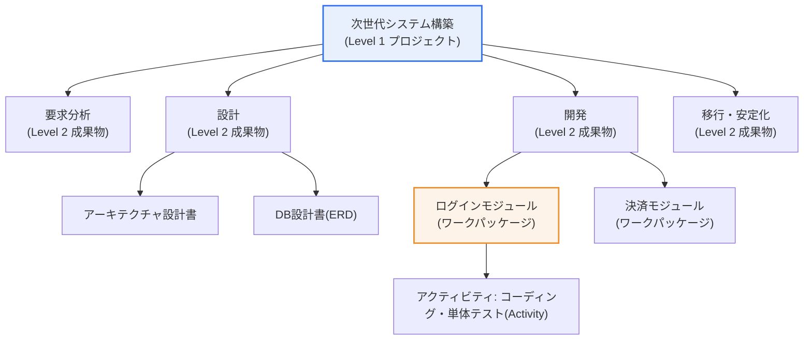

# 作業分解構成(WBS, Work Breakdown Structure)

## 1. 概要

### A. 定義
> プロジェクトの**全体スコープ(成果物)を、管理可能な小さな作業単位へと階層的に分解**した成果物指向(Deliverable-oriented)の階層構造。スコープ・スケジュール・コスト・資源・品質・リスク管理のベースライン(Baseline)となる、プロジェクトマネジメントの中核ツールである。

WBSの本質は、「**巨大で漠然としたプロジェクトを、扱える大きさに細かく分割すること**」にある。「次世代情報システムを構築する」という大きな目標は、それ自体ではスケジュールもコストも見積もることができない。スコープが抽象的なままである限り、担当者を割り当てることも、進捗率を計算することもできないからである。WBSは、これを最上位の成果物から始めて下位の成果物、さらには実際に遂行可能な最小単位である**ワークパッケージ(Work Package)** まで、ツリー(tree)形式で分解する。このように細かく分けることで、各作業の期間・コスト・担当者を具体的に見積もることができ、進捗を客観的に測定し、漏れなく全体を統制できる。

ここで最も重要な原理は、WBSが「**やること(アクティビティ, activity)**」ではなく「**作るもの(成果物・結果物, deliverable)**」を中心に分解されるという点である。例えば「コーディングする」ではなく、「ログインモジュール」「決済モジュール」のように成果物で分ける。この成果物指向は、2つの実務的な効果を生む。第一に、完成したかどうかを目で確認できる明確な完了基準(Definition of Done)を与える。アクティビティは「どれだけやったか」が曖昧であるが、成果物は「作られたか」で判定される。第二に、「何を漏らしたか」を成果物リストと照合できるため、スコープの漏れを構造的に防止する。アクティビティ中心に分割すると重複・漏れが発生しやすいが、成果物中心に分割すれば上位-下位の包含関係が明確になる。

### B. 登場背景および必要性
プロジェクトが大規模で複雑になるほど、何をどれだけやるべきかの把握が難しくなり、スコープが散漫になる。特にSI・SMのように成果物が無形のソフトウェアであるITプロジェクトでは、進捗を目で確認しにくいため、明確な分解基準がなければ「90%はもうできている」という報告がプロジェクトの最後まで繰り返される、いわゆる**90%シンドローム**に陥りやすい。WBSは、このような曖昧さを取り除くために登場した。スコープを可視化・構造化して計画・統制のベースラインを提供し、発注者・PM・開発者などの利害関係者の間に、「このプロジェクトは何を作るのか」についての**共通言語と合意**を形成する。

また、WBSはプロジェクトマネジメント知識体系において、他のすべての計画のインプット(input)の役割を果たす。スケジュール(ガントチャート・CPM)、コスト(コストベースライン)、資源(RAM)、リスク、品質の計画は、いずれもWBSのワークパッケージを出発点とする。したがってWBSが不十分であれば、その後のすべての計画が不十分になるという連鎖効果が発生し、逆に堅固なWBSはプロジェクト統制全般の土台となる。

## 2. WBSの階層構造と構成要素

プロジェクト全体をルート(root)に置き、下へ行くほど具体的な成果物に分解され、最下段に実際の管理単位であるワークパッケージが置かれる。各レベルは、上位の成果物を100%完全に表現するように構成される。

WBSは複数の構成要素がかみ合って1つの管理体系を成す。各要素は単なる名称ではなく、管理上それぞれ異なる役割を担うため、その意味を区別して理解することが重要である。

**ワークパッケージ(Work Package)** はWBSの最下位要素であり、スケジュール・コストを見積もり、進捗を測定し、責任を割り当てる**管理の基本単位**である。ワークパッケージよりさらに下へ降りると、それはWBSではなくスケジュール計画領域のアクティビティ(activity)となる。すなわちWBSは「何を作るのか(成果物)」で止まり、「それをどう作るのか(アクティビティ・順序)」は後続のスケジュール計画が担うという境界が存在する。実務では、1つのワークパッケージは通常1人(または1チーム)に割り当てられ、明確な完了基準と予算を持つよう設計される。

**コントロールアカウント(Control Account)** は、複数のワークパッケージを束ねて成果を測定・統制する上位の管理ポイントである。アーンドバリューマネジメント(EVM)において計画価値(PV)・出来高(EV)・実コスト(AC)を集計する単位がまさにこのコントロールアカウントであり、コスト・スケジュールの成果をこのレベルで統合して把握する。ワークパッケージが実行の単位だとすれば、コントロールアカウントは成果測定の単位といえる。

**WBS辞書(WBS Dictionary)** は、各ワークパッケージの詳細情報を記載した文書である。作業内容、成果物、担当者、予想期間・コスト、先行作業、受入基準(acceptance criteria)、関連する契約情報などを記述する。WBSの図だけでは名札にすぎないため、WBS辞書が併せて整備されてはじめて実行可能な計画となる。現場でWBSを描いたにもかかわらず計画が空回りする典型的な原因が、まさにこの辞書の不在である。

**WBSコード(Code of Accounts)** は、各要素に付与する階層的な識別番号(例: 1.3.2)であり、成果物とコスト・スケジュール情報をシステム的に結び付け、上位-下位の関係を追跡する鍵となる。

| 構成要素 | 役割 | 管理上の意味 |
|---|---|---|
| **ワークパッケージ** | 最下位の成果物単位 | スケジュール・コスト見積もり、進捗測定、責任割り当ての基本単位 |
| **コントロールアカウント** | ワークパッケージの束 | EVM成果(PV・EV・AC)の測定・統合ポイント |
| **WBS辞書** | ワークパッケージの詳細仕様 | 実行可能性の確保(内容・基準・担当・期間) |
| **WBSコード** | 階層的な識別番号 | 成果物-コスト-スケジュールの連携と追跡 |

## 3. WBSの作成原則と手順

### A. 作成原則
WBSは任意に描く図ではなく、守るべきルールがある。最も根本的なのは**100%ルール(100% Rule)** であり、下位要素の合計が上位要素を100%完全に表現しなければならず、漏れも超過もあってはならないという原則である。これは上向き(不要な作業を入れない)と下向き(漏れた作業がない)の両方向に適用される。100%ルールが守られなければ、スコープベースラインそのものが狂い、その後のすべての統制が無意味になる。

第二の原則は要素間の**相互排他性(Mutually Exclusive)** であり、同じ作業が2つの成果物に重複して含まれてはならない。重複があると、コスト・工数が二重計上され、責任の境界が曖昧になる。これは論理的分類のMECE(Mutually Exclusive, Collectively Exhaustive)原則に正確に対応する。

第三は先に強調した**成果物(結果物)中心の分解**であり、第四は**適切な分解レベル(適切な粒度)** である。細かく分けすぎると(過剰分解)管理のオーバーヘッドが急増し、大きすぎると(過少分解)進捗とコストを統制できない。実務では、**8/80ルール**(1つのワークパッケージが約8時間〜80時間、すなわち1日〜2週間分)を経験的な基準とするか、「1回の報告サイクル内で完了したかどうかを判定できるか」を物差しとすることが多い。例えば2週間単位で進捗を報告するプロジェクトであれば、ワークパッケージも2週間以内に終わる大きさに合わせるのが統制上有利である。

| 原則 | 内容 | 違反時の問題 |
|---|---|---|
| **100%ルール** | 下位の合計 = 上位の100%(漏れ・超過なし) | スコープベースラインの崩壊、統制不能 |
| **相互排他性(MECE)** | 要素間の重複なし | コスト・工数の二重計上、責任の曖昧化 |
| **成果物中心** | アクティビティではなく結果物で分解 | 完了判定・漏れ点検が困難 |
| **適切な分解レベル(8/80)** | 進捗・コストを測定可能な大きさ | 過剰: オーバーヘッド / 過少: 統制不能 |

### B. 作成手順とアプローチ
WBSの作成は、大きく**トップダウン(Top-down)** と**ボトムアップ(Bottom-up)** でアプローチする。トップダウンはプロジェクト全体から始めて徐々に詳細な成果物へと分割していく方式であり、スコープが比較的明確なプロジェクトに適している。ボトムアップは、チームメンバーが思い浮かべた詳細な作業をブレインストーミングで集め、上位のカテゴリにまとめ上げていく方式であり、新規・不確実な領域で漏れを減らすのに有利である。実務では両方式を併用し、トップダウンで骨格を立て、ボトムアップで詳細を補強するケースが多い。

分解の「**基準(軸)**」も選択しなければならない。**成果物基準**(製品・モジュール別)、**フェーズ基準**(ライフサイクルのphase別: 分析-設計-開発-テスト)、**組織基準**(遂行組織別)などがあり、上位レベルと下位レベルで異なる軸を併用することもある。例えば上位はフェーズ基準で分け、開発フェーズの内部は成果物(モジュール)基準で分けるといった具合である。次は作成の典型的なプロセスを示したものである。

### C. 表現形式と作成例
WBSは、目的と対象者に応じてさまざまな形式で表現される。**ツリー型(組織図型)** は階層関係を一目で示すため発注者への報告・共有に適しており、**階層リスト型(アウトライン型)** はコードとともにテキストで列挙するためツール・文書管理に有利であり、**表(テーブル)型** は担当・期間・コストを併せて記載できるため実行管理に適している。形式は異なっても、含む内容(階層・成果物・コード)は同じである。

以下は、小規模なSIプロジェクトを階層リスト型で表現した例である。各最下位項目がワークパッケージであり、ここにWBS辞書が付いて担当・期間・コストを持つ。

| WBSコード | 成果物(ワークパッケージ) | 予想工数 |
|---|---|---|
| 1. 次世代ポータル構築 | (プロジェクト) | — |
| 1.1 要求分析 | 要求定義書 | 60 M/D |
| 1.2 設計 | — | — |
| 1.2.1 画面設計書 | UI設計成果物 | 40 M/D |
| 1.2.2 DB設計書(ERD) | 論理・物理モデル | 30 M/D |
| 1.3 開発 | — | — |
| 1.3.1 ログインモジュール | 認証機能 | 20 M/D |
| 1.3.2 決済モジュール | 決済機能 | 45 M/D |
| 1.4 テスト・移行 | 統合テスト結果書 | 35 M/D |

この例において「1.3 開発」は、「1.3.1 ログインモジュール + 1.3.2 決済モジュール」の合計で100%を構成しなければならず(100%ルール)、2つのモジュールは互いに重なってはならない(MECE)。もしここに「管理者モジュール」が抜けていれば、下位の合計が上位を100%表現できないため、スコープの漏れとなる。また、各ワークパッケージの工数(M/D)を合計すればプロジェクトの総工数とコストベースラインが算出され、この値がその後のEVMにおける計画価値(PV)算定の基盤となる。

## 4. 他の計画との連携および活用

WBSの真の価値は、それ自体ではなく、他の管理ツールとかみ合ったときに現れる。第一に、WBSのワークパッケージは下位の**アクティビティ(activity)リスト**に分解されて先行・後続関係(PDM)が付与され、クリティカルパス法(CPM)・ガントチャートによってスケジュールが計算される。第二に、各ワークパッケージのコストを合計して**コストベースライン(Cost Baseline)** が作られ、ここにボトムアップ見積もり(Bottom-up Estimating)が適用される。第三に、WBSを組織分解構成(OBS)と交差させると**責任分担マトリックス(RAM/RACI)** となり、「誰がどの成果物に責任を持つか」が確定する。

第四に、進捗統制の局面でWBSは**アーンドバリューマネジメント(EVM)** の骨格となる。例えば総予算10億ウォン、100個のワークパッケージからなるプロジェクトで、計画上40個を完了しているべき時点に実際には30個しか完了していなければ、計画価値(PV)に対する出来高(EV)の差によってスケジュール遅延を定量化できる。このようにWBSがなければ、EVMのPV・EVを集計する単位そのものが存在しない。

**スケジュール遅延時の挽回策**も、WBS・CPMを土台として策定する。代表的なものとして、**クラッシング(Crashing)** はクリティカルパス上の作業に資源を追加投入して期間を短縮するものでありコストが増加し、**ファストトラッキング(Fast Tracking)** は逐次的な作業を並行して進めるものであり手戻りのリスクが増加する。例えば設計が2週間遅れた場合、人員を追加して設計を急ぐか(Crashing)、設計完了前に開発の一部に着手する(Fast Tracking)ことで挽回するが、いずれの場合も代償(コストまたはリスク)を受け入れることになる。

| 挽回策 | 内容 | 代償 |
|---|---|---|
| **クラッシング(Crashing)** | クリティカルパスへの資源追加による期間短縮 | コスト増加 |
| **ファストトラッキング(Fast Tracking)** | 逐次作業の並行化 | 手戻りリスクの増加 |
| **スコープ調整** | 優先度の低いスコープの縮小・延期 | 成果物の減少 |

## 5. 深掘り: アジャイル環境におけるWBSと最新の潮流

従来の予測型(Predictive)プロジェクトにおいて、WBSは着手初期にスコープ全体を確定することを前提とする。しかし要求が変わり続けるアジャイル(適応型, Adaptive)環境では、初期にスコープ全体を100%ルールで固定することが、かえって現実と食い違う。そのためアジャイルでは、WBSを**プロダクトバックログ(Product Backlog)** と**ストーリー分解(Epic → Feature → User Story → Task)** で置き換える。興味深いのは、名称と時期は異なっても、「巨大なスコープを管理可能な小さな単位に、重複・漏れなく分ける」という**分解の原理は同一**であるという点である。ただしアジャイルは、この分解を一度に完成させず、スプリントごとに段階的に詳細化(Progressive Elaboration)するという違いがある。

最新のプロジェクトマネジメント知識体系の潮流も注目に値する。PMBOK第6版までは、WBSが「スコープマネジメント」の中核成果物として明示的に規定されていたが、2021年のPMBOK第7版はプロセス中心から**原理・パフォーマンス領域(Principle/Domain)中心**へと改編され、特定のツールを強制しない方向に変わった。それでもWBSは依然として最も広く使われるスコープ分解手法であり続けており、ハイブリッド(予測型+適応型)プロジェクトでは、上位スコープはWBSで、詳細な実行はバックログで管理する折衷方式が広がっている。要するに、WBSは「固定された様式」ではなく「分解という思考法」として理解することが、試験と実務の両面で正確である。

## 6. 考慮事項および示唆

1. **すべての計画のベースライン(Baseline)である。** WBSなしでは、スケジュール(ガント・CPM)・コスト(コストベースライン)・資源(RAM)・リスクの計画は成立しない。したがって正確なWBSの作成がプロジェクト成功の出発点であり、不十分なWBSはその後のすべての計画へ誤差を伝播させる。
2. **WBS辞書と必ず併用する。** 図だけでは名札にすぎない。各ワークパッケージの内容・成果物・担当・期間・受入基準を記載したWBS辞書が併せて管理されてはじめて実行可能な計画となり、変更要求が入った際も、辞書があってこそ影響範囲を正確に追跡できる。
3. **変更管理・構成管理と連動させる。** スコープベースラインとして確定したWBSは、統合変更管理(ICC)の手続きを経なければ変更できない。WBSを統制なしに修正すればスコープクリープ(Scope Creep)の通り道となるため、変更は必ず承認・履歴化する。
4. **適切な粒度と利害関係者の参加が鍵である。** 過剰・過少分解を避けるために8/80ルールなどの基準を設け、実際に作業を遂行するチームと発注者を作成に参加させてこそ、現実的で合意されたWBSが生まれる。専門家の判断(Expert Judgment)や類似プロジェクトのテンプレートの再利用も品質を高める。
5. **方法論に合わせて柔軟に適用する。** 予測型は初期確定型のWBSを、アジャイルはバックログベースの段階的分解を、ハイブリッドは両者の折衷を採る。WBSを絶対的な様式ではなく「分解の原理」として理解すれば、多様なプロジェクト類型に一貫して適用できる。

## 参考資料
- PMI, "A Guide to the Project Management Body of Knowledge (PMBOK Guide) – Seventh Edition", 2021, https://www.pmi.org/pmbok-guide-standards
- PMI, "Practice Standard for Work Breakdown Structures", https://www.pmi.org/

---

> **一言まとめ**: WBSは*プロジェクトスコープを成果物中心にワークパッケージまで階層分解*した成果物指向の構造であり、100%ルール・MECE・8/80ルールを守ることでスケジュール・コスト・進捗・責任(EVM・RAM)管理のベースラインを提供し、アジャイルではプロダクトバックログへと形を変えつつも「分解の原理」は同一に保たれる。
