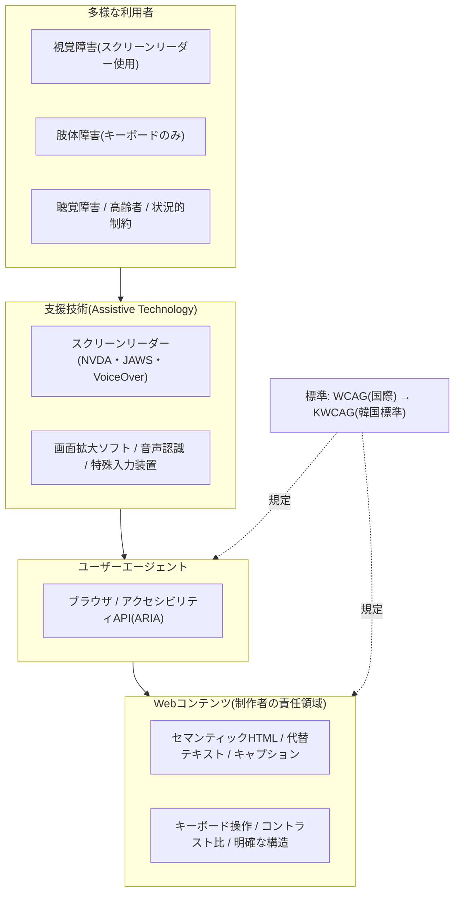
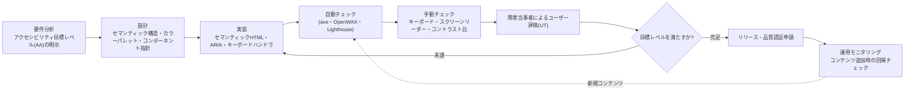

# Webアクセシビリティ(Web Accessibility)とWCAG/KWCAG

## 1. 概要

> **定義**: Webアクセシビリティ(Web Accessibility)とは、障害者・高齢者を含むすべての利用者が、身体的・技術的な条件にかかわらず、Webサイトが提供する情報と機能を同等に認識・理解・操作・利用できるよう保証する特性、およびそれを確保するための設計・開発原則をいう。

Webアクセシビリティが独立した情報システムの品質特性として浮上した背景には三つの軸がある。第一に、**人口・社会構造の変化**である。高齢化が進むにつれて視力低下・運動能力低下・認知機能低下を経験する利用者層が急増しており、一時的障害(腕の骨折)や状況的障害(明るい屋外での画面判読、騒音環境での音声聴取)まで含めれば、事実上全国民が該当する。アクセシビリティは少数の障害者のみを対象とした配慮ではなく、**普遍的ユーザビリティ(Universal Usability)** の問題として再定義されたのである。

第二に、**法・制度による強制**である。韓国では「障害者差別禁止及び権利救済等に関する法律」(障差法)において、Webを含む情報通信・意思疎通における正当な便宜提供を義務化し、その不提供を差別と規定している。「知能情報化基本法」は国・地方自治体・公共機関にWebアクセシビリティの遵守を求めており、違反した公共サービスは監査・評価で減点されたり是正命令の対象となったりする。海外においても、米国のリハビリテーション法508条(Section 508)・ADA、欧州のEN 301 549と欧州アクセシビリティ法(EAA、2025年施行)が、アクセシビリティを事実上の市場参入要件とした。

第三に、**技術標準の成熟**である。初期の恣意的な指針を超えてW3CのWCAG(Web Content Accessibility Guidelines)が国際標準として定着し、韓国ではこれを反映したKWCAG(韓国型Webコンテンツアクセシビリティ指針)が放送通信標準として制定されたことで、アクセシビリティは「善意の努力」ではなく**検証可能な定量基準**として管理できるようになった。技術士の観点では、Webアクセシビリティは非機能要件(品質特性)のうちユーザビリティ・規制遵守(Compliance)・包摂性が交差する地点であり、設計初期から内在化(Accessibility by Design)してこそ後工程のコストを最小化できる代表的な領域である。

## 2. Webアクセシビリティの全体構造と原則

Webアクセシビリティは、コンテンツ(制作者)、ユーザーエージェント(ブラウザ・メディアプレーヤー)、支援技術(Assistive Technology)の三角構造の上に成立する。いかにコンテンツが標準を守っていても、それを解釈するブラウザと利用者に伝達する支援技術がなければアクセシビリティは完成せず、逆に支援技術が優れていてもコンテンツが意味構造(Semantic)を持たなければ無力化される。以下の構造図は、このエコシステムと標準体系をあわせて示したものである。

### A. POUR — Webアクセシビリティの4大原則

WCAGとKWCAGは共通して**POUR**と呼ばれる4大原則の上に構築されている。この原則は個別技術が変わっても有効な上位概念であり、アクセシビリティ判断の羅針盤の役割を果たす。

**知覚可能(Perceivable)** は、情報とUI要素を利用者が認知できる形で提供しなければならないという原則である。代表的には、画像に代替テキスト(alt)を提供してスクリーンリーダーが読み上げられるようにし、動画には字幕・手話・音声解説を提供し、テキストと背景のコントラスト比を十分に(WCAG AA基準で通常テキスト4.5:1以上)確保することがこれに該当する。色だけで情報を伝えないことも、色覚特性を持つ利用者のための必須要件である。例えば「必須入力欄は赤色」という案内は色を区別できない利用者には無意味であるため、アスタリスクやテキストを併記しなければならない。

**操作可能(Operable)** は、UIとナビゲーションを操作できなければならないという原則である。マウスを使えない肢体障害の利用者のために、すべての機能を**キーボードだけで**実行できなければならず、フォーカス(focus)が論理的な順序で移動し、特定の要素に閉じ込められるキーボードトラップ(Keyboard Trap)があってはならない。時間制限のあるコンテンツは延長・解除できなければならず、1秒間に3回を超える点滅は光過敏性発作を誘発し得るため禁止される。繰り返されるメニューを飛ばす「本文へスキップ(Skip Navigation)」リンクの提供も代表的な例である。

**理解可能(Understandable)** は、情報とUIの動作を理解できなければならないという原則である。コンテンツの言語を明示(lang属性)してスクリーンリーダーが正しい発音で読めるようにし、ページ構成要素が予測可能に動作するようにし、入力エラーが発生した場合にはどこで何が誤っているのかを明確に知らせ、修正方法を案内しなければならない。例えば会員登録フォームで「形式エラー」とだけ表示する代わりに「メールアドレスには@が必要です」のように具体的な案内を提供することが、この原則の実践である。

**堅牢(Robust)** は、コンテンツが現在および将来の多様なユーザーエージェント・支援技術で安定して解釈できなければならないという原則である。文法的に正しいマークアップを使用し、カスタムコントロールにはWAI-ARIAで名前(name)・役割(role)・状態(state)・値(value)を正確に付与してこそ、スクリーンリーダーが当該要素の意味を伝えることができる。JavaScriptで作ったカスタムドロップダウンがアクセシビリティAPIに何の情報も公開しなければ、支援技術利用者にとっては存在しない要素となる。

### B. WCAGの適合レベルと検査項目の構造

WCAG(現行の安定版2.2、W3C勧告2023.10.5)は、4大原則の下にガイドライン(Guidelines)と検証可能な**達成基準(Success Criteria)** を置く階層構造を持つ。WCAG 2.2は合計87の達成基準を含んでおり、これはWCAG 2.1に対して9つの基準が新設(フォーカスの隠蔽防止、ドラッグ動作の代替、最小ターゲットサイズ、一貫したヘルプ、重複入力の最小化、アクセシブルな認証など)された結果である。各達成基準は次の3レベルに分類される。

| レベル | 意味 | 実務上の位置づけ |
|------|------|-------------|
| A(最低) | 基本的なアクセシビリティ、未達成の場合は特定の利用者がまったく利用できない | 必須の最低ライン |
| AA(推奨) | 大半の法・制度が要求する実質的な目標水準 | **公共・商用サービスの事実上の義務基準** |
| AAA(最高) | 専門コンテンツ・特殊目的に適用、全面的達成は非現実的 | 選択的な上位目標 |

大半の国の法制度と調達要件は**AA適合**を目標としている。AAAはコントラスト比7:1、手話提供など非常に高い基準を含み、サイト全体に一律適用するのは難しい点を理解しておく必要がある。このレベル体系は、アクセシビリティを「オール・オア・ナッシング」ではなく段階的に達成・測定できるようにする点に意義がある。

### C. KWCAG — 韓国型指針の構造

韓国では、WCAGを基に国立電波研究院が放送通信標準(KCS)として制定した**KWCAG(韓国型Webコンテンツアクセシビリティ指針)2.2** が適用される。KWCAG 2.2はWCAG 2.1を基に韓国の環境を反映して再構成したものであり、**4原則・14指針・33検査項目** の3階層構造を持つ。以下の表は原則ごとの代表的な検査項目を整理したものである。

| 原則 | 代表的な検査項目(例) | 中核要求 |
|------|----------------------|-----------|
| 知覚可能 | 代替テキスト、字幕提供、色に依存しないコンテンツ、コントラスト比(4.5:1) | 感覚で認知可能 |
| 操作可能 | キーボード使用の保証、フォーカス移動、反復領域のスキップ、点滅の制限 | 操作可能 |
| 理解可能 | 基本言語の表示、エラー訂正、ラベル提供、コンテンツの線形構造 | 内容を理解可能 |
| 堅牢 | マークアップエラーの防止、Webアプリケーションのアクセシビリティ(ARIA) | 技術互換性・安定性 |

KWCAGへの適合可否は、「知能情報化基本法」に基づく**Webアクセシビリティ品質認証**(韓国デジタルアクセシビリティ振興院など指定認証機関)を通じて審査され、合格すると認証マークが付与され1年間有効となる。検査は自動チェックツール(例: OpenWAX・K-WAH)と専門家・障害当事者による評価を併用するが、自動ツールはコントラスト比・代替テキストの有無など機械的に判断可能な項目しか検出できず、「代替テキストが意味のある内容で書かれているか」のような定性的項目には人の判断が必要であるという点が実務の要諦である。

## 3. アクセシビリティ確保のプロセスと実装アーキテクチャ

アクセシビリティは、完成したサイトを事後点検する方式では決して低コストで達成されない。要件定義段階でアクセシビリティを非機能要件として明示し、設計・実装・テストの全過程にわたって繰り返し検証する**アクセシビリティ by Design** が定着しなければならない。以下のプロセス図は、開発ライフサイクルにアクセシビリティ活動を内在化した姿を示している。

最もよくある失敗パターンは、アクセシビリティをプロジェクト終了直前の「認証取得用の作業」として扱うことである。この場合、すでに確定した画面構造を作り直さなければならないため修正コストが爆発的に増え、結局は表面的に代替テキストを埋めるだけの形式的な適合にとどまる。逆に、設計段階でセマンティック構造とデザインシステム(アクセシビリティを内蔵した共通コンポーネント)を確立すれば、開発者はすでにアクセシビリティが検証されたボタン・モーダル・タブコンポーネントを再利用するため、個々の開発者のアクセシビリティ知識のばらつきに関係なく一定の水準が担保される。実際、政府・大企業のデザインシステム(例: 大韓民国政府デザインシステム、複数の金融機関の共通UIコンポーネント)は、アクセシビリティ適合をコンポーネント単位で保証し、組織全体のアクセシビリティ品質を底上げした代表的な事例である。

実装面の核心は**セマンティック優先、ARIA最小**の原則である。`<button>`・`<nav>`・`<main>`・`<h1~h6>`など意味を持つ標準HTML要素は、それ自体で役割・状態をアクセシビリティツリーに公開するため、別途の処理がほとんど不要である。一方、`
`にクリックイベントを付けてボタンのように使うと、role・tabindex・キーボードハンドラ・状態管理をすべて手動で実装しなければならず、欠陥の確率が高まる。「ARIAを使わないほうが、誤ったARIAを使うよりよい(No ARIA is better than Bad ARIA)」というW3Cの警句がこの原則を凝縮している。

### D. 代表的な違反類型と改善事例

現場の点検で繰り返し指摘される欠陥は、いくつかの類型に収れんする。これを知っておけば設計チェックリストとして活用できる。第一に、**意味のない代替テキスト**である。`alt="画像"`、`alt="写真1"`のように形式的にだけ埋めたり、逆に純粋な装飾画像に冗長な説明を付けてスクリーンリーダー利用者の聴取を妨げたりする場合である。改善原則は「情報を持つ画像にはその画像が伝える情報を、装飾画像には空のalt(`alt=""`)を」付与し、支援技術に読み飛ばさせることである。

第二に、**キーボードでアクセスできないコントロール**である。マウスオーバーでしか開かないメニュー、マウスクリックでしか閉じないポップアップが代表的である。実際に韓国のある公共予約サービスでは、カレンダーウィジェットがマウス専用で実装されていたため肢体障害の利用者が日付を選択できず、これをキーボードの方向キーで日付を移動しEnterで選択する方式に再実装してアクセシビリティを回復した例がある。第三に、**フォーカス表示の削除**である。デザイン上の見た目を理由にCSSで`outline:none`を適用し、キーボード利用者が現在のフォーカス位置を把握できなくしてしまうよくある誤りであり、十分なコントラストを持つ代替のフォーカススタイルを必ず提供しなければならない。

第四に、**フォームラベルの欠落**である。入力フィールドに`<label>`が関連付けられていないと、スクリーンリーダーは「編集」とだけ読み上げ、何を入力すべきかわからない。視覚的にラベルを隠す場合でも、プログラム上の関連付け(labelのfor・id、またはaria-label)は維持しなければならない。こうした違反はたいてい少数の共通コンポーネントに起因するため、コンポーネント単位で一度修正すればサイト全体で同時に解消されるという点が、アクセシビリティ・リファクタリングの経済性を示している。

## 4. 比較 — アクセシビリティ・ユーザビリティ・ユニバーサルデザイン

Webアクセシビリティは、ユーザビリティ(Usability)・ユニバーサルデザイン(Universal Design)としばしば混同されるが、対象と観点が異なる。この違いを理解してこそ、アクセシビリティへの投資がどこまでを目標とするのかが明確になる。

| 区分 | Webアクセシビリティ | ユーザビリティ | ユニバーサルデザイン |
|------|-----------|--------|-----------------|
| 主な対象 | 障害者・高齢者など制約のある利用者 | 一般利用者 | すべての利用者 |
| 中核的な問い | 「利用が**可能か**?」 | 「利用が**効率的・満足できるか**?」 | 「最初から**誰もが**使えるよう設計したか?」 |
| 判断基準 | WCAG/KWCAGの達成基準(定量) | タスク成功率・所要時間・エラー率 | 7原則(公平・柔軟・単純など) |
| 関係 | ユーザビリティの前提条件 | アクセシビリティの上で深化 | アクセシビリティ・ユーザビリティを包含する上位の哲学 |

アクセシビリティとユーザビリティは排他的ではなく階層的である。アクセシビリティが「障壁の除去(利用可能性)」であるとすれば、ユーザビリティは「利用の質」の問題であり、アクセスはできても操作が煩雑であれば、アクセシビリティは満たしていてもユーザビリティは低いことがあり得る。ただし実務において両者は強く相関する。明確な構造・論理的なフォーカス順序・明瞭なエラーメッセージは、障害者だけでなくすべての利用者のユーザビリティをともに引き上げるからである。これが、アクセシビリティへの投資が「少数のためのコスト」ではなく、**UX全体の改善とSEO(検索エンジン最適化、セマンティック構造はクローラーにも有利)** として還元されるという論拠の根拠である。

具体的な事例として、字幕(Caption)は本来聴覚障害者のための機能であるが、騒音の激しい地下鉄で動画を見る一般利用者や外国語学習者にも有用である。このようにアクセシビリティ機能が想定外に幅広い利用者に恩恵をもたらす現象を**カーブカット効果(Curb-Cut Effect)** といい、アクセシビリティが特殊な要求ではなく普遍的な価値であることを示す代表的な論拠として引用される。

数値的に見ても、アクセシビリティの対象規模は決して小さくない。世界保健機関(WHO)は世界人口の約15%以上が何らかの形の障害を持って暮らしていると推計しており、韓国の登録障害者だけでも約260万人規模である。ここに高齢層と一時的・状況的な制約まで含めれば、アクセシビリティ改善の受益者は特定の少数ではなく、全利用者基盤の相当部分を占める。アクセシビリティ未対応による顧客離脱・法的紛争のコストと、対応による市場拡大・ブランド信頼をあわせて計算すると、アクセシビリティの投資収益率(ROI)は通常のUX改善投資に劣らないというのが、複数の実証研究に共通する結論である。

## 5. 深掘り — 最新動向とWCAG 3.0

アクセシビリティ標準は、コンテンツ形態の変化に合わせて進化している。第一に、**次世代標準WCAG 3.0** がW3Cで草案(Working Draft)段階として開発中である。WCAG 3.0は既存のPOUR 4原則の精神を継承しつつ、達成基準の「充足/未充足」という二分法とA・AA・AAAのレベル体系から脱し、**多次元のスコア・報告方式**(例: Bronze・Silver・Goldのレベル、成果中心の評価)へ転換する方向を議論している。これはHTML文書だけでなくモバイルアプリ・XR・Webアプリケーションなど多様な成果物を包含し、認知アクセシビリティのような定性的領域をより柔軟に反映するための試みである。ただし正式勧告までには相当な時間が必要であり、今後数年間は**WCAG 2.2/KWCAG 2.2(AA)** が実質的な適合基準として維持される見込みである。技術士答案では「WCAG 3.0はまだ草案段階であり、現行の実務基準は2.2である」という時点認識を正確に表現することが重要である。

第二に、**モバイルアクセシビリティ**の比重が高まった。レスポンシブWebとネイティブアプリでは、最小タッチターゲットサイズ(WCAG 2.2の新設基準)、画面回転への対応、拡大時のコンテンツ欠落防止などが中核的な論点となり、韓国でもモバイルアプリケーションのアクセシビリティ指針が別途運用されている。第三に、**AIを活用したアクセシビリティ自動化**が拡散している。画像の代替テキストを生成AIで自動生成したり、自動チェックツールが機械学習で欠陥を検出したりする方式である。しかし、AIが生成した代替テキストが文脈を誤読したり(「装飾用画像への過剰な説明」)、自動ツールが定性的項目を見逃したりする限界があるため、**人による最終検証は依然として必須**であることが強調されている。第四に、欧州アクセシビリティ法(EAA)の施行によってアクセシビリティが電子商取引・電子書籍・銀行サービスなど民間領域にまで法的義務として拡大され、グローバルサービス企業にとってアクセシビリティは規制リスク管理の事案となった。

## 6. 考慮事項と示唆(技術士の観点)

- **非機能要件としての明文化と調達への反映**: アクセシビリティは、発注・契約段階の提案依頼書(RFP)と要件定義書に目標レベル(例: KWCAG 2.2 AA、品質認証の取得)を定量的に明示してこそ、管理・検収の根拠が確保される。漠然と「アクセシビリティ遵守」とだけ記載すると検収時に紛争が生じるため、検査項目・認証取得の有無・成果物基準を契約要件として明確に定める戦略が必要である。

- **後追いのリモデリングに対する先制的内在化の経済性**: アクセシビリティの欠陥は、発見時点が遅いほど修正コストが指数関数的に増加する(設計欠陥の後工程発見によるコスト増大の原理と同じ)。デザインシステム・共通コンポーネントにアクセシビリティを内蔵し、CIパイプラインに自動チェック(axe-coreなど)を組み込む**シフトレフト(Shift-Left)** 戦略が総所有コスト(TCO)を最小化する。

- **自動化と手動評価のトレードオフ**: 自動チェックツールは、全達成基準の30~40%程度しか機械的に検証できないことを認識しておく必要がある。キーボード操作の流れ・スクリーンリーダーの読み上げによる意味伝達・代替テキストの適切性などは、専門家による手動チェックと実際の障害当事者によるユーザー評価(UT)で補完しなければならず、自動スコア100%をアクセシビリティの完成と誤認してはならない。

- **規制遵守を超えた包摂・ESG価値への拡張**: アクセシビリティは法的リスクの回避(障差法による差別救済・訴訟対応)を超えて、ESGの社会(S)の成果指標であり、潜在顧客層(障害者・高齢者市場)の拡大、ブランド信頼の向上へとつながる。カーブカット効果とSEO・UX改善効果まで考慮すれば、アクセシビリティ投資はコストではなく、普遍的なユーザビリティ向上を通じた価値創出として再解釈されるべきである。

- **関連技術との統合管理**: アクセシビリティは、デザインシステム、フロントエンドフレームワーク(React・Vueのアクセシビリティ対応)、セマンティックマークアップ・SEO、多言語(i18n)処理と密接に絡み合っている。個別機能ではなくフロントエンド品質アーキテクチャ全般の観点からガバナンス(ガイドライン・教育・チェック自動化・認証更新周期の管理)を確立することが、持続可能なアクセシビリティ確保の鍵である。

## 参考資料
- W3C, Web Content Accessibility Guidelines (WCAG) 2.2, https://www.w3.org/TR/WCAG22/
- W3C WAI, What's New in WCAG 2.2, https://www.w3.org/WAI/standards-guidelines/wcag/new-in-22/
- W3C, WCAG 3.0 Working Draft, https://w3c.github.io/wcag3/guidelines/
- 韓国型Webコンテンツアクセシビリティ指針(KWCAG)2.2, https://a11ykr.github.io/kwcag22/
- 韓国デジタルアクセシビリティ振興院(KWACC)Webアクセシビリティ品質認証, http://www.kwacc.or.kr/Accessibility/Certification

---
> **一言まとめ**: Webアクセシビリティは、障害者・高齢者を含むすべての人がWeb情報を同等に利用できるよう保証する品質特性であり、POUR 4原則の上に構築されたWCAG(国際、現行2.2・AA)とKWCAG(韓国、4原則・14指針・33項目)を基準として設計段階から内在化し、自動・手動・ユーザー評価を併用して確保する。
